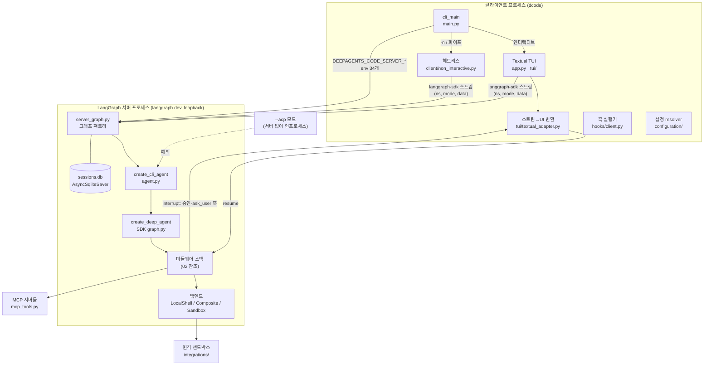

# 00 — dcode 전체 아키텍처 종합

`dcode`(deepagents-code 0.1.69)는 DeepAgents SDK(0.7.14)를 **터미널 코딩 에이전트 제품**으로 포장한 참조 구현이다. SDK가 "에이전트 하네스(그래프·미들웨어·백엔드)"를 주고, dcode는 그 위에 **프로세스 분리형 클라이언트/서버 런타임, 계층형 설정, 승인(Auto 분류기), 훅·MCP·확장·플러그인, 원격 샌드박스, Textual TUI**를 얹는다. 코드 규모는 dcode 약 20만 줄 대 SDK 약 2.8만 줄로, "제품화 비용"이 하네스 자체의 7배다.

이 문서는 01~09 영역 분석을 가로질러 **큰 그림 · 읽는 순서 · 공통 설계 패턴 · 문서↔코드 불일치 모음**을 정리한다. 세부 근거(`path:line`)는 각 영역 문서에 있다.

---

## 1. 큰 그림



**경계 원칙** (ARCHITECTURE.md): 표시·입력은 클라이언트, 모델 실행·도구·메모리·그래프 기동은 서버. 디버깅 시 "어느 쪽 소유인가"부터 판단한다.
**예외 두 가지**: ① `--acp`는 서버를 띄우지 않는다(01, 09). ② 훅은 서버 이벤트라도 **클라이언트에서** 실행되며, 서버는 interrupt로 멈추고 결과를 받아 재개한다(07).

## 2. 영역 문서 읽는 순서

| 순서 | 문서 | 왜 이 순서인가 |
|---|---|---|
| 1 | [01 부팅·클라이언트/서버](01-boot-client-server.md) | 프로세스 구조와 요청 경로를 먼저 잡아야 나머지 위치가 보인다 |
| 2 | [02 에이전트 조립·SDK 코어](02-agent-assembly-sdk-core.md) | 미들웨어 스택 순서가 모든 기능의 "배선도"다 |
| 3 | [03 설정·모델·자격증명](03-config-models-credentials.md) | 거의 모든 기능이 설정 resolver를 통해 켜지고 꺼진다 |
| 4 | [04 승인·HITL·보안](04-approval-hitl-security.md) | 도구 실행 전 관문. 02의 HITL 슬롯을 구체화 |
| 5 | [05 서브에이전트·목표·루브릭](05-subagents-goals-rubrics.md) | SDK 기능을 dcode가 가장 깊게 변형한 곳 |
| 6 | [06 메모리·스킬](06-memory-skills.md) | SDK 인자 대신 커스텀 미들웨어로 넣는 이유 |
| 7 | [07 MCP·훅·확장·플러그인](07-mcp-hooks-extensions-plugins.md) | 확장점 4종의 실행 위치·신뢰 모델 비교 |
| 8 | [08 샌드박스·실행 백엔드](08-sandboxes-execution.md) | 백엔드 교체와 그에 따른 기능 제한 |
| 9 | [09 TUI·커맨드·ACP](09-tui-app-commands-acp.md) | 사용자 표면. 앞 영역들이 화면에 어떻게 드러나는지 |

## 3. 실제 미들웨어 스택 (요약)

02의 결론. dcode는 SDK의 `skills=`·`memory=`·`interrupt_on=` 인자를 쓰지 않고 전부 `middleware=`로 주입한다.

```text
[SDK core]   Filesystem → SubAgent → (CLICompaction ⇐ 이름으로 Summarization 슬롯 교체) → PatchToolCalls
[dcode]      ConfigurableModel → ResumeState / Cost / GoalTools → AskUser → Memory / MemoryGuard
             → PluginSkills → LocalContext → HITL(AutoMode) → ServerHooks → Retry / ToolError → Rubric
[SDK tail]   profile extras → prompt caching (Anthropic·Bedrock·Fireworks) → ToolExclusion
```

## 4. 영역을 가로지르는 설계 패턴

| 패턴 | 어디서 보이나 | 의미 |
|---|---|---|
| **이름 기반 슬롯 교체** | CLICompaction이 `name="SummarizationMiddleware"`로 SDK 슬롯 차지(02), HITL도 동일(02·04), fork 서브에이전트가 부모 미들웨어를 이름으로 상속·덮어씀(02·05) | SDK를 포크하지 않고 동작을 바꾸는 핵심 수법. 대신 SDK 병합 규칙(`graph.py`)에 강하게 결합 |
| **서버 측 정책 고정** | 스레드↔워크스페이스 바인딩(`dcode_thread_workspaces`)이 클라이언트 주장을 409로 거절(01), Auto 모드는 private 타입으로만 신뢰(04) | "클라이언트는 믿지 않는다" — 프로세스 경계를 신뢰 경계로도 사용 |
| **fail-closed 기본값** | 관리자 MCP 정책 읽기 실패 시 MCP 전부 비활성(07), 분류기 모델 빌드 실패 래치(04), 관리자 정책 로드 실패 시 이전 설정 유지(03) | 불완전한 설정보다 오래된 설정·사람 승인이 낫다는 일관된 판단 |
| **스냅샷 세대(generation)** | 설정은 프로세스 단위 1세대, `/reload`로만 전진(03). 메모리·스킬 인덱스는 스레드당 1회 로드(06). 확장 미들웨어는 `/restart` 필요(07) | 파일 감시 없음. "무엇이 언제 반영되는가"가 기능마다 다름 → 사용자 혼란의 원천 |
| **캐시 우선 프롬프트 설계** | LocalContext가 system prompt를 고정하고 변경분만 메시지로 덧붙임(02), fork 서브에이전트가 `task` 도구를 남겨 도구 목록 일치(05) | prompt caching 적중률이 설계 제약으로 작동. 단, Memory가 caching 앞에 놓이는 등 SDK 권고와 어긋나는 부분도 있음(02·06) |
| **private API 의존** | LangChain 요약 미들웨어 private 슬롯 교체(02), 플러그인 스킬 어댑터의 SDK private 함수(06), genai-prices private 이름(pyproject 주석) | 업그레이드 리스크. dcode가 SDK·LangChain 버전을 좁게 고정하는 이유 |

## 5. 문서 ↔ 코드 불일치 종합 (중요도순)

**검증** 열: `직접 확인` = 종합 단계에서 코드를 다시 열어 확인함, `영역 분석` = 영역 문서의 정적 분석 근거만 있음, `(추정)` = 실행 검증 필요.

### 5.1 보안·비용에 영향

| # | 항목 | 문서 | 코드 | 검증 | 출처 |
|---|---|---|---|---|---|
| S1 | 헤드리스 승인 범위 | THREAT_MODEL D3: 헤드리스에서도 HTTP 도구는 승인 대상 | restrictive allow-list일 때 **셸 외 도구는 무조건 승인**, 셸 off/`all`이면 승인 자체 없음 (`client/non_interactive.py:1695-1710`) | 직접 확인 | 04 |
| S2 | Auto 모드에서 서브에이전트 | "부모 리뷰가 커버하지 않음"만 언급 | 서브에이전트 호출은 interrupt 안 함 → 분류기·사람 모두 거치지 않을 가능성 | (추정) | 04 |
| S3 | API 키 우선순위 | `credentials.md:103-111`: `DEEPAGENTS_CODE_` 접두 env > `/auth` 저장 키 > 일반 env | `resolve_provider_credential`은 **저장 키를 무조건 먼저** 반환하고 docstring도 그렇게 명시 (`model_config.py:2383-2416`), `create_model`이 이를 `api_key`로 덮어씀 (`config.py:6734`) | 직접 확인 | 03 |
| S4 | `FilesystemBackend.virtual_mode` 기본값 | SDK `backends.md:232`: 기본 False라 보안 없음 | 기본 **True** (`backends/filesystem.py:141`) | 직접 확인 | 02 |
| S5 | 샌드박스 setup 실패 시 정리 | 언급 없음 | `_run_sandbox_setup`이 `try/finally` 밖 → 실패 시 원격 샌드박스 미삭제·과금 지속 가능 (`integrations/sandbox_factory.py:160-166`) | 직접 확인(누수 재현은 안 함) | 08 |
| S6 | setup 스크립트 변수 치환 | `${VAR}` 치환 | `string.Template` → `$VAR`도 로컬 값으로 치환, 비밀이 원격 `bash -c` 인자로 평문 전달 | 영역 분석 | 08 |
| S7 | 플러그인 MCP 신뢰 | — | 플러그인 설치=동의, 서버별 승인 생략. 프로젝트 MCP·훅·확장은 각각 별도 trust store | 영역 분석 | 07 |
| S8 | 프로젝트 `AGENTS.md` 로드 | 명시 없음 | 사용자 확인 없이 로드(프로젝트 밖 symlink만 차단) | 영역 분석 | 06 |

### 5.2 기능 동작이 문서와 다름

| # | 항목 | 문서 | 코드 | 출처 |
|---|---|---|---|---|
| F1 | 자동 메모리 저장 위치 | `~/.deepagents/<agent>/memories/` 파일 | 실제로는 사용자·프로젝트 `AGENTS.md`를 `edit_file`로 수정 | 06 |
| F2 | 비동기 서브에이전트 | "end-user에게 제공 안 됨" | `config.toml` `[async_subagents]`만 있으면 동작 | 05 |
| F3 | 스킬 탐색 계층 | 4계층 | 8계층(`~/.claude`, 프로젝트 `.claude` 포함) | 06 |
| F4 | 확장 미들웨어 반영 | `/reload` | `/restart` 필요 | 07 |
| F5 | `--acp` 런타임 | "모든 모드가 같은 런타임" | 서버 없이 인프로세스 그래프 | 01·09 |
| F6 | resume과 `-a` | resume은 에이전트 플래그 무시 | `-a`가 유지·필터로 작동 | 01 |
| F7 | 루브릭 반복 한도 도달 | 콜백에 `needs_revision` | `max_iterations_reached`로 변환 | 05 |
| F8 | Auto 모드 실험 플래그 | `DEEPAGENTS_CODE_EXPERIMENTAL=1` 필요 | 해당 검사 없음 | 04 |
| F9 | Shift+Tab | Manual/Auto 토글 | Manual→Auto→YOLO 순환 (`/help` 문구도 구식) | 04·09 |
| F10 | 시작 모델 자동감지 | `GOOGLE_CLOUD_PROJECT` 단계 포함 | openai/anthropic/google 3개 하드코딩 | 03 |
| F11 | 샌드박스 작업 디렉터리 | setup·`execute`가 작업 디렉터리에서 실행 | `cd` 없음, Modal만 지정 | 08 |
| F12 | 컨텍스트 퇴출 미리보기 | 처음 10줄 | 앞 5줄 + 뒤 5줄 | 02 |

### 5.3 문서 자체의 결함

- `ARCHITECTURE.md`가 링크한 `STREAMING_RETRY_DESIGN.md`가 저장소에 **없음** (직접 확인).
- `THREAT_MODEL.md`의 도구명이 구식: `launch_async_subagent`(실제 `start_async_task`), `http_request`(없음), `--auto-approve`를 전면 우회로 설명(현재는 `--yolo`) (04).
- `EXTENSIONS.md`의 `extra_files`/`extra_dirs`는 코드에서 `extra_paths`만 읽음 (07).
- `hooks.md`에 `PostToolUseFailure` 이벤트 누락(코드 12종), `argv` 필드는 2026-09-01 제거 예정인데 권장 중 (07).
- built-in `skill-creator`의 스킬 경로 표가 5계층으로 실제와 불일치 (06).

### 5.4 문서에 없는 기능 (발견 목록)

| 영역 | 항목 |
|---|---|
| 커맨드 | `/manual`, `/yolo`, `/uninstall`, `/rubric max-iterations`, `/goal status`, 별칭 `/connect` `/criteria` `/q`, 숨김 `/debug` `/debug-error` (09·05) |
| 입력 | `!!`(셸 출력 컨텍스트 제외), `Ctrl+\` 디버그 콘솔, 외부 이벤트 Unix 소켓 `DEEPAGENTS_CODE_EXTERNAL_EVENT_SOCKET` (09) |
| CLI | `dcode skills delete/trust`, `--goal`, 헤드리스 exit code 124/130 (06·05·01) |
| 설정 | 문서화 안 된 env 약 40개, 샌드박스 프로바이더 env 다수, 시작 차단 관리자 키 14개(문서 12개) (03·08) |
| 한도 | Auto 분류기: 연속 거부 3·연속 실패 2·누적 거부 20, 응답 20초 / 목표·기준 글자 수 제한 (04·05) |

## 6. 버그 후보 (실행 검증 필요)

| 후보 | 근거 | 확인 방법 제안 |
|---|---|---|
| 샌드박스 setup 실패 시 누수 | S5 | 존재하지 않는 setup 경로로 샌드박스 기동 후 프로바이더 콘솔 확인 |
| Auto 모드 서브에이전트 무검토 실행 | S2 | Auto 모드에서 `task`로 셸 명령 위임 → 분류기 로그·승인 창 발생 여부 |
| ACP에서 ask_user·훅 interrupt 루프/정지 | SDK ACP 서버가 `action_requests` 없는 interrupt에 빈 결정 반환 (09) | 에디터 ACP 연결 후 ask_user 유도 |
| fork 서브에이전트가 부모 루브릭 루프까지 상속 | fork 시 부모 미들웨어·state 전체 복사 (05) | 목표 설정 상태에서 서브에이전트 실행 후 grader 호출 횟수 확인 |
| `threads delete` 후 워크스페이스 바인딩 잔존 | (01) | 삭제 후 `sessions.db`의 `dcode_thread_workspaces` 조회 |

## 7. dcode ↔ SDK 경계 한눈에

| 기능 | SDK가 제공 | dcode가 추가·대체 |
|---|---|---|
| 그래프 조립 | `create_deep_agent`, 미들웨어 병합 규칙 | `create_cli_agent`, 커스텀 미들웨어 10여 종 |
| 파일·셸 도구 | Filesystem 미들웨어, `execute`, 백엔드 프로토콜 | `LocalShellBackend(virtual_mode=False)` 선택, 대용량 결과 offload |
| 컨텍스트 | Summarization, 메시지 퇴출 | CLICompaction(슬롯 교체), `/offload`, LocalContext |
| 모델 | `resolve_model`, provider/harness profile | 자체 `create_model`, 런타임 모델 교체, 재시도, 비용 추적 |
| 승인 | HITL 미들웨어, `interrupt_on` | Auto 분류기, 승인 모드 3종, 헤드리스 allow-list |
| 서브에이전트 | `task`, fork, async, rubric | 정의 파일 로딩, 목표(`/goal`)·grader 모델 선택 |
| 메모리·스킬 | Memory·Skills 미들웨어 | 8계층 탐색, trust store, built-in 스킬 3종, 플러그인 네임스페이스 |
| MCP | (코드 없음) | `langchain_mcp_adapters` + OAuth·파일락 |
| 훅·확장·플러그인 | 미들웨어·Composite 라우팅이라는 "꽂을 자리"만 | 전부 dcode |
| 샌드박스 | `BaseSandbox`(파일 도구를 `python3 -c`로 구현) | 프로바이더 레지스트리·수명주기(서버 프로세스당 1개) |
| UI·세션 | — | Textual TUI, langgraph 서버 관리, sqlite 체크포인트, ACP |

## 8. 다음 단계 제안

1. **§6 버그 후보 실행 검증** — 특히 S2(Auto×서브에이전트)와 S5(샌드박스 누수)는 영향이 크다.
2. **테스트 코드 대조** — `libs/code/tests/unit_tests`에서 §5 항목별로 "의도된 동작인지"를 테스트가 고정하는지 확인. 예: S3는 docstring상 의도된 동작이므로 문서 쪽 오류일 가능성이 높다.
3. **호출 그래프** — `app.py`(3만 줄)·`textual_adapter.py`의 흐름은 정적 grep만으로 한계가 있어, 필요 시 GitNexus 인덱싱으로 보강.
4. **업스트림 추적** — 분석 기준 커밋 `1d3232c` 이후 변경은 `git log 1d3232c..origin/main -- libs/code libs/deepagents`로 확인해 이 문서를 갱신.
