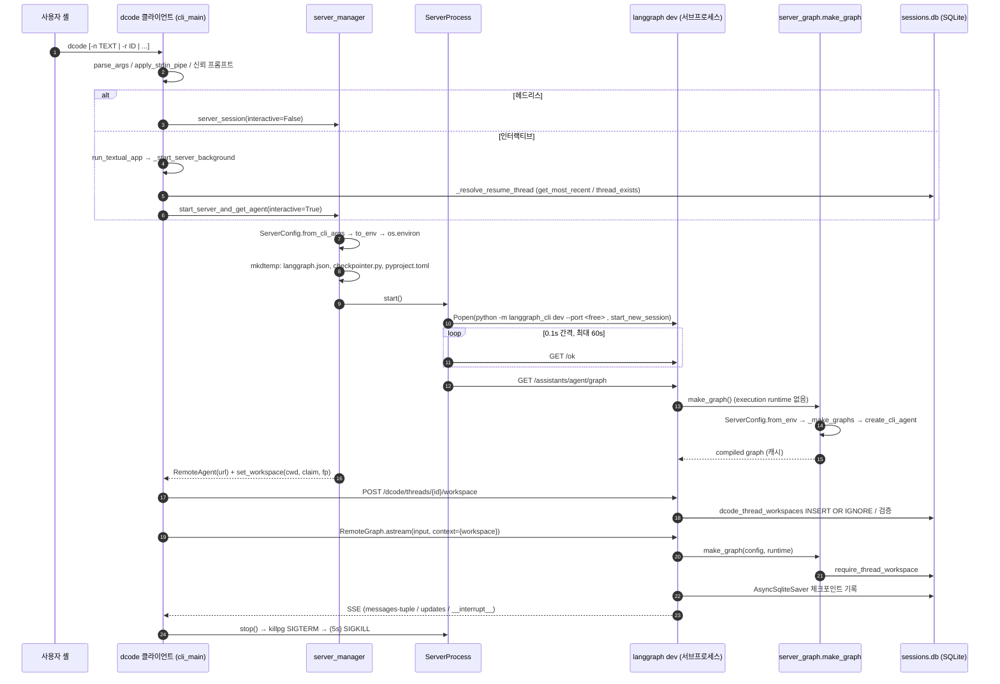
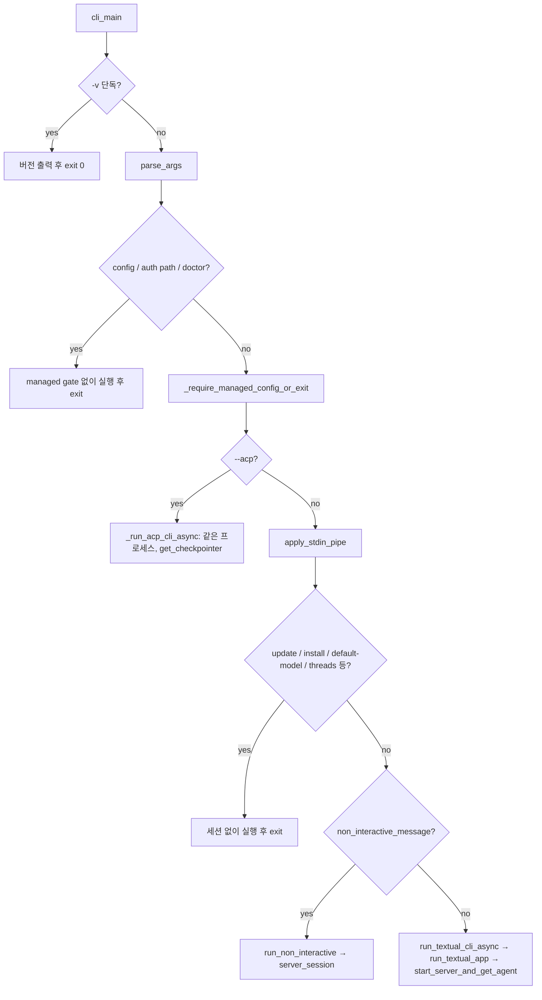

# 01 — 진입점·부팅·클라이언트/서버 런타임·세션

dcode(`deepagents-code` 0.1.69, commit `1d3232c`)는 **터미널 클라이언트 프로세스**와 **LangGraph 에이전트 서버 프로세스**를 따로 띄워 두 프로세스를 HTTP+SSE로 연결합니다. 콘솔 스크립트 `dcode`/`deepagents-code`는 `deepagents_code:cli_main`을 가리키고, 이 함수는 가벼운 서브커맨드는 서버 없이 바로 처리한 뒤 종료합니다. 세션을 여는 경우에는 세 갈래로 나뉩니다. (a) 헤드리스(`-n`이나 파이프 stdin)는 `run_non_interactive`로, (b) 인터랙티브는 Textual TUI `run_textual_app`으로, (c) `--acp`는 서버 없이 같은 프로세스 안에서 그래프를 만듭니다. (a)와 (b)는 공통 모듈 `client/launch/server_manager.py`를 씁니다. 이 모듈은 임시 디렉터리에 `langgraph.json`·`checkpointer.py`·`pyproject.toml`을 만들고, `python -m langgraph_cli dev`를 분리된 세션으로 실행하며, `RemoteAgent`(`langgraph.pregel.remote.RemoteGraph` 래퍼)를 돌려줍니다. 클라이언트가 서버에 설정을 넘기는 통로는 `DEEPAGENTS_CODE_SERVER_*` 환경변수 하나뿐이고, 직렬화 규칙은 `ServerConfig` 데이터클래스 한 곳에서만 정의합니다. 대화 영속화는 프로필 state 디렉터리의 `sessions.db`(SQLite, `AsyncSqliteSaver`)가 맡습니다. 같은 DB에 dcode 전용 `dcode_thread_workspaces` 테이블이 있어 스레드와 워크스페이스(cwd·정책) 사이의 바인딩을 서버 쪽이 권한을 갖는 형태로 강제합니다. 이렇게 나눈 목적은 ARCHITECTURE.md가 밝히듯 "UI 응답성 + LangGraph의 스트리밍·체크포인트·resume 재사용"입니다.

---

## 문서가 약속하는 것

- 클라이언트(표시·입력·승인)와 서버(에이전트 그래프·모델·도구·메모리·백엔드)는 **별도 프로세스**이고 스트리밍 프로토콜로 연결된다. 인터랙티브와 헤드리스는 같은 에이전트 런타임을 공유한다 — `libs/code/ARCHITECTURE.md` "The big picture", "Request flow"
- 세션 상태는 보존되어 나중에 대화를 이어갈 수 있다 — `libs/code/ARCHITECTURE.md` "Request flow" 5단계
- 디버깅은 "실패를 어느 쪽이 소유하는지"부터 판단한다(표시·입력은 클라이언트, 모델·도구·그래프 기동은 서버) — `libs/code/ARCHITECTURE.md` "Design tradeoffs"
- 두 프로세스는 각자 로그를 쓴다. `DEEPAGENTS_CODE_DEBUG`를 켜면 서버 로그(`$TMPDIR/deepagents_server_log_*.txt`)가 종료 후에도 남고 경로가 stderr에 출력된다. 클라이언트 로그는 `/tmp/deepagents_debug/<thread-id>.log`에 쌓인다 — `libs/code/DEVELOPMENT.md` "Debugging"
- 기동 크래시 원인은 서버 로그의 `Failed to initialize server graph` 줄 아래 트레이스백에서 찾는다 — `libs/code/DEVELOPMENT.md` "Startup crash"
- 서버 하나는 첫 워크스페이스의 트레이싱 설정을 수명 내내 유지한다. 설정이 다른 워크스페이스는 거부되고 별도 서버가 필요하다 — `libs/code/DEVELOPMENT.md` "LangSmith tracing projects" 마지막 문단
- `-r`만 쓰면 가장 최근 스레드, `-r <ID>`면 특정 스레드를 재개한다. "Resuming bypasses agent selection flags and restores the thread's original agent" — `docs_official/code/cli-reference.md:143`
- `dcode threads list/delete`로 세션을 관리한다. 기본 limit은 20이고 `DEEPAGENTS_CODE_RECENT_THREADS`로 바꾼다 — `docs_official/code/cli-reference.md:544-545`
- `-n` 실행은 매번 새 스레드에서 시작해 대화 이력이 이어지지 않는다. 파일 기반 상태(메모리·스킬·설정)는 유지된다 — `docs_official/code/quickstart.md:188`, `docs_official/code/cli-reference.md:154`
- stdin이 파이프로 들어오면 자동으로 비대화형이 된다. `-n`/`-m`과 함께 쓰면 파이프 내용이 앞에 붙는다. 상한은 10 MiB, `--stdin`으로 명시할 수 있다 — `docs_official/code/cli-reference.md:160-168`, `docs_official/code/quickstart.md:190-202`
- `-q`/`--no-stream`/`--max-turns`/`--timeout`은 `-n`이나 파이프 stdin을 요구하고, `--max-turns`·`--timeout` 초과 시 exit 124 — `docs_official/code/cli-reference.md:181-185,457-460`
- 비대화형에서는 shell이 기본으로 꺼져 있고 `-S`로 켠다 — `docs_official/code/cli-reference.md:188,455`
- `--recursion-limit`: "When unset, the LangGraph server default applies" — `docs_official/code/cli-reference.md:456`
- `--acp`: 인터랙티브 UI 대신 stdio ACP 서버로 실행한다 — `docs_official/code/cli-reference.md:481`
- `dcode doctor`는 세션 없이 설치 방식·의존성·업데이트·트레이싱·데이터 디렉터리 상태를 요약한다 — `docs_official/code/cli-reference.md:522-526`
- `/restart`는 에이전트 서버를 재시작한다 — `libs/code/COMMANDS.md:45`, `docs_official/code/quickstart.md:91`
- 변경 이력(아키텍처 관련): 2024 포트 대신 ephemeral 포트 사용(#4264), 소유한 `langgraph dev`를 터미널에서 분리(#4642), 기동 취소 시 서버 회수(#4629), `/restart` 때 설정이 없으면 재스캐폴딩(#4050), 상속된 `PYTHONPATH` 보존(#3833), resume 나이 제한(#6068) — `docs_official/code/changelog.md:1535,1353,1357,1631,1715,807`
- SDK 쪽: `thread_id`로 checkpointer가 대화를 저장·재개하고, 자체 호스팅이면 persistence 설정이 필요하다 — `docs_official/sdk/going-to-production.md:67,403-416`

---

## 코드 지도

| file/symbol | 역할 | 비고 |
| --- | --- | --- |
| `libs/code/pyproject.toml:155-156` | `deepagents-code`, `dcode` → `deepagents_code:cli_main` | 두 이름이 같은 진입점 |
| `libs/code/deepagents_code/__init__.py:17-18` | 패키지 로거에 링버퍼와 디버그 로깅 설치 | import 시점 부작용 |
| `libs/code/deepagents_code/__init__.py:26-58` | `__getattr__`로 `cli_main`을 지연 import. `DeepAgentsHomeError`는 exit 2 메시지로 변환 | `main.py` 로딩 비용 회피 |
| `libs/code/deepagents_code/__main__.py:1-6` | `python -m deepagents_code` 지원 | 업데이트 후 re-exec 경로가 사용(`main.py:241-242`) |
| `libs/code/deepagents_code/main.py:5180` `cli_main` | 최상위 디스패처 | 약 1,380줄 |
| `libs/code/deepagents_code/main.py:92-117` | SIGHUP/SIGTERM/SIGQUIT → `SystemExit(128+signum)` | 서버를 분리 세션으로 띄우므로 정리용 finally를 강제 실행 |
| `libs/code/deepagents_code/main.py:2143` `parse_args` | argparse 트리 | `-r/--resume` 정의는 `main.py:2469-2478` |
| `libs/code/deepagents_code/main.py:3659` `apply_stdin_pipe` | 파이프 stdin 병합, 10 MiB 상한, `/dev/tty` dup2 복원 | 헤드리스/인터랙티브 판정의 최종 결정자 |
| `libs/code/deepagents_code/main.py:890` `_resolve_agent_arg` | `-a` > (`-r`이면 기본 에이전트) > `[agents].default` > `[agents].recent` > 기본값 | |
| `libs/code/deepagents_code/main.py:3119` `run_textual_cli_async` | TUI 진입 준비. 모델 spec을 가볍게 해석하고 `server_kwargs`를 만들어 `run_textual_app`에 넘김 | **TUI 경계**(`main.py:3386`) |
| `libs/code/deepagents_code/main.py:3429` `_run_acp_cli_async` | ACP 모드. 서버 없이 `get_checkpointer()`와 `create_cli_agent`로 같은 프로세스에서 그래프 생성 | `main.py:3579-3632` |
| `libs/code/deepagents_code/main.py:561` `_run_startup_auto_update` | 인터랙티브 기동 전 자동 업데이트, 성공 시 `os.execv` | `main.py:221-259` |
| `libs/code/deepagents_code/client/launch/server_manager.py:295` `start_server_and_get_agent` | ServerConfig 생성 → env 기록 → 스캐폴딩 → 서버 기동 → 그래프 준비 확인 → `RemoteAgent` 반환 | 클라이언트 부팅의 핵심 |
| `libs/code/deepagents_code/client/launch/server_manager.py:496` `server_session` | 위 함수를 감싼 async context manager. 종료 시 stop과 로그 알림 | 헤드리스가 사용 |
| `libs/code/deepagents_code/client/launch/server_manager.py:121-163` `_write_checkpointer` | `AsyncSqliteSaver.from_conn_string($DEEPAGENTS_CODE_SERVER_DB_PATH)`를 yield하는 모듈 생성 | DB 경로는 env로만 전달 |
| `libs/code/deepagents_code/client/launch/server_manager.py:212-234` | 생성할 pyproject 의존성: editable이면 `file://` 경로, 설치본이면 `==버전` | |
| `libs/code/deepagents_code/client/launch/server.py:198-252` `generate_langgraph_json` | `graphs.agent`, `http.app=deepagents_code.offload_api:app`, `checkpointer.path` | 커스텀 graph_ref면 http 블록 없음 |
| `libs/code/deepagents_code/client/launch/server.py:369-393` `_build_server_cmd` | `sys.executable -m langgraph_cli dev --host --port --no-browser --no-reload --config` | |
| `libs/code/deepagents_code/client/launch/server.py:396-433` `_build_server_env` | env 복사, dotenv 값 제거, `LANGGRAPH_AUTH_TYPE=noop`, 위험 env 제거, PYTHONPATH는 캐리어로 이관 | `_SERVER_ENV_DENYLIST` `:104-119` |
| `libs/code/deepagents_code/client/launch/server.py:753` `ServerProcess` | spawn·health·graph-ready·stop·restart | lifecycle lock과 state lock 이중 구조 |
| `libs/code/deepagents_code/client/launch/server.py:594` `_terminate_server_process` | POSIX 프로세스 그룹에 SIGTERM, 5초 대기 후 SIGKILL. Windows는 Ctrl+Break | |
| `libs/code/deepagents_code/client/remote_client.py:298` `RemoteAgent` | `RemoteGraph` 지연 생성, 메시지 dict→LangChain 객체 변환, workspace 페이로드 주입 | |
| `libs/code/deepagents_code/client/non_interactive.py:2568` `run_non_interactive` | 헤드리스 1회 실행 | `server_session(interactive=False)` |
| `libs/code/deepagents_code/_server_config.py:344` `ServerConfig` | 클라이언트→서버 설정 스키마(frozen dataclass) | `to_env` `:704`, `from_env` `:787`, `from_cli_args` `:845` |
| `libs/code/deepagents_code/_server_config.py:34-80` | `SESSION_WORKSPACE_FIELDS`, `PROJECT_WORKSPACE_FIELDS` 분할 | 클라이언트가 주장할 수 있는 정책과 없는 정책 |
| `libs/code/deepagents_code/server_graph.py:886` `make_graph` | `langgraph.json`이 참조하는 그래프 팩토리 | runtime context의 workspace를 검증 |
| `libs/code/deepagents_code/server_graph.py:313` `_make_graphs` / `:387` `_make_graphs_in_environment` | 워크스페이스 env 스냅샷 → 모델·도구·샌드박스·확장 → `create_cli_agent` | 블로킹 I/O는 `to_thread`로 넘김 |
| `libs/code/deepagents_code/server_graph.py:628` `_build_runtime_factory` | 프로세스당 1회 빌드 캐시(lock) | 실패 시 marker 출력 후 exit 1 |
| `libs/code/deepagents_code/server_graph.py:707-711` | 워크스페이스별 런타임 LRU(최대 32), 샌드박스는 프로세스당 1 워크스페이스 | |
| `libs/code/deepagents_code/_startup_error.py:15,22` | `DEEPAGENTS_STARTUP_ERROR:` 마커 출력 | 부모가 `server.py:182` 에서 파싱 |
| `libs/code/deepagents_code/offload_api.py:1236-1256` | Starlette 앱: `/dcode/threads/{id}/workspace`, `/offload`, `/offload/{op}/cancel`, `/extensions` | `langgraph dev`에 custom HTTP로 마운트 |
| `libs/code/deepagents_code/workspace.py:200-230` | `dcode_thread_workspaces` 테이블(sessions.db 안) | schema v3 |
| `libs/code/deepagents_code/workspace.py:328` `_bind` / `:435` `require_thread_workspace` | 바인딩 생성·검증(`BEGIN IMMEDIATE`) | |
| `libs/code/deepagents_code/sessions.py:344` `get_db_path` | `PATHS.profile.state_dir/sessions.db` 반환, 디렉터리를 0700으로 강화 | `model_config.py:771` |
| `libs/code/deepagents_code/sessions.py:366` `generate_thread_id` | UUID7 | 시간순 정렬 가능 |
| `libs/code/deepagents_code/sessions.py:1356-1520` | `get_most_recent`/`thread_exists`/`get_thread_agent`/`get_thread_cwd`/`find_similar_threads` | `checkpoints.metadata` JSON에 직접 SQL |
| `libs/code/deepagents_code/sessions.py:1521` `delete_thread` | `checkpoints`/`writes` 행 삭제와 offload 이력 삭제 | 워크스페이스 바인딩 행은 삭제하지 않음 |
| `libs/code/deepagents_code/sessions.py:1557` `get_checkpointer` | 클라이언트 쪽 `AsyncSqliteSaver`(ACP 전용) | |
| `libs/code/deepagents_code/app.py:5892` `_resolve_resume_thread` | `-r` 의도를 실제 thread_id로 해석 | TUI 내부. 이 영역에서는 resume 로직만 인용 |
| `libs/code/deepagents_code/app.py:6061-6156` `_start_server_background` | resume 해석 → 지연 모델 생성 → ripgrep → `start_server_and_get_agent`와 MCP 사전 로드 병렬 실행 | TUI가 서버를 띄우는 지점 |
| `libs/code/deepagents_code/doctor.py:825` `run_doctor_command` | 오프라인 진단(PyPI에 접속하지 않음, `doctor.py:1-7`) | managed-config gate보다 먼저 분기 |
| `libs/code/deepagents_code/update_check.py:1270` | resume 전용 실행이면 업데이트를 7일 유예(`:255`) | |
| `libs/code/deepagents_code/input.py:1-30` | `@file` 멘션·이미지 입력 파싱 유틸 | 부팅과 직접 관련은 적음. 이름과 달리 stdin 처리는 `main.apply_stdin_pipe` |

---

## 동작 흐름

### A. 공통 부팅 (`cli_main`)

1. macOS에서는 `GRPC_ENABLE_FORK_SUPPORT=0`을 설정하고, dotenv 로딩 전 `TERM_PROGRAM`을 스냅샷으로 떠 둡니다(resume 힌트용) — `main.py:5192-5201`.
2. 인자가 `-v`/`--version` 하나뿐이면 무거운 import 없이 즉시 종료합니다 — `main.py:5209-5211`.
3. 인자에 `--acp`가 없으면 Textual 등 UI 의존성을 확인합니다 — `main.py:5220-5221`.
4. 종료 시그널 핸들러를 설치합니다 — `main.py:5227`, `main.py:113-117`.
5. `parse_args()`를 호출하고 CLI provider를 설치합니다(`vars(args)` 스냅샷) — `main.py:5230-5231`.
6. **설정 부트스트랩 전 fast path**: `config`, `auth path`, `doctor`는 managed policy 게이트보다 먼저 실행합니다(깨진 managed 파일을 진단할 수단을 남기기 위해서입니다) — `main.py:5259-5272`. `help`를 뺀 나머지 명령은 `_require_managed_config_or_exit()`를 거칩니다 — `main.py:5279-5280`. 그다음 `tools`/`install`/`uninstall`을 처리합니다 — `main.py:5282-5295`.
7. 레거시 상태 마이그레이션(실패해도 계속 진행) → `_get_credentials()`로 dotenv를 부트스트랩합니다 — `main.py:5303-5321`.
8. `--model-params`/`--profile-override` JSON 검증, 재시도 설정 경고, summarization model 해석 — `main.py:5335-5415`.
9. **`--acp` 분기** → `_run_acp_cli_async`를 호출하고 exit — `main.py:5417-5493`. langgraph 서버를 띄우지 않습니다(흐름 D).
10. `apply_stdin_pipe(args)`: 우선순위는 `-n` > `-m` > `--skill`(자동 감지 파이프일 때) > `non_interactive_message`로 대체입니다. 입력을 읽은 뒤 `/dev/tty`를 fd 0에 dup2합니다 — `main.py:3791-3818`.
11. 플래그 조합 검증: `--max-turns`/`--timeout`/`-q`/`--no-stream`/rubric 계열은 `-n`이 필요하고, `--goal`은 인터랙티브 전용이며, 헤드리스에서 `--yolo`/`--auto-approve`는 **경고 후 무시**합니다 — `main.py:5580-5598,5627-5735`.
12. `update`/`--install`/`--auto-update`/`--default-model` 같은 세션 없는 명령을 처리합니다 — `main.py:5747-6054`.
13. 서브커맨드(`help`/`agents`/`skills`/`plugin`/`mcp`/`threads`)를 실행합니다 — `main.py:6058-6164`. `threads list/delete`는 `sessions.list_threads_command`/`delete_thread_command`를 `asyncio.run`으로 돌립니다 — `main.py:6113-6161`.
14. `args.non_interactive_message`가 있으면 **헤드리스**(흐름 C), 없으면 **인터랙티브**(흐름 B)입니다 — `main.py:6165`, `main.py:6305`.

### B. 인터랙티브 (TUI 경계까지)

1. resume이 아니면 자동 업데이트를 실행합니다. resume이면 7일 유예 기간 안에서만 건너뜁니다 — `main.py:6307-6326`, `update_check.py:1270-1283`.
2. `thread_id = None if resume_thread else generate_thread_id()`. resume 해석은 TUI 안에서 비동기로 합니다 — `main.py:6337`.
3. 샌드박스 의존성과 인터프리터를 확인하고, 프로젝트 MCP·hooks·extensions 신뢰 프롬프트를 띄웁니다(취소 시 종료) — `main.py:6340-6400`.
4. 승인 모드 해석: sandbox가 있으면 Auto를 Manual로 내리고, YOLO는 확인 절차를 거칩니다 — `main.py:6416-6433`.
5. `asyncio.run(run_textual_cli_async(...))` — `main.py:6435`. 여기서 모델 spec만 가볍게 해석하고(`main.py:3270-3294`), `server_kwargs`를 `interactive=True`, `enable_ask_user=True`로 만듭니다 — `main.py:3351-3375`. 자격 증명이 없으면 `defer_server_start=True`가 됩니다 — `main.py:3272-3275`.
6. `run_textual_app(...)` — `main.py:3386`. **이후는 TUI 영역입니다.** 서버 기동은 백그라운드 워커 `_start_server_background`가 맡습니다. 순서는 resume 해석 → 지연 `create_model` → 관리형 ripgrep 설치(서버가 env를 스냅샷하기 **전에**) → `start_server_and_get_agent`와 MCP 사전 로드를 `asyncio.gather` — `app.py:6061-6160`.
7. 종료 시 세션 통계, LangSmith 링크·resume 힌트, 업데이트 배너를 출력합니다 — `main.py:6470-6549`.

### C. 헤드리스 (`run_non_interactive`)

1. stdio 인코딩 안전 처리, `quiet`이면 콘솔을 stderr로 보냅니다 — `non_interactive.py:2699-2703`.
2. `--startup-cmd`, `--skill` 로드와 envelope 생성 — `non_interactive.py:2705-2804`.
3. **클라이언트 프로세스에서도** `create_model`을 호출해 설정 오류를 서버 기동 전에 잡습니다 — `non_interactive.py:2806-2817`.
4. `generate_thread_id()`로 매번 새 스레드를 만듭니다 — `non_interactive.py:2819`.
5. shell 정책: `shell.allow_list`가 비어 있으면 shell을 끄고 나머지 도구는 YOLO, 제한 목록이면 `interrupt_shell_only`, `all`이면 YOLO. permission hook이 있으면 두 단축 경로를 모두 끕니다 — `non_interactive.py:2862-2906`.
6. `build_stream_config`는 metadata에 `agent_name`, `updated_at`, `cwd` 등을 기록합니다 — `config.py:2771-2777`, `config.py:2633`.
7. `async with server_session(interactive=False, enable_ask_user=False, cwd=Path.cwd())` — `non_interactive.py:2921-2950`. MCP 메타데이터 사전 로드는 서버 기동과 동시에 진행합니다 — `non_interactive.py:2839-2852`.
8. `_run_agent_loop(agent, message, config, ...)` — `non_interactive.py:2971`. 예외별 exit code: 130 인터럽트, 0 hook stop, 124 HITL 반복 한도, 1 오류 — `non_interactive.py:2992-3020`. `--timeout`은 바깥의 `asyncio.wait_for`가 124로 변환합니다 — `main.py:6242-6297`.

### D. 서버 기동 공통 (`start_server_and_get_agent`)

1. `ProjectContext.from_user_cwd(cwd)`를 만들고, `--mcp-config` 사전 검증을 **부모 프로세스에서** 합니다 — `server_manager.py:389-398,242-287`.
2. `ServerConfig.from_cli_args(...)`에서 상대 경로를 사용자 cwd 기준 절대 경로로 바꾸고 인터프리터 tri-state를 확정합니다 — `_server_config.py:931-982`.
3. `_apply_server_config` → `os.environ[DEEPAGENTS_CODE_SERVER_*]`를 설정하거나 지웁니다 — `server_manager.py:61-73`.
4. `tempfile.mkdtemp(prefix="deepagents_server_")`에 `checkpointer.py`·`pyproject.toml`·`langgraph.json`을 씁니다 — `server_manager.py:434-435,94-118`.
5. `ServerProcess.start()` → `_spawn_process`: 포트 0이면 빈 포트를 찾고, 명령과 env를 만들고, 로그 임시파일로 `Popen(start_new_session=True)` — `server.py:976-1008`.
6. `wait_for_server_healthy`로 `/ok`를 0.1초 간격, 60초까지 폴링합니다. 프로세스가 먼저 죽으면 로그 끝부분과 marker 요약을 붙여 `RuntimeError` — `server.py:299-361`.
7. `wait_for_graph_ready("agent")`: `GET /assistants/agent/graph`로 **지연 그래프 팩토리를 강제 실행**해 기동 실패를 앞당겨 드러냅니다 — `server.py:1011-1087`.
8. `RemoteAgent(url, graph_name="agent")`와 `set_workspace(cwd, session_claim, fingerprint)` — `server_manager.py:448-459`.
9. 실패하거나 취소되면 `finally`에서 `server.stop()`을 호출합니다(`CancelledError`까지 포함하려고 `except Exception`이 아니라 `finally`) — `server_manager.py:462-487`.

### E. 서버 프로세스 내부

1. `langgraph dev`가 `langgraph.json`을 읽고 `deepagents_code.server_graph:make_graph`와 `offload_api:app`을 로드합니다. 체크포인터는 생성된 `checkpointer.py:create_checkpointer`가 제공합니다 — `server.py:234-248`.
2. 첫 요청(graph-ready)에서 `make_graph(config, runtime)`이 불립니다. execution runtime이 없으면 `get_server_runtime()`으로 가서 **launch 워크스페이스**를 바인딩하고 캐시 런타임을 반환합니다 — `server_graph.py:895-906,851-883`.
3. `_build_runtime_factory.get_runtime`: managed config 건강 검사 → `_make_graphs()`. 예외가 나면 `emit_startup_failure`와 `sys.exit(1)` — `server_graph.py:655-674`.
4. `_make_graphs`: 워크스페이스 dotenv를 미리 읽어 불변 environ을 만들고 `Credentials.snapshot_from_environment`를 떠 둡니다 → `_configure_server_tracing`(프로세스 전체에 고정, 설정이 다르면 `WorkspaceConflictError`) → `_make_graphs_in_environment` — `server_graph.py:343-384,97-128`.
5. `_make_graphs_in_environment`: `create_model`(thread) → `_build_tools`(MCP 포함) → 샌드박스 열기(`atexit` 정리 등록) → `DEEPAGENTS_CODE_EXPERIMENTAL`이면 extensions 로드 → `create_cli_agent(...)`(thread) → `ServerRuntime(agent, backend, offload, mcp_server_info)` — `server_graph.py:443-619`.
6. 실제 run 요청: 클라이언트가 먼저 `POST /dcode/threads/{id}/workspace`로 바인딩을 만들고(`remote_client.py:805-870`, `offload_api.py:212-343`), 이후 `astream`마다 `context={"workspace": payload}`를 보냅니다(`remote_client.py:531-545`). 서버의 `make_graph`는 `require_thread_workspace`로 DB 행과 페이로드가 모두 같은지 확인한 뒤 `_workspace_runtime(binding)` 그래프를 반환합니다 — `server_graph.py:896-905`, `workspace.py:435-495`.





---

## 핵심 설계 포인트

### 1. 설정 채널은 env 하나, 스키마도 하나

클라이언트와 서버는 메모리를 공유하지 않으므로, `ServerConfig.to_env()`/`from_env()` 한 쌍이 채널 전체를 정의합니다(`_server_config.py:1-10`). `None`은 "빈 문자열"이 아니라 "변수 삭제"를 뜻합니다(`_server_config.py:704-713`, `server_manager.py:47-58`). 보안 제어 값은 서버 쪽에서 **fail-closed**로 다시 검증합니다. 예를 들어 `ALLOW_FS_TOOLS`는 모양이 이상하면 무제한으로 떨어지지 않고 예외를 냅니다.

```python
# _server_config.py:196-220
env_name = f"{SERVER_ENV_PREFIX}ALLOW_FS_TOOLS"
if env_name not in os.environ:
    return None
raw = _read_env_json("ALLOW_FS_TOOLS")
if isinstance(raw, list) and raw and all(isinstance(name, str) for name in raw):
    ...
    return cast("list[FsToolName]", raw)
msg = (...)
raise ValueError(msg)
```

반면 `_read_env_int`는 파싱에 실패하면 조용히 default를 씁니다(`_server_config.py:235-251`). 그래서 `RECURSION_LIMIT`나 `MAX_RETRIES`가 잘못된 형식이면 경고 없이 무시됩니다(추정: 클라이언트가 항상 정수로 쓰므로 실제로는 거의 일어나지 않음).

### 2. 체크포인터 경로를 생성 코드에 박지 않는다

`checkpointer.py`는 매번 새로 생성되지만 DB 경로는 문자열로 넣지 않고 `DEEPAGENTS_CODE_SERVER_DB_PATH`를 런타임에 읽습니다(`server_manager.py:133-162`). 또 `graph_ref`는 dotted import이고 `checkpointer_path`는 cwd 기준 경로(`./checkpointer.py:...`)인데, 주석이 이 둘을 "통일하지 말라"고 명시합니다(`server_manager.py:109-118`). 생성 파일은 import 가능한 패키지 모듈이 아니기 때문입니다.

### 3. ephemeral 포트와 분리된 세션

기본 포트는 `_EPHEMERAL_PORT = 0`입니다. 사용자가 자기 프로젝트에서 `langgraph dev`(2024)를 함께 돌려도 충돌하지 않게 하려는 선택입니다(`server.py:45-52`). 명시한 포트가 이미 쓰이면 조용히 다른 포트로 갑니다(`server.py:981-983`). 서버는 `start_new_session=True`로 실행해 터미널 job-control 시그널을 받지 않습니다. 대신 dcode는 SIGHUP/TERM/QUIT를 `SystemExit`로 바꿔 finally 정리를 보장합니다(`main.py:5223-5227`). 종료할 때는 **프로세스 그룹 전체**를 기다리고, dcode 자신의 그룹은 절대 대상으로 삼지 않습니다.

```python
# server.py:530-532
if pgid != pid or pgid == own_pgid:
    return None
return pgid
```

### 4. "health OK"와 "그래프 준비"를 따로 본다

`langgraph dev`는 그래프 팩토리를 지연 로드하므로 `/ok`가 200이어도 그래프 빌드가 실패할 수 있습니다. 그래서 `wait_for_graph_ready`가 `/assistants/agent/graph`를 호출해 팩토리를 강제로 실행합니다(`server.py:1011-1087`). 서버 쪽 실패는 `DEEPAGENTS_STARTUP_ERROR:<Type>: <첫 줄>` 한 줄로 stderr에 나가고(`_startup_error.py:22-45`), 부모는 로그를 **뒤에서부터** 훑어 이 요약을 에러 메시지에 붙입니다(`server.py:182-195`). TUI 배너 한 줄이 쓸모 있는 이유가 이것입니다.

### 5. 서버 env 위생: 신뢰 경계를 다루는 방식

`_build_server_env`는 dotenv에서 온 값을 제거하고, `LANGGRAPH_AUTH_TYPE=noop`을 강제하고, `LD_PRELOAD`·`PYTHONPATH`·`NODE_OPTIONS` 등 기동을 바꿀 수 있는 변수를 제거합니다(`server.py:104-129,409-433`). `PYTHONPATH`는 서버 인터프리터의 `sys.path`에는 넣지 않고, 캐리어 변수로 옮겨 **승인 게이트를 거치는 shell 백엔드에만** 다시 적용합니다. 또 `_IMMUTABLE_SERVER_ENV_KEYS`는 `update_env` 오버라이드로도 바꿀 수 없어서, 클라이언트와 서버가 서로 다른 프로필(`DEEPAGENTS_HOME`)을 쓰는 상황을 막습니다(`server.py:436-481`).

### 6. 스레드와 워크스페이스 바인딩: 서버가 권한을 갖는다

`/restart`, cwd 전환, 여러 워크스페이스를 오가는 상황에서도 **한 스레드가 실행되는 디렉터리와 정책이 바뀌지 않도록** `sessions.db`에 `dcode_thread_workspaces`를 둡니다(`workspace.py:200-230`). 정책은 두 부류로 나뉩니다.

- `SESSION_WORKSPACE_FIELDS`: 클라이언트 CLI 플래그에서 온 값이라 클라이언트가 "주장"할 수 있고, 서버는 일치 여부만 확인합니다(`_server_config.py:34-63`).
- `PROJECT_WORKSPACE_FIELDS`(MCP config, sandbox setup, extensions 신뢰): 코드 실행 권한과 직결되므로 클라이언트가 주장하면 409로 거절합니다(`offload_api.py:253-257`). 다른 디렉터리로 옮기면 이 값들은 **버리고** 신뢰 저장소에서 다시 읽습니다(`_server_config.py:572-619`).

```python
# _server_config.py:606-619
if _same_workspace_project(launch_root, target_root):
    return replace(self, cwd=cwd, project_root=project_root)
...
return replace(self, cwd=cwd, project_root=project_root,
    sandbox_setup=None, mcp_config_path=None, trust_project_mcp=None,
    trust_project_extensions=is_project_extensions_trusted(target_root),
    extension_paths=())
```

매 run마다 `_resolve_bound_workspace_config`가 drift를 검사하고, 바뀐 필드 이름을 담아 거절합니다(`server_graph.py:781-817`). 추가된 신뢰는 새 스레드에만 적용되고 철회는 즉시 반영됩니다(`_server_config.py:621-637`).

### 7. 런타임 캐시가 정확성의 전제다

`_build_runtime_factory` 주석은 캐시가 "최적화가 아니라 필수(load-bearing)"라고 말합니다. 요청마다 새로 빌드하면 MCP 재발견, 샌드박스 누수, `atexit` 핸들러 중복이 생기기 때문입니다(`server_graph.py:633-639`). 워크스페이스별 런타임은 최대 32개 LRU이고(`server_graph.py:708,746-753`), 샌드박스는 프로세스 전체에서 하나라서 **처음 요청한 워크스페이스가 소유**합니다(`server_graph.py:723-743`). 트레이싱 설정도 프로세스 전체에 한 번 고정되며, 캐시에서 빠진 뒤에도 그 예약은 유지됩니다(`server_graph.py:97-128`).

### 8. blockbuster 대응: 서버 이벤트 루프에서 블로킹 금지

`langgraph-runtime-inmem`은 blockbuster로 이벤트 루프의 블로킹 I/O를 거부합니다(`pyproject.toml:190` 주석). 그래서 dotenv 탐색, `Path.cwd()`, `create_model`(예: openai_codex 토큰 파일 락), `create_cli_agent` 모두 `asyncio.to_thread`로 넘깁니다(`server_graph.py:337-375,400-449,619`).

### 9. 체크포인트 영속화와 HTTP 스레드 등록은 별개다

dev 서버를 재시작하면 체크포인트는 디스크에 남지만 live thread 행이 없어서 `POST /threads/{id}/state`가 404를 냅니다. 그래서 `aensure_thread`가 `threads.create(if_exists="do_nothing")`로 스레드를 먼저 등록합니다(`remote_client.py:924-965`). `aget_state`는 checkpoint가 null일 때 SDK에서 나는 `TypeError('...subscriptable')`를 "빈 스레드"로 처리합니다(`remote_client.py:621-630`). `aupdate_state`는 409가 나면 활성 run을 cancel(wait)하고 한 번 재시도합니다(`remote_client.py:686-719`).

### 10. resume 해석을 TUI 안에서 비동기로 한다

`cli_main`은 동기 `asyncio.run` DB 조회로 첫 화면을 늦추지 않으려고 raw intent(`"__MOST_RECENT__"`나 ID)만 넘깁니다(`main.py:6334-6337`). TUI는 `get_most_recent`(에이전트 필터) → `_thread_resume_block`(`threads.max_resume_age`/`threads.resume_after` 정책) → cwd 전환 제안(abort 선택지 포함) → 에이전트 채택 순서로 해석합니다(`app.py:5920-6031`). DB 오류가 나면 새 스레드로 대체합니다(`app.py:6032-6041`).

---

## 문서 ↔ 코드 대조

| 항목 | 문서 | 코드 | 판정 |
| --- | --- | --- | --- |
| 클라이언트/서버 분리 프로세스 | ARCHITECTURE.md "big picture" | `server.py:998-1008` Popen `langgraph_cli dev` | 일치 |
| 헤드리스와 인터랙티브가 같은 런타임 | ARCHITECTURE.md "Request flow" | 둘 다 `start_server_and_get_agent`(`non_interactive.py:2921`, `app.py:6156`) | 일치. 단 `--acp`는 서버 없이 같은 프로세스에서 실행(`main.py:3579-3632`) → **ACP 예외는 코드에만 있음** |
| resume이 에이전트 선택 플래그를 무시 | `cli-reference.md:143` "bypasses agent selection flags" | bare `-r`은 `-a`가 있어도 스레드 에이전트를 채택하지만, `-r <id>`는 기본이 아닌 `-a`가 지정되면 그 `-a`를 유지(`app.py:6019-6030`). `-a X -r`은 가장 최근 스레드를 **X로 필터링**(`app.py:5926-5929`) | **불일치**(부분) |
| resume 나이·기준일 차단 | changelog #6068만 언급 | `threads.max_resume_age`, `threads.resume_after` 설정 키(`config_manifest.py:2752-2769`), `app.py:5859-5890`. updated_at이 없어도 차단 | 코드에만 있음(이 영역 문서 기준, config-file.md는 미확인) |
| 비대화형은 매번 새 스레드 | `quickstart.md:188` | `non_interactive.py:2819` | 일치. 헤드리스는 `-r`을 사용하지 않음(`thread_id` 인자 없음) |
| 파이프 stdin 자동 비대화형, 10 MiB | `cli-reference.md:160-168` | `main.py:3747-3801` | 일치. 단 `cat x \| dcode --skill foo`(`-n` 없음)는 **인터랙티브 TUI**로 가고 stdin이 `initial_prompt`가 됨(`main.py:3798-3799`). "자동 비대화형" 서술의 예외 |
| 헤드리스 `--yolo`/`--auto-approve` | 문서에 명시 없음 | 오류가 아니라 경고 후 무시(`main.py:5580-5598`) | 코드에만 있음 |
| `--max-turns`/`--timeout` exit 124 | `cli-reference.md:181` | `main.py:6287-6297`, `non_interactive.py:3005-3007` | 일치 |
| 조건 없이 `-n` 필요 시 exit 2 | `quickstart.md` Cap turn count | `main.py:5627-5647` `sys.exit(2)` | 일치 |
| `--recursion-limit` 미설정 시 | `cli-reference.md:456` "LangGraph server default" | managed → CLI → `DEEPAGENTS_CODE_RECURSION_LIMIT`(`_env_vars.py:512`) → `config.toml runtime.recursion_limit` → LangGraph env 기본값(`config_manifest.py:1872-1897`, `agent.py:3452-3455`) | **불일치**(문서가 env·config 계층 누락) |
| `threads list` 기본 20 / env | `cli-reference.md:544` | `sessions.py:1577-1602`, `_env_vars.py:509-510` | 일치 |
| `threads delete` 범위 | "Delete a session" | checkpoints/writes와 offload 이력 삭제(`sessions.py:1521-1555`). `dcode_thread_workspaces` 행은 남음(다른 파일에서 이 테이블 참조 없음) | 코드에만 있음(이력 삭제) / 잔여 바인딩은 문서에 없음 |
| 세션 DB 위치 | 공식 docs에 `sessions.db` 언급 없음(grep 결과) | `PATHS.profile.state_dir/sessions.db`, 0700(`sessions.py:344-363`) | 코드에만 있음 |
| 서버 로그 보존 | DEVELOPMENT.md: DEBUG 시 보존·경로 출력 | `server.py:1126-1139`, `emit_preserved_log_notices` `:728-745` | 일치 |
| 트레이싱 설정이 다른 워크스페이스 거부 | DEVELOPMENT.md:92 | `server_graph.py:113-121` | 일치 |
| 서버 포트 | changelog #4264 "ephemeral" | `server.py:45-52,976-983` | 일치 |
| 서버 인증 | 공식 docs 언급 없음 | `LANGGRAPH_AUTH_TYPE=noop` + loopback 바인딩(`server.py:413`, `server_manager.py:326`) | 코드에만 있음(THREAT_MODEL.md TB10 참조, `server.py:209-213`) |
| 서버 env denylist, PYTHONPATH 캐리어 | changelog #3833 | `server.py:104-129,396-433` | 코드에만 있음(세부 동작) |
| `DEEPAGENTS_CODE_SERVER_*` 변수 34개 | 공식 docs 없음 | `_server_config.py:715-784` (+ `DB_PATH` `server_manager.py:134`) | 코드에만 있음(내부 채널) |
| health 60s·종료 5s·SIGKILL 2s | 문서 없음 | `server.py:62-73` | 코드에만 있음 |
| resume 시 자동 업데이트 유예 | 문서 없음 | 7일(`update_check.py:255,1270-1283`, `main.py:6307-6326`) | 코드에만 있음 |
| `doctor`가 managed config 게이트 전에 실행 | `cli-reference.md:522` "without launching a session" | `main.py:5269-5280`, 오프라인(`doctor.py:1-7`) | 일치(+게이트 우회는 코드에만 있음) |
| `/restart` | COMMANDS.md:45 | `ServerProcess.restart` 가 config dir 재사용, 없으면 재스캐폴딩, 포트는 바뀔 수 있음(`server.py:1221-1264,954-961`, `app.py:24616` 주석) | 일치 |
| ACP에서 YOLO | 문서 없음 | TUI에서 YOLO 확인을 먼저 하지 않았으면 exit 2(`main.py:5425-5433`) | 코드에만 있음 |

---

## dcode ↔ SDK 경계

**SDK(`deepagents`)에 맡기는 것**
- 그래프 조립: `create_cli_agent`가 최종적으로 `create_deep_agent(model, system_prompt, tools, backend, middleware, interrupt_on, context_schema=CLIContextSchema, checkpointer, store, subagents, name)`를 호출합니다 — `libs/code/deepagents_code/agent.py:3488-3500`. SDK는 이를 langchain `create_agent(... checkpointer=, store=, state_schema=DeepAgentState)`로 넘깁니다 — `libs/deepagents/deepagents/graph.py:271,286-287,957-968`.
- 파일시스템 도구 이름 타입 `FsToolName`과 경로 검증 `deepagents.backends.utils.validate_path` — `_server_config.py:204-215`, `workspace.py:100-115`.
- `CompositeBackend` 타입 — `server_graph.py:50,303`.

**LangGraph 플랫폼에 맡기는 것**(SDK 바깥이지만 dcode가 직접 구현하지 않는 부분)
- HTTP 서버·run·thread·SSE: `langgraph-cli[inmem]`, `langgraph-runtime-inmem` — `pyproject.toml:36-37`. 클라이언트는 `langgraph.pregel.remote.RemoteGraph`와 `langgraph_sdk` — `remote_client.py:346-353`, `pyproject.toml:35`.
- 체크포인트 저장: `langgraph-checkpoint-sqlite`의 `AsyncSqliteSaver` — `server_manager.py:152-161`, `sessions.py:1564-1574`.
- 서버 모드에서는 `create_cli_agent`에 checkpointer를 **넘기지 않습니다**(`server_graph.py:528-569`에 `checkpointer` 인자 없음). 서버가 `langgraph.json`의 `checkpointer.path`로 주입합니다(추정: langgraph-api가 컴파일된 그래프에 checkpointer를 붙이는 방식). ACP 모드만 명시적으로 넘깁니다(`main.py:3579-3614`).

**dcode가 추가하는 것**
- 프로세스 오케스트레이션 전부: 스캐폴딩, 포트, env 위생, 헬스·그래프 준비 확인, 프로세스 그룹 종료, 재시작 — `client/launch/server.py`, `server_manager.py`.
- 클라이언트↔서버 설정 스키마 `ServerConfig`와 워크스페이스 바인딩·drift 거부 — `_server_config.py`, `workspace.py`, `offload_api.py:212-343`.
- 세션 목록·검색 UX: 체크포인트 `metadata` JSON(`agent_name`, `cwd`, `updated_at`)에 대한 직접 SQL — `sessions.py:1356-1520`. 이 metadata는 dcode가 `build_stream_config`에서 채웁니다 — `config.py:2771-2777`.
- 헤드리스 정책(shell allow-list에서 approval 파생, exit code 체계) — `non_interactive.py:2862-2906,2992-3020`.
- 서버 전용 HTTP 확장(`/dcode/threads/*/workspace|offload`) — `offload_api.py:1236-1256`.
- SDK 문서가 말하는 "`thread_id` + checkpointer = 재개"(`docs_official/sdk/going-to-production.md:67`)를 dcode는 로컬 SQLite 파일과 UUID7 스레드 ID로 구현하고, 그 위에 워크스페이스 불변성을 추가로 강제합니다.

---

## 더 볼 거리

- **resume 문서 불일치 확인**: `dcode -a foo -r <id>`는 `foo`를 유지합니다(`app.py:6023`). 의도된 동작인지 문서가 오래된 것인지 changelog·PR로 확인할 필요가 있습니다.
- **고아 바인딩**: `delete_thread`가 `dcode_thread_workspaces` 행을 지우지 않습니다. 같은 thread_id가 다시 쓰일 일은 UUID7이라 드물지만, DB가 커지는지와 `threads delete --dry-run` 출력에 포함해야 하는지는 확인하지 않았습니다.
- **ServerConfig와 `system_prompt`**: `SYSTEM_PROMPT` env는 있으나 `from_cli_args`에는 인자가 없습니다(`_server_config.py:937-982`). 어떤 경로로 설정되는지(추정: 테스트나 향후 용도) 확인이 필요합니다.
- **`enable_memory`/`enable_skills`를 끄는 CLI 경로**: 기본 True이고 `from_cli_args`가 받지 않습니다. 끄는 경로가 있는지 확인하지 않았습니다.
- **체크포인터 주입 방식**: langgraph-api가 `checkpointer.path`를 받아 팩토리가 반환한 그래프에 어떻게 붙이는지(그래프 재컴파일인지 run 시점 주입인지)는 `langgraph_api` 소스를 봐야 합니다.
- **동시성**: 여러 dcode 인스턴스가 같은 `sessions.db`를 공유합니다(서버 N개와 클라이언트 조회). `_connect`의 timeout 30s(`sessions.py:183`), `_DEFAULT_SQLITE_TIMEOUT=5.0`(`sessions.py:36`), 바인딩의 `BEGIN IMMEDIATE`+timeout 5(`workspace.py:329-331`)만으로 잠금 경합이 충분히 해소되는지 확인이 필요합니다. WAL 설정 여부는 확인하지 않았습니다.
- **TUI 쪽 서버 수명 관리**(`/restart`, cwd 전환 시 새 서버, `run_textual_app` finally)는 `app.py:24394-24620`, `app.py:28182-28334`, `app.py:21836`에 있습니다. `tui/`·`app.py` 담당 분석과 교차 확인이 필요합니다.
- **ACP 모드와 워크스페이스 바인딩**: ACP는 서버와 `offload_api`를 거치지 않으므로 `dcode_thread_workspaces` 강제가 없습니다(추정). 보안 모델 차이는 THREAT_MODEL.md와 대조할 거리입니다.
- **`from_env`의 `_read_env_int`가 조용히 default로 떨어지는 문제**: 보안 관련 정수(`RECURSION_LIMIT`)가 변조되면 무시만 되는데, fail-closed 원칙(ALLOW_FS_TOOLS)과 일관적인지 의문입니다.
- **STREAMING_RETRY_DESIGN.md·THREAT_MODEL.md TB10**: 서버 루프백과 `noop` 인증의 위협 가정을 확인해야 합니다(이 영역에서 읽지 않음).
