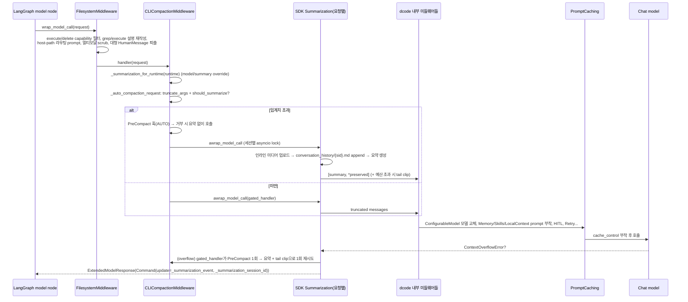

# 02 — 에이전트 조립과 SDK 코어 (create_deep_agent, 미들웨어 스택, 백엔드, 컨텍스트 관리)

dcode의 에이전트 서버 프로세스는 `server_graph._make_graphs`에서 모델과 도구를 준비합니다. 이어서 `create_cli_agent`(`libs/code/deepagents_code/agent.py:2408`)를 호출해 LangGraph `Pregel` 그래프 하나와 `CompositeBackend` 하나를 받습니다(`libs/code/deepagents_code/server_graph.py:528-569`). `create_cli_agent` 자체는 조립기이고, 실제 그래프 생성은 SDK의 `create_deep_agent`(`libs/deepagents/deepagents/graph.py:271`)에 넘깁니다. dcode는 SDK의 `skills=`/`memory=`/`interrupt_on=`/`permissions=` 인자를 쓰지 않습니다. 대신 20개 안팎의 미들웨어 인스턴스를 `middleware=`로 직접 넘기고, 이름(`.name`)이 겹치게 만들어 SDK 기본 슬롯을 **제자리 교체**합니다. 핵심은 세 가지입니다. (1) `.name` 기반 병합으로 미들웨어 스택 순서가 정해집니다. (2) 백엔드는 로컬 디스크(`LocalShellBackend`, `virtual_mode=False`)에 artifacts/conversation_history 전용 라우트를 얹은 `CompositeBackend`입니다. (3) 컨텍스트 관리는 FilesystemMiddleware의 도구 결과 퇴출, SDK SummarizationMiddleware의 인자 절단·요약·오버플로 복구, 그리고 dcode `CLICompactionMiddleware`의 PreCompact 훅·런타임 모델 추종·`/offload`로 이루어집니다.

---

## 문서가 약속하는 것

- `create_deep_agent`의 기본 스택은 Filesystem → SubAgent → Summarization → PatchToolCalls → Prompt caching입니다(`docs_official/sdk/customization.md:1094-1098`).
- 전체 스택 순서는 Skills → Filesystem → SubAgent → Summarization → Patch → AsyncSubAgent → *사용자 middleware* → profile extras → excluded-tool 필터 → Prompt caching(Anthropic, Bedrock) → Memory → HITL입니다(`docs_official/sdk/customization.md:1105-1131`).
- 사용자 미들웨어의 `.name`이 기본 항목과 같으면 제자리 교체되고, 다르면 "Patch 뒤" 또는 "마지막 core 항목 뒤, profile/prompt-caching/memory 앞"에 들어갑니다(`docs_official/sdk/customization.md:1084`, `:1117`, `:1482`; `docs_official/sdk/context-engineering.md:891`).
- MemoryMiddleware는 캐시 prefix를 깨지 않도록 prompt caching **뒤**에 둡니다(`docs_official/sdk/customization.md:1128`).
- FilesystemMiddleware와 SubAgentMiddleware는 `excluded_middleware`로 제거할 수 없습니다(`docs_official/sdk/overview.md:1173`, `:1404`).
- `FilesystemMiddleware(tools=[...])`를 직접 넘기면 메인 에이전트의 기본 인스턴스를 대체합니다. general-purpose 서브에이전트는 그 제한을 상속하고, 선언형 서브에이전트는 상속하지 않습니다(`docs_official/sdk/overview.md:1181-1198`).
- 오프로딩: 도구 입력·결과가 20,000 토큰을 넘으면 퇴출됩니다. 결과는 "파일 경로 + 처음 10줄 미리보기"로 바뀌고, 입력은 컨텍스트가 85%를 넘을 때 오래된 tool call이 절단됩니다(`docs_official/sdk/context-engineering.md:832-840`).
- 요약: `max_input_tokens`의 85%에서 트리거되고 10%를 보존합니다. 프로필이 없으면 170,000 토큰 / 6 메시지입니다. `ContextOverflowError`가 나면 즉시 요약한 뒤 재시도합니다(`docs_official/sdk/context-engineering.md:860-867`).
- `create_summarization_tool_middleware`를 붙이면 `compact_conversation` 도구가 생기고, 자동 요약과 엔진·상태를 공유합니다(`docs_official/sdk/context-engineering.md:886-1007`).
- 할 일 목록(`write_todos`)은 v0.7부터 opt-in이며, `TodoListMiddleware`를 직접 넘겨야 합니다(`docs_official/sdk/overview.md:1304-1312`, `docs_official/sdk/tools.md:518`).
- `FilesystemBackend`는 `CompositeBackend`로 감싸 `/large_tool_results/`, `/conversation_history/`가 프로젝트 파일과 섞이지 않게 하라고 권장합니다(`docs_official/sdk/backends.md:322`, `:914`).
- `FilesystemBackend`의 기본값은 `virtual_mode=False`이고, 그러면 `root_dir`가 있어도 보안이 없다고 설명합니다(`docs_official/sdk/backends.md:230-232`).
- dcode `/offload`는 `~/.deepagents/conversation_history/`에 마크다운 아카이브를 쓰고, 30일 보존 sweep이 돕니다(`docs_official/code/configuration.md:422-441`).
- 재개 시 컨텍스트가 400,000 토큰을 넘으면 compact를 제안합니다(`[threads].compact_on_resume_threshold`, `docs_official/code/configuration.md:445-449`).
- 요약 모델 우선순위: `--summarization-model` → `[models].summarization_default` → 메인 모델. 이 설정은 자동 compaction, `/offload`, `/compact`에 적용됩니다(`docs_official/code/config-file.md:36-51`, `docs_official/code/cli-reference.md:69-86`).
- dcode 개요는 "Context compaction: Summarize older messages and offload originals to storage."라는 한 줄만 둡니다(`docs_official/code/overview.md:49-50`).

---

## 코드 지도

| file/symbol | 역할 | 비고 |
|---|---|---|
| `libs/code/deepagents_code/server_graph.py:163` `_build_tools` | 소비자 도구 목록(`fetch_url`, `get_current_thread_id`, Tavily `web_search`, MCP) | `:206-249` |
| `libs/code/deepagents_code/server_graph.py:528` | `create_cli_agent` 호출, `offload_operation_from(composite_backend)` 필수 검사 | `:570-578` |
| `libs/code/deepagents_code/agent.py:2408` `create_cli_agent` | dcode 조립기, `(agent, CompositeBackend)` 반환 | `:2450`, `:3513` |
| `agent.py:2711` `_subagent_cli_middleware` | 서브에이전트용 dcode 미들웨어 묶음 | HITL, ConfigurableModel, Cost, Retry, Hooks(emit_stop=False) |
| `agent.py:2859-2873` | dcode가 GP 서브에이전트를 직접 만들고, 기본값으로 `mode="fork"` 지정 | `DEEPAGENTS_CODE_FORKED_SUBAGENTS`(`_env_vars.py:258`) |
| `agent.py:2876-3444` | 메인 `agent_middleware` 리스트 조립 | 아래 흐름 참조 |
| `agent.py:2979-3012` | 로컬: `LocalShellBackend`/`FilesystemBackend`(`virtual_mode=False`), 원격: sandbox | |
| `agent.py:3095-3163` | `CompositeBackend(default=backend, routes=artifact+extension, artifacts_root=...)` | |
| `agent.py:1526` `get_system_prompt` | `system_prompt.md` 템플릿에 placeholder 치환 | `:1670-1684` |
| `agent.py:198` `_get_harness_tool_descriptions` / `:226` `_inject_fs_tools_into_subagents` | `--allow-fs-tools`를 메인·서브에이전트 모두에 강제 | |
| `libs/code/deepagents_code/offload_middleware.py:1009` `CLICompactionMiddleware` | SDK `SummarizationToolMiddleware`를 상속. 자동 요약과 compact 도구를 한 인스턴스가 담당 | `.name` 별칭 `:1049-1052` |
| `offload_middleware.py:1597` `_create_cli_compaction_middleware` | SDK factory로 만든 뒤 요약 모델 재시도 정책 주입 | `:1617-1625` |
| `offload_middleware.py:1322` `_summarization_for_runtime` | `/model`·`/summarization-model` 변경을 따라가는 요청 단위 summarizer (1-slot memo) | `:1347-1360` |
| `offload_middleware.py:157-263` | `_install_summary_model_retries` / `_trim_limit` / `_token_counter` | LangChain 내부 슬롯을 직접 교체 |
| `offload_middleware.py:1694` `OffloadOperation` | 서버 HTTP 경로 `/offload`의 실행기(훅 → forced compaction plan) | `:1778-1868` |
| `libs/code/deepagents_code/offload_api.py:959` `_execute_offload`, `:1125` `offload` | Starlette HTTP 경계, idle/error 스레드만 허용 | `:66` |
| `libs/code/deepagents_code/offload.py:125` `_artifacts_root`, `:163` `_offload_fallback_root` | `/tmp/dcode-artifacts-<uid>`(0o700) 및 `~/.deepagents/conversation_history` | fallback `/dcode-artifacts-fallback` `:17` |
| `libs/code/deepagents_code/local_context.py:718` `LocalContextMiddleware` | 백엔드 `execute`로 git/프로젝트 감지 스크립트를 1회 실행하고 결과를 system prompt에 부착 | private state 캐시 `:694-710` |
| `libs/code/deepagents_code/tools.py:503` `fetch_url`, `:348` `create_web_search_tool` | 소비자 도구, SSRF 가드 `_validate_url` `:98` | |
| `libs/code/deepagents_code/managed_tools.py:326` `prepend_managed_bin_to_path` | ripgrep 14.1.1을 `PATH` 앞에 둠. SDK는 `rg`를 PATH로 찾음 | `:1-12`, SDK `backends/filesystem.py:72` |
| `libs/code/deepagents_code/file_ops.py:683` `FileOpTracker` | 클라이언트 측 diff/승인 미리보기(read/write/edit/delete) | 그래프 밖 |
| `libs/code/deepagents_code/_tool_stream.py:268` `ToolCallBuffer` | TUI·headless 공용 스트리밍 tool-call 버퍼와 훅 payload | `:1-30` |
| `libs/code/deepagents_code/cold_cache.py:758` `resolve_prompt_cache_policy` | 프롬프트 캐시 TTL/재가열 비용 경고 정책(Anthropic 300s 등) | `:150`, 그래프 밖 |
| `libs/deepagents/deepagents/graph.py:271` `create_deep_agent` | SDK 조립. 모델 해석 → profile → 서브에이전트 스택 → 메인 스택 → `create_agent` | |
| `graph.py:73` `DeepAgentState` | `messages`에 `DeltaChannel(_messages_delta_reducer, snapshot_frequency=50)` | O(N²)→O(N) |
| `graph.py:204` `_apply_custom_middleware` | 이름이 일치하면 제자리 교체, 아니면 마지막 core 뒤에 splice | |
| `graph.py:241` `_REQUIRED_MIDDLEWARE` | Filesystem, SubAgent 제외 금지 | |
| `libs/deepagents/deepagents/_excluded_middleware.py:88` `_apply_excluded_middleware` | class는 정확한 타입, 문자열은 `.name` 일치로 제거. 커버리지 검증 `:163` | |
| `libs/deepagents/deepagents/middleware/_tool_exclusion.py:34` `_ToolExclusionMiddleware` | 모델 요청의 tools에서 제거하고, 호출 시에도 거부 | `:79-101` |
| `libs/deepagents/deepagents/middleware/_prompt_caching.py:43` `append_prompt_caching_middleware` | Anthropic(무조건) + Bedrock/Fireworks(패키지가 있을 때) | |
| `libs/deepagents/deepagents/_messages_reducer.py:31` | ID dedup, `RemoveMessage` tombstone, `REMOVE_ALL_MESSAGES` 리셋 | |
| `libs/deepagents/deepagents/_tools.py:30` `_apply_tool_description_overrides` | profile의 설명 재작성(호출자 객체는 변경하지 않음) | |
| `libs/deepagents/deepagents/middleware/filesystem.py:1681` `FilesystemMiddleware` | 8개 FS 도구, 도구 결과·HumanMessage 퇴출, execute/delete capability 필터 | 기본값 `:1748-1760` |
| `middleware/summarization.py:523` `_DeepAgentsSummarizationMiddleware` | `.name`="SummarizationMiddleware"(`:533-545`), LangChain 헬퍼 위임 | |
| `middleware/summarization.py:262` `compute_summarization_defaults` | 0.85/0.10 또는 170k/6, truncate_args 설정 | |
| `middleware/summarization.py:1472` `wrap_model_call` | 인자 절단 → 요약 판단 → 오프로드 → 요약 → 예산 검사 → 오버플로 재시도 | |
| `middleware/summarization.py:1924` `SummarizationToolMiddleware` | `compact_conversation` 도구, 트리거의 50%부터 호출 자격 | `:2124-2174` |
| `middleware/_message_eviction.py:25` `TOO_LARGE_TOOL_MSG`, `:35` `_create_content_preview` | head 5 + tail 5 줄 미리보기 | |
| `middleware/_overflow_clip.py:143` `_clip_overflow_tail` | 오버플로 시 꼬리 ToolMessage 묶음을 퇴출(read_file은 4k로 slice) | |
| `backends/protocol.py:404` `BackendProtocol`, `:870` `SandboxBackendProtocol` | 파일 연산 / `execute` 분리 | |
| `backends/composite.py:195` `_route_for_path`, `:228` `CompositeBackend` | 가장 긴 prefix 우선 라우팅, `artifacts_root` | `:281` |
| `backends/filesystem.py:91` `FilesystemBackend` | 실제 디스크, ripgrep/Python grep, **기본값 `virtual_mode=True`** | `:141` |
| `backends/state.py:38` `StateBackend` | LangGraph state의 `files` 채널(스레드 범위) | SDK 기본 backend |
| `backends/store.py:90` `StoreBackend` | `BaseStore` + namespace factory(스레드 간 영구) | dcode 미사용(추정) |
| `backends/utils.py:88-90` | `MAX_LINE_LENGTH=5000`, `TOOL_RESULT_TOKEN_LIMIT=20000` | |

---

## 동작 흐름

### A. 조립 (서버 프로세스 시작 시 1회)

1. `server_graph`가 `create_model`로 모델을 해석하고(`server_graph.py:443-450`), `_build_tools`로 `[fetch_url, get_current_thread_id, (web_search), *MCP]`를 만듭니다(`server_graph.py:206-249`).
2. `create_cli_agent` 진입. `DEEPAGENTS_CODE_EXPERIMENTAL`이 꺼져 있으면 extension registry를 무시하고(`agent.py:2648-2651`), sandbox가 있으면 Auto 모드를 끕니다(`:2653-2657`).
3. HITL 결정: `interrupt_shell_only` + allow-list가 있으면 `ShellAllowListMiddleware` 경로, 아니면 `_add_interrupt_on`으로 `resolved_interrupt_on`을 만듭니다(`agent.py:2677-2702`).
4. 모델 정책(`ModelConfig.require_model_allowed`)을 검사하고, dcode 재시도를 소유하는 모델로 재해석합니다(`agent.py:2778-2803`).
5. 사용자·프로젝트 `agents/*.md` 서브에이전트를 `SubAgent` dict로 변환합니다. 각각 `_subagent_cli_middleware`를 붙이고, HITL이 켜져 있으면 `interrupt_on={}`로 SDK 이중 HITL을 차단합니다(`agent.py:2804-2852`). GP 서브에이전트를 직접 추가하고 기본적으로 `mode="fork"`로 둡니다(`:2859-2873`).
6. 메인 `agent_middleware`를 순서대로 append합니다(`agent.py:2876-3444`. 전체 목록은 아래 스택 다이어그램).
7. 백엔드: 로컬+shell이면 `LocalShellBackend(root_dir=cwd, virtual_mode=False, inherit_env=False, env=shell_env)`입니다(`agent.py:2999-3004`). `shell_env`는 `GIT_TERMINAL_PROMPT=0`, 사용자 LangSmith env 복원, PYTHONPATH 재적용을 거친 복사본입니다(`:2985-2991`).
8. 백엔드 조건부 미들웨어: 백엔드가 `execute`를 지원하면 `LocalContextMiddleware`를 붙입니다(`agent.py:3054-3062`). 인자로 system prompt를 받지 않았으면 `get_system_prompt`를 만듭니다(`:3069-3078`).
9. `CompositeBackend`: 로컬 모드에서는 `artifacts_root=/tmp/dcode-artifacts-<uid>`(실제 호스트 경로)입니다. 라우트 `{artifacts_root}/conversation_history/`와 `/dcode-artifacts-fallback/conversation_history/`는 `FilesystemBackend(root=~/.deepagents/conversation_history, virtual_mode=True)`로 가고, fallback일 때는 `large_tool_results/`도 전용 라우트가 붙습니다(`agent.py:3104-3163`, `offload.py:125-160`).
10. `_create_cli_compaction_middleware(model, composite_backend)`(`agent.py:3164-3170`)를 만들고, HITL(Auto 또는 AsyncApproval)과 `ServerHooksMiddleware`를 붙입니다(`:3171-3212`). 이어서 `attach_offload_operation`으로 `/offload` 실행기를 backend 객체에 게시합니다(`:3217-3220`).
11. `--allow-fs-tools`가 있으면 제한된 `FilesystemMiddleware`를 메인 스택과 모든 서브에이전트 spec에 주입합니다(`agent.py:3222-3254`).
12. compaction, `CodeModelRetryMiddleware`, `ToolErrorMiddleware(task)`, `ReliableRubricMiddleware`를 append합니다(`agent.py:3300-3444`). extension 도구·미들웨어는 이름이 겹치는 기존 항목을 제거한 뒤 추가합니다(`:3457-3481`).
13. `create_deep_agent(model, system_prompt, tools, backend=composite, middleware=agent_middleware, interrupt_on={}, context_schema=CLIContextSchema, subagents=...)`(`agent.py:3488-3500`).
14. SDK 내부:
    - 모델 해석과 harness profile 선택(`graph.py:594-615`), profile 제외 설정 검증(`:617-621`)
    - `backend`는 None이 아니므로 그대로 사용(`:637`), `system_prompt`에 profile BASE/SUFFIX 결합(`:639-648`)
    - 선언형 서브에이전트마다 `[Filesystem, Summarization, Patch] + profile extras + caching + 커스텀 병합` 스택 구성(`:663-788`)
    - dcode가 `general-purpose`를 이미 넘겼으므로 SDK의 GP 자동 추가는 건너뜀(`:795-796`)
    - 메인 core `[Filesystem, SubAgent, Summarization, Patch]`(`:862-891`) → core 이름 캡처(`:900`) → profile extras + caching(`:904-905`)
    - `memory=None`, 병합한 interrupt_on이 None이므로 Memory/HITL tail 없음(`:906-921`)
    - `_apply_custom_middleware`로 dcode 리스트 병합(`:928`), `_ToolExclusionMiddleware`(`:937-938`)
    - `create_agent(...).with_config({"recursion_limit": 9_999, ...})`(`:956-978`)
15. dcode는 `resolve_recursion_limit()` 값으로 `agent.copy`해 9,999를 덮어씁니다(`agent.py:3501-3512`).

### B. 실제로 조립되는 메인 에이전트 미들웨어 스택

전제는 로컬 모드, interactive, HITL 활성, Auto 모드, memory·skills·ask_user 켜짐, `--allow-fs-tools` 없음, extension 없음, async subagent 없음입니다. 리스트의 앞쪽일수록 `wrap_model_call`/`wrap_tool_call`에서 **바깥쪽**입니다(LangChain `factory.py:661` "first = outermost", 저장소 밖 uv 캐시에서 확인).

```mermaid
flowchart TD
  subgraph CORE["SDK core (graph.py:862-896)"]
    A1["1 FilesystemMiddleware<br/>(SDK 인스턴스; --allow-fs-tools면 dcode 인스턴스로 제자리 교체)"]
    A2["2 SubAgentMiddleware<br/>(task: dcode agents/*.md + GP fork)"]
    A3["3 CLICompactionMiddleware<br/>name='SummarizationMiddleware' → SDK 요약 슬롯 제자리 교체<br/>+ compact_conversation 도구"]
    A4["4 PatchToolCallsMiddleware"]
  end
  subgraph DCODE["dcode splice (graph.py:234-235, agent.py 순서 유지)"]
    B1["5 ConfigurableModelMiddleware (agent.py:2876)"]
    B2["(headless) _GlmTerminalStallRecovery / HeadlessMCPGuardMiddleware"]
    B3["6 ResumeState · 7 CostTracking · 8 GoalTools (update_goal)"]
    B4["9 AskUserMiddleware (ask_user)"]
    B5["10 MemoryMiddleware(FilesystemBackend vm=False) · 11 ManagedMemoryGuard"]
    B6["12 PluginSkillsMiddleware"]
    B7["(opt) CodeInterpreterMiddleware js_eval"]
    B8["13 LocalContextMiddleware"]
    B9["(opt) ShellAllowListMiddleware"]
    B10["14 AutoModeHITL | AsyncApprovalHITL<br/>(name='HumanInTheLoopMiddleware')"]
    B11["15 ServerHooksMiddleware"]
    B12["(goal) GoalCriteriaMiddleware"]
    B13["16 CodeModelRetryMiddleware · 17 ToolErrorMiddleware(task)"]
    B14["18 ReliableRubricMiddleware"]
    B15["(exp) extension middleware · ExtensionRuntimeMiddleware"]
  end
  subgraph TAIL["SDK tail (graph.py:904-938)"]
    C1["profile extra_middleware (예: GLM/Codex/Nemotron)"]
    C2["AnthropicPromptCaching · (Bedrock) · (Fireworks)"]
    C3["(profile.excluded_tools) _ToolExclusionMiddleware"]
  end
  A1-->A2-->A3-->A4-->B1-->B2-->B3-->B4-->B5-->B6-->B7-->B8-->B9-->B10-->B11-->B12-->B13-->B14-->B15-->C1-->C2-->C3-->M(("model"))
```



주의: `compaction_middleware`는 코드상 `agent.py:3300`에서 append되지만, `.name`이 SDK 요약과 같아서 `_apply_custom_middleware`(`graph.py:229-231`)가 **3번 슬롯으로 옮겨** 넣습니다. 따라서 컴팩션은 ConfigurableModel/Memory/Skills/LocalContext/HITL/Retry보다 모두 바깥에 있습니다.

### C. 한 번의 모델 호출(메인 스택)



- 요약 판단: 먼저 이전 이벤트를 적용해 유효 메시지를 만들고(`summarization.py:1509`), 토큰을 한 번만 셉니다(`:1513`). 인자를 절단한 뒤(`:1516-1519`) `should_summarize or _over_budget`을 판단합니다(`:1524`). 아니면 그대로 호출하고, 오버플로 예외만 잡아 요약 경로로 넘깁니다(`:1528-1535`).
- 요약 경로: cutoff를 계산하고(`:1538`) 인라인 미디어를 오프로드합니다(`:1547`). 히스토리 파일에 append하는데, 실패하면 `file_path=None`인 채로 계속 진행합니다(`:1555-1559`). 요약 생성(`:1572`), 이벤트 생성(`:1581-1585`), 예산 검사가 붙은 호출(`:1590-1595`)이 이어집니다.
- 예산: `max_input_tokens*0.95 - max(output tokens)`(`summarization.py:1380-1391`). 축소 후에도 넘으면 `ContextOverflowError`를 올립니다(`:1400-1408`).
- 도구 호출 측: `FilesystemMiddleware.wrap_tool_call`은 `ls/glob/grep/read_file/edit_file/write_file/delete`를 제외한 결과(예: `execute`, MCP, `fetch_url`)가 `4*20000`자를 넘으면 `{artifacts_root}/large_tool_results/{tool_call_id}`에 쓰고 미리보기로 바꿉니다(`filesystem.py:1611-1619`, `:3282-3326`, `:3605-3629`).

### D. `/offload` (서버 HTTP 경로)

`offload_api.offload`(`offload_api.py:1125`) → `_execute_offload`(`:959`) → `OffloadOperation.execute`(`offload_middleware.py:1778`)로 이어집니다. `execute`는 다음 순서로 동작합니다.

1. 유효 메시지와 토큰을 계산합니다.
2. `ServerHooksMiddleware.aafter_model`에 가짜 `compact_conversation(force=True)` 호출을 넣어 PreCompact/PreToolUse 결정을 받습니다(`:1713-1776`). 결정 채널이 없으면 fail-closed입니다.
3. `_aplan_forced_compaction_update`로 계획을 세웁니다.
4. `_summarization_event`/`_summarization_session_id` 두 채널만 반환해 checkpoint에 씁니다(`:1858-1868`, 허용 채널 `offload_api.py:60`).

---

## 핵심 설계 포인트

### 1. 이름 별칭으로 SDK 슬롯을 "납치"한다

```python
# offload_middleware.py:1049-1052
@property
def name(self) -> str:
    """Replace the SDK auto-summarizer while retaining the compact tool."""
    return self._summarization.name   # == "SummarizationMiddleware"
```
```python
# graph.py:228-237 (_apply_custom_middleware)
result = list(base)
for i, m in enumerate(result):
    if m.name in replacements:
        result[i] = replacements[m.name]
if to_append and core_names is not None:
    pos = max((i for i, m in enumerate(result) if m.name in core_names), default=len(result) - 1) + 1
    result[pos:pos] = to_append
```
- SDK 문서는 `create_summarization_tool_middleware`를 "자동 요약과 **함께** 두는" 별도 도구 계층으로 설명합니다(`summarization.py:1857-1863`). dcode는 반대로 자동 요약 슬롯 자체를 도구 미들웨어로 바꿔 한 인스턴스로 합칩니다. 그 결과 자동 요약, 모델이 부르는 compact, `/offload`가 같은 summarizer 선택 로직(`_summarization_for_runtime`)과 같은 세션 lock(`_archive_lock`, `offload_middleware.py:533`)을 공유합니다.
- 같은 기법이 두 곳 더 있습니다. `AsyncApprovalHITLMiddleware.name = HumanInTheLoopMiddleware.__name__`(`agent.py:2078-2083`)와 `AutoModeHITLMiddleware.name`(`auto_mode.py:2139-2141`)입니다. 이 둘이 동시에 설치되면 `create_agent`의 중복 이름 assert에 걸리기 때문에 dcode는 둘 중 하나만 설치합니다(`agent.py:3198-3202`).

### 2. 컴팩션이 모델 교체보다 바깥에 있다 → 런타임 모델 추종

`ConfigurableModelMiddleware`(5번)는 `/model` 선택을 요청 안쪽에서 반영하는데, 컴팩션(3번)은 그보다 바깥입니다. 그래서 컴팩션은 `request.model`을 믿지 않고 runtime context의 모델 설정으로 summarizer를 **다시 만듭니다**.
```python
# offload_middleware.py:1338-1345
config = _runtime_model_config(runtime)
summary_model_spec = config.summarization_model_spec
if summary_model_spec == INHERIT_SUMMARIZATION_MODEL:
    summary_model_spec = None
elif summary_model_spec is None:
    summary_model_spec = self._summarization_model_spec
if not config.model_spec and not summary_model_spec:
    return self._summarization
```
- 임계치와 토큰 계산은 메인 모델을 따르고, 요약 생성만 요약 모델을 씁니다(`:1331-1336`). 1-slot memo로 매 턴 `create_model` 비용을 피합니다(`:1040-1047`).
- (추정) 같은 이유로, 요약 토큰 카운트(`summarization.py:1513`)가 보는 `request.system_message`에는 안쪽 미들웨어(Memory/Skills/LocalContext)가 나중에 붙이는 prompt가 들어 있지 않습니다. 예산 검사 `_over_budget`도 같은 레이어에서 돌기 때문에, 실제 전송 크기보다 작게 추정할 수 있습니다. provider 오버플로 fallback이 이 차이를 메웁니다.

### 3. 요약 모델 호출 정책을 LangChain 내부 슬롯에 직접 주입

```python
# offload_middleware.py:171-179
helper = summarization._lc_helper
_require_helper_slot(helper, "_summary_model", "own compaction summarization retries")
helper._summary_model = _RetryingModelInvoker(
    model if model is not None else summarization.model
)
```
- LangChain의 무조건 3회 `with_retry`를 `--max-retries`로 대체합니다. 슬롯 이름이 바뀌면 조용히 넘어가지 않고 `AttributeError`로 실패합니다(`:131-154`).
- SDK factory의 `trim_tokens_to_summarize` 기본값은 `None`(`summarization.py:1762`)이라 LangChain 기본값 4000(`:556`, `:575`)을 덮어 **트리밍이 꺼집니다**. 전용 요약 모델을 쓸 때만 그 모델 창의 80%로 제한합니다(`offload_middleware.py:209-237`, fallback 4,000 `:84`).

### 4. 메시지 상태를 파괴하지 않는 요약

LangChain 요약은 `RemoveMessage(REMOVE_ALL_MESSAGES)`로 `messages`를 다시 씁니다. SDK는 private state `_summarization_event{cutoff_index, summary_message, file_path}`만 기록하고, 매 호출마다 이 이벤트를 적용해 유효 메시지를 재구성합니다(`summarization.py:1787-1792`, `:142-152`, `:198-211`). `LocalContextMiddleware`는 이 이벤트의 `cutoff_index` 변화를 감지해 git/프로젝트 상태를 다시 수집하고, 달라졌을 때만 `HumanMessage`로 **append**합니다. system prompt를 바이트 단위로 그대로 두어 캐시 적중을 유지하기 위해서입니다(`local_context.py:694-710`, `:825-872`, `:910-923`).

### 5. `messages`의 DeltaChannel과 ID 기반 in-place 교체

`DeepAgentState.messages`는 `DeltaChannel(..., snapshot_frequency=50)`입니다(`graph.py:73-76`). reducer는 ID로 dedup합니다(`_messages_reducer.py:74-90`). 그래서 HumanMessage 퇴출은 `REMOVE_ALL` 없이 같은 ID의 tagged 복사본 하나만 씁니다(`filesystem.py:3390-3421`). 오버플로 tail clip도 원래 ID를 유지한 치환본을 `Command(update={"messages": ...})`로 돌려줍니다(`_overflow_clip.py:158-162`, `summarization.py:1601-1602`).

### 6. fork 서브에이전트는 부모 미들웨어 전체를 이름 병합으로 상속

```python
# graph.py:726-735
subagent_custom_middleware = list(spec.get("middleware", []))
if is_forked and middleware:
    subagent_custom_middleware = list({m.name: m for m in [*middleware, *subagent_custom_middleware]}.values())
subagent_middleware = _apply_custom_middleware(subagent_middleware, subagent_custom_middleware, core_names=_subagent_core_names)
```
- dcode GP 서브에이전트는 기본값이 fork입니다(`agent.py:2869-2870`). 따라서 부모의 `agent_middleware` 전체가 넘어갑니다. 여기에는 `CLICompactionMiddleware`(요약 슬롯 교체), Memory, Rubric, LocalContext 등이 포함됩니다. 이름이 같은 항목은 spec 쪽 `_subagent_cli_middleware` 인스턴스(예: `ServerHooksMiddleware(emit_stop=False)`, `ConfigurableModelMiddleware(persist_model_state=False)`)가 이깁니다. (추정) `_subagent_cli_middleware`가 부모와 **같은 클래스·이름**으로 다시 만드는 이유가 바로 이 덮어쓰기입니다. 비-fork 선언형 서브에이전트는 SDK 기본 `create_summarization_middleware`를 씁니다(`graph.py:698`). 따라서 PreCompact 훅이나 요약 모델 설정을 받지 못합니다(추정).
- 서브에이전트 상세는 다른 분석 담당입니다(경계만 표시).

### 7. `--allow-fs-tools` 강제는 dcode가 직접 한다

SDK 문서는 "GP가 제한을 상속"한다고 하지만, 그 경로(`graph.py:822-823`)는 SDK가 GP를 **자동 생성할 때만** 동작합니다. dcode는 GP를 직접 넘기므로 모든 서브에이전트 spec에 `FilesystemMiddleware(tools=fs_tools)`를 주입합니다. `CompiledSubAgent`가 있으면 제한을 강제할 수 없으므로 `ValueError`로 실패합니다(`agent.py:3245-3254`, `:258-284`). 또 교체 인스턴스에는 `_permissions`가 전달되지 않습니다. 현재 dcode는 permissions를 쓰지 않지만, 앞으로 도입하면 `--allow-fs-tools`가 권한 규칙을 조용히 제거하게 된다는 경고 주석이 있습니다(`agent.py:3231-3237`).

### 8. 백엔드: "실제 경로 = 에이전트 경로"와 artifacts 격리

- 메인 백엔드는 `virtual_mode=False`입니다. 에이전트 경로가 곧 호스트 절대경로여서, `execute` 셸과 파일 도구가 같은 경로를 봅니다(`agent.py:2999-3007`). system prompt도 절대경로 사용을 강제합니다(`agent.py:1658-1668`).
- `artifacts_root`를 실제 호스트 디렉터리(`/tmp/dcode-artifacts-<uid>`, 0o700, 소유자 검사)로 잡습니다. 그래서 `large_tool_results`는 라우트 없이 기본 백엔드로 떨어지고, 셸에서도 그대로 읽을 수 있습니다(`offload.py:125-160`, `agent.py:3096-3103`). SDK는 `CompositeBackend.artifacts_root`에서 prefix를 계산합니다(`filesystem.py:1830-1833`, `summarization.py:631-634`).
- conversation_history는 영구 저장소(`~/.deepagents/conversation_history`, `virtual_mode=True`)로 라우팅되고, fallback 별칭은 복구 후에도 남겨 과거 경로를 해석할 수 있게 합니다(`agent.py:3105-3121`).
- 라우팅은 가장 긴 prefix가 우선이고, 경계는 `/`로 강제합니다(`composite.py:214-225`, `:281`).

### 9. 캐시 친화적 배치와 SDK 의도의 차이

SDK는 Memory를 caching 뒤에 둡니다(`graph.py:901-915`). dcode는 `memory=`를 쓰지 않고 `MemoryMiddleware`를 커스텀으로 넘기므로, 그 인스턴스는 splice 위치(caching 앞)에 들어갑니다. 그 대신 dcode는 LocalContext를 state에 캐시하고(`local_context.py:697-704`) 별도 cold-cache 경고 체계(`cold_cache.py:150`, `:758`)를 둡니다. (추정) `AnthropicPromptCachingMiddleware`는 요청이 나가기 직전 마지막 레이어라, 안쪽에서 system prompt가 바뀌어도 cache_control 위치에는 영향이 없습니다. SDK 주석이 말한 "prefix 무효화"는 매 턴 memory 내용이 바뀔 때의 문제로 보입니다.

---

## 문서 ↔ 코드 대조

| 항목 | 문서 | 코드 | 판정 |
|---|---|---|---|
| 기본 스택 순서 | Filesystem→SubAgent→Summarization→Patch→caching (`sdk/customization.md:1094-1098`) | `graph.py:862-905` | 일치 |
| 커스텀 미들웨어 삽입 위치 | "Patch 뒤"(`customization.md:1084`, `:1117`) vs "마지막 core 뒤"(`:1482`) | 마지막 core 뒤. AsyncSubAgent가 있으면 그 뒤(`graph.py:900`, `:234`) | 문서 내부 불일치(1482가 정확) |
| Prompt caching 종류 | Anthropic, Bedrock (`customization.md:1123`) | Anthropic + Bedrock + **Fireworks** (`_prompt_caching.py:29-49`) | 코드에만 있음(Fireworks) |
| Memory 위치 | caching 뒤 (`customization.md:1128`) | SDK `memory=` 경로는 일치(`graph.py:906-915`). dcode는 커스텀으로 넘겨 caching 앞(`agent.py:2940-2950`, `graph.py:928`) | dcode에서 불일치 |
| 도구 결과 미리보기 | "처음 10줄" (`sdk/context-engineering.md:840`) | head 5 + tail 5 줄, 줄당 1000자 (`_message_eviction.py:35-62`) | 불일치 |
| 퇴출 제외 도구 | 언급 없음 | `ls, glob, grep, read_file, edit_file, write_file, delete` (`filesystem.py:1611-1619`) | 코드에만 있음 |
| HumanMessage 퇴출 | 언급 없음 | 50,000 토큰(≈200k자) 초과인 마지막 HumanMessage를 퇴출 (`filesystem.py:1755`, `:3358-3380`) | 코드에만 있음 |
| 도구 입력 절단 | 85%에서 오래된 tool call 절단 (`context-engineering.md:834-836`) | 프로필 있음: trigger 0.85 / keep 0.10, 인자당 2000자 + `...(argument truncated)` (`summarization.py:280-288`, `:639-648`) | 일치(세부 기본값은 코드에만) |
| 요약 기본값 | 0.85/0.10, 없으면 170k/6 (`context-engineering.md:863-865`) | `summarization.py:280-299`. 프로필이 없으면 truncate는 messages 20/20 | 일치(truncate 기본값은 코드에만) |
| 오버플로 복구 | 즉시 요약 후 재시도 (`context-engineering.md:866`) | 최대 1회 "엄격히 더 작은" 재시도, 입력 예산 `0.95*limit - output` (`summarization.py:1380-1439`) | 일치(예산 규칙은 코드에만) |
| compact 도구 자격 | "on demand" (`context-engineering.md:889`) | 트리거의 50% 이상일 때만 허용 (`summarization.py:2124-2174`) | 코드에만 있음 |
| 요약 트리밍 | LangChain 기본 4000 (`summarization.py:575` docstring) | factory 기본 `None`으로 비활성 (`summarization.py:1762`). dcode는 전용 요약 모델일 때 80% (`offload_middleware.py:197-237`) | 코드에만 있음 |
| FilesystemBackend `virtual_mode` 기본값 | `False` (`sdk/backends.md:232`) | `True` (`backends/filesystem.py:141`, docstring `:165-167`) | **불일치** |
| dcode 메인 백엔드 | 명시 없음 | `virtual_mode=False` 로컬 셸 (`agent.py:2999-3007`) | 코드에만 있음 |
| artifacts 위치 | `/large_tool_results/`, `/conversation_history/` (`backends.md:322`) | dcode: `/tmp/dcode-artifacts-<uid>/large_tool_results`, conversation_history는 `~/.deepagents/conversation_history`로 라우팅 (`offload.py:141`, `agent.py:3106-3121`) | 코드에만 있음(tmp 경로) |
| `/offload` 아카이브 위치 | `~/.deepagents/conversation_history/` (`code/configuration.md:422`, `:441`) | `_offload_fallback_root()/conversation_history` (`agent.py:3106-3108`, `offload.py:163-180`) | 일치 |
| 요약 모델 우선순위 | CLI → `[models].summarization_default` → 메인 (`code/config-file.md:45-49`) | 런타임 context → 시작 spec → 메인 (`offload_middleware.py:1338-1345`), `INHERIT_SUMMARIZATION_MODEL` sentinel | 일치(런타임 sentinel은 코드에만) |
| 자동 compaction의 PreCompact 훅 | code 문서에 없음(훅 담당 분석 참조) | `trigger=AUTO`, 오버플로 fallback 때도 1회 게이트 (`offload_middleware.py:1064-1088`, `:1124-1144`) | 코드에만 있음 |
| GP 서브에이전트 fork 기본값 | 문서에서 확인 못함 | `DEEPAGENTS_CODE_FORKED_SUBAGENTS` 기본 True (`agent.py:2869`, `_env_vars.py:258`) | 코드에만 있음 |
| GP의 `FilesystemMiddleware(tools=)` 상속 | GP가 상속 (`sdk/overview.md:1198`) | SDK 자동 GP만 해당. dcode는 직접 주입 (`graph.py:822-823`, `agent.py:3245-3254`) | 일치(dcode는 우회 구현) |
| recursion_limit | CLI → env `DEEPAGENTS_CODE_RECURSION_LIMIT` → toml → `LANGGRAPH_DEFAULT_RECURSION_LIMIT` (`code/config-file.md:685-699`) | SDK 9,999 (`graph.py:971`)를 `agent.copy`로 교체 (`agent.py:3501-3512`) | 일치(SDK 9,999는 코드에만) |
| TodoListMiddleware | opt-in (`sdk/overview.md:1304`) | SDK `graph.py`에 없음. dcode `agent.py`에도 없음(grep 결과 0건) | 일치. dcode는 `write_todos` 미사용(추정: 다른 모듈 확인 필요) |
| 필수 scaffolding | Filesystem/SubAgent 제외 금지 (`overview.md:1173`, `:1404`) | `graph.py:241-268`, `_excluded_middleware.py:23-66` | 일치 |
| 기본 모델 | (deprecated) | `claude-sonnet-4-6`, `model=None` 경고 (`graph.py:143-182`, `:596-612`) | 일치 |
| `ToolExclusion` 동작 | "removes those tools" (`customization.md:1121`) | 모델 요청에서 제거하고, 호출하면 `Error: X is not available.`로 거부 (`_tool_exclusion.py:79-101`) | 일치(호출 거부는 코드에만) |
| execute 결과 한도 | 명시 없음 | `max_execute_timeout=3600`, `grep_max_count=1000`, execute 캡처 inline 한도 `4*20000` (`filesystem.py:1756-1757`, `:3024`) | 코드에만 있음 |
| Local context 주입 | code/overview에 없음 | 감지 스크립트 timeout 30s, 요약 이후 refresh (`local_context.py:57`, `:910-912`) | 코드에만 있음 |

---

## dcode ↔ SDK 경계

| 관심사 | SDK가 제공(위임받는 것) | dcode가 추가·교체하는 것 |
|---|---|---|
| 그래프 생성 | `create_agent` 래핑, DeltaChannel state, recursion 9,999, 메타데이터 (`graph.py:956-978`, `:73-76`) | recursion_limit 재설정 (`agent.py:3501-3512`), `context_schema=CLIContextSchema` (`:3495`) |
| System prompt | USER→BASE→SUFFIX 결합(profile) (`graph.py:639-648`) | `system_prompt.md` 템플릿과 모드/모델 정체성/cwd/도구 가이드 치환 (`agent.py:1526-1686`), LocalContext·MCP·tracing 섹션 (`local_context.py:995-1018`) |
| 파일 도구 | 8개 도구, 권한, 퇴출, capability 필터, host-path 라우팅 prompt (`filesystem.py:1681-1872`, `:3152-3198`) | `--allow-fs-tools` 교체·서브에이전트 주입 (`agent.py:3222-3254`), ripgrep 관리 (`managed_tools.py:326`), 클라이언트 diff 추적 (`file_ops.py:683`) |
| 기타 도구 | 소비자 `tools=` 병합과 profile 설명 재작성 (`_tools.py:30`) | `fetch_url`(SSRF 가드), Tavily `web_search`, `get_current_thread_id`, MCP (`server_graph.py:206-249`, `tools.py:98`, `:503`) |
| 백엔드 | `BackendProtocol`/`SandboxBackendProtocol`, `CompositeBackend` 라우팅, `FilesystemBackend`/`LocalShellBackend`/`StateBackend`/`StoreBackend` | 백엔드 선택·env 정제, artifacts/history 라우트, extension 라우트 보호 (`agent.py:2979-3163`); sandbox 백엔드는 다른 분석 담당 |
| 요약/컴팩션 | `_DeepAgentsSummarizationMiddleware`, `SummarizationToolMiddleware`, 기본값 계산, 오버플로 클립 (`summarization.py`, `_overflow_clip.py`) | `CLICompactionMiddleware`: 슬롯 교체, PreCompact 훅, 런타임 모델 추종, 세션 lock, 요약 모델 재시도/트림/카운터 주입, `/offload` HTTP (`offload_middleware.py:1009-1868`, `offload_api.py`) |
| 서브에이전트 | 선언형 spec 스택·fork 병합·GP 자동 추가 (`graph.py:663-859`) | agents/*.md 로딩, GP 직접 제공(fork), 서브에이전트용 미들웨어 묶음, `interrupt_on={}` (`agent.py:2711-2873`); 상세는 다른 분석 담당 |
| HITL | `interrupt_on`이 있으면 `HumanInTheLoopMiddleware` tail (`graph.py:916-921`) | SDK tail은 비활성(`interrupt_on={}`). 이름 별칭 `AsyncApprovalHITL`/`AutoModeHITL`을 splice 위치에 둠 (`agent.py:3171-3202`); 상세는 다른 분석 담당 |
| Memory/Skills | `memory=`/`skills=` 경로 (`graph.py:863-864`, `:906-915`) | 미사용. `MemoryMiddleware(FilesystemBackend vm=False)`, `PluginSkillsMiddleware`를 커스텀으로 넘김 (`agent.py:2928-2973`); 상세는 다른 분석 담당 |
| Rubric | `RubricMiddleware` (SDK) | `ReliableRubricMiddleware` + 읽기 전용 grader 도구/미들웨어 (`agent.py:3316-3444`); 다른 분석 담당 |
| Prompt caching | Anthropic/Bedrock/Fireworks 자동 (`_prompt_caching.py:43`) | LocalContext 고정화, cold-cache 경고 정책 (`cold_cache.py`) |
| 모델 | `resolve_model`, harness profile (`graph.py:614-615`) | `ConfigurableModelMiddleware`(런타임 교체), `CodeModelRetryMiddleware`, 모델 allowlist, GLM-5.2 profile 등록 (`agent.py:2778-2803`, `:3451`) |
| 스트리밍 | (LangGraph) | 클라이언트 측 tool-call 버퍼와 훅 payload 공용화 (`_tool_stream.py:1-30`, `:268`) |

---

## 더 볼 거리

- **컴팩션 토큰 계산의 과소 추정 가능성(추정)**: CLICompaction(3번)이 세는 `request.system_message`/`tools`에는 안쪽 미들웨어가 붙이는 Memory/Skills/LocalContext prompt와 `ask_user`/`update_goal`/`js_eval` 도구 스키마가 반영되지 않았을 수 있습니다. LangChain `create_agent`가 `request.tools`를 처음부터 전체 목록으로 채우는지(미들웨어 `tools` 수집 시점) 확인이 필요합니다.
- **fork GP 서브에이전트의 미들웨어 상속 범위**: 부모의 `ReliableRubricMiddleware`, `GoalToolsMiddleware`, `LocalContextMiddleware`, `ResumeStateMiddleware`, `CostTrackingMiddleware()`(nested가 아닌 인스턴스)가 fork 안에서 어떻게 동작하는지 봐야 합니다. spec의 `CostTrackingMiddleware(nested=True)`와 이름이 같으므로 spec이 이긴다고 추정합니다. `subagents.py`의 fork 실행 경로와 교차 확인이 필요합니다.
- **비-fork 서브에이전트 요약**: `agents/*.md` 서브에이전트는 SDK 기본 summarizer를 쓰므로 `--summarization-model`·PreCompact·`--max-retries`가 적용되지 않는 것으로 보입니다(추정). 의도인지 확인이 필요합니다.
- **dcode Memory 위치**: SDK 주석(`graph.py:901-903`)이 경고하는 캐시 prefix 문제가 dcode 배치(caching 앞)에서 실제로 캐시 적중률에 영향을 주는지, LangSmith trace의 `cache_read_input_tokens`로 검증할 수 있습니다.
- **`backends.md`의 `virtual_mode` 기본값 오기**: 문서는 False, 코드는 True입니다. 보안 권고 문맥이라 문서 수정 제보 대상입니다.
- **`context-engineering.md`의 "처음 10줄"**: 실제로는 head/tail 5줄씩이며 문서 갱신이 필요합니다.
- **`_install_summary_*`의 LangChain private 슬롯 의존**: `_summary_model`, `trim_tokens_to_summarize`, `_partial_token_counter`에 기대고 있어 LangChain 업그레이드 시 깨질 위험이 있습니다. dcode의 SDK/LangChain 버전 pin 정책(`pyproject.toml`)을 확인할 필요가 있습니다.
- **`HeadlessMCPGuardMiddleware`의 `.name`**: `HumanInTheLoopMiddleware` 서브클래스인데 이름 override를 확인하지 못했습니다. headless에서는 `resolved_interrupt_on`이 None일 수 있어 충돌하지 않는 것으로 보이나(`auto_approve` 의존) 추정이며, `auto_mode.py:4040` 이후를 확인해야 합니다.
- **`StoreBackend`/`StateBackend`**: dcode 경로에서는 쓰이지 않는 것으로 보입니다(메인은 로컬/샌드박스, 라우트는 FilesystemBackend). extension 라우트(`extensions/hosting.py`)가 Store 계열을 허용하는지는 추가 확인이 필요합니다.
- **`offload_api` 동시성**: `_OFFLOADABLE_THREAD_STATUSES={"idle","error"}`(`offload_api.py:66`)와 스레드 lock(`:379`), deferred archive commit(`:886`)의 실패·취소 의미론은 별도 심층 분석 대상입니다.
- **`TOOL_RESULT_TOKEN_LIMIT`(utils.py:89)와 FilesystemMiddleware 기본값 20000**: 이중 정의라 한쪽만 바뀌면 drift가 생길 수 있습니다.
