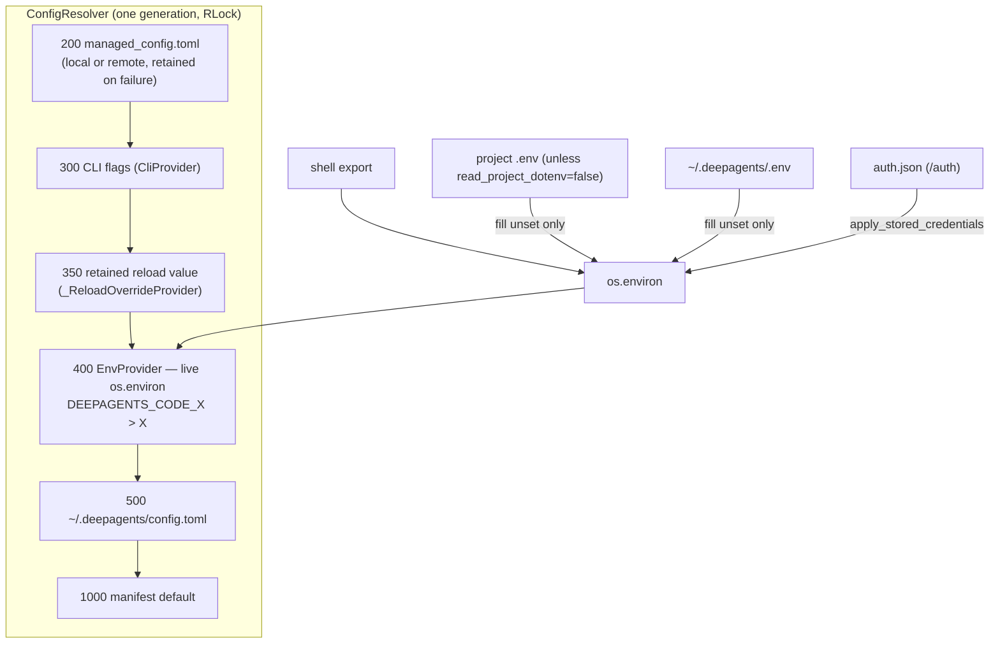
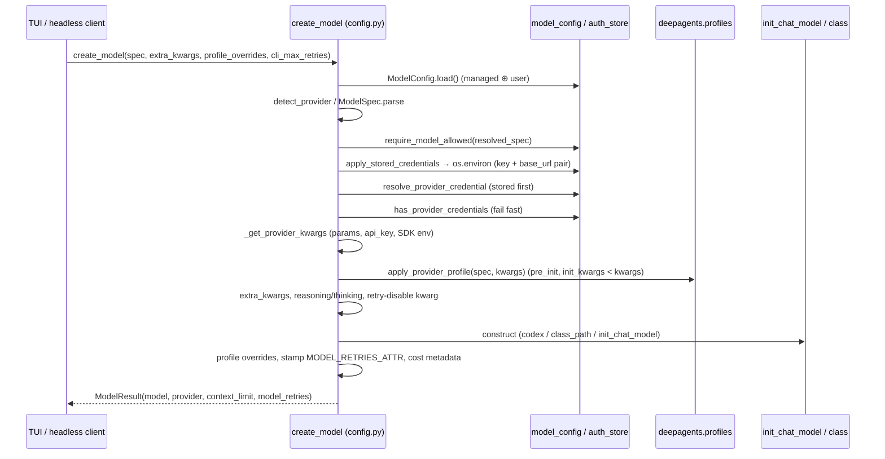
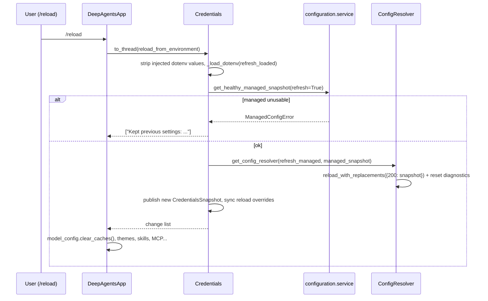

# 03 — 설정 계층·모델/프로바이더·자격증명·비용 추적

dcode의 설정 서브시스템은 네 가지 일을 합니다. (1) 관리자 정책(`managed_config.toml`), CLI 플래그, 환경변수, 사용자 `config.toml`, 매니페스트 기본값을 **숫자 rank 기반 resolver** 하나로 합칩니다. (2) 프로젝트/전역 `.env`를 신뢰 경계에 맞춰 `os.environ`에 주입합니다. (3) `/auth`로 저장한 키(`auth.json`)와 환경변수 키를 합쳐 `provider:model` 스펙을 LangChain 모델 인스턴스로 만듭니다. 이때 정책 게이트, 재시도 예산, 프로필 오버라이드가 함께 적용됩니다. (4) 모든 모델 호출 비용을 genai-prices로 추정해 스레드 checkpoint에 누적합니다. 이 영역이 따로 존재하는 이유는 신뢰 경계에 있습니다. 리포지토리를 따라오는 파일(프로젝트 `.env`)이나 사용자가 쓸 수 있는 파일(`config.toml`)이 관리자 정책이나 사용자 수준 보안 결정(MCP 신뢰, Auto 분류기 모델 등)을 바꾸지 못하게 막는 코드가 대부분을 차지합니다. 또한 설정이 "부분 적용"되지 않도록 generation 스냅샷 방식을 씁니다.

> 분석 기준: `deepagents` 커밋 `1d3232c`(deepagents-code 0.1.69). 정적 코드 읽기만 했고 실행 검증은 하지 않았습니다.

---

## 문서가 약속하는 것

**설정 우선순위·조회**
- 일반 옵션의 우선순위는 managed → `DEEPAGENTS_CODE_` 접두 env → 표준 env → `~/.deepagents/config.toml` → 기본값입니다. (`docs_official/code/configuration.md` "How settings resolve")
- `dcode config`, `dcode config get <key>`, `dcode config path`로 값과 출처를 보여 줍니다. 비밀값은 configured / not configured로만 표시합니다. (`docs_official/code/configuration.md` "Inspect configuration")
- `DEEPAGENTS_CODE_{NAME}`을 먼저 보고, 없으면 `{NAME}`을 봅니다. 빈 값으로 설정하면 표준 변수를 가립니다. (`docs_official/code/configuration.md` "`DEEPAGENTS_CODE_` prefix")
- recursion limit의 우선순위는 managed > `--recursion-limit` > env > `config.toml` > `LANGGRAPH_DEFAULT_RECURSION_LIMIT` > 서버 기본값입니다. 유효 범위는 25–100000입니다. (`docs_official/code/config-file.md` "Agent runtime limits")
- Auto 분류기 timeout: 한 문서는 범위를 벗어나면 "기본값(20)으로 fallback"한다고 하고, 다른 문서는 "floor/ceiling으로 clamp"한다고 합니다. (`docs_official/code/configuration.md` env 레퍼런스, `docs_official/code/config-file.md` "Auto classifier timeout")

**.env**
- 시작 시 가장 가까운 프로젝트 `.env`를 읽고 그다음 `~/.deepagents/.env`를 읽습니다. 프로젝트 파일이 전역 파일을 이기고, shell export는 둘 다 이깁니다. (`docs_official/code/configuration.md` "Loading order and precedence")
- `startup.read_project_dotenv`는 managed, env, 사용자 `config.toml`에서 결정됩니다. 프로젝트 `.env`는 이 토글을 바꿀 수 없습니다. (같은 절)
- 모든 `.env`에서 거부되는 키 목록과, 프로젝트 `.env`에서만 거부되는 키 목록이 있습니다. (같은 절 Accordion)
- `DEEPAGENTS_HOME`은 신뢰 루트입니다. 어떤 `.env`에서도 설정할 수 없습니다. (`docs_official/code/configuration.md` "Profile location")

**Managed 설정**
- 경로는 OS별로 고정됩니다(macOS `/Library/Application Support/dcode/…`, Linux `/etc/dcode/…`, Windows는 레지스트리의 ProgramData). 설정을 읽지 못하면 종료 코드 78로 멈춥니다. (`docs_official/code/configuration.md` "Managed configuration")
- 원격 정책의 조건: HTTPS, 자격증명/쿼리 없음, 2048자 이하, 리다이렉트·프록시 미사용, 1 MiB 이하, 5초 timeout. (같은 절)
- 값이 잘못되면 fail-closed로 멈추는 키가 12개 나열되어 있습니다. (같은 절 "View settings that fail closed")
- 실행 중 갱신에 실패하면 이전의 유효한 정책을 유지합니다. (같은 절 "Fix an invalid policy")

**config.toml·모델**
- `[models].default`가 `[models].recent`보다 우선합니다. `/model`은 `recent`에만 씁니다. (`docs_official/code/config-file.md` "Default and recent model")
- 시작 모델 해석 순서는 `--model` → default → recent → env 자동감지(`OPENAI_API_KEY`, `ANTHROPIC_API_KEY`, `GOOGLE_API_KEY`, `GOOGLE_CLOUD_PROJECT`)입니다. (`docs_official/code/providers.md` "Model resolution order")
- `[models.providers.<name>]`의 `models`/`api_key_env`/`base_url`/`base_url_env`/`params`/`profile`/`class_path`/`enabled`. params는 shallow merge입니다. (`docs_official/code/config-file.md` "Provider configuration")
- 모델 파라미터 우선순위는 `--model-params` > `/model --model-params` > `config.toml` params입니다. (`docs_official/code/providers.md` "Model parameters")
- profile override 체인은 모델 기본값 < `config.toml` profile < `--profile-override`이고, `/model` hot-swap 이후에도 유지됩니다. (`docs_official/code/config-file.md` "Profile overrides")
- 재시도 예산 우선순위는 `--max-retries` > `[retries.<provider>]` > `[retries]` > 5입니다. 프로바이더 SDK 자체 재시도는 끕니다. (`docs_official/code/config-file.md` "Retries")
- 엔드포인트 해석 순서는 `base_url` → 접두 env → 표준 env → `/auth` 저장 엔드포인트 → SDK 기본값입니다. 키와 엔드포인트는 한 쌍으로 해석됩니다. (`docs_official/code/config-file.md` "Endpoints, keys, and gateways")

**자격증명**
- 키 해석 순서는 **① `DEEPAGENTS_CODE_` 접두 env → ② `/auth` 저장 키 → ③ 표준 env**입니다. (`docs_official/code/credentials.md` "Key resolution order")
- `dcode auth set`은 stdin 또는 `--from-env`로만 받습니다. 저장소는 `auth.json`입니다. (`docs_official/code/credentials.md`)
- `openai_codex`는 ChatGPT 브라우저 로그인을 쓰고 `.state/chatgpt-auth.json`에 저장합니다. (`docs_official/code/providers.md`, `docs_official/code/configuration.md` Data locations)

**비용**
- `/cost`는 genai-prices를 쓰고 매시간 갱신합니다. 추정치일 뿐이고 지출을 제한하지 않습니다. (`libs/code/PRICING.md`)
- `~/.deepagents/prices.json`은 카탈로그에 해당 모델이 없을 때만 쓰이고, 다음 시작부터 반영됩니다. (`libs/code/PRICING.md`, `docs_official/code/configuration.md` "Custom pricing overrides")
- 세션 비용 경고 기본값은 $50, cold-cache 경고 기본값은 $0.50입니다. (`docs_official/code/config-file.md`)

**아키텍처·SDK**
- 설정 계층은 "user, project, session, runtime scopes"로 나뉩니다. 설정 파일은 프로세스 단위 generation 하나로 읽히고 `/reload`나 앱 내 쓰기에서만 generation이 전진합니다. 파일 감시는 하지 않습니다. env 계층은 항상 live입니다. (`libs/code/ARCHITECTURE.md:40-54`)
- 스트리밍 이후 재시도 설계는 `STREAMING_RETRY_DESIGN.md`에 있다고 합니다. (`libs/code/ARCHITECTURE.md:88-89`)
- Provider/Harness profile은 provider-level과 model-level 키를 머지하고, 재등록 시 additive 머지합니다. 로드 순서는 built-in → entry-point 플러그인 → 사용자 코드입니다. 내장 harness profile은 OpenAI와 Anthropic용이라고 합니다. (`docs_official/sdk/profiles.md`)
- 런타임 모델 교체는 `wrap_model_call` 미들웨어에서 `request.override(model=...)`로 하라고 권장합니다. (`docs_official/sdk/models.md` "Select a model at runtime")

---

## 코드 지도

| 파일/심볼 | 역할 | 비고 |
|---|---|---|
| `libs/code/deepagents_code/configuration/resolver.py:32-47` | rank 상수: MANAGED 200 / CLI 300 / RELOAD 350 / ENV 400 / USER 500 / DEFAULT 1000 | 숫자가 작을수록 강합니다. 프로젝트 config 계층은 없습니다. |
| `configuration/resolver.py:133-222` `ConfigResolver` | provider 체인을 lock 하나로 해석합니다. union/deep_merge일 때 DEFAULT를 제외합니다. | `_resolve` 200-222 |
| `configuration/resolver.py:273-326` `reload_with_replacements` | generation을 전진시킵니다(교체 설치 + 나머지 reload + 진단 dedup 리셋). | |
| `configuration/resolver.py:388-450` `resolver_from_snapshots` | managed / (cli) / env / user / default 표준 체인을 만듭니다. | keyword-only로 rank 뒤바뀜을 막습니다. |
| `configuration/resolver.py:514-617` `get_config_resolver` | 프로세스 공유 resolver 캐시(`_ResolverKey(user_path, managed_path)`) | `refresh_managed`면 lock 밖에서 fetch한 스냅샷으로 교체합니다. |
| `configuration/resolver.py:684-710` `install_cli_provider` | argparse 이후 CLI 계층을 끼워 넣습니다. generation은 바꾸지 않습니다. | |
| `configuration/providers.py:1370-1616` `TomlFileProvider` | TOML 스냅샷을 읽고 health(OK/MISSING/UNREADABLE/CORRUPT/INDETERMINATE)를 분류합니다. | 실패한 reload는 이전 스냅샷을 유지합니다(1584-1596). |
| `configuration/providers.py:1619-1667` `EnvProvider` | `active_environment()`를 live로 읽습니다. | durable=False |
| `configuration/providers.py:438-523` | 접두 env 선택(빈 값이라도 존재하면 채택), 공백 값 처리 | |
| `configuration/providers.py:66-69`, `1210` `RemoteTomlProvider` | 원격 managed 정책(1 MiB, 5초, 리다이렉트 거부) | |
| `configuration/types.py:50-93,141-150` | 원격 URL 검증. `usable` = OK 또는 MISSING | INDETERMINATE는 사용 불가 |
| `configuration/paths.py:99-120` | OS별 managed 경로 | |
| `configuration/service.py:31-36,220-235` | deny list union 경로, `ENFORCED_MANAGED_KEYS`(14개) | |
| `configuration/writer.py:53-156` `update_user_config` | 사용자 TOML 원자적 RMW. managed 경로로 쓰기는 거부합니다. | 커밋 후 `refresh_shared_resolver` 호출 |
| `libs/code/deepagents_code/config_manifest.py` (`ConfigOption` 104개, 2123-3120) | 옵션 manifest: key, env_var, toml_keys, kind, default | manifest key와 TOML 경로가 다를 수 있습니다(예: `display.theme` ↔ `[ui].theme`, 2139-2145). |
| `config_manifest.py:1308-1382` `resolve_read_project_dotenv` | managed → env → 전역 .env → toml → default | 공유 resolver를 우회합니다. |
| `libs/code/deepagents_code/_env_vars.py` | `DEEPAGENTS_CODE_*` 상수 모음. bool 분류는 677-704. | `SERVER_ENV_PREFIX`(549) |
| `libs/code/deepagents_code/config.py:204-448` | dotenv 전역/프로젝트 거부 키 | |
| `config.py:632-899` `_dotenv_environment`/`_load_dotenv` | 프로젝트 → 전역 .env 적용. 주입 값을 추적합니다. | |
| `config.py:518-543` `use_environment` | ContextVar로 워크스페이스 env 스냅샷을 바인딩합니다. | 서버 멀티 워크스페이스용 |
| `config.py:1879-1962` `_ensure_bootstrap` | 1회 bootstrap: dotenv, LangSmith project 오버라이드, 저장된 서비스 키 적용 | |
| `config.py:3425-3517` | `_RELOADABLE_FIELDS`, `_ReloadOverrideProvider`(rank 350) | |
| `config.py:3605-3727` `RuntimeState`/`CredentialsSnapshot`/`Credentials` | 불변 스냅샷을 참조 교체로 publish합니다. | |
| `config.py:4059-4168` `reload_from_environment` | `/reload` 본체 | |
| `config.py:5535-5747` `detect_provider`, `_get_default_model_spec` | bare 모델명으로 프로바이더를 추론하고 기본 모델을 고릅니다. | |
| `config.py:5913-6031` `_get_provider_kwargs`, `_apply_scoped_endpoint` | config params + api_key + SDK env kwargs | |
| `config.py:3088-3291` | `[retries]` 파싱, SDK 재시도 끄기, 예산 해석 | `DEFAULT_MODEL_RETRIES=5`(3250) |
| `config.py:6552-6928` `create_model` | 모델 생성의 단일 진입점 | 정책 게이트 6685 |
| `libs/code/deepagents_code/model_config.py:102-148` `resolve_env_var` | 접두 우선 조회 | |
| `model_config.py:882-1166` | `PROVIDER_API_KEY_ENV`, `RETRY_PARAM_BY_PROVIDER`, `PROVIDER_BASE_URL_ENV`, `IMPLICIT_AUTH_PROVIDERS` 등 레지스트리 | |
| `model_config.py:1224-1328` | managed+user 머지 로드, `clear_caches` | |
| `model_config.py:2383-2719` | `resolve_provider_credential`, gateway 판정, `get_provider_auth_status` | |
| `model_config.py:2876-3019` | 저장 키와 엔드포인트를 `os.environ`에 브리지합니다. | |
| `libs/code/deepagents_code/auth_store.py` | `auth.json` 저장소(0600/0700, 원자적 교체, version 1) | OAuth 타입은 스텁(80-98) |
| `libs/code/deepagents_code/configurable_model.py:840-993` `ConfigurableModelMiddleware` | `runtime.context.model`/`model_params`로 모델을 교체합니다. | SDK `model_matches_spec` 사용(17-20) |
| `libs/code/deepagents_code/model_retry.py:1031-1222` `CodeModelRetryMiddleware` | 모델 노드 재시도, `model_attempt`/retry 이벤트 | LangChain `ModelRetryMiddleware`를 대체합니다(1-20). |
| `libs/code/deepagents_code/cost_tracking.py:2294-2443` `CostTrackingMiddleware` | `_session_cost_usd` checkpoint 누적 | 전역 콜백 recorder와 짝(1974-2006) |
| `cost_tracking.py:478-563` | 가격 카탈로그 hourly updater | `DEEPAGENTS_CODE_OFFLINE` 존중 |
| `libs/code/deepagents_code/_session_stats.py:1344-1385` | 종료 시 사용량 표 표시 여부 | fail-open |
| `libs/code/deepagents_code/_server_config.py:1-80` | 클라이언트→서버 설정 채널(`DEEPAGENTS_CODE_SERVER_*`) | |
| `libs/code/deepagents_code/extras_info.py:999-1100`, `_dep_floor_check.py:1-18` | 프로바이더 extra 목록, editable 설치 시 의존성 floor 경고 | 이 영역에서는 주변부 |
| `libs/deepagents/deepagents/profiles/provider/provider_profiles.py:195-380` | `register/get/apply_provider_profile` | |
| `libs/deepagents/deepagents/profiles/harness/harness_profiles.py:1050-1103,1255-1325` | harness profile 조회(exact → provider) | |
| `libs/deepagents/deepagents/profiles/_builtin_profiles.py:103-236` | lazy bootstrap: 내장 등록 → entry-point 플러그인 | |
| `libs/deepagents/deepagents/_models.py:35-57` `resolve_model` | SDK의 문자열→모델 해석(`init_chat_model` + provider profile) | dcode는 이 함수를 쓰지 않습니다. |

---

## 동작 흐름

### A. 부팅: env → dotenv → 자격증명 스냅샷 → resolver generation

1. 모듈 전역 `credentials`는 `_LazyProxy`입니다. 첫 속성 접근 때 `_get_credentials()`가 실행됩니다(`config.py:7013-7039`, `7057-7085`).
2. `_ensure_bootstrap()`(`config.py:1879-1962`) 순서:
   - 먼저 launch 시점의 LangSmith 환경을 캡처합니다(1902-1907).
   - `_load_dotenv(start_path=…, capture_user_langsmith=True)`(1915-1918)를 호출합니다.
   - dotenv에만 설정된 `DEEPAGENTS_CODE_DEBUG`를 반영하려고 debug logging을 다시 구성합니다(1924-1926).
   - `DEEPAGENTS_CODE_LANGSMITH_PROJECT`로 `LANGSMITH_PROJECT`를 덮어씁니다(1946-1948).
   - `apply_stored_langsmith_auth()`(1954)를 호출합니다.
   - 실패해도 `done=True`로 진행합니다(1961-1962).
3. `_dotenv_environment`(`config.py:632-780`):
   - 호출자 env를 `baseline`으로 고정합니다. 각 파일은 baseline에 대해서만 interpolation합니다(661-667).
   - 전역 `.env`에서 `READ_PROJECT_DOTENV` **한 키만** 프로젝트 파일보다 먼저 읽습니다. 전역 파일을 읽지 못하면 `"false"`로 fail-closed합니다(728-753).
   - `resolve_read_project_dotenv`가 참이면 프로젝트 `.env`를 적용하고(757-758), 이어서 전역 `.env`를 적용합니다(766-779).
   - 이미 존재하는 키는 건너뜁니다(701-702). 그래서 shell > 프로젝트 > 전역 순이 됩니다.
   - 거부 키는 제외합니다(686-700).
4. `_load_dotenv`는 새로 주입한 키만 `os.environ`에 쓰고, `_dotenv_loaded_values`와 provenance에 기록합니다(`config.py:892-896`).
5. `Credentials.from_environment` → `snapshot_from_environment`(`config.py:3729-3785`)는 OpenAI/Anthropic/Google/NVIDIA/Tavily 키와 GCP project/location을 `_resolve_env_var_from`(접두 우선, 821-833)으로 읽어 불변 스냅샷을 만듭니다.
6. 옵션을 처음 조회하면 `get_config_resolver()`가 managed 스냅샷(`service.get_managed_snapshot`)과 사용자 `TomlFileProvider.load()`로 체인을 만들고 캐시합니다(`resolver.py:564-591`). argparse 뒤에는 `install_cli_provider`가 rank 300을 끼워 넣습니다(`resolver.py:684-710`).



### B. 모델 생성: `create_model`(`config.py:6552-6928`)

1. 스펙이 없으면 `_get_default_model_spec()`를 부릅니다(6634-6635). 순서는 `[models].default` → `recent`이고 둘 다 allowlist 밖이면 경고 후 건너뜁니다(5673-5684). 그다음 allowlist 후보 중 credential이 MISSING이 아닌 첫 항목(5686-5727), 마지막으로 openai → anthropic → google_genai 하드코딩 기본값입니다(5736-5747).
2. 프로바이더 파싱(6642-6668): 사용자가 정의한 프로바이더명이 먼저입니다. Bedrock `:0` 버전 접미사를 보호하고, bare 이름이면 `detect_provider`로 추론합니다(5554-5605). `claude`/`gemini`는 보유 자격증명에 따라 Vertex로 분기합니다.
3. **정책 게이트**: `config.require_model_allowed(resolved_spec)`(6685). 자격증명 브리지나 프로바이더 import보다 먼저 실행됩니다.
4. 비-스코프 환경이면 `apply_stored_credentials`(6702-6703)가 저장 키를 표준 env에 쓰고 엔드포인트 env를 정리합니다. 이어서 `stored_credential = resolve_provider_credential(provider)`(6704)를 구합니다.
5. 조기 credential 검사(6712-6730). `IMPLICIT_AUTH_PROVIDERS`(Vertex 계열)는 제외합니다.
6. kwargs 조립 순서는 `_get_provider_kwargs`(config params + `api_key` + SDK env kwargs, 5913-5989) → `stored_credential`이 있으면 `kwargs["api_key"]`를 덮어씀(6734-6735) → **SDK `apply_provider_profile`**(profile < 기존 kwargs, 6741-6766) → `--model-params`(6771-6775) → 스코프 환경일 때 엔드포인트 페어링(6776-6777) → OpenAI reasoning, Anthropic thinking 바인딩(6778-6785)입니다.
7. 재시도: `_read_retry_config()`(managed+user 머지, 3088-3134)로 예산을 해석하고(6801-6805), 프로바이더 SDK 재시도 kwarg는 0으로 강제합니다. google_genai만 1입니다(3185-3247, `model_config.py:968`).
8. 생성 분기: `openai_codex`는 `_codex.build_chat_model`(OAuth token_provider, 6813-6850), `class_path`가 있으면 `_create_model_from_class`, 나머지는 `_create_model_via_init`입니다(6851-6854).
9. 생성 후처리:
   - 비용용 모델 메타데이터를 붙입니다(6859).
   - `config.toml` profile override를 적용하고, 그 위에 `--profile-override`를 적용합니다(6862-6882).
   - 모델 객체에 `_deepagents_model_retries`를 `object.__setattr__`로 스탬프합니다(6888-6900).
   - profile에서 context limit과 modality를 추출합니다(6903-6918).



### C. 런타임 모델 전환(`/model`)

1. 클라이언트는 매 실행에 `CLIContext(model=…, model_params=…, profile_overrides=…, thread_id=…)`를 `context=`로 보냅니다(`app.py:17756-17769`, `_cli_context.py`). 첫 성공 시 `save_recent_model`로 `[models].recent`를 씁니다(`app.py:6123-6139`, `model_config.py:6492-6514`).
2. 서버 그래프의 가장 바깥 미들웨어는 `ConfigurableModelMiddleware`입니다(`agent.py:2876-2882`). `_apply_overrides`는 SDK `model_matches_spec`으로 모델이 달라졌는지 확인하고, 다르면 `create_model`을 다시 호출합니다(`configurable_model.py:557-565`). `ModelNotAllowedError`는 다시 raise하고(566-571), 다른 `ModelConfigError`는 기존 모델로 계속 진행합니다(572-591).
3. `_build_overrides`(`configurable_model.py:375-499`)가 하는 일:
   - `model_settings`를 병합합니다.
   - Fireworks session affinity나 OpenAI `prompt_cache_key`를 주입합니다.
   - 비-Anthropic으로 바뀌면 `cache_control`을 제거합니다.
   - 시스템 프롬프트의 `### Model Identity` 절을 정규식으로 교체합니다.
4. 교체된 모델에는 생성 시 스탬프한 재시도 예산이 붙어 있습니다. `CodeModelRetryMiddleware._request_max_retries`가 요청마다 이 값을 읽습니다(`model_retry.py:1129-1132`).

### D. `/reload`

1. `app._run_reload`가 `_environment_mutation_lock`을 잡고(`app.py:17306-17314`) `credentials.reload_from_environment`를 스레드에서 shield로 실행합니다(17316-17342).
2. `reload_from_environment`(`config.py:4059-4168`) 순서:
   - reload 보존 계층을 설치합니다(4092).
   - LangSmith launch env를 복원합니다(4093-4111).
   - **이전에 주입한 dotenv 값을 제거한 뒤 다시 로드**합니다(`refresh_loaded=True`, 4112-4116, 871-874).
   - `_reload_values`를 호출합니다.
3. `_reload_values`(`config.py:3787-…`)는 `get_healthy_managed_snapshot(refresh=True)`를 호출합니다. 실패하면 `"Kept previous settings: …"`를 반환하고 이전 값을 유지합니다(3836-3848). 이어서 `get_config_resolver(refresh_managed=True, managed_snapshot=…)`로 generation을 한 번에 전진시킵니다(3869-3872). 사용자 TOML이 깨졌으면 `"Kept previous config.toml: …"` 알림을 만듭니다(3881-3887).
4. managed가 막지 않았을 때만 `self._active = replacement`를 publish합니다(4166-4167). resolver가 재현하지 못하는 `shell.allow_list`와 `skills.extra_allowed_dirs`는 rank 350 `_ReloadOverrideProvider`에 남겨 둡니다(`config.py:3536-3560`).
5. 앱은 `clear_caches()`로 모델/프로필/Ollama/threads 캐시를 비웁니다(`app.py:17382-17385`, `model_config.py:1309-1328`). 이어서 테마, 스킬 등을 다시 불러옵니다.
6. **서버 프로세스 쪽 한계**: reload한 값은 `os.environ`에 다시 게시하지 않습니다. 서버 env는 spawn 때마다 `_bootstrap_state`에서 다시 인코딩됩니다(`config.py:4117-4122`). Tavily 키는 respawn 이후에 반영됩니다(`model_config.py:988-995`).



---

## 핵심 설계 포인트

**1. rank 숫자 기반 단일 generation.** resolver는 manifest나 파일시스템을 모르고 숫자 rank만 압니다(`resolver.py:1-8`). provider rank가 중복되면 생성 시 거부합니다(`resolver.py:145-149`). `resolve_options`는 여러 옵션을 한 lock 안에서 해석해서, 한 화면에 섞인 generation이 나오지 않게 합니다(`resolver.py:224-245`).

**2. 실패한 reload는 이전 스냅샷을 유지합니다(fail-closed retention).** unusable 스냅샷은 빈 테이블이고, 설치하면 "이 소스는 아무것도 선언하지 않음"으로 해석되어 하위 계층이 이기게 됩니다. 그래서 설치하지 않습니다.
```python
# configuration/providers.py:1590-1596
if snapshot.status.usable:
    self._state.value = snapshot
    self._state.failure = None
else:
    if self._state.value is None:
        self._state.value = snapshot
    self._state.failure = snapshot.status
```
health 보고(`status()`)는 디스크 파일 상태를 보여 주고, 해석은 유지 중인 generation을 씁니다(`providers.py:1550-1569`).

**3. 원격 managed fetch를 lock 밖으로 뺍니다.** `reload()`는 lock 안에서 모든 provider를 reload하므로, 원격 timeout(5초) 동안 Textual 이벤트 루프가 멈출 수 있습니다(`resolver.py:263-269`). 그래서 `get_config_resolver(refresh_managed=True)`는 스냅샷을 먼저 가져온 뒤 `reload_with_replacements({MANAGED_RANK: …})`로 교체만 합니다(`resolver.py:609-617`).

**4. `MISSING`은 사용 가능, `INDETERMINATE`는 사용 불가.** 권위 있는 경로에 파일이 없으면 "정책 없음"을 뜻합니다. 반면 Windows 레지스트리를 읽지 못해 추측한 경로라면 빈 결과가 아무것도 증명하지 못하므로 막습니다(`types.py:141-150`, `providers.py:1410-1419`).

**5. 사용자 `config.toml`이 깨져도 managed는 적용됩니다.** 기본 경로를 읽을 때 사용자 계층이 unusable이면 raise하지 않고 managed 데이터만 반환합니다. 사용자가 자기 파일에 1바이트를 망가뜨려 정책을 떨어뜨리는 공격을 막는 장치입니다(`model_config.py:1248-1261`).

**6. dotenv 신뢰 경계.**
- 거부 키가 두 등급으로 나뉩니다. 모든 `.env`에서 거부하는 키(코드 실행 벡터, `config.py:204-242`, 접두 패밀리 308-315)와 프로젝트 `.env`에서만 거부하는 키(사용자 수준 보안 결정, 383-393)입니다.
- Windows에서는 대소문자를 정규화하므로 `key.upper()`로 비교합니다(326-339).
- 파일마다 **호출 전 baseline**에 대해서만 interpolation합니다. 프로젝트 `.env`가 전역 `.env`의 `${VAR}` 확장을 통해 거부 키 값을 흘려보내지 못하게 하려는 것입니다(661-667).
- `READ_PROJECT_DOTENV`는 모든 `.env`에서 거부하되, 전역 파일 값만 프로젝트 파일보다 먼저 직접 읽습니다. 이 순서 자체가 보안 통제입니다(`config.py:721-727`).

**7. 자격증명 스냅샷은 참조 교체로 publish합니다.** `CredentialsSnapshot`은 frozen이고, `Credentials.__setattr__`도 `dataclass_replace`로 새 스냅샷을 만듭니다(`config.py:3722-3727`). 여러 필드를 일관되게 읽으려면 `active`를 잡아 두면 됩니다.

**8. 워크스페이스 스코프 env(ContextVar).** 서버가 여러 워크스페이스를 다룰 때 `os.environ`을 건드리지 않도록 `use_environment`로 불변 스냅샷을 바인딩합니다(`config.py:518-543`). lazy 모델 전환은 바인딩 블록 밖에서 일어나므로 미들웨어가 `environ` 필드를 들고 있다가 요청 시점에 다시 들어갑니다(`configurable_model.py:916-918`). 스코프 경로에서는 `apply_stored_credentials`를 건너뛰고, `_apply_scoped_endpoint`가 키/엔드포인트 페어링을 유일하게 강제합니다(`config.py:5992-6031`, 6699-6703).

**9. 키와 엔드포인트는 원자적 쌍입니다.** 저장 키를 적용하면 엔드포인트 env도 함께 쓰거나 지웁니다. `base_url`이 없으면 모든 alias를 지우고 `ANTHROPIC_CUSTOM_HEADERS`도 지워서, 게이트웨이 헤더가 네이티브 엔드포인트로 새지 않게 합니다(`model_config.py:2959-3019`).
```python
# model_config.py:2984-2988
for name in names:
    if base_url and name == canonical:
        os.environ[name] = base_url
    else:
        os.environ.pop(name, None)
```
`PROVIDER_BASE_URL_ENV`는 SDK 소스를 보고 검증한 이름 목록입니다. 공유 `OPENAI_BASE_URL`은 OpenAI 호환 프로바이더에 일부러 넣지 않았습니다(`model_config.py:1047-1111`).

**10. 재시도 소유권은 미들웨어에 있습니다.** 중첩 재시도가 곱해지지 않도록 SDK 재시도를 끕니다. 알 수 없는 프로바이더는 한 번만 경고합니다(`config.py:3219-3228`). LangChain `ModelRetryMiddleware`를 쓰지 않는 이유는 모듈 docstring에 있습니다. 예산을 생성 시 한 번만 읽고, 조용히 sleep하고, 실패를 AIMessage로 위장하고, `Retry-After`를 무시하기 때문입니다(`model_retry.py:10-19`). 파라미터는 첫 지연 0.2초, 배수 2, 최대 10초, `Retry-After` 상한 60초, jitter 10%, 대화형 누적 지연 60초이고, 재시도 대상 상태 코드는 408/409/429입니다(`model_retry.py:74-79,115`). 5xx도 대상이며 범위는 108-109행에 정의됩니다.

**11. 비용은 checkpoint가 원천입니다.** 프로세스 전역 콜백 recorder가 완료된 요청을 스레드별로 모으고, `CostTrackingMiddleware`만 가격을 매겨 `_session_cost_usd` delta를 씁니다(`cost_tracking.py:1-33`). 가격 계산 예외는 턴을 실패시키지 않고 다음 drain으로 미룹니다(`cost_tracking.py:2361-2369`, 2495-2498). 서브에이전트 비용은 owner-scope transfer로 부모 그래프에 전달됩니다(2423-2442). `openai_codex`는 구독 모델이라 가격을 매기지 않습니다(124).

**12. manifest key와 TOML 경로가 분리되어 있습니다.** `update.no_update_check`의 TOML 표현은 `[update].check`이고 bool이 반전됩니다(`config_manifest.py:2959-2968`). `display.*` 계열은 `[ui]`에 저장됩니다(2139-2145). `dcode config get`에 쓰는 이름과 TOML 경로가 다르다는 뜻입니다.

---

## 문서 ↔ 코드 대조

| 항목 | 문서 | 코드 | 판정 |
|---|---|---|---|
| 일반 옵션 우선순위 | managed → 접두 env → env → config.toml → default (`configuration.md`) | 200 managed, 400 env(접두 우선), 500 user, 1000 default. 여기에 **300 CLI, 350 reload 보존**이 더 있습니다(`resolver.py:32-47`, `config.py:3473`). | 일치(CLI/reload 계층은 코드에만 있음) |
| 설정 scope | "user, project, session, runtime" (`ARCHITECTURE.md:42`) | resolver 체인에 프로젝트 `config.toml` 계층이 없습니다(`resolver.py:429-449`). 프로젝트 scope는 `.env`와 `.deepagents/` 디렉터리로만 들어옵니다. grep에서도 `~/.deepagents/config.toml`만 나옵니다. | 불일치(추정: 문서가 개념적 표현) |
| **Provider 키 해석 순서** | 접두 env > `/auth` 저장 > 표준 env (`credentials.md`) | `resolve_provider_credential`은 **저장 키를 먼저** 반환합니다(`model_config.py:2403-2416`). `create_model`은 `_get_provider_kwargs`가 접두 env로 넣은 `api_key`를 `stored_credential`로 덮어씁니다(`config.py:5950-5953` → `6704`, `6734-6735`). 접두 env가 저장 키를 막는 가드 `stored_key_reaches_runtime`는 서비스(Tavily/LangSmith)에만 쓰입니다(`model_config.py:2863,2898`). | **불일치(정적 분석, 미실행)** |
| 시작 모델 env 자동감지 | `OPENAI_API_KEY`, `ANTHROPIC_API_KEY`, `GOOGLE_API_KEY`, **`GOOGLE_CLOUD_PROJECT`** (`providers.md`) | openai → anthropic → google_genai 3개뿐입니다. 모델은 `gpt-5.6-terra`/`claude-opus-5`/`gemini-3.1-pro-preview`로 하드코딩되어 있습니다(`config.py:5736-5747`). allowlist 후보 단계가 중간에 있습니다(5686-5727). | 불일치 |
| Auto 분류기 timeout 범위 밖 | "기본값으로 fallback" (`configuration.md`) / "clamp" (`config-file.md`) | 범위 밖인 계층은 버리고 **다음 소스**로 넘어갑니다(env → toml → default). clamp하지 않습니다(`config_manifest.py:1511-1560`). | 불일치(두 문서 모두 부정확) |
| `DEEPAGENTS_CODE_DEBUG_FILE` 기본값 | `/tmp/deepagents_debug.log` (`configuration.md`) | deprecated이고 기본값이 없으며, 부모 디렉터리만 씁니다. 디렉터리 기본값은 `/tmp/deepagents_debug`이고 `DEEPAGENTS_CODE_DEBUG_DIRECTORY`로 바꿉니다(`config_manifest.py:3080-3096`). | 불일치 |
| fail-closed managed 키 | 12개 (`configuration.md`) | `ENFORCED_MANAGED_KEYS` 14개이며 `threads.max_resume_age`, `threads.resume_after`가 추가되어 있습니다(`service.py:220-235`). config-file.md에는 threads 관련 언급이 있습니다. | 부분 불일치 |
| `read_project_dotenv` 해석 | managed, env, config.toml (`configuration.md:107`) | managed → env → **전역 `.env` 값** → toml → default. 전역 파일을 읽지 못하면 false입니다(`config_manifest.py:1316-1382`, `config.py:744`). | 코드에만 있음(전역 .env 계층, fail-closed) |
| dotenv 전역 거부 키 | 목록 (`configuration.md`) | 문서 목록 + `DEEPAGENTS_USER_LANGSMITH_ENV` 캐리어(`config.py:144,240`). | 코드에만 있음(1개) |
| 프로젝트 `.env` 거부 키 | 6개 + `LANGGRAPH_DEFAULT_RECURSION_LIMIT` 별도 언급 | 7개(`config.py:383-393`) | 일치 |
| managed 경로 / 원격 조건 | OS별 경로, HTTPS·2048자·1 MiB·5초 | `paths.py:111-120`, `types.py:46,61-83`, `providers.py:66-69` | 일치 |
| `/model`은 recent만 씀 | `config-file.md` | `save_recent_model` → `_save_model_field("recent")`(`model_config.py:6492-6514`). MRU `recent_models.json`(826, 6517-6526)도 따로 있습니다. | 일치(MRU 파일은 코드에만 있음) |
| 재시도 우선순위 / 기본값 5 | `config-file.md` | `config.py:3261-3291`, `3250` | 일치 |
| `[retries.<p>].param` 의미 | SDK 재시도를 끄는 데만 사용 | `_resolve_retry_param`이 레지스트리보다 우선합니다(`config.py:3168-3182`). google_genai는 1로 끕니다(`model_config.py:968`). | 일치(google 값 1은 코드에만 있음) |
| Perplexity 키 env | `PERPLEXITY_API_KEY` (또는 `PPLX_API_KEY`) (`providers.md`) | `PROVIDER_API_KEY_ENV["perplexity"] = "PPLX_API_KEY"`만 있습니다(`model_config.py:901`). 사전 검사에서 `PERPLEXITY_API_KEY`는 보지 않습니다. | 불일치(사전 검사 기준) |
| LiteLLM 키 | "Per-provider" (`providers.md`) | 사전 검사 env가 `LITELLM_API_KEY`입니다(`model_config.py:895`). | 코드에만 있음 |
| LangSmith Gateway로 인증 | 문서의 managed gateway는 `*_BASE_URL` 쌍만 설명 | `LANGSMITH_GATEWAY`+`LANGSMITH_GATEWAY_API_KEY`만 있어도 CONFIGURED로 판정합니다(`model_config.py:2419-2476`). | 코드에만 있음 |
| profile override hot-swap 유지 | `config-file.md` | `_model_creation_kwargs`가 `ctx.profile_overrides`를 전달합니다(`configurable_model.py:502-515`). | 일치 |
| 가격 updater 끄기 | env/`[update].prices_auto_update` (`PRICING.md`) | 추가로 `DEEPAGENTS_CODE_OFFLINE`이 truthy여도 멈춥니다(`cost_tracking.py:523`). 한 번 시도하면 이후 설정을 바꿔도 반영되지 않습니다(517-520). | 코드에만 있음 |
| `prices.json` 반영 시점 | 다음 시작 (`PRICING.md`) | 첫 요청에서 1회 로드 후 캐시합니다(`cost_tracking.py:623-646`, 추정: 캐시 무효화 경로 미확인). | 일치(추정) |
| 세션 비용/cold-cache 기본값 | $50 / $0.50 | `config_manifest.py:139,142`, `app.py:4411-4415` | 일치 |
| `STREAMING_RETRY_DESIGN.md` | `ARCHITECTURE.md:88-89`가 참조 | 리포 전체에 파일이 없습니다(`find` 결과 없음). | 문서에만 있음(깨진 링크) |
| 내장 harness profile | "OpenAI and Anthropic" (`sdk/profiles.md`) | bootstrap이 NVIDIA Nemotron 3 Ultra, openai_codex harness와 nvidia/openai/openrouter provider profile까지 등록합니다(`_builtin_profiles.py:149-156`). | 코드에만 있음 |
| 미문서화 env var | — | `_env_vars.py`의 약 40개가 `docs_official/code`에 나오지 않습니다. 예: `DEEPAGENTS_CODE_OFFLINE`, `…_OPENAI_PROMPT_CACHE_KEY`, `…_YOLO_SWITCHER`, `…_LOG_LEVEL`, `…_RIPGREP_INSTALLER`, `…_UI_CHARSET_MODE`, `…_SUPPRESS_ENV_OVERRIDE_WARNING`, `…_SHOW_LANGSMITH_REPLICA_TRACING`, `…_EXTERNAL_EVENT_SOCKET(_PATH)`, `…_DEBUG_*`. (문서 경로에 grep한 결과) | 코드에만 있음 |
| 미문서화 TOML 키 | — | `[warnings].model_switch_token_threshold`(기본 100000, `config_manifest.py:129,2839-2844`), `[models].openai_prompt_cache_key`(2583), `[models].ollama_discovery`(2575), `[threads].sort_order`(2782), `[tracing].langsmith_replica_projects`(2539)는 문서에 0회 등장합니다. | 코드에만 있음 |

---

## dcode ↔ SDK 경계

| 관심사 | dcode가 추가하는 것 | SDK에 위임하는 것 |
|---|---|---|
| 문자열 → 모델 | 자체 `create_model`: 프로바이더 추론, 정책 게이트, 자격증명 브리지, config params, 재시도 끄기, codex/class_path 분기(`config.py:6552-6928`) | kwargs 합성만 `apply_provider_profile`로 합니다(`config.py:6741-6766` → `provider_profiles.py:318-380`). SDK `resolve_model`(`_models.py:35-57`)은 **쓰지 않습니다**. dcode는 인스턴스를 넘기고, SDK 그래프는 `BaseChatModel`이면 그대로 씁니다(`_models.py:54-55`, `graph.py:614`). |
| Provider profile | OpenRouter 앱 attribution을 SDK 내장 profile 위에 **스택 등록**합니다(`config.py:5849-5873`). 합성 순서는 profile < config.toml < `--model-params`입니다. | 레지스트리, 머지(pre_init 체인, factory 체인), lazy bootstrap, entry-point 플러그인(`provider_profiles.py:177-247`, `_builtin_profiles.py:103-236`) |
| Harness profile | GLM-5.2 harness profile을 dcode가 등록합니다. 기존 suffix가 있으면 건너뛰려고 private `_HARNESS_PROFILES`에 직접 접근합니다(`_glm_5p2_profile.py:282-315`). tool description override 조회는 SDK 함수를 재사용합니다(`agent.py:217-223`). | 모델별 profile 조회와 적용(`graph.py:614-615,677-680`, `harness_profiles.py:1255-1325`). 내장 Claude/NVIDIA/Codex 프롬프트 suffix(`profiles/harness/_anthropic_opus_4_7.py:1-14,53`) |
| 런타임 모델 교체 | `ConfigurableModelMiddleware`: 정책, 스코프 env, identity 프롬프트 패치, 프로바이더별 설정 제거, 캐시 키 주입, resume checkpoint(`configurable_model.py:840-993`) | SDK 문서의 `wrap_model_call` + `request.override` 패턴(`docs_official/sdk/models.md`)을 따릅니다. 모델 동일성 판정은 `deepagents._models.model_matches_spec`(`configurable_model.py:17-20`)을 씁니다. |
| 재시도 | `CodeModelRetryMiddleware`(모델 노드 전용, 스트림 이벤트, 모델별 예산) | 없음. LangChain 기본 미들웨어를 명시적으로 거부합니다(`model_retry.py:10-19`). |
| 설정·자격증명·비용 | resolver/manifest/dotenv/auth_store/managed policy/genai-prices는 모두 dcode 전용입니다. | SDK는 설정 파일 개념이 없습니다. profile 레지스트리가 유일한 "설정"입니다(추정: `libs/deepagents` 안에 config.toml 로더 부재, grep 미실시). |
| 프로세스 경계 | 클라이언트는 `DEEPAGENTS_CODE_SERVER_*` env로 서버 subprocess에 정책을 넘깁니다. 프로젝트 범위 정책(MCP, 확장, sandbox setup)은 서버가 직접 해석하고 클라이언트 주장은 받지 않습니다(`_server_config.py:1-10,34-80`). | — |

---

## 더 볼 거리

1. **자격증명 우선순위 불일치 실증.** `/auth` 키가 저장된 상태에서 `DEEPAGENTS_CODE_OPENAI_API_KEY=x dcode -n …`을 실행하면 실제로 어느 키가 쓰이는지 테스트로 확인해야 합니다. `tests/`에서 `resolve_provider_credential`과 접두 env 조합 테스트가 있는지 찾아볼 것.
2. **`/reload`와 서버 subprocess.** reload한 키와 설정이 이미 떠 있는 langgraph 서버에 언제 전달되는지 확인이 필요합니다. `config.py:4117-4122`는 "spawn마다 재인코딩"이라고만 합니다. `app.py:27738` `_reload_configuration_for_restart`와 `ServerProcess` 재시작 경로를 따라가 볼 것.
3. **dcode 기본 모델과 harness profile 매칭.** `claude-opus-5`, `gpt-5.6-terra`는 SDK 내장 harness 파일(opus_4_7/sonnet_4_6/haiku_4_5)에 해당하는 exact 키가 없어 보입니다. provider-level `anthropic`/`openai` 등록이 있는지 `_openai.register`와 각 harness `register()` 키를 확인할 것.
4. **`ModelConfig.load()` 캐시와 resolver generation의 이중 캐시.** `_default_config_cache`(`model_config.py:1183`)는 `get_config_sources`를 거치는데, 이것이 공유 resolver generation과 항상 같은 스냅샷인지(`service.get_config_sources` 853-900) 확인할 것. ARCHITECTURE가 말하는 "스스로 스냅샷을 잡는 예외 호출자"와의 관계도 함께 볼 것.
5. **원격 managed 정책 갱신 주기.** 실행 중 자동 재fetch가 있는지, 아니면 `/reload`와 앱 내 쓰기(`writer.refresh_shared_resolver`)에서만 일어나는지 봐야 합니다. 앱 내 토글 하나가 원격 fetch 5초를 유발할 수 있는지도 확인할 것(`writer.py:168-174`).
6. **`STREAMING_RETRY_DESIGN.md` 누락.** `model_attempt` start/complete 이벤트와 `output_may_have_started` 플래그를 클라이언트가 어떻게 조정하는지는 `textual_adapter`를 읽어 문서 공백을 메워야 합니다.
7. **genai-prices 프로바이더 alias.** `_PROVIDER_ALIASES`(`cost_tracking.py:113-121`)에 없는 프로바이더(fireworks, baseten, groq 등)가 genai-prices id와 맞는지 확인이 필요합니다. PRICING.md가 경고한 "sweep" 오가격 경로(`_find_override_model` 1041)도 함께 볼 것.
8. **`OAuthCredential` 스텁.** `auth_store.py:80-98`은 "아무 경로도 생산하지 않음"이라고 되어 있고, codex는 별도 `chatgpt-auth.json`을 씁니다. MCP OAuth(`mcp_auth`)와 저장소를 통합할 계획이 있는지 볼 것.
9. **manifest를 문서 생성 원천으로 쓸 수 있는지.** `dcode config --verbose --json`이 104개 옵션 전부를 내보내므로, 이 출력과 `docs_official`을 자동 diff해 미문서화 키 목록을 정식으로 만들 수 있습니다.
10. **`_dep_floor_check`/`extras_info`.** editable 설치에서만 동작하는 pre-TUI 프롬프트(`_dep_floor_check.py:12-18`)가 수업 실습 환경(`uv sync --locked`)에서 뜨는지 확인할 것.
