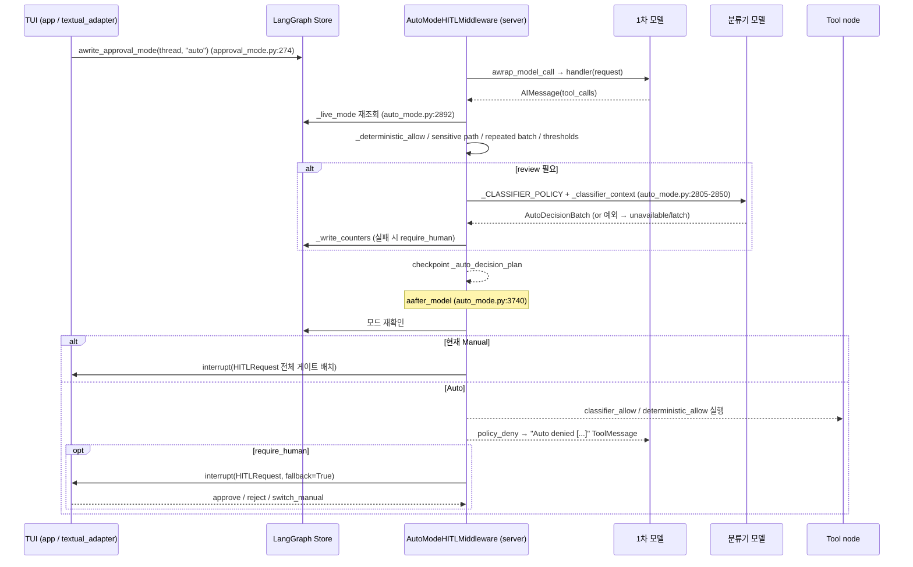
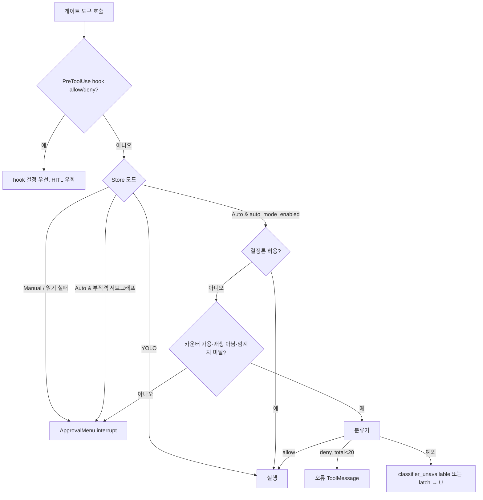

# 04 — 승인 모드·Human-in-the-loop·권한·위협 모델

dcode의 "승인 계층"은 모델이 제안한 부작용 있는 도구 호출(셸 `execute`, 파일 쓰기/수정/삭제, 웹 검색/URL 조회, 서브에이전트 위임, 비변경 표시가 없는 MCP 도구 등)을 실제로 실행하기 전에 **누가, 어떤 근거로 허가하는가**를 결정한다. SDK(`deepagents`)는 LangChain `HumanInTheLoopMiddleware`(HITL)와 `interrupt_on` 맵, 파일시스템 `FilesystemPermission`(allow/deny/interrupt)만 제공한다. dcode는 그 위에 (1) 스레드별 **라이브 승인 모드**(Manual/Auto/YOLO)를 LangGraph Store에 두고 매 호출마다 다시 읽는 구조, (2) 결정론적 허용 규칙과 LLM 분류기로 이루어진 **Auto 모드**(`auto_mode.py`, 4.1k줄), (3) 헤드리스용 셸 allow-list와 fail-closed MCP 가드, (4) YOLO 위험 확인·project `.env` 차단 목록 같은 신뢰 경계 장치를 더한다. 이 계층은 클라이언트(TUI)와 LangGraph 서버가 별도 프로세스이기 때문에 존재한다. 승인 결정은 서버 그래프 안의 `interrupt()`로 멈추고 SSE로 클라이언트에 전달되며, 모드 전환은 클라이언트가 Store에 기록한다. 서버는 그래프 상태나 입력으로 모드를 위조할 수 없도록 설계되어 있다.

---

## 문서가 약속하는 것

**dcode 공식 문서**
- 기본값은 "gated action" 전에 승인을 요구한다. gated action은 `write_file`/`edit_file`/`delete`, `execute`, `web_search`/`fetch_url`, `task`이고, `ls`/`read_file`/`glob`/`grep`은 묻지 않는다 (`docs_official/code/approval-modes.md:9-16`).
- 모드는 세 가지다. Manual(기본값, 매번 확인), Auto(일상 작업은 자동 승인하고 불확실한 것만 모델이 검토하며, 거부나 실패가 반복되면 사람에게 넘김), YOLO(검토 없음) (`approval-modes.md:20-24`).
- Auto는 샌드박스나 OS 경계가 아닌 "authorization heuristic"이다 (`approval-modes.md:26-28`).
- Auto는 interactive이면서 샌드박스가 없는 세션에서만 쓸 수 있다. `-y`, `[startup] mode="auto"`, `Shift+Tab`으로 켠다 (`approval-modes.md:32-47`).
- YOLO는 `--yolo`로 켜고 1회 위험 확인이 필요하며, 확인 기록은 로컬에 저장된다. `Shift+Tab` 순환은 YOLO → Manual → Auto → YOLO이고, `startup.yolo_switcher=false`로 YOLO를 순환에서 뺄 수 있다 (`approval-modes.md:51-72`).
- Auto 2단계. ① 소스 파일 쓰기, `git status` 같은 읽기 전용 git은 바로 실행하고 `.github/workflows/*`나 `git commit`은 다음 단계로 넘긴다. ② 활성 모델이 "사용자 요청 결과"와 대조해 검토하고, 거부하면 에이전트에 오류 결과를 준다 (`approval-modes.md:76-81`).
- 거부나 분류기 실패가 반복되면 다음 배치에서 일반 승인 UI를 띄운 뒤 다시 Auto로 돌아간다 (`approval-modes.md:81`, 흐름도 `:84-123`).
- 분류기 모델 기본값은 제공자별이다. Anthropic → `anthropic:claude-sonnet-5`, OpenAI → `openai:gpt-5.6-luna` 등이고, 그 외 제공자는 메인 모델을 상속한다. 우선순위는 `/auto model` > `--auto-classifier-model` > `DEEPAGENTS_CODE_AUTO_CLASSIFIER_MODEL` > `[models].auto_classifier` > 제공자 기본값 > 상속이다. project `.env`로는 env를 설정할 수 없다 (`approval-modes.md:128-191`).
- 결정 계획은 thread·mode·batch·정확한 호출에 묶인다. 상태가 없거나 무효이면, 모드 경합이나 재생(replay)이 일어나면 사람 검토로 넘어간다 (`approval-modes.md:195-197`).
- 한계: 모델은 독립된 보안 권한자가 아니고 MCP read-only 어노테이션을 신뢰한다(베타 트레이드오프). 서브에이전트 내부 동작이나 `js_eval` fan-out은 부모 Auto 검토 대상이 아니다 (`approval-modes.md:199-203`).
- 원격 `--sandbox`를 쓰면 Auto가 Manual로 강제된다. non-interactive(`-n`/pipe)에서는 `-y`/`--yolo`를 무시하고, 셸은 `--shell-allow-list`를, MCP는 fail-closed를 따른다 (`approval-modes.md:207-209`).
- `[startup].mode`에 `auto`를 쓰려면 `DEEPAGENTS_CODE_EXPERIMENTAL=1`이 필요하고 분류기 기본 타임아웃은 20초라고 한다 (`docs_official/code/config-file.md:361-365`).
- `-S/--shell-allow-list`는 interactive와 `-n` 모두에 적용되고, `recommended`/`all` 센티널이 있다 (`docs_official/code/cli-reference.md:244`, `:466`). cli-reference는 "Toggle between Manual and Auto ... with Shift+Tab"이라고 쓴다 (`cli-reference.md:237`).

**SDK 공식 문서**
- `interrupt_on`: `True`면 approve/edit/reject/respond를 모두 허용하고, `InterruptOnConfig`는 `allowed_decisions`와 `when` 조건을 받는다. checkpointer가 필요하다 (`docs_official/sdk/human-in-the-loop.md:36-43`, `:81`).
- `respond`는 사람이 도구 역할을 할 때만 쓰고, 부작용이 있는 도구를 거부하는 용도로 쓰면 안 된다 (`human-in-the-loop.md:329-331`).
- `when`이 `False`를 반환하면 인터럽트 배치에서 빠진다 (`human-in-the-loop.md:354`, `:530`).
- 서브에이전트는 자기 `interrupt_on`으로 부모 설정을 덮어쓸 수 있다 (`human-in-the-loop.md:670-701`).
- `FilesystemPermission`은 내장 파일시스템 도구에만 적용되고 custom/MCP 도구와 샌드박스 `execute`에는 적용되지 않는다. 규칙은 first-match-wins이며 매칭되는 규칙이 없으면 allow다 (`docs_official/sdk/permissions.md:15`, `:23`, `:53`).
- `mode="interrupt"`는 **write 도구**(`write_file`/`edit_file`/`delete`)에 걸리면 HITL 인터럽트를 발생시키고, 사용자 `interrupt_on`과 병합된다 (`permissions.md:61`, `:82`).
- 서브에이전트의 `permissions`는 부모 규칙을 통째로 대체한다 (`permissions.md:239`).

**위협 모델 (repo)**
- TB2: `agent._add_interrupt_on`이 `execute`, `write_file`, `edit_file`, `web_search`, `fetch_url`, `task`, `compact_conversation`, `launch_async_subagent`, `update_async_subagent`, `cancel_async_subagent`을 게이트한다. non-interactive에서는 `_handle_action_request`가 셸 allow-list를 강제한다 (`libs/code/THREAT_MODEL.md:246`).
- TB2: "`auto_approve` 모드는 모든 HITL 프롬프트를 우회하지만 Unicode/URL 경고는 표시한다" (`THREAT_MODEL.md:249`).
- D3: SSRF는 URL/호스트 blocklist가 없지만 HITL이 의도된 통제다. non-interactive에서도 HTTP 도구는 HITL 게이트를 거친다 (`THREAT_MODEL.md:640`).
- 범위 외 행: 인터랙티브 모드에서는 모든 부작용 도구가 HITL을 거친다. `http_request`도 HITL이 필요하다 (`THREAT_MODEL.md:603-604`).
- T2/T13: `--shell-allow-list all`은 패턴 검사를 건너뛴다. 일반 allow-list도 첫 토큰만 검사하므로 인터프리터를 허용하면 우회된다 (`THREAT_MODEL.md:446`, `:456`, `:488-492`, `:562-566`).
- T12: project `.env`의 셸 startup-hook 키를 차단 목록으로 막는다 (`THREAT_MODEL.md:455`, `:556-560`).
- T14: 약한 분류기 모델의 위험, trusted surface 제한, construction 실패 시 main 모델로 fallback하지 않음(latch), 타임아웃 floor/ceiling (`THREAT_MODEL.md:457`, `:568-572`).
- SDK T3/T6: `LocalShellBackend`는 `shell=True`로 실행하고 명령을 검증하지 않는다. HITL은 opt-in이다 (`libs/deepagents/THREAT_MODEL.md:263-267`, `:280-284`).

---

## 코드 지도

| file/symbol | 역할 | 비고 |
|---|---|---|
| `libs/code/deepagents_code/approval_mode.py:48` `ApprovalMode` | `manual`/`auto`/`yolo` enum | |
| `approval_mode.py:62` `coerce_approval_mode` | 알 수 없는 값은 Manual로 처리(fail-closed) | |
| `approval_mode.py:77` `next_approval_mode` | Shift+Tab 순환 Manual → Auto → YOLO → Manual | Auto 부적격이거나 `yolo_switcher` off면 해당 모드를 건너뜀 |
| `approval_mode.py:117` `approval_mode_key` | thread_id의 sha256을 Store 키로 사용 | 원시 thread id 비노출 |
| `approval_mode.py:233` `aread_approval_mode_from_store` | 서버에서 `("deepagents_code","approval_mode")` 네임스페이스를 읽음 | 읽기 실패 시 `None`, 호출자는 Manual로 해석 |
| `approval_mode.py:274` `awrite_approval_mode` | 클라이언트가 RemoteAgent `aput_store_item`으로 기록 | |
| `approval_mode.py:26`, `:514-552` | YOLO 확인 정책 버전 `2026-07-14`, `approval.json`(0600) | 정책 버전이 바뀌면 다시 확인 |
| `libs/code/deepagents_code/agent.py:1902` `_approval_mode_source` | run context → Store 키 검증 또는 context 전용 결정 | typed auto/yolo인데 Store 키가 없으면 Manual |
| `agent.py:2008` `_RoutingDecision` | async hook이 해석한 모드. **타입 identity로 신뢰** | 체크포인트나 입력으로 위조 불가 |
| `agent.py:2028` `_should_interrupt_tool_call` | stock HITL `when` 조건. hook 결정 → YOLO(False) → AUTO(`not auto_mode_enabled`) → Manual(True) 순 | |
| `agent.py:2066` `AsyncApprovalHITLMiddleware` | `aafter_model`에서 Store를 async로 읽은 뒤 stock 라우팅 | 이름을 `HumanInTheLoopMiddleware`로 위장해 SDK 중복을 제거 |
| `agent.py:2162` `_add_interrupt_on` | dcode의 게이트 도구 맵 | 모두 `["approve","reject"]`만 허용(edit/respond 없음) |
| `agent.py:194` `REQUIRE_COMPACT_TOOL_APPROVAL = True` | `compact_conversation` 게이트 | |
| `agent.py:2677-2702` | `interrupt_shell_only`/`auto_approve`에 따라 `resolved_interrupt_on` 결정 | |
| `agent.py:2711-2766` `_subagent_cli_middleware` | 서브에이전트마다 `AsyncApprovalHITLMiddleware`, `ShellAllowListMiddleware`, `ServerHooksMiddleware` 장착 | |
| `agent.py:2845-2872` | 서브에이전트 spec에 `interrupt_on = {}`를 명시 | SDK 상속으로 인한 이중 HITL 방지 |
| `agent.py:2886-2893` | 헤드리스이고 MCP가 있으면 `HeadlessMCPGuardMiddleware` | |
| `agent.py:3080-3202` | Auto가 적격이면 `AutoModeHITLMiddleware`, 아니면 `AsyncApprovalHITLMiddleware` | `worktree_root`는 project root 또는 cwd |
| `agent.py:3204-3212` | `ServerHooksMiddleware`를 HITL 뒤에 append | PreToolUse가 승인 라우팅보다 먼저 결정 |
| `libs/code/deepagents_code/server_graph.py:516` | `auto_mode_enabled = config.interactive and sandbox_backend is None` | Auto 적격성의 서버 측 원천 |
| `libs/code/deepagents_code/auto_mode.py:121-123` | `_TOTAL_DENIAL_FALLBACK=20`, `_CONSECUTIVE_DENIAL_FALLBACK=3`, `_CONSECUTIVE_UNAVAILABLE_FALLBACK=2` | 문서에 수치 없음 |
| `auto_mode.py:537` `mcp_tool_is_coherently_read_only` | `readOnlyHint is True`이고 `destructiveHint`가 True가 아닐 때만 read-only로 봄 | 힌트 타입 이상 시 False |
| `auto_mode.py:653` `sanitize_auto_reason` | 거부 사유 정리(비밀값, URL, 제어문자) | `_REASON_LIMIT=512` |
| `auto_mode.py:1544` `_CLASSIFIER_POLICY` | 분류기 시스템 프롬프트(동의 근거·deny 규칙·scratch 예외) | |
| `auto_mode.py:1839` `_is_sensitive_write_path` | `.git`, `.github`, `.deepagents`, `.claude`, `hooks`, `.env`, `AGENTS.md`, `Dockerfile`, `*.sh` 등 | worktree 밖이면 sensitive |
| `auto_mode.py:1908`, `:1946`, `:1964` | 일상 쓰기 확장자 허용 목록, 의존성 파일 제외 | |
| `auto_mode.py:1989` `_fixed_repo_command_allowed` | `git diff/log/ls-files/rev-parse/show/status`만 허용 | 셸 제어문자나 worktree 밖 경로면 불가 |
| `auto_mode.py:2017` `_narrow_configured_command_allowed` | 설정 allow-list 중 "broad" 항목(python, bash, git, make, uv 등)을 빼고 적용 | T13 완화 |
| `auto_mode.py:2084` `_deterministic_allow` | 결정론적 허용 판정 | |
| `auto_mode.py:2130` `AutoModeHITLMiddleware` | Auto 본체: `awrap_model_call`에서 계획, `aafter_model`에서 적용 | |
| `auto_mode.py:2213-2221` | `create_temp_artifact`/`delete_temp_artifact` 게이트 도구 추가 | 코드에만 있음 |
| `auto_mode.py:2746` `_review_batch` | 분류기를 구성·호출. construction과 inference 타임아웃 분리 | |
| `auto_mode.py:2864` `awrap_model_call` | 1차 모델 호출 후 `_auto_decision_plan`을 체크포인트 | |
| `auto_mode.py:3493` `_human_review` | `interrupt(HITLRequest)`, `switch_manual` 처리 | |
| `auto_mode.py:3636` `_validated_plan` | 계획 무결성 검증(batch_id, thread_key, id 집합, 사유 길이) | |
| `auto_mode.py:3740` `aafter_model` | 모드 재확인 → Manual/YOLO/Auto 분기 → 거부 ToolMessage 합성 | |
| `auto_mode.py:4040` `HeadlessMCPGuardMiddleware` | UI 없는 런타임에서 게이트된 MCP 호출을 오류 ToolMessage로 거부 | |
| `libs/code/deepagents_code/_ask_user_types.py:392-402` | ask_user 동의 영수증 키, 질문/답변 길이 한도 | |
| `libs/code/deepagents_code/ask_user.py:271-289` | 답변 완료 시 `AskUserAuthorizationReceipt`를 `additional_kwargs`에 첨부 | 한도 초과 시 영수증 없음(fail-closed) |
| `libs/code/deepagents_code/config.py:4262` `contains_dangerous_patterns` / `:4290` `is_shell_command_allowed` | 셸 allow-list(첫 토큰 매칭) | `_ShellAllowAll`이면 즉시 True |
| `config.py:204` `_DOTENV_DENIED_ENV_KEYS`, `:383` `_PROJECT_DOTENV_DENIED_ENV_KEYS` | dotenv 차단 키 | 분류기 모델/타임아웃 env는 project `.env`에서 차단 |
| `config.py:4671-4675`, `:4684` | 제공자별 기본 분류기, 정책 위반 시 inherit 센티널 | |
| `libs/code/deepagents_code/config_manifest.py:80-96` | 분류기 타임아웃 20s, floor 1s, ceiling 300s | |
| `libs/code/deepagents_code/client/non_interactive.py:2862-2929` | 헤드리스 승인 구성 | 셸 비활성 또는 `all`이면 `auto_approve=True` |
| `non_interactive.py:1694` `_handle_action_request` | 헤드리스 HITL 응답: execute는 allow-list, 나머지는 승인 | |
| `libs/code/deepagents_code/main.py:1271` `_resolve_approval_mode` | 설정 체인으로 startup 모드 해석, 없으면 최근 모드 복원 | |
| `main.py:6416-6433` | TUI 실행 시 sandbox면 Auto → Manual, YOLO 미확인이면 Manual | |
| `main.py:5580-5598` | 헤드리스에서 `-y`/`--yolo`를 쓰면 경고 후 무시 | |
| `libs/code/deepagents_code/tui/widgets/approval.py:478` `_build_options` | Approve / (Enable Auto for this thread · Switch to Manual) / Reject | |
| `libs/code/deepagents_code/tui/textual_adapter.py:3626-3703` | 메뉴 결정을 HITL resume 결정으로 변환 | |
| `libs/code/deepagents_code/app.py:10286` `_write_live_approval_mode` | 모드 전환을 Store에 기록 | 실패하면 key 제거(fail-closed) |
| `libs/code/deepagents_code/hooks/server_middleware.py:818-855` | PreToolUse hook의 allow/deny가 HITL을 우회 | `ask`는 `_ask_permission_via_hitl`(`:1172`) |
| `libs/code/deepagents_code/tools.py:67`, `:98` | `_is_blocked_ip`, `_validate_url` SSRF 가드 + DNS pinning | 위협 모델 D3와 불일치 |
| `libs/deepagents/deepagents/graph.py:185` `_merge_fs_interrupt_on` | 권한 기반 interrupt와 사용자 `interrupt_on` 병합(사용자 우선) | |
| `graph.py:752-784`, `:852-857`, `:916-921` | 서브에이전트/GP/메인에 HITL 설치 | spec에 `interrupt_on`이 없으면 부모 것 상속 |
| `libs/deepagents/deepagents/middleware/filesystem.py:387` `FilesystemPermission`, `:423` `_check_fs_permission` | first-match, 기본값 allow | |
| `libs/deepagents/deepagents/middleware/_fs_interrupt.py:38` `_FS_TOOL_PATH_ARGS` | read 도구 포함 7개 도구의 경로 인자 매핑 | |
| `_fs_interrupt.py:94` `_make_bulk_when_predicate` | bulk 도구 subtree 겹침 검사, `path="."`와 glob pattern 우회 방지 | |
| `_fs_interrupt.py:156` `_build_interrupt_on_from_permissions` | 허용 결정 approve/edit/reject/respond | |

---

## 동작 흐름

### A. 부팅: 모드와 미들웨어 결정
1. CLI가 모드를 해석한다. `_resolve_approval_mode`(`main.py:1271-1294`)는 managed → CLI → config 체인으로 해석하고, 기본 rank이면 `load_startup_mode()`로 최근 모드를 복원한다(YOLO는 복원하지 않음, `model_config.py:6311-6312` 주석).
2. TUI 실행 경로에서 sandbox가 켜져 있으면 Auto를 Manual로 바꾸고, YOLO인데 확인 기록이 없으면 Manual로 바꾼다(`main.py:6416-6433`). 헤드리스에서는 `-y`/`--yolo`를 쓰면 경고만 출력한다(`main.py:5580-5598`).
3. 서버 subprocess의 `server_graph`가 `auto_mode_enabled = interactive and sandbox_backend is None`을 계산한다(`server_graph.py:516`).
4. `create_cli_agent`가 동작한다. `hitl_active = not auto_approve and restrictive_shell_allow_list is None`이면 `_add_interrupt_on(...)`을 만든다(`agent.py:2694-2702`). Auto가 적격이면 `AutoModeHITLMiddleware(resolved_interrupt_on, worktree_root=..., shell_allow_list=narrow...)`, 아니면 `AsyncApprovalHITLMiddleware`를 설치한다(`agent.py:3171-3202`).
5. 서브에이전트에는 `_subagent_cli_middleware`로 `AsyncApprovalHITLMiddleware`를 붙이고 `interrupt_on={}`를 명시해 SDK의 stock HITL 상속을 끊는다(`agent.py:2718-2719`, `:2845-2851`, `:2871-2872`, SDK 쪽 상속 규칙은 `graph.py:752-784`).

### B. 턴 실행 중 Manual/YOLO(stock 경로)
1. 모델 응답 후 `AsyncApprovalHITLMiddleware.aafter_model`이 Store를 async로 읽고, 결과를 `_RoutingDecision(mode)`로 감싸 **얕은 state 사본**에만 주입한 뒤 stock `after_model`을 호출한다(`agent.py:2096-2116`).
2. 각 게이트 도구의 `when=_should_interrupt_tool_call`은 다음 순서로 판단한다. hook이 allow/deny를 결정했으면 False, YOLO면 False, AUTO면 `not auto_mode_enabled`, 그 외에는 True(`agent.py:2044-2063`).
3. True인 호출만 모아 `HITLRequest`를 만들고 `interrupt()`한다. SSE로 클라이언트에 전달되면 `ApprovalMenu`가 뜬다(`textual_adapter.py:3626`, `approval.py:478-498`).
4. 사용자가 고르면 결정 타입이 정해진다. `approve`/`reject`는 그대로 resume한다. `auto_approve_all`(Enable Auto for this thread)은 `_on_auto_approve_enabled` 콜백으로 Store에 Auto를 기록한 뒤 현재 배치를 approve로 resume한다(`textual_adapter.py:3630-3684`).

### C. Auto 경로(`AutoModeHITLMiddleware`)
1. **계획 단계**(`awrap_model_call`, `auto_mode.py:2864`). 1차 모델을 호출하고 Store에서 모드를 다시 읽는다(`:2892`). 도구 호출이 없으면 plan을 비운다(`:2906-2910`).
2. `mode != AUTO`이거나 게이트 호출이 없으면 plan만 기록하고 반환한다(`:2943-2947`).
3. 게이트 호출마다 다음을 적용한다. 쓰기 경로를 해석할 수 없으면 `policy_deny`(`:2960-2979`). 같은 배치에 compaction이 두 번 있으면 deny(`:2980-2994`). `_deterministic_allow`면 `deterministic_allow`(`:2995-3015`). 나머지는 `review`(`:3016-3018`).
4. 카운터 store를 쓸 수 없으면 `control_state_unavailable` → `require_human`(`:3020-3046`).
5. `last_batch_id == batch_id`이면(재생) `repeated_batch` → `require_human`(`:3060-3078`).
6. 연속 거부 3회 또는 연속 unavailable 2회면 `require_human`(`:3079-3097`).
7. 분류기 호출: `_classify` → `_review_batch`. construction 30s와 inference 20s(기본값) 예산이 따로 있고, 구조화 출력은 `AutoDecisionBatch`다(`:2779-2862`). id가 1:1로 대응하는지 검증한다(`:2114-2127`, `:3117-3118`).
8. 예외가 나면 construction 실패는 spec을 latch한다(첫 발생은 `classifier_unavailable`로 deny, 같은 spec이 반복되면 `require_human`). 일시 실패는 `consecutive_unavailable`을 올린다(`:3130-3220`).
9. 성공하면 allow는 `classifier_allow`, deny는 `policy_deny`로 기록하고, total 20회에 도달하면 `require_human`으로 바꾼다(`:3242-3275`). 카운터 기록에 실패하면 분류기 결정 전부를 `require_human`으로 강등한다(`:3280-3288`).
10. plan은 `Command(update={"_auto_decision_plan": plan})`으로 **체크포인트**한다.
11. **적용 단계**(`aafter_model`, `auto_mode.py:3740`). hook 결과를 수집하고(`:3762-3779`) `_validated_plan`으로 검증한다(`:3793`, `:3636-3738`). plan이 무효이면 Manual 인터럽트로 넘긴다(`:3803-3840`).
12. 현재 모드를 다시 읽고 제안 당시 모드와 비교한다. 둘 중 하나라도 Manual이면 전체 게이트 배치를 사람 검토로 보낸다(`:3857-3891`). YOLO면 hook이 deny하지 않은 호출을 모두 실행한다(`:3892-3906`).
13. Auto면 `policy_deny`/`classifier_unavailable`을 `Auto denied [...]` 오류 ToolMessage로 합성하고(`:3940-3960`), `require_human`만 `_human_review(fallback=True)`로 인터럽트한다(`:3980-4009`). fallback을 승인하면 연속 카운터를 리셋한다(latch는 유지, `:4010-4017`).
14. 폴백 메뉴에서 "Switch to Manual"을 고르면 클라이언트가 Manual을 기록한다(`textual_adapter.py:3686-3702`). 서버는 `switch_manual`을 받으면 **전체 manual 게이트 배치**로 두 번째 `interrupt()`를 연다(`auto_mode.py:3562-3590`).

### D. 헤드리스(`-n`)
1. `enable_shell = bool(allow_list)`이다. `requested_auto_approve = not enable_shell or shell_is_unrestricted`이고, permission hook이 없으면 이것이 `auto_approve`가 된다(`non_interactive.py:2862-2897`).
2. 제한적 allow-list가 있으면 `interrupt_shell_only`와 `ShellAllowListMiddleware`를 쓰고(`agent.py:2677-2693`, `:3064-3066`), HITL이 뜨면 `_handle_action_request`가 execute는 `is_shell_command_allowed`로, 나머지는 approve로 처리한다(`non_interactive.py:1723-1763`).
3. MCP는 `HeadlessMCPGuardMiddleware`가 read-only가 아닌 도구를 거부한다(`agent.py:2886-2893`, `auto_mode.py:4055-4067`).





---

## 핵심 설계 포인트

**1. "타입 identity"로 모드 위조 차단.** 서버 그래프는 외부 입력(RemoteGraph input, 체크포인트)을 신뢰하지 않는다. async hook이 읽은 모드는 private dataclass 인스턴스로만 전달되고, 직렬화를 거친 dict는 이 타입이 될 수 없다.
```python
# agent.py:2019-2025
def _async_routing_mode(state: object) -> ApprovalMode | None:
    if isinstance(state, dict):
        routed = state.get(_ASYNC_APPROVAL_ROUTING_KEY)
        if isinstance(routed, _RoutingDecision):
            return routed.mode
    return None
```
typed `approval_mode="auto"|"yolo"`를 context로 넘겨도 Store 키가 없으면 Manual이 된다(`agent.py:1944-1954`). 자율 모드의 **유일한 원천은 클라이언트가 쓴 Store 레코드**다. 다만 레거시 `auto_approve=True`는 여전히 YOLO로 해석된다(`agent.py:1950-1956`). 헤드리스는 이 경로를 쓴다(`non_interactive.py:2914`).

**2. HITL 미들웨어 이름 위장과 서브에이전트 이중 HITL 방지.** SDK `create_deep_agent`는 서브에이전트 spec에 `interrupt_on`이 없으면 부모 맵을 상속해 stock HITL을 추가한다(`graph.py:752-784`). dcode는 자기 async HITL을 서브에이전트 middleware에 넣고 `interrupt_on={}`로 상속을 끊는다. `name = HumanInTheLoopMiddleware.__name__`(`agent.py:2083`)은 SDK dedup 슬롯을 차지해 "그래프당 HITL 하나"를 보장한다.

**3. 서브에이전트에서 Auto는 적격성에 따라 Manual(인터럽트) 또는 무검토 bypass가 된다.** `_should_interrupt_tool_call(auto_mode_enabled=False)`이면 Auto 레코드도 인터럽트가 된다(`agent.py:2061-2062`). 문서의 "부모 Auto 검토는 서브에이전트 내부를 커버하지 않는다"(`approval-modes.md:203`)는 코드상 **서브에이전트 내부 호출이 Auto 분류기 없이 stock HITL로 판단된다**는 뜻이다. 서버 부팅 시 interactive·비샌드박스이면 `auto_mode_enabled=True`이고(`server_graph.py:516`), `_add_interrupt_on`에 `auto_mode_enabled=True`가 넘어가면 `when=_should_interrupt_tool_call`(기본값 True)이 된다(`agent.py:2186-2190`). 그러면 **서브에이전트 안에서는 Auto 모드일 때 분류기 검토 없이 곧바로 bypass**된다. 서브에이전트에는 `AutoModeHITLMiddleware`가 없고 `AsyncApprovalHITLMiddleware`만 있기 때문이다(`agent.py:2718-2719`) (추정: 부모 `task` 호출 자체는 Auto 분류기 검토를 받으므로 위임 시점에만 통제됨).

**4. 결정론적 허용은 좁고, 분류기 allow는 재검증하지 않는다.**
```python
# auto_mode.py:2091-2103
if name == "compact_conversation":
    return tool is not None and tool is trusted_compaction_tool
if tool is not None and is_mcp_tool(tool):
    return mcp_tool_is_coherently_read_only(tool)
if name in {"write_file", "edit_file"}:
    return _routine_write_allowed(root, call)
if name == "execute":
    return _fixed_repo_command_allowed(command, root) or \
           _narrow_configured_command_allowed(command, shell_allow_list)
return False
```
`delete`, `web_search`, `fetch_url`, `task`는 결정론적 허용이 없어 항상 분류기로 간다. `.yaml/.json/.toml`도 일상 쓰기 확장자에 포함되지만 `.github` 같은 경로 파트(`:1845-1867`)와 의존성 파일(`:1946-1961`)은 제외된다. `Makefile`처럼 확장자가 없는 파일은 분류기로 간다. 설정 allow-list에서는 `python`, `bash`, `uv`, `make` 등 "broad" 엔트리를 제거하므로(`:2022-2072`) Auto는 T13 우회에 대해 헤드리스보다 방어적이다.

**5. 도구 인스턴스 identity로 신뢰한다.** `compact_conversation`과 `ask_user`는 이름이 아니라 **객체 identity**(`tool is self._trusted_compaction_tool`)로 신뢰한다(`auto_mode.py:2093`, `:2955-2959`, `__init__` 이름 검증 `:2185-2196`). MCP나 확장이 같은 이름의 도구를 등록해도 결정론적 허용을 얻지 못한다.

**6. 동의 근거의 출처를 제한한다.** 분류기 정책은 `literal_user_text`, 슬래시 명령으로 설정한 goal/rubric, 서버가 검증한 같은 턴 `ask_user` 답변만 동의로 인정한다. 질문 텍스트는 "모델이 작성한 설명"일 뿐이다(`auto_mode.py:1548-1570`). 영수증은 답변 길이 한도(4000자)를 넘거나 thread/turn id가 없으면 **발행되지 않는다**(`ask_user.py:271-289`, 한도 `_ask_user_types.py:393-402`).

**7. 계획 체크포인트와 재검증(TOCTOU 대응).** 분류기 결정은 `awrap_model_call`에서 private state로 체크포인트되고, `aafter_model`에서 batch_id·thread_key·id 집합·사유 길이까지 재검증된다(`auto_mode.py:3636-3738`). 그 사이 사용자가 Manual로 바꿨으면 이전 Auto allow는 폐기되고 전체 배치가 사람 검토로 간다(`:3857-3891`). 문서의 "Revalidate before side effects"(`approval-modes.md:195-197`)와 일치한다.

**8. Construction 실패 latch.** 잘못된 분류기 spec이 "2회 deny → 승인 시 카운터 리셋 → 다시 2회 deny" 루프에 빠지지 않도록, construction 오류는 spec 단위로 latch되고 **리뷰가 성공해야만** 해제된다(`auto_mode.py:3122-3150`, `:3238-3241`, `:4010-4017`). main 모델로 fallback하지 않는다(T14 서술과 일치).

**9. YOLO에서도 hook deny는 존중된다.** `aafter_model`의 YOLO 분기는 hook deny만 제외하고 실행한다(`auto_mode.py:3892-3905`). stock 경로에서도 hook 결정이 먼저다(`agent.py:2048-2049`). PreToolUse `ask`는 HITL로 전환된다(`hooks/server_middleware.py:625-626`, `:1172`).

**10. 헤드리스의 "YOLO".** 셸이 꺼져 있거나 `all`이면 `auto_approve=True`가 되어 `resolved_interrupt_on=None`, 즉 **HITL 미들웨어 자체가 없다**(`non_interactive.py:2868-2870`, `agent.py:2694-2702`). 주석은 "non-shell tools have no HITL handler in non-interactive mode"라고 이유를 댄다(`non_interactive.py:2865-2867`). 따라서 헤드리스에서 `fetch_url`/`web_search`/`task`/`write_file`은 승인 없이 실행된다(MCP만 별도 가드). 제한 allow-list 모드에서도 `_handle_action_request`가 non-shell을 무조건 approve한다(`non_interactive.py:1702-1706`).

---

## 문서 ↔ 코드 대조

| 항목 | 문서 | 코드 | 판정 |
|---|---|---|---|
| 게이트 도구 목록 | write/edit/delete, execute, web_search/fetch_url, task (`approval-modes.md:11-14`) | 여기에 `start_async_task`/`update_async_task`/`cancel_async_task`, `compact_conversation`, 비-read-only MCP, (Auto) `create_temp_artifact`/`delete_temp_artifact`가 더해짐 (`agent.py:2239-2273`, `auto_mode.py:2213-2221`) | 코드에만 있음(추가 게이트) |
| TM TB2 async 도구 이름 | `launch_async_subagent`/`update_async_subagent`/`cancel_async_subagent` (`THREAT_MODEL.md:246`) | `start_async_task`/`update_async_task`/`cancel_async_task` (`agent.py:2247-2249`) | 불일치(위협 모델 stale) |
| TM TB2 `delete` 누락 | 목록에 `delete` 없음 (`THREAT_MODEL.md:246`) | `delete` 게이트 (`agent.py:2243`) | 불일치(문서 누락) |
| TM `http_request` HITL | "`http_request` requires HITL" (`THREAT_MODEL.md:604`), 도구 목록 (`:18`, `:141`) | `tools.py`에 `http_request`가 없고(`web_search`, `fetch_url`만 있음, `tools.py:348-552`) interrupt 맵에도 없음 | 불일치(stale) |
| TM D3 SSRF blocklist 없음 | "no URL scheme or host blocklist" (`THREAT_MODEL.md:640`) | `_is_blocked_ip`/`_validate_url`/`_pinned_dns` (`tools.py:67-180`) | 불일치(코드가 더 강함, 문서 stale) |
| TM D3 헤드리스 HTTP HITL | "non-interactive ... HTTP tools still go through the HITL interrupt gate" (`THREAT_MODEL.md:640`) | 셸 off/`all`이면 HITL이 없고(`non_interactive.py:2868`, `agent.py:2694`), 제한 allow-list에서도 non-shell은 무조건 approve (`non_interactive.py:1702-1706`) | **불일치(통제 갭)** |
| TM T4 "auto_approve = Shift+Tab" | auto-approve를 `--auto-approve`/Shift+Tab으로 켜면 모든 게이트 우회 (`THREAT_MODEL.md:500-504`) | `-y/--auto-approve`는 이제 **Auto(분류기)**이고 전면 우회는 `--yolo` (`cli-reference.md:463-465`, `approval_mode.py:48-53`) | 불일치(용어 stale) |
| TM TB2 "auto_approve에서도 Unicode/URL 경고" | (`THREAT_MODEL.md:249`) | 경고는 interrupt description 포맷터에서 생성(`agent.py:1761`, `:1852`)되므로 YOLO에서는 인터럽트가 없어 표시할 곳이 없음(추정). 헤드리스는 `_collect_action_request_warnings`로 출력 (`non_interactive.py:1718-1719`) | 불일치(추정) |
| TM T14 분류기 기본값 | "the default reuses the main agent model" (`THREAT_MODEL.md:572`) | 제공자별 기본 분류기 (`config.py:4671-4675`, `:4702`), 공식 문서도 동일 (`approval-modes.md:128-138`) | 불일치(TM stale) |
| 분류기 타임아웃 | 기본 20s (`config-file.md:365`) | `AUTO_CLASSIFIER_TIMEOUT_SECONDS_DEFAULT = 20.0`, floor 1, ceiling 300 (`config_manifest.py:80-96`) | 일치(floor/ceiling은 코드에만) |
| construction 타임아웃 | 없음 | 30s 별도 (`auto_mode.py:115`) | 코드에만 있음 |
| 폴백 임계치 | "repeated denials or failures" (`approval-modes.md:81`) | 연속 거부 3, 연속 unavailable 2, 누적 거부 20 (`auto_mode.py:121-123`) | 코드에만 있음(수치) |
| Auto에 EXPERIMENTAL 필요 | `auto` requires `DEEPAGENTS_CODE_EXPERIMENTAL=1` (`config-file.md:361`) | 승인/모드 경로에서 EXPERIMENTAL 참조를 찾지 못함. EXPERIMENTAL은 extensions 등에만 쓰임 (`main.py:2786-2908`, `app.py:13583`) | 문서에만 있음(추정 stale) |
| Shift+Tab 순환 | YOLO → Manual → Auto → YOLO (`approval-modes.md:72`) / "Manual과 Auto 사이 토글" (`cli-reference.md:237`) | Manual → Auto → YOLO → Manual (`approval_mode.py:102-114`) | approval-modes는 일치, cli-reference는 불일치 |
| sandbox면 Auto → Manual | (`approval-modes.md:207`) | `main.py:6417-6426`, 서버 `server_graph.py:516` | 일치 |
| 헤드리스 `-y`/`--yolo` 무시 | (`approval-modes.md:209`) | 경고 후 무시 (`main.py:5580-5598`) | 일치(경고 출력은 코드에만) |
| project `.env`로 분류기 설정 불가 | (`approval-modes.md:167-169`) | `_PROJECT_DOTENV_DENIED_ENV_KEYS`에 `AUTO_CLASSIFIER_MODEL`, `AUTO_CLASSIFIER_TIMEOUT` (`config.py:383-392`) | 일치(timeout 차단은 코드/TM에만) |
| YOLO 1회 확인, 로컬 저장 | (`approval-modes.md:61`) | `approval.json`, 정책 버전이 바뀌면 재확인 (`approval_mode.py:26`, `:514-552`) | 일치(버전 재확인은 코드에만) |
| 최근 모드 복원, YOLO 제외 | (`approval-modes.md:213`) | `load_startup_mode` 주석 (`model_config.py:6311-6312`), Auto는 notice 표시 후에만 복원 | 일치 |
| Manual 메뉴에서 스레드 Auto 활성화 | (`approval-modes.md:201`) | "Enable Auto for this thread" (`approval.py:496`, `textual_adapter.py:3630-3684`) | 일치 |
| 폴백에서 Manual 전환 시 전체 배치 재검토 | 흐름도 L (`approval-modes.md:105`) | `switch_manual` 후 전체 manual 배치로 두 번째 interrupt (`auto_mode.py:3562-3590`) | 일치 |
| MCP read-only 어노테이션 신뢰 | (`approval-modes.md:202`) | `readOnlyHint is True`이면 게이트 맵에서 제외하고 결정론적 허용 (`agent.py:2254-2256`, `auto_mode.py:2094-2095`) | 일치 |
| 서브에이전트 내부 Auto 비적용 | "does not cover" (`approval-modes.md:203`) | 서브에이전트는 stock async HITL이고, Auto 모드면 분류기 없이 bypass (`agent.py:2061-2062`, `:2718-2719`) | 일치(단 "Manual로 떨어짐"이 아니라 **무검토 실행**이라는 점은 문서에 명시되지 않음) |
| PreToolUse hook의 allow가 HITL 우회 | 승인 문서에 없음 | `hook_decided_permission` → `when` False (`agent.py:2044-2049`), YOLO에서도 deny 존중 | 코드에만 있음 |
| 결정 종류 | SDK 기본 approve/edit/reject/respond (`human-in-the-loop.md:40`) | dcode 게이트는 `["approve","reject"]`만 (`agent.py:2191-2261`), 클라이언트 전용 `auto_approve_all`/`switch_manual` | 코드에만 있음(dcode 확장) |
| SDK interrupt 권한 = write 도구만 | "built-in write tool (`write_file`, `edit_file`, `delete`)" (`permissions.md:61`) | read 도구 `ls`/`read_file`/`glob`/`grep`도 매핑 (`_fs_interrupt.py:38-46`) | 불일치(코드가 더 넓음) |
| SDK interrupt 결정에 `respond` 포함 | `respond`로 부작용 도구를 거부하지 말라고 권고 (`human-in-the-loop.md:331`) | 권한 기반 interrupt가 `respond`를 포함해 제공 (`_fs_interrupt.py:174`). 주석은 "respond skips execution"이라고 정당화 | 문서 권고와 긴장 |
| dcode의 `FilesystemPermission` 사용 | — | `agent.py`에 `permissions=`/`FilesystemPermission` 사용 없음(grep 무결과) | 코드에만(미사용) |
| TM T13 헤드리스 첫 토큰 매칭 | (`THREAT_MODEL.md:562-566`) | `tokens[0]`만 검사 (`config.py:4341-4349`) | 일치 |
| TM T2 `all` 패턴 검사 생략 | (`THREAT_MODEL.md:488-492`) | `_ShellAllowAll`이면 즉시 True (`config.py:4316-4318`) | 일치 |
| TM T12 dotenv 차단 목록 | `BASH_ENV`, `ENV` 등 (`THREAT_MODEL.md:559`) | `_DOTENV_DENIED_ENV_KEYS`에 `BASH_ENV`, `ENV`, `LD_PRELOAD`, `PATH`, `GIT_SSH_COMMAND`, `NODE_OPTIONS` 등 (`config.py:204-240`) | 일치 |

---

## dcode ↔ SDK 경계

**SDK가 제공하고 dcode가 위임하는 것**
- HITL 기본 메커니즘: `HumanInTheLoopMiddleware`의 `after_model` → `interrupt(HITLRequest)` → `Command(resume={"decisions":...})`. dcode의 `AsyncApprovalHITLMiddleware`와 `AutoModeHITLMiddleware`가 모두 이 클래스를 상속하고, `_process_decision`, `interrupt_on` 저장, `when` 조건 처리를 재사용한다(`agent.py:2066`, `:2116`, `auto_mode.py:2130`, `:3609-3612`).
- `create_deep_agent`의 `interrupt_on` 전파 규칙: 선언형 서브에이전트는 상속하고, 명시 시 덮어쓴다(`graph.py:752-784`, 문서 `graph.py:495-515`). dcode는 이 규칙을 **역이용**해 `{}`로 상속을 끊는다(`agent.py:2851`).
- GP 서브에이전트 기본 HITL(`graph.py:852-857`)도 dcode가 자체 GP spec을 넣고 `interrupt_on={}`로 막는다(`agent.py:2859-2873`). SDK는 같은 이름의 spec이 있으면 기본 GP를 추가하지 않는다(`graph.py:796`).
- `FilesystemPermission`(allow/deny/interrupt)과 `_fs_interrupt`의 경로 기반 `when` 합성(`filesystem.py:387-433`, `_fs_interrupt.py:156-183`, 병합 `graph.py:185-203`)은 SDK 기능이지만 **dcode는 사용하지 않는다**(agent.py grep 무결과). dcode의 경로 민감도 판단은 Auto 전용 `_is_sensitive_write_path`에 별도로 구현되어 있다(`auto_mode.py:1839`).
- `LocalShellBackend`의 `shell=True` 실행 자체(SDK TM T3)는 SDK 소관이다. dcode는 그 앞단에 HITL, allow-list, Auto를 둔다.

**dcode가 추가하는 것**
- 라이브 모드 Store(클라이언트 쓰기, 서버 async 읽기, 실패 시 Manual) — `approval_mode.py`, `agent.py:1902-2063`, `app.py:10286-10319`.
- Auto 분류기 파이프라인 전체(결정론 규칙, 분류기 정책, 카운터, latch, 계획 체크포인트, 재검증, 거부 ToolMessage 합성, 이벤트 ledger) — `auto_mode.py` 전체.
- ask_user 동의 영수증 — `ask_user.py:271-289`, `_ask_user_types.py:392-402`.
- 게이트 맵 정의, 도구별 description 포맷터(Unicode/URL 경고) — `agent.py:2162-2275`, `:1749`, `:1815`.
- 헤드리스 셸 allow-list(`config.py:4262-4355`), `ShellAllowListMiddleware`, `HeadlessMCPGuardMiddleware`(`auto_mode.py:4040`).
- Hooks v2의 PreToolUse allow/deny/ask를 승인 라우팅에 통합 — `hooks/server_middleware.py:818-855`, `:1172`.
- 신뢰 경계: YOLO 확인 정책 버전, dotenv 차단 목록, project hooks workspace trust(`hooks/trust.py:1`), SSRF 가드(`tools.py:67-180`).

---

## 더 볼 거리

1. **서브에이전트 + Auto = 무검토?** Auto가 켜진 interactive 세션에서 `task`로 위임된 서브에이전트 내부의 `execute`/`write_file`은 `_should_interrupt_tool_call(auto_mode_enabled=True)`에서 False가 되어 분류기 없이 실행되는 것으로 보인다(`agent.py:2061-2062`, `:2186-2190`, `:2718-2719`). `_add_interrupt_on` 독스트링은 "`auto_mode_enabled`: Whether `auto` bypasses stock HITL for delegated subagents"(`agent.py:2180-2181`)라고 적어 의도를 드러낸다. 이 경로의 방어가 부모 `task` 호출에 대한 분류기 판단 하나뿐인지 테스트(`tests/`)로 확인할 필요가 있다.
2. **헤드리스 HITL 공백과 위협 모델 D3.** 위협 모델은 헤드리스에서도 HTTP 도구가 HITL을 거친다고 주장하지만, 코드는 셸 off일 때 HITL 미들웨어를 아예 설치하지 않는다. SSRF 가드(`tools.py`)가 실질적 통제인데 위협 모델은 이를 "blocklist 없음"이라고 기술한다. 위협 모델 갱신이 필요하다.
3. **위협 모델 stale 항목 일괄 정리 필요:** `http_request`, `*_async_subagent` 도구 이름, `delete` 누락, T4의 `auto_approve` 의미, T14의 분류기 기본값, D3.
4. **`config-file.md:361`의 "auto requires EXPERIMENTAL"**: 코드에서 근거를 찾지 못했다. `configuration/` 리졸버나 `model_config.load_startup_mode` 전체를 읽어 확인해야 한다.
5. `_classifier_context`(`auto_mode.py:1456`)가 분류기에 넘기는 필드(`authorization_evidence`, `trusted_metadata`, redaction 범위)와 `_known_credential_values`(`:616`)의 비밀값 수집 범위를 정밀 검토해야 한다. 문서가 말하는 "provider/tracing이 분류기 입출력을 볼 수 있음"(`approval-modes.md:203`)과 `TracePolicy(omit_payload)`(`auto_mode.py:2133`)의 실제 효과도 확인할 것.
6. `create_temp_artifact`/`delete_temp_artifact`(`auto_mode.py:2250-2377`)의 OS temp 할당, 권한, 수명 관리. 어느 도구 목록에 노출되는지, Manual에서도 존재하는지 확인할 것.
7. `_narrow_configured_command_allowed`의 broad 목록에 `awk`, `find -exec`, `xargs`, `env`, `sed -i`, `tar`, `npx` 등이 없다(`auto_mode.py:2022-2066`). 이런 명령을 allow-list에 넣으면 Auto 결정론 경로에서 T13류 우회가 가능한지 점검해야 한다(단 `_SHELL_CONTROL_RE`가 `;|&<>$(` 등을 차단, `:162`).
8. `hook_decided_permission`의 PreToolUse `allow`는 Manual에서도 승인 UI를 건너뛴다. 프로젝트 hooks trust(`hooks/trust.py`)가 이 우회의 유일한 방어인지 확인할 것.
9. ACP 모드(`main.py:5417-5447`)에서 Auto/YOLO 적격성, Store 존재 여부, 승인 UI 부재 시 동작(`acp.py`).
10. SDK `_fs_interrupt`가 read 도구까지 매핑하는 점(문서는 write만)과 `respond` 결정 제공에 대해 SDK 문서 수정 또는 의도 확인이 필요하다.
