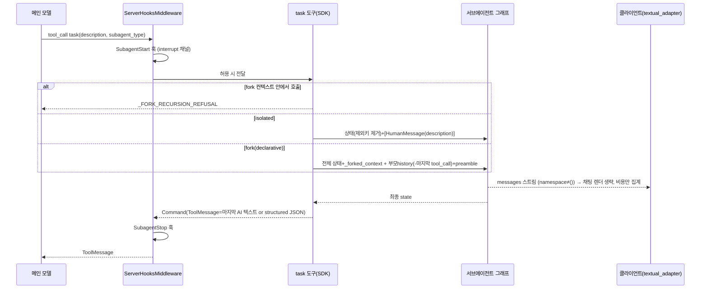
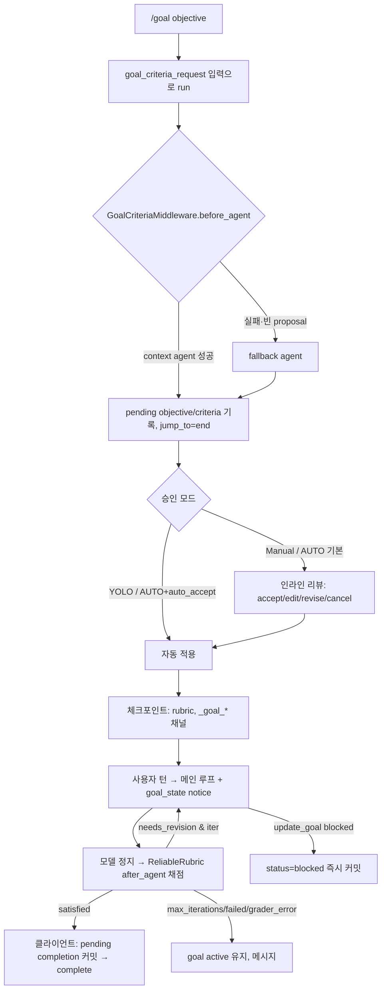

# 05 — 서브에이전트(동기/비동기)·목표(Goal)와 루브릭(Rubric)

dcode의 "위임"과 "완료 판정"은 두 기둥으로 이뤄진다. **서브에이전트**는 SDK의 `SubAgentMiddleware`가 제공하는 `task` 도구로 동기 실행한다. isolated 모드는 새 컨텍스트에서, fork 모드는 부모 대화를 이어받아 돈다. 원격 Agent Protocol 서버에서 도는 비동기 서브에이전트는 `AsyncSubAgentMiddleware`의 5개 도구가 맡는다. dcode는 여기에 파일 기반 정의 로딩(`.deepagents/agents/{name}/AGENTS.md`), CLI 전용 미들웨어 주입(HITL·비용·훅·재시도), 기본 `general-purpose`를 fork 모드로 켜는 정책을 더한다. **목표와 루브릭**은 SDK `RubricMiddleware`(LLM-as-a-judge 루프)가 기반이다. dcode는 이를 `ReliableRubricMiddleware`로 확장하고, 목표 수명주기(수락 기준 초안 → 리뷰 → active/paused/blocked/complete)를 얹는다. 관련 코드는 TUI 상태(`app.py`), 서버 미들웨어(`GoalCriteriaMiddleware`, `GoalToolsMiddleware`), 모델용 알림 메시지(`goal_state_notice.py`)로 나뉜다. 이 기능들이 필요한 이유는 두 가지다. 컨텍스트가 부풀지 않도록 막아야 하고, "완료"를 모델의 자기 선언이 아니라 별도 채점기의 판정으로 정해야 한다.

---

## 문서가 약속하는 것

**dcode 서브에이전트** (`docs_official/code/subagents.md`)
- 커스텀 동기 서브에이전트는 `.deepagents/agents/{subagent-name}/AGENTS.md`(프로젝트)와 `~/.deepagents/{agent}/agents/{subagent-name}/AGENTS.md`(사용자)에 정의한다. 이름이 겹치면 프로젝트 정의가 이긴다.
- "Async subagents are not available to end-users in Deep Agents Code at this time."
- 내장 `general-purpose`는 부모의 대화와 시스템 프롬프트를 상속한다. `DEEPAGENTS_CODE_FORKED_SUBAGENTS=false`로 isolated 모드로 바꿀 수 있다.
- frontmatter에서 `name`과 `description`은 **필수**, `model`은 선택(`provider:model`)이다. 본문은 `system_prompt`가 된다.
- `tools`/`middleware`/`interrupt_on`/`skills`는 frontmatter로 설정할 수 없고, 도구는 메인 에이전트에서 상속한다.
- 코드 인터프리터가 기본으로 켜져 있어 dynamic subagents가 바로 동작한다. "workflow"를 요청하면 `task()` 글로벌을 쓰는 스크립트를 짜고, 패널에 dispatch별 phase로 표시한다.
- `general-purpose` 이름으로 정의하면 내장 GP를 대체한다(저렴한 모델 라우팅 예시).
- `docs_official/code/configuration.md:693-694`: `DEEPAGENTS_CODE_FORKED_SUBAGENTS`의 기본값은 `true`이고, 프로젝트 `.env`로는 설정할 수 없다(`configuration.md:122`).
- `docs_official/code/cli-reference.md:254`: `--allow-fs-tools`는 메인과 동기 서브에이전트에 적용되고 async 서브에이전트에는 적용되지 않는다.

**dcode 목표·루브릭** (`docs_official/code/goals-and-rubrics.md`)
- `/goal <objective>`를 입력하면 에이전트가 수락 기준 초안을 쓰고, 작업 시작 전에 리뷰를 거친다.
- 승인 모드별 동작: Manual은 항상 리뷰, Auto는 기본 리뷰(`goals.auto_accept_criteria = true`면 자동 적용), YOLO는 리뷰 없이 적용한다.
- 목표는 pause/complete/blocked/clear 전까지 여러 턴에 걸쳐 유지되고, 후속 턴마다 기준에 따라 채점된다. 완료가 승인되면 목표를 clear한다.
- 서브커맨드: `amend <feedback>`, `pause`, `resume`, `show`, `clear`, `model [provider:model|clear]`, `max-iterations <N|clear>`.
- `/rubric set|next|file|show|clear|model <provider:model>`. sticky 루브릭은 clear 전까지, next 루브릭은 다음 한 턴에만 적용된다.
- 비대화형 모드에서는 `--rubric TEXT|@PATH`, `--rubric-model`, `--rubric-max-iterations`를 쓴다(`cli-reference.md:215-233,452-454`, 모두 `-n` 또는 stdin 필요).

**SDK** (`docs_official/sdk/*.md`)
- `subagents.md`: `SubAgent`(dict)와 `CompiledSubAgent` 두 종류가 있다. 동기 `general-purpose`는 이름이 같은 사용자 스펙이 없으면 자동 추가되며, 끄려면 `GeneralPurposeSubagentProfile(enabled=False)`를 쓴다. 동기 서브에이전트가 하나도 없으면 `task` 도구가 붙지 않는다.
- `subagents.md`(Forked): `mode: "fork"`면 부모의 전체 대화와 정확한 시스템 프롬프트를 받는다. `skills`는 거부되고, `system_prompt`는 addendum으로 붙어 캐시를 깬다. 위임 tool call은 제거되고 continuation preamble로 대체된다. fork는 "Cannot use `task`"이며 `deepagents>=0.7.13` beta다.
- `async-subagents.md`: `start/check/update/cancel/list_async_task(s)` 5개 도구가 있고, 상태는 `async_tasks` 채널에 두어 요약(compaction)에도 살아남는다. `url`이 없으면 ASGI 전송을 쓰고, update는 `multitask_strategy="interrupt"`로 새 run을 만든다.
- `dynamic-subagents.md`: 인터프리터 `task({description, subagentType, responseSchema})` 글로벌이 있고, `CodeInterpreterMiddleware(subagents=False)`로 끌 수 있다.
- `subagent-streaming.md`: 프론트엔드(`useStream`)에서 `stream.subagents` 셀렉터로 네임스페이스별 구독을 하는 패턴을 설명한다(주로 JS UI 가이드).
- `rubric.md`: `RubricMiddleware(model, system_prompt, tools, max_iterations=3, on_evaluation)`가 있고, 상태 `rubric`을 넣으면 루프가 켜진다. verdict는 `satisfied/needs_revision/max_iterations_reached/failed/grader_error`이고, custom 이벤트 `rubric_evaluation_start/end`를 낸다. checkpointer와 같은 thread면 루브릭이 유지된다.

---

## 코드 지도

| file/symbol | 역할 | 비고 |
|---|---|---|
| `libs/deepagents/deepagents/middleware/subagents.py:66` `SubAgent` | 선언형 스펙 TypedDict | `mode`, `permissions`, `response_format` 포함 |
| `…/subagents.py:220` `CompiledSubAgent` | 미리 컴파일된 runnable 스펙 | fork 가능하나 프롬프트는 유지 |
| `…/subagents.py:46` `_FORK_EXCLUDED_STATE_KEYS` | fork가 상속하지 않는 상태 | structured_response, 요약 이벤트/세션ID |
| `…/subagents.py:357` `_FORK_TASK_PREAMBLE` | fork 위임 메시지 앞에 붙는 안내문 | 재위임 거부 경고 포함 |
| `…/subagents.py:370` `_fork_messages` | 부모 history에서 마지막 tool_call AIMessage 제거, 요약 이벤트 적용 후 task 추가 | |
| `…/subagents.py:392` `_EXCLUDED_STATE_KEYS` | isolated 입력/출력에서 뺄 키 | messages, todos, structured_response, fork 마커 |
| `…/subagents.py:426` `TASK_TOOL_DESCRIPTION` | `task` 도구 설명 템플릿 | `{available_agents}` |
| `…/subagents.py:456` `GENERAL_PURPOSE_SUBAGENT` | GP 기본 스펙 | |
| `…/subagents.py:475` `_ForkTaskToolMiddleware` | fork에 "진짜" task 도구 + 마커 상태 스키마 | 호출 시 거부 |
| `…/subagents.py:508` `create_sub_agent` | SubAgent → `create_agent` | `interrupt_on`이면 HITL 추가 |
| `…/subagents.py:577` `_build_task_tool` | task/atask 클로저, 상태 준비, 결과 Command | 핵심 |
| `…/subagents.py:842` `SubAgentMiddleware` | `task` 도구 등록, 선택적 시스템 프롬프트 | `subagent_names` 공개 |
| `libs/deepagents/deepagents/middleware/async_subagents.py:34` `AsyncSubAgent` | 원격 스펙(name/description/graph_id/url/headers) | |
| `…/async_subagents.py:132` `AsyncSubAgentState.async_tasks` | 병합 reducer가 붙은 태스크 추적 채널 | |
| `…/async_subagents.py:199` `_ClientCache` | (url, headers) 키로 sync/async 클라이언트 캐시 | sync는 url 필수 |
| `…/async_subagents.py:815` `_build_async_subagent_tools` | 5개 도구 생성 | |
| `libs/deepagents/deepagents/graph.py:663-788` | 스펙 분류(async=`graph_id` 유무), 선언형 스펙 미들웨어 조립, fork 프롬프트/미들웨어 상속 | |
| `…/graph.py:795-859` | GP 자동 추가(프로필 enabled/이름 중복 검사) | dcode는 항상 자체 GP를 줌 |
| `…/graph.py:872-896` | `SubAgentMiddleware`/`AsyncSubAgentMiddleware` 삽입 | |
| `…/graph.py:946-948` | private_state_keys를 task 도구에 역주입 | |
| `libs/deepagents/deepagents/middleware/rubric.py:489` `RubricMiddleware` | before_agent 리셋, after_agent 채점→`jump_to="model"` | beta |
| `…/rubric.py:257` `RubricState` | `rubric`(공개) + `_rubric_*` private 채널 | |
| `…/rubric.py:869` `_usability_correction` | 기준 수 누락 검출 → 1회 재시도·satisfied 강등 | |
| `…/rubric.py:1227` `_compose_update` | 기준 목록 동결, 수정 HumanMessage 주입 | `lc_source="rubric_grader"` |
| `…/rubric.py:1327` `_emit` | `runtime.stream_writer`로 custom 이벤트 | `unverified` 필드 포함 |
| `libs/code/deepagents_code/subagents.py:67` `_parse_subagent_file` | YAML frontmatter 파싱 | `name` 선택(폴더명 fallback) |
| `…/subagents.py:177` `_load_subagents_from_dir` | `{dir}/{name}/AGENTS.md` 스캔, 오배치 경고, 충돌 경고 | |
| `…/subagents.py:251` `list_subagents` | user → project 순 `dict.update` | 프로젝트 우선 |
| `libs/code/deepagents_code/_paths.py:342` / `project_utils.py:88` | `~/.deepagents/{agent}/agents`, `{root}/.deepagents/agents` | |
| `libs/code/deepagents_code/agent.py:2711` `_subagent_cli_middleware` | 서브에이전트용 CLI 미들웨어 스택 | HITL/모델/비용/재시도/훅/메모리가드 |
| `…/agent.py:2804-2852` | 파일 서브에이전트 → `SubAgent` 변환, 모델 정책 검사 | `interrupt_on={}`로 이중 HITL 방지 |
| `…/agent.py:2859-2873` | dcode 자체 GP 생성, `FORKED_SUBAGENTS` 기본 true → `mode="fork"` | |
| `…/agent.py:1113` `load_async_subagents` | `config.toml [async_subagents]` 로드 | 문서상 "미제공"과 충돌 |
| `…/agent.py:2233-2249` | async 도구 3종 HITL 설정 | start/update/cancel |
| `…/agent.py:226,3249` `_inject_fs_tools_into_subagents` | `--allow-fs-tools`를 각 서브에이전트에 강제 | Compiled면 ValueError |
| `…/agent.py:156` `_format_task_error` + `:3312` `ToolErrorMiddleware` | task 예외 → "failed. You may retry" | |
| `…/agent.py:2914-2916` | `ResumeState`/`CostTracking`/`GoalToolsMiddleware` 삽입 | 순서 주석 |
| `…/agent.py:3256-3298` | `GoalCriteriaMiddleware`(context agent + fallback agent) | `goal_criteria_tools`가 None이면 미설치 |
| `…/agent.py:3316-3444` | 채점기 도구/미들웨어 조립 → `ReliableRubricMiddleware` | 항상 설치(no-op until rubric) |
| `…/agent.py:3447-3500` | custom+async 합쳐 `create_deep_agent(subagents=…)` | fork beta 경고 억제 |
| `libs/code/deepagents_code/server_graph.py:515,559` | 서버 그래프 생성 시 async 서브에이전트 로드·전달 | |
| `libs/code/deepagents_code/_env_vars.py:258` / `config.py:389,415` | `FORKED_SUBAGENTS` 정의, 프로젝트 `.env` 거부 | |
| `libs/code/deepagents_code/reliable_rubric.py:99` `ReliableRubricMiddleware` | thread별 채점 모델 선택, CLI 컨텍스트 복사 | `state_schema` 확장 |
| `libs/code/deepagents_code/goal_rubric.py:116` `GOAL_RUBRIC_SYSTEM_PROMPT` | 기준 초안 프롬프트(2-5 bullet, 검색 ≤3) | |
| `…/goal_rubric.py:1369` `GoalCriteriaMiddleware` | `goal_criteria_request` 있으면 before_agent에서 중첩 에이전트 실행 → pending 필드 기록 → `jump_to="end"` | |
| `…/goal_rubric.py:1626` `_create_goal_criteria_agent` | 읽기 전용 repo 도구·예산·HITL + `ToolStrategy(GoalProposal)` | |
| `libs/code/deepagents_code/goal_tools.py:275` `GoalToolsMiddleware` | `update_goal`(complete/blocked) + 목표 상태 알림 유지 | 읽기 도구 없음 |
| `…/goal_tools.py:125` `_update_goal_command` | 전제조건 검사, complete는 staging만 | |
| `libs/code/deepagents_code/goal_state_notice.py:36-97` | notice 소스 태그, 스키마 버전 5, 숨김 소스 집합 | |
| `libs/code/deepagents_code/goal_state_limits.py:8-46` | `GoalStatus`, 글자 수 한도 | 8k/12k/12k/4k |
| `libs/code/deepagents_code/app.py:14847` `_handle_goal_command` | `/goal` 라우팅 | |
| `…/app.py:15945` `_handle_rubric_command` | `/rubric`(`/criteria`) 라우팅 | |
| `…/app.py:13769-13800` `_goal_state_update` | TUI → 체크포인트 상태 dict | paused/complete면 `rubric=None` |
| `…/app.py:18710-18731` | 턴 전송 시 next → sticky 루브릭 선택 | |
| `…/app.py:14045` `_live_goal_proposal_auto_accept_enabled` | 승인 모드별 자동 수락 | |
| `…/app.py:14463` `_resolve_pending_goal_completion` | grading_run_id 상관 후 verdict로 완료 확정 | |
| `libs/code/deepagents_code/command_registry.py:155,274` | `/goal`(QUEUED), `/rubric`(IMMEDIATE_UI, alias `/criteria`) | |
| `libs/code/deepagents_code/tui/textual_adapter.py:1267,2013-2060,2350` | 네임스페이스 필터, custom `subagent`/rubric 이벤트 분기 | 프로토콜 측 |
| `libs/code/deepagents_code/hooks/server_middleware.py:468,703` | `task` 호출 전후 `SubagentStart/Stop` 훅 | |
| `libs/code/deepagents_code/client/non_interactive.py:1020,2154` | `-n`의 rubric 입력 주입, rubric 이벤트 렌더 | |

---

## 동작 흐름

### A. 서브에이전트 조립 (서버 프로세스 시작 시)

1. `server_graph.py:515`에서 `load_async_subagents()`가 `config.toml`의 `[async_subagents]`를 읽는다(`agent.py:1113-1190`). `description`과 `graph_id`가 없으면 건너뛰고, `url`/`headers`는 선택이다.
2. `create_cli_agent` 안에서 `get_user_agents_dir(assistant_id)`와 `project_context.project_agents_dir()`로 두 디렉터리를 정한다(`agent.py:2704-2709`).
3. `list_subagents()`는 user를 먼저, project를 나중에 `dict.update`해서 프로젝트 정의가 우선한다(`subagents.py:268-278`).
4. 각 메타에 대해 `model`이 있으면 `model_policy.require_model_allowed`를 호출한다. 파일 경로가 에러 문맥에 들어가고, 차단되면 기동이 중단된다(`agent.py:2818-2839`). 그다음 `_subagent_cli_middleware(has_explicit_model=…)`를 붙이고, HITL이 활성이면 `interrupt_on={}`로 설정한다(`agent.py:2840-2852`).
5. 사용자 정의에 `general-purpose`가 없으면 dcode가 직접 GP 스펙을 만들고, `FORKED_SUBAGENTS`의 기본값이 True라서 `mode="fork"`가 된다(`agent.py:2859-2873`).
6. `--allow-fs-tools`가 있으면 각 스펙의 middleware에 제한된 `FilesystemMiddleware`를 넣는다(`agent.py:3238-3254`).
7. `create_deep_agent(subagents=custom+async)`를 호출한다(`agent.py:3447-3500`). SDK는 `graph_id`가 있으면 async로 분류하고(`graph.py:666`), 선언형 스펙에는 기본 스택을 앞에 붙인다(Filesystem, Summarization, PatchToolCalls, 프로필, 캐싱. `graph.py:689-750`). 도구가 없으면 부모 도구를 상속한다(`graph.py:760`).
8. fork 스펙은 부모의 `final_system_prompt`를 base로 삼고 자기 `system_prompt`를 addendum으로 붙인다(`graph.py:772-780`). 부모 `middleware`는 이름 기준으로 병합해 상속한다(`graph.py:727-730`).
9. `SubAgentMiddleware`(`graph.py:873-885`)와 async가 있으면 `AsyncSubAgentMiddleware`(`graph.py:893-896`)를 넣는다. 마지막으로 private state key를 task 도구에 역주입한다(`graph.py:946-948`).

### B. `task` 호출 (동기)

1. 모델이 `task(description, subagent_type)`를 호출한다. 서버 훅 미들웨어가 `SubagentStart` 훅을 실행하고, 거부되면 deny ToolMessage를 돌려준다(`hooks/server_middleware.py:468-497`).
2. `task`/`atask`(`subagents.py:766-824`)는 먼저 fork 마커가 있으면 거부 문자열을 반환한다. 알 수 없는 타입이면 허용 목록 문자열을 반환하고, `tool_call_id`가 없으면 ValueError를 낸다.
3. `_validate_and_prepare_state`(`subagents.py:732-764`)에서 모드별로 입력을 만든다.
   - isolated: 부모 상태에서 `_EXCLUDED_STATE_KEYS`와 private 키를 뺀 뒤 `messages=[HumanMessage(description)]`.
   - 선언형 fork: `_FORK_EXCLUDED_STATE_KEYS`만 뺀 **전체 상태**(private 포함)에 `_deepagents_forked_context=True`를 더하고, messages는 `_fork_messages`.
   - compiled fork: private 키까지 제외한 상태에 `_fork_messages`.
4. `configurable.ls_agent_type="subagent"`와 tracing context를 설정한 뒤 `invoke`/`ainvoke`한다(`subagents.py:791-793`).
5. `_return_command_with_state_update`(`subagents.py:677-715`): `structured_response`가 있으면 JSON으로, 없으면 텍스트가 비어 있지 않은 마지막 AIMessage를 결과로 쓴다. 제외 키를 뺀 상태 업데이트와 `ToolMessage`를 Command로 반환한다.
6. 예외는 dcode `ToolErrorMiddleware`가 `"Subagent 'x' failed. You may retry this task."`로 바꾼다(`agent.py:156-163,3312`). 정상 결과는 `SubagentStop` 훅을 거친다(`server_middleware.py:703-723`).
7. 스트리밍: 클라이언트는 `subgraphs=True`로 받은 `(namespace, mode, data)`에서 `ns_key != ()`인 메시지를 채팅에 렌더하지 않는다(`textual_adapter.py:1995-2016,2567-2569`). 비용 이벤트는 네임스페이스와 무관하게 집계한다(`:2025-2051`).



### C. 동적 서브에이전트(js_eval `task()`) 프로토콜 측

- `CodeInterpreterMiddleware(tool_name="js_eval", …)`가 메인 스택에 들어간다(`agent.py:3014-3051`). `task()` bridge 구현은 외부 패키지 `langchain_quickjs`에 있어 이 저장소에서는 확인할 수 없다(추정: `subagents=` 기본값 on, `docs_official/sdk/dynamic-subagents.md:1282`).
- bridge는 custom 스트림에 `{"type":"subagent","phase":"start|complete|error","id","eval_id",…}`를 낸다. 클라이언트는 **메인 네임스페이스에서 온 이벤트만** 패널로 넘긴다(`textual_adapter.py:1267-1281,2350-2358`). 필드 재검증은 `tui/widgets/subagent_panel.py:339-369`에서 한다.

### D. `/goal` 수명주기

1. `/goal <objective>`: `_handle_goal_command`가 먼저 `model`/`max-iterations` 단일 토큰 alias를 걸러낸다. 이어 `show|status`, `amend`(첫 토큰), `pause`, `resume`, `clear`를 처리하고, 나머지는 objective로 본다(`app.py:14860-14959`). `validate_goal_objective`로 8,000자 한도를 확인한다.
2. `_run_goal_criteria_request`(`app.py:15129-15165`)는 그래프 입력 `goal_criteria_request`를 담아 run을 시작한다.
3. 서버에서는 `GoalCriteriaMiddleware.before_agent`가 요청을 감지해 중첩 criteria agent를 invoke한다. 실패하거나 proposal이 없으면 goal-only fallback agent를 쓴다. 결과는 `_pending_goal_objective/_pending_goal_rubric/...`에 기록하고 `rubric=None`, `jump_to="end"`로 끝낸다. 메인 에이전트 루프는 돌지 않는다(`goal_rubric.py:1476-1526,1465-1473`).
4. 클라이언트는 체크포인트에서 pending을 동기화한다. `_live_goal_proposal_auto_accept_enabled`(`app.py:14045-14061`)가 YOLO면 True, AUTO면 `goals.auto_accept_criteria`(env `DEEPAGENTS_CODE_GOAL_AUTO_ACCEPT_CRITERIA`, 기본 False), 그 외에는 False를 돌려준다. False면 리뷰 UI를 띄운다.
5. 수락되면 `_goal_state_update()`(`app.py:13769-13800`)가 `rubric`(공개 입력), `_sticky_rubric`, `_goal_objective`, `_goal_status`, `_goal_rubric` 등을 체크포인트에 쓴다.
6. 매 턴: `_send_to_agent`가 `next_rubric`을 먼저 고르고, 없으면 paused/complete가 아닐 때 `active_rubric`을 고른다(`app.py:18710-18731`).
7. 서버: `GoalToolsMiddleware.before_model`이 상태 fingerprint가 다르거나 요약 cutoff 아래로 밀린 경우 `goal_state` HumanMessage notice를 새로 넣는다(`goal_tools.py:349-401`). 모델은 `update_goal(complete|blocked, note)`만 쓸 수 있다.
8. 모델이 tool call 없이 멈추면 `ReliableRubricMiddleware.after_agent`가 채점한다. `needs_revision`이면 수정 HumanMessage를 넣고 `jump_to="model"`로 돌아간다(`rubric.py:657-693,1259-1272`).
9. 턴이 끝나면 클라이언트 `_resolve_pending_goal_completion`(`app.py:14463-14531`)이 grading_run_id를 상관시킨다. `satisfied`면 완료를 커밋하고(`note`가 없으면 기본 노트), 나머지 verdict면 pending을 정리하거나 유지한다.



---

## 핵심 설계 포인트

### 1. fork는 `task` 도구를 "뺏지 않고" 호출 시점에 거부한다
fork의 도구 블록이 부모와 같아야 프롬프트 캐시가 맞는다. 그래서 fork에도 같은 description의 `task`를 같은 위치(Filesystem 바로 뒤)에 넣고, 마커 상태로 거부한다.
```python
# libs/deepagents/deepagents/middleware/subagents.py:632-636
# The parent's `task` sits right after its filesystem tools; matching that
# position keeps both tools blocks in the same order.
fs_index = next((i for i, m in enumerate(fork_middleware) if isinstance(m, FilesystemMiddleware)), -1)
fork_middleware.insert(fs_index + 1, _ForkTaskToolMiddleware(fork_task_tool))
```
```python
# subagents.py:771-772
if runtime.state.get(_FORKED_CONTEXT_KEY):
    return _FORK_RECURSION_REFUSAL
```
마커 키는 스키마에 선언해야 채널로 추적된다. 선언하지 않으면 `runtime.state.get`에 보이지 않는다(`subagents.py:464-472`). SDK 문서 표의 "Cannot use `task`"(`docs_official/sdk/subagents.md` Forked 표)는 실제로는 "도구는 보이지만 호출하면 거부"다.

### 2. task 도구 목록의 fork 주석은 load-bearing이다
기본 설명에 "Each invocation is stateless"가 있어서, 주석이 없으면 모델이 fork 위임을 거부할 수 있다(`subagents.py:439-445`). 목록 문자열은 원본 스펙에서 **먼저** 계산해 fork 미러 도구와 바이트 단위로 같게 맞춘다(`subagents.py:601-610`).

### 3. isolated와 fork의 상태 경계
- isolated는 `messages/todos/structured_response/fork 마커`와 **private 키**를 뺀다(`subagents.py:392-397,762`). `private_state_keys`는 그래프 조립이 끝난 뒤 setter로 task 도구를 **다시 빌드**해 주입한다(`subagents.py:957-966`, `graph.py:946-948`).
- 선언형 fork는 private 키까지 전부 상속한다. 부모와 같은 그래프 모양이라 자기 미들웨어가 부모 프롬프트를 재구성할 수 있기 때문이다(`subagents.py:743-748`).
- 반환 방향도 `_EXCLUDED_STATE_KEYS`와 private 키를 뺀 상태를 부모에 병합한다(`subagents.py:687`). 따라서 서브에이전트가 쓴 공개 커스텀 채널은 부모로 새어 올라간다.

### 4. dcode의 서브에이전트 스택은 "부모와 같은 통제"를 복제한다
```python
# libs/code/deepagents_code/agent.py:2742-2755 (요약)
# Server-owned hooks must wrap subagent tools too; otherwise Pre/Post
# ToolUse only fire on the parent graph. Disable Stop so finishing a
# subagent does not emit the main-agent Stop event (SubagentStop still
# fires from the parent wrap around `task`).
middleware.append(ServerHooksMiddleware(cwd=hooks_cwd, emit_stop=False, mcp_tools=mcp_tools))
```
- `CostTrackingMiddleware(nested=True)`는 HITL로 서브그래프가 멈추기 전에 중첩 비용을 체크포인트한다(`agent.py:2728-2731`).
- 명시 모델이 없을 때만 `ConfigurableModelMiddleware(persist_model_state=False)`를 붙여 런타임 `/model` 전환을 따르게 한다(`agent.py:2720-2727`).
- `interrupt_on={}`를 명시하는 이유: SDK는 `spec.get("interrupt_on", parent)`로 상속하므로(`graph.py:752`), 빈 dict가 없으면 dcode의 async HITL 위에 동기 stock HITL이 한 겹 더 씌워진다(`agent.py:2845-2851`).
- dcode는 **항상** 자기 GP를 넘기므로 SDK의 GP 자동 생성 경로가 실행되지 않는다. 그래서 `--allow-fs-tools` 제한을 스펙마다 직접 주입한다(`agent.py:3244-3254`).

### 5. 파일 정의의 관대한 파싱과 시끄러운 경고
- `name`이 없으면 폴더명을 쓰지만, 빈 문자열이나 공백·비문자열 `name`은 거부해 오타를 드러낸다(`subagents.py:81-86,124-156`).
- `agents/foo.md` 같은 잘못된 배치나 `AGENTS.md`가 아닌 md 파일은 warning으로 알린다(`subagents.py:197-225`). frontmatter `name` 충돌도 경고하며, 이때 승자는 파일시스템 순회 순서에 따른다(`:230-246`).
- 차단된 모델을 쓰는 서브에이전트는 **기동 전체를 중단**시키고 파일 경로를 알려 준다(`agent.py:2819-2831`). 단 `dcode tools list` 같은 열거 전용 경로는 정책 검사를 건너뛴다(`agent.py:2779-2787`).

### 6. Rubric 루프: "모델이 멈춘 뒤" `after_agent`에서 `jump_to="model"`
```python
# libs/deepagents/deepagents/middleware/rubric.py:1259-1272
if evaluation["result"] != "needs_revision":
    return update
return {**update,
    "messages": [HumanMessage(content=self._revision_prompt(evaluation),
        name=RUBRIC_GRADER_MESSAGE_SOURCE,
        additional_kwargs={"lc_source": RUBRIC_GRADER_MESSAGE_SOURCE})],
    "jump_to": "model"}
```
- 새 채점 run의 판단: 루브릭 문자열이 바뀌었거나 이전 status가 terminal이면 run id, iterations, 동결 기준을 리셋한다(`rubric.py:639-655`).
- **커버리지 방어**: 첫 pass에서 보고된 기준 이름 목록을 동결한다(`:1246-1257`). 이후 기준 수가 줄면 채점기를 한 번 재시도하고(`:909-938`), 그래도 `satisfied`면 `needs_revision`+`unverified=True`로 강등한다(`:752-770`). 반면 `failed`는 커버리지 검사에서 면제된다(`:897-898`).
- `max_iterations`에 도달하면 `needs_revision` 이벤트를 내지 않고 바로 `max_iterations_reached`로 기록·방출한다(`:778-796`). SDK 문서(`docs_official/sdk/rubric.md` Grader pass events)는 "callback still receives `result: "needs_revision"`"라고 하므로 서술이 코드와 다르다(아래 대조표).
- 채점기가 인터럽트(`GraphBubbleUp`)를 던지면 `grader_error`로 기록하지 않고 전파한다(`:685-689`).

### 7. `ReliableRubricMiddleware`: thread별 채점 모델 선택
- `state_schema = ReliableRubricState`로 `_model_spec/_model_params/_rubric_model_spec`를 다시 선언한다. 선언하지 않으면 LangGraph가 채널을 전달하지 않아 **아무 에러 없이** 생성 시점 모델로 채점된다(`reliable_rubric.py:120-124`).
- `_rubric_model_spec`은 세 가지 상태를 가진다: 없음, `INHERIT_RUBRIC_MODEL` 센티넬, 명시 spec. 상속 모드이면 메인 모델과 그 params를 **한 단위로** 복사한다(`reliable_rubric.py:226-268`).
- 채점기 미들웨어의 `CodeModelRetryMiddleware(stream_output_is_visible=False)`는 두 클라이언트 모두 중첩 네임스페이스 출력을 필터하므로 안전하게 재시도할 수 있다(`agent.py:3365-3370`).
- 채점기 도구: 오프로드 결과 디렉터리 `read_file`과, working dir에 가상 모드로 루트를 둔 `ls/read_file/glob/grep`(sandbox_type을 모르면 비활성)을 준다. 호출 수 예산도 있다(`agent.py:3320-3386`).
- 미들웨어 순서 제약: `CostTrackingMiddleware`는 `ReliableRubricMiddleware`보다 **앞에** 있어야 한다. `after_agent`가 역순으로 실행되므로, 그렇지 않으면 채점 비용이 다음 턴 체크포인트로 넘어간다(`agent.py:2902-2906`).

### 8. Goal = "공개 `rubric` 입력 + private goal 채널 + model-only notice"
- 모델은 목표를 **읽는 도구가 없다**. `before_model`이 체크포인트에 notice를 영속화하고, 요약으로 notice가 창 밖으로 밀리면 `wrap_model_call`이 요청에만 임시로 다시 붙인다(`goal_tools.py:275-289`).
- notice는 `HumanMessage` 역할이지만 `lc_source="goal_state"`로 트랜스크립트·제목 투영에서 숨긴다(`goal_state_notice.py:1-7,36-75`). 스키마 버전(현재 5)이 다른 notice는 권위를 잃고 새 notice로 대체된다(`:51-63`).
- `update_goal(complete)`는 **즉시 커밋하지 않는다**. `_pending_goal_completion_note`만 staging하고, 클라이언트가 같은 턴의 `satisfied` verdict와 grading_run_id를 상관시켜 확정한다. `blocked`는 즉시 커밋된다(`goal_tools.py:242-272`, `app.py:14484-14531`). 모델의 자기 완료 선언을 채점기가 막는 구조다.
- paused/complete 목표에서는 공개 `rubric`을 `None`으로 보내 채점기를 끄고, `_sticky_rubric`에만 보존한다(`app.py:13764-13775`).
- 크기 예산은 한 곳에서 파생된다: `GOAL_NOTICE_TEXT_CHAR_LIMIT = APPLICATION(12k) + STATUS_NOTE(4k)`. 수락된 목표도 상태 노트 예산을 항상 남겨 둔다(`goal_state_limits.py:44-63`). 초과하면 `update_goal`을 거부하고, 복구는 사용자 `/goal clear`로만 가능하다(`goal_tools.py:174-202`).

### 9. 기준 초안 생성은 "메인 그래프 안의 짧은 run"
별도 프로세스나 엔드포인트가 아니다. 같은 서버 그래프 run에서 `goal_criteria_request` 입력 → `before_agent` → `jump_to="end"`로 끝난다(`goal_rubric.py:1370,1465-1473`). 이점은 체크포인트·HITL·컨텍스트를 그대로 재사용한다는 것이다. criteria agent의 컨텍스트 도구에는 `AsyncApprovalHITLMiddleware`가 걸리고(`goal_rubric.py:1722-1729`), 크기 초과(`GoalStateSizeError`)는 fallback으로 재시도하지 않고 바로 올린다(`:1502-1505`).

---

## 문서 ↔ 코드 대조

| 항목 | 문서 | 코드 | 판정 |
|---|---|---|---|
| 서브에이전트 경로 | `.deepagents/agents/{n}/AGENTS.md`, `~/.deepagents/{agent}/agents/{n}/AGENTS.md` (`code/subagents.md`) | `project_utils.py:88-92`, `_paths.py:342-344` | 일치 |
| 프로젝트 > 사용자 우선 | `code/subagents.md` | `subagents.py:270-276` | 일치 |
| frontmatter `name` 필수 | "requires `name` and `description`" (`code/subagents.md`; `configuration.md:898`) | 없으면 폴더명 fallback (`subagents.py:22-28,124`) | **불일치**(코드가 더 관대) |
| 잘못된 배치 경고, 이름 충돌 경고 | 없음 | `subagents.py:197-246` | 코드에만 있음 |
| `model` 빈 값 | 명시 없음 | `model:`이 빈 값이면 상속 (`agent.py:2808-2812`) | 코드에만 있음 |
| 서브에이전트 모델 allowlist 차단 시 기동 중단 | `configuration.md:510`에 rubric/classifier 언급, 서브에이전트 frontmatter는 모호 | `agent.py:2819-2831` | 부분 일치 |
| frontmatter로 tools 등 설정 불가, 도구 상속 | `code/subagents.md` | dcode 스펙에 tools 없음 → `graph.py:760` 상속 | 일치 |
| GP fork 기본 on / env로 끄기 | `code/subagents.md`, `configuration.md:693` | `agent.py:2869`, `_env_vars.py:258` | 일치 |
| env를 프로젝트 `.env`로 설정 불가 | `configuration.md:122` | `config.py:389,415-418` | 일치 |
| GP fork인데 `system_prompt`가 addendum으로 붙음 | SDK 문서: fork의 system_prompt는 캐시를 깨므로 비워 두라 | dcode GP는 `DEFAULT_SUBAGENT_PROMPT`를 넣은 채 fork (`agent.py:2866-2870` → `graph.py:777-780`) | **코드에만 있음**(문서 권고와 다름, 캐시 영향 추정) |
| async 서브에이전트 사용자 제공 여부 | "not available to end-users" (`code/subagents.md`) | `[async_subagents]` 로드→전달 (`server_graph.py:515,559`), manifest `agents.async_subagents` (`config_manifest.py:2475-2484`), HITL (`agent.py:2233-2249`) | **불일치**(실제 배선됨, 문서화 안 됨) |
| `--allow-fs-tools` 범위 | 동기 O, async X (`cli-reference.md:254`) | `agent.py:3244-3254`, 주석 `:2517-2519` | 일치 |
| task 실패 메시지 | 없음 | `"Subagent 'x' failed. You may retry this task."` (`agent.py:156-163`) | 코드에만 있음 |
| fork 재귀 | "Cannot use `task`" (`sdk/subagents.md`) | 도구는 노출, 호출 시 거부 (`subagents.py:475-482,771`) | 불일치(표현 차이) |
| fork preamble 문구 | "Continuing as the subagent that was just invoked…" (`sdk/subagents.md` 예시) | 훨씬 긴 `_FORK_TASK_PREAMBLE` (`subagents.py:357-367`) | 불일치(문서는 단순화) |
| mode 값 | isolated/fork | `"handoff"`도 legacy alias로 허용 (`subagents.py:313`) | 코드에만 있음 |
| 중복 서브에이전트 이름 | 없음 | ValueError (`subagents.py:321-334`, async `async_subagents.py:897-901`) | 코드에만 있음 |
| async `list` 캐시 동작 | terminal(`success/error/cancelled`)은 캐시 사용 (`sdk/async-subagents.md`) | `_TERMINAL_STATUSES`에 `timeout`, `interrupted`도 포함 (`async_subagents.py:659`) | 불일치(코드가 더 넓음) |
| async 헤더 | 사용자 지정 | `x-auth-scheme: langsmith` 기본 주입 (`async_subagents.py:186-196`) | 코드에만 있음 |
| async sync 경로 url 필수 | ASGI는 async 전용 note | `get_sync`가 ValueError (`async_subagents.py:214-216`) | 일치 |
| 동적 서브에이전트 기본 on | `code/subagents.md` | `CodeInterpreterMiddleware` 설치 (`agent.py:3014-3051`), bridge는 외부 패키지 | 일치(bridge 미확인) |
| 동적 패널 phase | "grouped into phases by dispatch" | `eval_id`로 phase 분리 (`subagent_panel.py:339-381`) | 일치 |
| `/goal` 서브커맨드 | amend/pause/resume/show/clear/model/max-iterations | + `status` alias, 인자 없으면 show, `max_iterations` 철자 (`app.py:14866,14874-14884`) | 코드에만 있음(alias) |
| `/rubric` 서브커맨드 | set/next/file/show/clear/model `<provider:model>` | + `max-iterations`, `model … clear`, `status`, 별칭 `/criteria` (`app.py:16038-16046,16054-16062`, `command_registry.py:274-280`) | **코드에만 있음** |
| 자동 수락 설정 | `goals.auto_accept_criteria` in config.toml | + env `DEEPAGENTS_CODE_GOAL_AUTO_ACCEPT_CRITERIA` (`_env_vars.py:294-302`, `config_manifest.py:2671-2679`), 기본 False | env는 코드에만 있음 |
| 승인 모드별 리뷰 | Manual 항상/Auto 옵션/YOLO 자동 | `app.py:14045-14061` | 일치 |
| 완료 시 goal clear | "When a goal's completion is approved, Deep Agents Code clears the goal" | status를 `complete`로 커밋 (`app.py:14404`의 `_commit_pending_goal_completion`, `goal_state_limits.py:8-14`는 `complete`를 terminal 상태로 정의) | 불일치 가능(추정. commit 본문 미확인) |
| 완료 판정 방식 | "graded against acceptance criteria" | 모델 `update_goal(complete)`는 staging, 같은 run의 `satisfied`만 커밋 (`goal_tools.py:242-256`, `app.py:14484-14531`) | 코드에만 있음(세부) |
| `--goal` CLI 플래그 | code 문서에 없음(changelog에만 언급) | `main.py:2645-2651`, `--rubric*`와 함께 쓰면 거부 (`main.py:5649-5664`) | 코드에만 있음 |
| 글자 수 한도 | `/rubric` usage에만 표시 | objective 8k, rubric 12k, 합계 12k, note 4k (`goal_state_limits.py:26-42`) | 코드에만 있음 |
| `--rubric-model` 기본 | 메인 모델 (`cli-reference.md:453`) | `inherit_main_model = rubric_model is None` (`agent.py:3440`) | 일치 |
| `max_iterations` 기본 | 3 (`sdk/rubric.md`) | SDK 기본 3, dcode는 None이면 전달하지 않음 (`agent.py:3442-3443`) | 일치 |
| cap 도달 시 이벤트 result | callback은 `needs_revision`을 받는다 (`sdk/rubric.md` Grader pass events) | `max_iterations_reached`로 바꾼 뒤 emit/callback (`rubric.py:778-806`) | **불일치** |
| `on_evaluation` result 목록 | satisfied/needs_revision/failed/grader_error (`sdk/rubric.md` 필드표) | `max_iterations_reached`도 가능, `unverified` 필드 추가 (`rubric.py:243-254,795`) | 불일치(문서 누락) |
| before_agent 리셋 조건 | 새 rubric 또는 terminal 뒤 같은 rubric | 일치, `grader_error`도 terminal에 포함 (`rubric.py:94`) — docstring(`:615`)에는 누락 | 일치(코드 내 docstring 누락) |
| 채점기 입력 트렁케이션 | 없음 | 최근 30개 메시지, 메시지당 4,000자 (`rubric.py:100-119`) | 코드에만 있음 |
| 커버리지 재시도/강등 | 없음 | `rubric.py:869-938,752-770` | 코드에만 있음 |
| 서브에이전트 훅 | `HOOKS.md` 소관 | `SubagentStart/Stop`은 task 호출을 감쌈, 서브에이전트 내부 Stop은 비활성 (`agent.py:2742-2755`) | (타 분석 영역) |

---

## dcode ↔ SDK 경계

| 관심사 | SDK가 하는 일 | dcode가 더하는 일 |
|---|---|---|
| 서브에이전트 스펙·실행 | `SubAgent/CompiledSubAgent`, `task` 도구, 상태 격리, fork 메시지 구성, 결과 추출 (`subagents.py:577-839`) | 없음(그대로 사용) |
| 정의 소스 | dict 리스트만 받음 (`graph.py:277`) | 파일시스템 AGENTS.md 로더 (`deepagents_code/subagents.py`), config.toml async 로더 (`agent.py:1113`) |
| GP 서브에이전트 | 이름 중복이 없으면 자동 추가, 프로필로 on/off (`graph.py:795-859`) | 직접 GP를 만들어 SDK 자동 경로를 우회하고 fork 기본 on (`agent.py:2859-2873`) |
| 서브에이전트 미들웨어 | 기본 스택(Filesystem/Summarization/PatchToolCalls/프로필/캐싱) 선행 (`graph.py:689-750`) | HITL(async), ConfigurableModel, CostTracking(nested), GLM stall, ModelRetry, ShellAllowList, ServerHooks(emit_stop=False), MemoryGuard (`agent.py:2711-2766`) |
| HITL | `interrupt_on` 상속 (`graph.py:752-756`) | `interrupt_on={}`로 상속을 끊고 자체 async HITL 사용 (`agent.py:2845-2851`) |
| fs 도구 제한 | GP 자동 생성 경로에서만 상속 | 스펙별 강제 주입 (`agent.py:226-285,3249`) |
| 실패 처리 | 예외 전파 | `ToolErrorMiddleware`로 재시도 안내 문자열 (`agent.py:3312`) |
| 비동기 서브에이전트 | 5개 도구 + `async_tasks` 채널 (`async_subagents.py`) | TOML 로드, 레닥트 manifest, start/update/cancel HITL (`agent.py:2233-2249`) |
| 동적 서브에이전트 | (외부 `langchain_quickjs`의 `task()` bridge) | 인터프리터 설치, custom `subagent` 이벤트 검증·패널 (`textual_adapter.py:1267,2350`) |
| 스트리밍 | `ls_agent_type="subagent"` 태깅 (`subagents.py:484-505`) | `subgraphs=True` 수신 후 비메인 네임스페이스 렌더 필터, 중첩 비용 집계 (`textual_adapter.py:1995-2051,2567`) |
| 루브릭 루프 | `RubricMiddleware` 전체(리셋·채점·커버리지·수정 주입·이벤트) | `ReliableRubricMiddleware`: thread별 모델 선택, CLI 컨텍스트, 채점기 도구·예산·HITL, 비용 순서 (`reliable_rubric.py`, `agent.py:3316-3444`) |
| 목표 | 개념 없음 | `GoalCriteriaMiddleware`, `GoalToolsMiddleware`, notice 스키마, TUI 수명주기, 자동 수락 설정 |
| 루브릭 입력 전달 | 상태 `rubric` 키 | TUI next/sticky/goal 선택 (`app.py:18710-18731`), `-n --rubric` → `stream_input["rubric"]` (`non_interactive.py:2154-2155`) |

---

## 더 볼 거리

1. **fork GP가 dcode 메인 미들웨어를 통째로 상속하는가? (추정, 위험 후보)** `graph.py:727-730`은 fork일 때 `create_deep_agent(middleware=agent_middleware)` 전체와 스펙 middleware를 이름 기준으로 병합한다. dcode의 `agent_middleware`에는 `GoalToolsMiddleware`, `GoalCriteriaMiddleware`, `ReliableRubricMiddleware`, `CodeInterpreterMiddleware`(js_eval)가 있다. 게다가 fork는 `rubric` 공개 상태를 포함한 전체 상태를 상속한다(`subagents.py:747`). 그렇다면 GP 서브에이전트 안에서도 루브릭 채점 루프나 `update_goal`, `js_eval task()`가 켜질 수 있다. `js_eval`의 `task()` 경로가 `_FORKED_CONTEXT_KEY` 거부를 거치는지도 확인해야 한다. 테스트(`libs/code/tests`)에서 fork GP의 실제 미들웨어 목록을 검증할 필요가 있다.
2. **async 서브에이전트 문서화 공백**: 코드상 `[async_subagents]`만 넣으면 동작하고 HITL까지 붙는데, 공식 문서는 "미제공"이라고 한다. 의도적인 숨김인지(실험 기능) CHANGELOG에서 확인해야 한다.
3. **GP fork + `system_prompt` addendum**: dcode GP는 `DEFAULT_SUBAGENT_PROMPT`를 addendum으로 붙인다. SDK 문서가 말하는 캐시 미스가 실제로 일어나는지 LangSmith trace에서 cache read 토큰을 확인해야 한다.
4. `_commit_pending_goal_completion`(`app.py:14404`)의 본문: 문서는 "clears the goal"이라고 하는데, 실제로 clear하는지 `complete` 상태로 보존하는지 미확인이다.
5. `GoalToolsMiddleware.wrap_model_call`(`goal_tools.py:438-535`)의 re-pin 로직과 요약 미들웨어의 순서 관계(컴팩션을 감싸는 위치)를 미들웨어 순서표로 정리할 것.
6. `langchain_quickjs`의 `task()` bridge 소스(외부 패키지): custom 이벤트 스키마(`phase/id/eval_id/subagent_type/model/error`), `responseSchema` → `SUBAGENT_RESPONSE_FORMAT_CONFIG_KEY`(`subagents.py:43,563-574`) 연결, 동시 실행 한도.
7. `SubagentStart` 결정의 `additionalContext` 주입(`_inject_subagent_start_context`, `server_middleware.py:497`)이 task `description`을 바꾸는 방식. 훅 분석 담당과 교차 확인할 것.
8. 서브에이전트 반환 시 private이 아닌 커스텀 상태 채널이 부모로 병합되는 문제(`subagents.py:687`): dcode 커스텀 공개 채널(예: `rubric`, `goal_criteria_request`)이 fork 결과로 부모에 되돌아와 덮어쓸 가능성(추정).
9. 비대화형 `-n`에서의 서브에이전트 표시(`non_interactive.py:585,1560`의 transcript agent id)와 대화형 패널의 차이.
10. `ReliableRubricMiddleware._ensure_grader`의 런타임 채점기 캐시(`reliable_rubric.py:294-`)가 thread마다 다른 채점 모델을 동시에 쓸 때 안전한지(ContextVar 기반, 추정상 안전).
