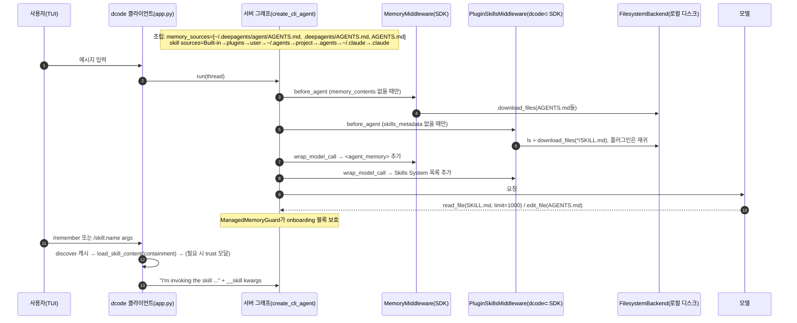
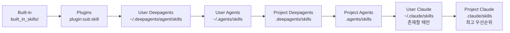

# 06 — 메모리(AGENTS.md)·스킬 시스템

dcode는 에이전트를 두 가지 방식으로 맞춤화한다. 하나는 **메모리**로, `AGENTS.md` 파일을 매 스레드 시작 때 시스템 프롬프트에 항상 넣는다. 다른 하나는 **스킬**로, `SKILL.md`의 frontmatter(name/description)만 먼저 목록으로 보여 주고 본문은 모델이 필요할 때 `read_file`로 읽는다(progressive disclosure). 핵심 로직은 SDK의 `MemoryMiddleware`·`SkillsMiddleware`에 있다. dcode가 더하는 것은 크게 네 가지다. (1) user/project/built-in/plugin/`.agents`/`.claude` 경로 해석과 우선순위, (2) 플러그인 네임스페이스 스킬, (3) `/skill:<name>`·`/remember`·`--skill`·`dcode skills ...` 같은 사용자 진입점, (4) 보안 장치(프로젝트 AGENTS.md 심볼릭 링크 차단, 스킬 containment와 trust store, onboarding 이름 블록 보호). 이런 구조가 필요한 이유는 분명하다. 코딩 에이전트는 "항상 알아야 할 규칙"과 "가끔 필요한 절차"를 서로 다른 토큰 비용 모델로 다뤄야 한다. 또 사용자 홈과 클론한 저장소에서 읽는 파일은 프롬프트 인젝션 경로가 되므로 막아야 한다.

---

## 문서가 약속하는 것

- 자동 메모리는 `~/.deepagents/<agent_name>/memories/`에 markdown 파일로 저장된다. 프로토콜은 Research, Response, Learning 순서다. — `docs_official/code/memory-and-skills.md:27-42`
- 글로벌 `~/.deepagents/<agent_name>/AGENTS.md`와 프로젝트 `.deepagents/AGENTS.md`(git 프로젝트 루트)가 세션 시작 때 시스템 프롬프트에 붙는다. — `docs_official/code/memory-and-skills.md:60-65`
- 추가 메모리 파일은 `.deepagents/`에 두고 `AGENTS.md`에서 참조해야 에이전트가 안다. 시작 시에는 읽지 않는다. — `docs_official/code/memory-and-skills.md:78-80`
- `/remember`는 대화 내용을 메모리와 스킬에 반영하도록 에이전트에게 명시적으로 요청한다. — `docs_official/code/memory-and-skills.md:17`
- `[memory].auto_save = false` 또는 `DEEPAGENTS_CODE_MEMORY_AUTO_SAVE=0`을 쓰면 메모리 로드는 유지하고 자동 저장만 끈다. env가 config보다 우선하며, 그래도 `/remember`는 동작한다. — `docs_official/code/configuration.md:399-417`, `:713-715`
- 스킬은 시작 시 frontmatter의 name/description만 읽고, `/reload`하면 다시 발견한다. — `docs_official/code/memory-and-skills.md:105`
- `dcode skills create <name> [--project]`, `dcode skills list [--project]`, `dcode skills info` 명령이 있다. — `docs_official/code/memory-and-skills.md:111-117`, `:220-230`
- 발견 디렉터리는 `~/.deepagents/<agent>/skills/`, `~/.agents/skills/`, `.deepagents/skills/`, `.agents/skills/`, `~/.claude/skills/`(experimental), `.claude/skills/`(experimental) 순이다. 뒤쪽이 이름 충돌 시 이긴다. — `docs_official/code/memory-and-skills.md:164-175`
- 우선순위 목록은 4단계이고 `.agents/skills/`가 highest다. — `docs_official/code/configuration.md:880-887`
- 프로젝트 루트는 `.git`을 기준으로 판단한다. — `docs_official/code/memory-and-skills.md:177`
- `/skill:<name> [args]`를 쓰면 SKILL.md 본문과 인자가 프롬프트에 주입된다. `--skill` 플래그는 TUI와 headless 모두에서 동작하고, `--skill`에 `-q`나 `--no-stream`을 붙이면 `-n`이 필요하다. — `docs_official/code/memory-and-skills.md:181-216`
- 스킬 containment allowlist는 `[skills].extra_allowed_dirs`와 `DEEPAGENTS_CODE_EXTRA_SKILLS_DIRS`(콜론 구분)로 설정한다. 발견 경로를 늘리는 것이 아니라 symlink 대상만 허용한다. — `docs_official/code/configuration.md:143-165`
- `DEEPAGENTS_HOME`으로 프로필 디렉터리를 옮길 수 있다. 다만 `~/.agents/skills/`는 launch home 기준이다. — `docs_official/code/configuration.md:171`, `:186`
- `dcode agents reset --agent NAME`은 "Clear agent memory and reset to default"다. — `docs_official/code/cli-reference.md:535-536`
- `/context-doctor`는 AGENTS.md 메모리와 스킬 인덱스의 토큰 비용을 보여 준다. — `docs_official/code/cli-reference.md:331-341`
- (SDK) `memory=`에 경로를 주면 항상 주입되고 progressive disclosure는 없다. `skills=`는 on-demand다. — `docs_official/sdk/context-engineering.md:154-268`
- (SDK) 에이전트는 `edit_file`로 메모리를 갱신한다. read-only 메모리는 permissions로 강제한다. — `docs_official/sdk/memory.md:21-25`, `:471-486`
- (SDK) 스킬은 3단계(Metadata → Instructions → Resources)로 로드한다. — `docs_official/sdk/skills.md:146-178`
- (SDK) frontmatter 제약은 name 1-64자이며 디렉터리 이름과 일치해야 하고, description 최대 1024자, compatibility 최대 500자, `allowed-tools`는 experimental, 10MB 초과 SKILL.md는 skip이다. — `docs_official/sdk/skills.md:1834-1861`, `:1786`
- (SDK) `skills=`를 주면 GP subagent가 스킬을 자동 상속하고, custom subagent는 상속하지 않는다. — `docs_official/sdk/skills.md:730-737`

---

## 코드 지도

| file/symbol | 역할 | 비고 |
|---|---|---|
| `libs/deepagents/deepagents/middleware/memory.py:105-170` `MEMORY_SYSTEM_PROMPT` | `<agent_memory>`와 `<memory_guidelines>` 템플릿. 신뢰·검증 규칙과 "언제 저장/비저장"을 담는다 | 자동 저장을 부추기는 문구의 원천 |
| `libs/deepagents/deepagents/middleware/memory.py:180-243` `MemoryMiddleware.__init__` | backend, sources, `add_cache_control`, `system_prompt` | `{agent_memory}` 슬롯이 없으면 ValueError |
| `libs/deepagents/deepagents/middleware/memory.py:245-277` `_format_agent_memory` | source 순서대로 `path\n\ncontent`를 연결하고 HTML 주석을 제거 | 비어 있으면 `(No memory loaded)` |
| `libs/deepagents/deepagents/middleware/memory.py:279-345` `before_agent/abefore_agent` | `backend.download_files`로 일괄 로드. `file_not_found`는 무시, 그 밖의 오류는 raise | state에 `memory_contents`가 있으면 skip |
| `libs/deepagents/deepagents/middleware/memory.py:347-383` `modify_request` | 시스템 메시지 뒤에 붙이고, ChatAnthropic이면 `cache_control` 부여 | `wrap_model_call`마다 호출 |
| `libs/deepagents/deepagents/middleware/skills.py:140-149` | `MAX_SKILL_FILE_SIZE=10MB`, 이름 64, 설명 1024, compat 500, 경고 최대 20개 | |
| `libs/deepagents/deepagents/middleware/skills.py:194-230` `_derive_source_label` | 경로에서 라벨 도출(`built_in_skills`→`Built-in`, `.claude/skills`→`Claude`) | |
| `libs/deepagents/deepagents/middleware/skills.py:313-351` `_validate_skill_name` | spec 검증 | 실패해도 경고만 하고 로드(`:423-431`) |
| `libs/deepagents/deepagents/middleware/skills.py:373-472` `_parse_skill_metadata` | `^---\s*\n(.*?)\n---\s*\n` 정규식과 `yaml.safe_load`로 파싱 | 설명과 compat는 잘라서 유지 |
| `libs/deepagents/deepagents/middleware/skills.py:591-648` `_list_skills_with_errors` | source 바로 아래 1단계 디렉터리만 보고 `SKILL.md`를 일괄 다운로드 | 재귀 없음 |
| `libs/deepagents/deepagents/middleware/skills.py:723-763` `SKILLS_SYSTEM_PROMPT` | 스킬 위치, 목록, 사용법(`read_file(limit=1000)`) | "Deepagents"/"Agents" 라벨 설명 포함 |
| `libs/deepagents/deepagents/middleware/skills.py:866-903` | 목록과 `<skill_load_warnings>` 포맷 | 경고를 json.dumps와 html.escape로 이스케이프 |
| `libs/deepagents/deepagents/middleware/skills.py:933-1021` `before_agent` | source 순서대로 last-one-wins dict 병합 | state에 있으면 skip |
| `libs/deepagents/deepagents/graph.py:278-279`, `:863-864`, `:906-913` | `create_deep_agent(skills=, memory=)`. memory는 prompt-caching 뒤 tail에 `add_cache_control=True`로 들어간다 | dcode는 이 경로를 쓰지 않음(아래 참고) |
| `libs/deepagents/deepagents/graph.py:204-238` `_apply_custom_middleware` | 사용자 middleware를 core 뒤, profile/prompt-caching/memory tail 앞에 삽입 | |
| `libs/code/deepagents_code/_paths.py:295-382` | `get_user_agent_md_path`, `get_project_agent_md_path`, 각 스킬 디렉터리 getter, `get_built_in_skills_dir` | `.agents`/`.claude`는 `PATHS.launch_home` 기준 |
| `libs/code/deepagents_code/project_utils.py:136-147` `find_project_root` | git 루트 탐색 | |
| `libs/code/deepagents_code/project_utils.py:150-231` `find_project_agent_md` | `.deepagents/AGENTS.md`와 루트 `AGENTS.md`를 **둘 다** 반환. 트리 밖을 가리키는 symlink는 거부 | 보안 근거 docstring `:168-172` |
| `libs/code/deepagents_code/agent.py:166-196` `_MEMORY_READONLY_SYSTEM_PROMPT` | auto_save=false일 때 쓰는 대체 프롬프트 | |
| `libs/code/deepagents_code/agent.py:2341-2405` `get_skill_sources` | 런타임 스킬 source 목록(8계층) | plugin 발견 실패는 경고 후 계속 |
| `libs/code/deepagents_code/agent.py:2665-2671` | memory나 skills가 켜져 있으면 agent dir을 만들고 빈 `AGENTS.md`를 touch | |
| `libs/code/deepagents_code/agent.py:2927-2973` | `MemoryMiddleware`, `ManagedMemoryGuardMiddleware`, `PluginSkillsMiddleware`를 `agent_middleware`에 추가 | `FilesystemBackend(virtual_mode=False)` |
| `libs/code/deepagents_code/agent.py:2757-2762` | subagent에도 `ManagedMemoryGuardMiddleware`를 붙임 | subagent에 memory/skills middleware는 없음 |
| `libs/code/deepagents_code/agent.py:3488-3501` | `create_deep_agent(..., middleware=agent_middleware)`. `memory=`/`skills=`는 **미전달** | |
| `libs/code/deepagents_code/agent.py:1344-1411` `reset_agent` | agent dir 전체를 `rmtree`한 뒤 `AGENTS.md`에 기본 프롬프트나 source agent 내용을 기록 | skills/도 삭제됨 |
| `libs/code/deepagents_code/memory_guard.py:95-200` `ManagedMemoryGuardMiddleware` | onboarding 이름 블록에 대한 write/edit/delete를 감시하고 복원 | O_NOFOLLOW로 읽고 씀 |
| `libs/code/deepagents_code/onboarding.py:24-27`, `:213-231` | `<!-- deepagents:onboarding-name:start/end -->` 블록 upsert | |
| `libs/code/deepagents_code/plugins/adapters/skills_middleware.py:229-372` `PluginSkillsMiddleware` | SDK `SkillsMiddleware`를 상속. 3-tuple source(namespace)는 재귀로 탐색하고 `plugin:sub:skill`로 명명 | SDK private 함수(`_list_skills_with_errors`, `_skill_metadata_from_response`)를 사용 |
| `libs/code/deepagents_code/plugins/adapters/skills.py:25-136` | `namespaced_skill_name`, `plugin_skill_sources/roots` | |
| `libs/code/deepagents_code/skills/merge.py:27-68` `merge_skill` | last-one-wins 병합과 충돌 시 DEBUG 로그 | 런타임과 CLI가 공유 |
| `libs/code/deepagents_code/skills/load.py:48-163` `list_skills` | CLI/TUI용 발견. `source` 필드를 붙이고 built-in에는 `deepagents-code-version` metadata 주입 | 소스별 try/except |
| `libs/code/deepagents_code/skills/load.py:166-223` `load_skill_content` | resolve한 경로가 allowed_roots 밖이면 `PermissionError` | |
| `libs/code/deepagents_code/skills/invocation.py:40-115` `discover_skills_and_roots` | 스킬과 containment root(표준 dir, extra_allowed_dirs, trust store) | |
| `libs/code/deepagents_code/skills/invocation.py:118-157` `build_skill_invocation_envelope` | 프롬프트 래핑과 `additional_kwargs.__skill` 메타데이터 | |
| `libs/code/deepagents_code/skills/trust.py:1-50`, `:261-497` | `~/.deepagents/.state/skill_trust.json` trust store | |
| `libs/code/deepagents_code/skills/commands.py:331-401`, `:403-530`, `:998-1200` | `dcode skills list/create/info/delete/trust {list,revoke}` | 템플릿에 10MB 경고 주석 |
| `libs/code/deepagents_code/command_registry.py:223-240`, `:515-565` | `/remember`와 `/skill-creator` 정적 alias, `/skill:` 파싱과 autocomplete | `_STATIC_SKILL_ALIASES` |
| `libs/code/deepagents_code/app.py:16831-16852`, `:16921-16922` | `/remember`와 `/skill-creator`를 `/skill:...`로 재작성, `/skill:` 디스패치 | |
| `libs/code/deepagents_code/app.py:16950-17094` `_invoke_skill` | 캐시 조회, miss면 재발견, 내용 로드, trust 프롬프트, `_send_to_agent` | |
| `libs/code/deepagents_code/app.py:17099-17180` `_prompt_skill_trust_and_retry` | `SkillTrustScreen` 모달, 승인하면 영구 저장 | |
| `libs/code/deepagents_code/app.py:17372-17473` | `/reload`에서 스킬을 재발견하고 추가/삭제 목록 보고 | 클라이언트 캐시와 autocomplete 갱신 |
| `libs/code/deepagents_code/client/non_interactive.py:2712-2801` | headless `--skill` 경로 | PermissionError면 trust 프롬프트 없이 exit 1(`:2762-2768`) |
| `libs/code/deepagents_code/config_manifest.py:2563-2573`, `:2596-2608` | `skills.extra_allowed_dirs`, `memory.auto_save` 옵션 정의 | |
| `libs/code/deepagents_code/config.py:4495-4510` `is_memory_auto_save_enabled` | 옵션 resolve | |
| `libs/code/deepagents_code/_server_config.py:815-816` | `DEEPAGENTS_CODE_SERVER_ENABLE_MEMORY/ENABLE_SKILLS`(기본 true) | 클라이언트에서 서버로 전달 |
| `libs/code/deepagents_code/system_prompt.md:169-173` | "Skills Directory" 섹션(user skills 경로만 표시) | |
| `libs/code/deepagents_code/context_doctor.py:68-125`, `app.py:13455-13520` | `/context-doctor`의 메모리·스킬 프롬프트 토큰 근사 | |
| `libs/code/deepagents_code/file_ops.py:403-408` | 가상 경로 `/memories/...`를 agent dir로 매핑 | 표시·diff용 헬퍼 |
| `libs/code/examples/extensions/memory_store.py:1-17` | 확장이 `/memories/`를 `StoreBackend`로 라우팅하는 예제 | 기본 동작 아님 |
| `libs/code/deepagents_code/built_in_skills/` | built-in 스킬 3종(아래) | `__init__.py:1-5`: 최저 우선순위 |
| `libs/code/examples/skills/` | 예제 4종(arxiv-search, langgraph-docs, skill-creator, web-research) | 자동 로드되지 않음, 복사해서 사용 |
| `libs/deepagents/deepagents/backends/context_hub.py:16`, `:350` | LangSmith Hub push payload 타입에 `SkillEntry`를 import만 함 | 메모리/스킬 로딩과 직접 관련 없음 |

### Built-in 스킬 목록

| 스킬 | 파일 | 하는 일 |
|---|---|---|
| `remember` | `libs/code/deepagents_code/built_in_skills/remember/SKILL.md:1-118` | 대화에서 best practice와 교훈을 뽑는다. 선호나 규칙은 AGENTS.md(글로벌 `$DEEPAGENTS_HOME/agent/AGENTS.md` 또는 프로젝트 `.deepagents/AGENTS.md`)에, 다단계 절차는 `$DEEPAGENTS_HOME/agent/skills/<name>/SKILL.md` 스킬로 저장한다. `edit_file`/`write_file`로 기록한 뒤 요약한다. `/remember` alias로 호출 |
| `skill-creator` | `libs/code/deepagents_code/built_in_skills/skill-creator/SKILL.md` (383줄), `scripts/init_skill.py`, `scripts/quick_validate.py` | 스킬 설계 가이드, 스캐폴딩, 검증. `/skill-creator` alias로 호출. `examples/skills/skill-creator`와 내용이 다름(diff 확인) |
| `deepagents-thread-inspector` | `libs/code/deepagents_code/built_in_skills/deepagents-thread-inspector/SKILL.md:1-50`, `scripts/inspect_sessions.py` | 로컬 `$DEEPAGENTS_HOME/.state/sessions.db`(SQLite 체크포인트)를 read-only로 열어 스레드를 목록·요약·트랜스크립트로 보여 준다. LangSmith를 쓸 수 없을 때의 fallback. `DEEPAGENTS_SESSIONS_DB` override 지원 |

---

## 동작 흐름

### A. 서버 그래프 조립 시 (한 번)

1. 클라이언트가 서버 설정을 env로 넘긴다. `enable_memory`/`enable_skills`의 기본값은 true다(`libs/code/deepagents_code/_server_config.py:815-816`). 서버는 `memory_auto_save=is_memory_auto_save_enabled()`를 `create_cli_agent`에 전달한다(`libs/code/deepagents_code/server_graph.py:543-545`).
2. `create_cli_agent`가 `~/.deepagents/<agent>/`를 만들고 `AGENTS.md`가 없으면 빈 파일로 touch한다(`libs/code/deepagents_code/agent.py:2665-2671`).
3. 메모리 source는 `[user AGENTS.md] + find_project_agent_md(project_root)`다. 프로젝트 쪽은 `.deepagents/AGENTS.md`와 루트 `AGENTS.md`이며, 트리 밖 symlink는 제외한다(`agent.py:2929-2935`, `project_utils.py:187-231`).
4. auto_save가 켜져 있으면 SDK 기본 `MEMORY_SYSTEM_PROMPT`, 꺼져 있으면 `_MEMORY_READONLY_SYSTEM_PROMPT`로 `MemoryMiddleware`를 만든다. 이어서 `ManagedMemoryGuardMiddleware([user AGENTS.md])`를 붙인다(`agent.py:2939-2960`).
5. `get_skill_sources()`가 8계층 source를 만들고 `PluginSkillsMiddleware`를 붙인다(`agent.py:2963-2973`, `:2341-2405`).
6. `create_deep_agent(middleware=agent_middleware)`를 호출한다. `memory=`/`skills=`가 없으므로 SDK가 자체 Memory/Skills middleware를 만들지 않는다. dcode 인스턴스는 custom middleware로서 core 뒤, prompt-caching tail 앞에 들어간다(`agent.py:3488-3501`, `graph.py:214-235`, `:928`).

### B. 매 스레드 첫 실행 / 매 모델 호출

7. `before_agent`: state에 `memory_contents`가 없으면 source 파일을 일괄 다운로드한다(`memory.py:328-345`). `skills_metadata`가 없으면 source별로 발견한다. namespace가 없는 source는 SDK 1단계 스캔, 플러그인 source는 재귀 탐색과 이름 네임스페이스를 적용하고 `merge_skill`로 병합한다(`skills_middleware.py:328-372`).
8. `wrap_model_call`: 메모리 블록(HTML 주석 제거)과 스킬 섹션(위치, 목록, 경고)을 시스템 메시지 뒤에 붙인다(`memory.py:347-383`, `skills.py:905-931`).
9. 모델이 스킬 description과 작업이 맞는다고 판단하면 `read_file(path, limit=1000)`으로 SKILL.md를 읽는다(`skills.py:740-741`). 필요한 교훈은 `edit_file`로 AGENTS.md에 기록한다(`memory.py:111`, `:120`).
10. `edit_file`/`write_file`/`delete`가 user AGENTS.md를 대상으로 하면 guard가 onboarding 블록이 바뀌었는지 검사한다. 바뀌었으면 블록을 복원하고 오류 ToolMessage를 돌려준다(`memory_guard.py:1-21`, `:139-171`).

### C. 사용자 명시 호출 (`/skill:`, `/remember`, `--skill`)

11. TUI 시작 시 `_discover_skills()`가 `discover_skills_and_roots`를 스레드로 실행한다. 결과로 `_discovered_skills`와 `_skill_allowed_roots`를 캐시하고 `/skill:` autocomplete를 만든다(`app.py:5712-5751`, `skills/invocation.py:40-115`).
12. `/remember [args]`는 `/skill:remember [args]`로 재작성된다. 대화가 없으면 안내만 하고 끝낸다(`app.py:16831-16844`).
13. `_invoke_skill`: 이름을 소문자화하고 캐시를 조회한다. miss면 재발견한다. `load_skill_content`의 containment 검사에서 `PermissionError`가 나면 trust 모달을 띄우고, 승인하면 `skill_trust.json`에 저장한 뒤 재시도한다(`app.py:16963-17062`, `:17099-17180`).
14. `build_skill_invocation_envelope`가 "I'm invoking the skill ..." 프롬프트와 `additional_kwargs.__skill`을 만들고 `_send_to_agent`로 보낸다(`app.py:17081-17094`, `invocation.py:134-156`). 즉 명시 호출은 모델의 `read_file`을 거치지 않고 **클라이언트가 본문을 사용자 메시지로 주입**한다.
15. headless `--skill`도 같은 헬퍼를 쓴다. 다만 containment에 실패하면 trust 프롬프트 없이 exit 1이다(`client/non_interactive.py:2712-2801`, `:2762-2768`).





---

## 핵심 설계 포인트

### 1. SDK `memory=`/`skills=`가 아니라 `middleware=`로 주입한다

dcode는 두 middleware를 직접 만들어 `agent_middleware`에 넣는다(`agent.py:2940-2973`, `:3488-3501`). 이렇게 한 이유는 세 가지다. (a) auto_save에 따라 프롬프트 템플릿을 바꿔야 하고, (b) 스킬 source에 plugin namespace를 담은 3-tuple을 넘겨야 하며, (c) project/user 경로를 dcode 규칙으로 해석해야 한다. 대가도 있다.
- SDK `graph.py:906-913`의 `MemoryMiddleware(..., add_cache_control=True)`와 "prompt caching 뒤 tail" 배치를 쓰지 않는다. dcode 인스턴스는 `add_cache_control` 기본값 False(`memory.py:198`)로 core 뒤, prompt-caching 앞에 삽입된다(`graph.py:214-235`). SDK 주석(`graph.py:901-903`)이 설명하는 "메모리 갱신이 프리픽스 캐시를 깨지 않게 하는" 이점이 dcode에서는 적용되지 않을 수 있다 (추정: 실제 캐시 적중 여부는 prompt-caching middleware 구현과 profile에 따라 다름).
- SDK의 GP subagent 자동 스킬 상속(`graph.py:806-807`)이나 fork subagent의 Skills/Memory 미러링(`graph.py:690-691`, `:710-711`)은 `skills`/`memory` 인자가 있어야 동작한다. dcode는 자체 GP spec을 공급하고(`agent.py:2859-2873`), subagent middleware(`agent.py:2711-2763`)에는 memory guard만 있고 Memory/Skills middleware는 없다. 따라서 dcode subagent는 AGENTS.md와 스킬 인덱스를 시스템 프롬프트로 받지 않는 것으로 보인다 (추정: fork 모드가 부모 메시지를 상속하는 방식은 subagents 영역에서 확인 필요).

### 2. 메모리는 스레드당 한 번만 로드한다. 갱신은 다음 스레드부터 반영된다

```python
# libs/deepagents/deepagents/middleware/memory.py:327-329
        # Skip if already loaded
        if "memory_contents" in state:
            return None
```
`memory_contents`는 `PrivateStateAttr`(`memory.py:96`)이고, 스킬도 같은 방식이다(`skills.py:951-953`). 에이전트가 턴 중에 `edit_file`로 AGENTS.md를 고쳐도 같은 스레드의 시스템 프롬프트에는 이전 스냅샷이 계속 쓰인다. `/reload`는 클라이언트 쪽 스킬 캐시와 autocomplete를 갱신하지만(`app.py:17428-17473`), 이미 체크포인트에 `skills_metadata`가 있는 스레드에서는 서버 middleware가 재발견을 건너뛸 것이다 (추정: private state가 체크포인트에 저장되는지 여부에 달려 있음). 문서의 "Discovery runs again on `/reload`"(`memory-and-skills.md:105`)는 클라이언트 쪽에는 확실히 맞지만, 모델이 보는 인덱스에도 맞는지는 불확실하다.

### 3. auto_save=false는 프롬프트만 바꾸는 소프트 제어다

```python
# libs/code/deepagents_code/agent.py:2937-2949
        # Loading memory stays on either way; a read-only prompt drops the
        # "proactively persist learnings" guidance when auto-save is disabled.
        if memory_auto_save:
            memory_middleware = MemoryMiddleware(backend=FilesystemBackend(virtual_mode=False), sources=memory_sources)
        else:
            memory_middleware = MemoryMiddleware(..., system_prompt=_MEMORY_READONLY_SYSTEM_PROMPT)
```
쓰기를 막는 permission이나 guard는 없다. 모델에게 "자발적으로 저장하지 말라"고 지시할 뿐이다(`agent.py:183-188`). `/remember`가 계속 동작하는 이유도 같다. 그 스킬은 결국 모델이 `edit_file`을 호출하는 방식이다.

### 4. 프로젝트 AGENTS.md: 루트 `AGENTS.md`도 로드하고 트리 밖 symlink는 차단한다

`find_project_agent_md`는 `.deepagents/AGENTS.md`와 `<root>/AGENTS.md`를 **둘 다** 반환한다(`project_utils.py:153-157`, `:187-190`). 악성 클론이 `AGENTS.md -> ~/.ssh/config`를 넣어 두면 시스템 프롬프트로 유출될 수 있다. 이를 막기 위해 `resolve(strict=True)` 뒤 `relative_to(project_root)`로 검사한다(`:168-172`, `:215-224`). 클론한 저장소의 루트 AGENTS.md가 **사용자 확인 없이** 시스템 프롬프트에 들어간다는 뜻이기도 하다. 완화책은 SDK 프롬프트의 "Trust and verification" 문구뿐이다(`memory.py:113-116`).

### 5. 스킬 containment, 그리고 발견과 읽기의 비대칭

- **모델 경로**: `PluginSkillsMiddleware`는 `FilesystemBackend(virtual_mode=False)`로 발견하고 경로를 그대로 목록에 노출한다. 모델은 일반 `read_file`로 읽으므로 containment 검사가 없고, 일반 파일 권한·승인 정책만 적용된다 (추정: filesystem 권한 영역).
- **사용자 명시 호출 경로**: `load_skill_content`가 resolve한 경로를 allowed_roots와 비교한다(`skills/load.py:199-215`). roots는 표준 dir, extra_allowed_dirs, trust store로 구성된다(`invocation.py:84-114`).
- trust store는 "승인 당시 resolve된 대상 디렉터리"를 re-resolve하지 않고 저장한다. 발견 경로의 symlink가 교체되면 containment에서, 저장된 디렉터리가 교체되면 `load_trusted_skill_dirs`의 resolve-to-self 검사에서 걸러진다(`skills/trust.py:14-25`).

### 6. 플러그인 스킬의 재귀 탐색과 네임스페이스

SDK는 source 바로 아래 1단계만 스캔한다(`skills.py:623-628`). 플러그인은 `skills/foo/bar/review/SKILL.md` 같은 중첩을 허용하므로 dcode가 서브클래스로 확장했다.
```python
# libs/code/deepagents_code/plugins/adapters/skills_middleware.py:128-137
        if not resolved.is_relative_to(source_root) or resolved in visited:
            continue
        visited.add(resolved)
        resolved_path = str(resolved)
        entries = _entries(backend.ls(resolved_path))
        if _has_skill_file(entries, resolved_path):
            found.append((resolved_path, path_segments[:-1]))
            continue
        for name, path in _child_dirs(entries, resolved_path):
            stack.append((path, (*path_segments, name)))
```
source 루트 밖으로 나가는 symlink와 순환은 막는다. 이름은 `plugin_id:foo:bar:review`가 된다. 다만 SDK private 함수(`sdk_skills._list_skills_with_errors`, `_skill_metadata_from_response`)에 의존하므로 SDK 내부 API가 바뀌면 깨질 수 있다(`skills_middleware.py:198`, `:311`).

### 7. onboarding 이름 블록 보호

onboarding은 `<!-- deepagents:onboarding-name:start -->` 블록을 user AGENTS.md에 upsert한다(`onboarding.py:213-231`). 문제는 SDK가 HTML 주석을 제거한 뒤 주입한다는 점이다(`memory.py:267`). 모델은 경계를 볼 수 없으므로 블록을 덮어쓸 수 있다. 그래서 tool 호출 단위로 사후 복원하고 오류를 반환하는 guard를 두었다. delete는 사전에 거부하며, 부모 디렉터리 삭제도 `is_relative_to`로 잡는다(`memory_guard.py:164-171`). subagent도 같은 파일에 쓸 수 있어 guard를 공유한다(`agent.py:2757-2762`).

### 8. 명시 호출은 "user 메시지 주입"이다

`/skill:x`는 모델의 progressive disclosure를 건너뛰고 SKILL.md 전문을 사용자 턴에 넣는다(`invocation.py:134-141`). `additional_kwargs.__skill`에는 name, description, source, args가 남아 체크포인트와 트레이스에서 스킬 호출을 식별할 수 있다(`:143-152`). `/remember`와 `/skill-creator`는 스킬 발견이 끝나기 전에도 입력할 수 있도록 정적 alias로 등록되어 있다(`command_registry.py:223-240`, `:536-545`).

---

## 문서 ↔ 코드 대조

| 항목 | 문서 | 코드 | 판정 |
|---|---|---|---|
| 자동 메모리 저장 위치 `~/.deepagents/<agent>/memories/` | `code/memory-and-skills.md:27-42`, `code/configuration.md:171` | 메모리 source는 AGENTS.md뿐이다(`agent.py:2929-2935`). `memories/` 디렉터리를 만들거나 로드하는 코드는 없다. `/memories/`는 `file_ops.py:403-408`의 경로 매핑과 확장 예제(`examples/extensions/memory_store.py:8-17`)에만 나온다. 저장 대상은 SDK 프롬프트가 지시하는 `edit_file`(AGENTS.md)이다 | **불일치** (문서가 옛 설계를 설명하는 것으로 보임) |
| "memory-first protocol"(Research/Response/Learning) | `code/memory-and-skills.md:29-31` | 해당 절차는 코드에 없다. `MEMORY_SYSTEM_PROMPT`의 "When to update memories" 지침만 있다(`memory.py:132-147`) | 문서에만 있음 |
| 프로젝트 메모리 경로 | `.deepagents/AGENTS.md`만 언급(`code/memory-and-skills.md:63`) | `.deepagents/AGENTS.md`와 **루트 `AGENTS.md`**를 둘 다 로드(`project_utils.py:187-190`) | 코드에만 있음 |
| 프로젝트 AGENTS.md symlink 트리 밖 차단 | 없음 | `project_utils.py:168-172`, `:215-224` | 코드에만 있음 |
| AGENTS.md의 HTML 주석 제거 | code 문서에 없음 | `memory.py:50-52`, `:267` | 코드에만 있음 |
| user AGENTS.md 자동 생성 | 암묵적 | 빈 파일 touch(`agent.py:2665-2671`) | 일치(세부는 코드에만) |
| `memory.auto_save` / `DEEPAGENTS_CODE_MEMORY_AUTO_SAVE` | 기본 true, 빈 값도 false, env 우선(`code/configuration.md:399-417`, `:713-715`) | `config_manifest.py:2596-2608`(`default=True`, `empty_env_is_false=True`) | 일치 |
| auto_save=false의 강제력 | "stopping automatic saves" | 프롬프트 교체뿐, 쓰기 차단 없음(`agent.py:2937-2949`) | 일치(소프트 제어라는 점은 문서에 없음) |
| `DEEPAGENTS_CODE_SERVER_ENABLE_MEMORY` / `_ENABLE_SKILLS` | 없음 | `_server_config.py:815-816` (기본 true) | 코드에만 있음(내부 전송용) |
| 스킬 우선순위 | 6개 dir(`memory-and-skills.md:166-173`) / 4개 dir, `.agents/skills` highest(`configuration.md:880-887`) | Built-in → plugins → user .deepagents → user .agents → project .deepagents → project .agents → user .claude → project .claude(`agent.py:2347-2350`, `:2371-2403`) | **불일치**(configuration.md는 Claude dir과 built-in/plugin 누락, highest 표기가 다름) |
| `~/.claude/skills` 조건 | experimental | 존재할 때만 source에 추가(`agent.py:2394`). project `.claude/skills`는 항상 추가(`:2401-2403`) | 코드에만 있음(비대칭) |
| built-in 스킬 3종과 plugin 스킬 | code 문서의 발견 목록에 없음 | `agent.py:2372`, `:2381`, `built_in_skills/` | 코드에만 있음 |
| skill-creator SKILL.md 내부 표 | "five sources" | 실제는 8계층(`built_in_skills/skill-creator/SKILL.md:13-23` vs `agent.py:2347-2350`) | 불일치(번들 스킬 내부 문서 드리프트) |
| `/remember` | 메모리/스킬 업데이트 요청(`memory-and-skills.md:17`) | `/skill:remember` alias, 대화가 없으면 거부(`app.py:16831-16844`) | 일치 |
| `/skill-creator` alias | 없음 | `command_registry.py:237-240`, `app.py:16845-16852` | 코드에만 있음 |
| `/skill:<name> args` | SKILL.md와 인자 주입(`memory-and-skills.md:181-188`) | `invocation.py:134-141` | 일치 |
| `/reload` 재발견 | "Discovery runs again on /reload"(`memory-and-skills.md:105`) | 클라이언트 캐시와 autocomplete 갱신(`app.py:17428-17473`). 서버 `skills_metadata`는 state에 있으면 skip(`skills_middleware.py:340-341`) | 부분 일치 (추정: 기존 스레드에서 모델이 보는 인덱스는 갱신 안 됨) |
| `dcode skills list/create/info` | 있음 | `commands.py:998-1200`. `delete [--force --dry-run]`, `trust list/revoke`도 있음 | 코드에만 있음(delete, trust) |
| 스킬 trust store(`skill_trust.json`)와 TUI 모달 | 없음(allowlist만 문서화, `configuration.md:143-165`) | `skills/trust.py:1-31`, `app.py:17099-17180` | 코드에만 있음 |
| headless `--skill` containment 실패 | 없음 | trust 프롬프트 없이 exit 1(`non_interactive.py:2762-2768`) | 코드에만 있음 |
| extra dirs env 구분자 | 콜론 구분(`configuration.md:161-165`) | "env uses the platform path separator"(`config_manifest.py:2566-2568`) | 불일치(Windows에서는 `;`로 추정) |
| name이 디렉터리 이름과 일치 | 필수(`sdk/skills.md:1838`) | 불일치해도 경고 후 로드(`skills.py:423-431`) | 불일치(코드가 관대) |
| description > 1024자 | 최대 1024 | 잘라서 유지(`skills.py:434-446`) | 일치(truncate 동작은 코드에만) |
| SKILL.md 10MB 초과 skip | `sdk/skills.md:1786`, `:1861` | `skills.py:141`, `:392-394`. 비교 대상은 바이트가 아니라 디코딩된 `len(content)` 문자 수 | 일치(단위 차이는 코드에만) |
| `allowed-tools` | 공백 구분, experimental | 공백이나 콤마 구분 문자열, 또는 YAML 리스트. 프롬프트에 "Allowed tools" 표시만 하고 강제 없음(`skills.py:354-370`, `:879-880`) | 일치(강제 없음은 코드로 확인) |
| GP subagent 스킬 상속 | `skills=` 전달 시 자동(`sdk/skills.md:734`) | dcode는 `skills=`를 넘기지 않고 자체 GP spec을 씀(`agent.py:2859-2873`, `:3245-3248`) | dcode에서는 해당 없음 (추정: subagent는 스킬 인덱스 없음) |
| `dcode agents reset` | "Clear agent memory"(`cli-reference.md:535`) | `shutil.rmtree(agent_dir)`로 skills/와 agents/도 삭제한 뒤 AGENTS.md에 `default_agent_prompt.md` 내용을 기록(`agent.py:1398-1411`, `config.py:5480-5490`) | 불일치(삭제 범위가 문서보다 넓음) |
| 시스템 프롬프트의 스킬 경로 | 없음 | `system_prompt.md:169-173`에 user skills 경로만 표시(project, `.agents` 없음) | 코드에만 있음 |
| SDK 메모리 캐시 브레이크포인트 | SDK memory 문서에 명시 없음 | SDK `memory=` 경로는 `add_cache_control=True`, dcode 경로는 False | 코드에만 있음 (dcode와 SDK 차이) |

---

## dcode ↔ SDK 경계

| 기능 | SDK가 제공 | dcode가 추가/변경 |
|---|---|---|
| 메모리 로딩과 주입 | `MemoryMiddleware`: 일괄 다운로드, 스레드당 1회, HTML 주석 제거, 시스템 메시지 append, 선택적 cache_control(`memory.py:180-417`) | source 경로 결정(user와 project 2종, `agent.py:2929-2935`, `project_utils.py:150-231`), symlink 보안 |
| 메모리 쓰기 정책 | 기본 "적극 저장" 프롬프트(`memory.py:110-169`), 쓰기 도구는 `FilesystemMiddleware`의 `edit_file` | `_MEMORY_READONLY_SYSTEM_PROMPT` 교체(`agent.py:166-196`), `memory.auto_save` 옵션(`config_manifest.py:2596-2608`), onboarding 블록 guard(`memory_guard.py`) |
| 스킬 발견과 파싱 | frontmatter 파싱과 검증, 1단계 스캔, last-one-wins, 라벨, 경고 이스케이프, 프롬프트(`skills.py:373-1021`) | 8계층 source(`agent.py:2341-2405`), plugin 재귀와 네임스페이스(`skills_middleware.py:99-372`), 충돌 DEBUG 로그(`merge.py:27-68`) |
| progressive disclosure | 목록 주입과 `read_file(limit=1000)` 안내(`skills.py:735-763`) | 명시 호출 envelope(`invocation.py:118-157`), `/skill:`·`/remember`·`/skill-creator`·`--skill` |
| 보안 | 10MB 상한, 경고 truncate와 escape(`skills.py:140-191`, `:885-903`) | containment(`load.py:166-223`), extra_allowed_dirs(`config_manifest.py:2563-2573`), trust store와 모달(`trust.py`, `app.py:17099-17180`) |
| 관리 CLI | 없음 | `dcode skills list/create/info/delete/trust`(`commands.py`), `dcode agents reset`(`agent.py:1344`) |
| 관측 | trace_policy로 hook 입력 생략(`memory.py:188`, `skills.py:802`) | `/context-doctor` 토큰 근사(`context_doctor.py:68-125`) |
| 번들 콘텐츠 | 없음 | built-in 스킬 3종, examples 4종 |
| 저장 백엔드 | `StoreBackend`/`CompositeBackend`로 `/memories/` 라우팅(SDK 문서 `sdk/memory.md:35-66`) | 기본은 로컬 `FilesystemBackend(virtual_mode=False)`. Store 라우팅은 확장 API(`extensions/api.py:144-170`)와 예제로만 제공 |

경계에서 눈에 띄는 점은 두 가지다. 첫째, dcode는 SDK의 **private 함수**(`_list_skills`, `_list_skills_with_errors`, `_skill_metadata_from_response`)를 import해 쓴다(`skills/load.py:22-25`, `skills_middleware.py:198`, `:311`). 둘째, SDK `create_deep_agent`의 `memory=`/`skills=` 경로를 우회하므로 그 경로에 딸린 부가 기능(cache_control tail 배치, GP/fork subagent 상속)을 받지 못한다.

---

## 더 볼 거리

1. **`memories/` 문서 드리프트**: changelog에서 `memories/` 디렉터리 기반 자동 메모리가 언제 AGENTS.md 편집 방식으로 바뀌었는지 추적하기. 현재 `DEEPAGENTS_HOME` 설명(`configuration.md:171`)에도 남아 있다.
2. **PrivateStateAttr 체크포인트 영속성**: `memory_contents`/`skills_metadata`가 SQLite 체크포인트에 저장되는지 확인해야 한다. 저장된다면 `/reload`나 스레드 resume 뒤에도 옛 인덱스와 메모리 스냅샷이 유지된다. `resume_state.py`, `state_migration.py`와 함께 볼 것.
3. **subagent 컨텍스트**: dcode의 fork 모드 GP subagent(`agent.py:2869-2870`)가 부모 시스템 메시지(메모리와 스킬 포함)를 실제로 받는지. SDK `_is_forked_subagent`와 `SubAgentMiddleware`의 fork 구현을 확인할 것(07/서브에이전트 영역과 교차).
4. **프롬프트 캐시 영향**: dcode의 MemoryMiddleware가 prompt-caching middleware 앞에 있을 때 Anthropic 캐시 브레이크포인트가 어디 찍히는지. `append_prompt_caching_middleware` 구현을 확인할 것.
5. **모델 경로의 containment 부재**: 스킬 목록에 노출된 경로를 모델이 `read_file`할 때 filesystem 권한과 승인 정책이 무엇인지. symlink 스킬이 모델 경로에서는 trust 없이 읽히는지 검증할 것.
6. **루트 `AGENTS.md` 자동 로드와 신뢰 모델**: MCP project trust 같은 확인 절차가 없다. THREAT_MODEL.md에서 이 위험을 어떻게 평가하는지 대조할 것.
7. **`agents reset`의 스킬 삭제**: 의도된 동작인지, `--dry-run` 출력이 skills/ 삭제를 알리는지(`agent.py:1385-1395`는 디렉터리 전체 "remove and recreate"만 표시).
8. **`.claude/skills` 비대칭**: user는 존재할 때만, project는 항상 source에 추가된다. 존재하지 않는 project 경로에 대해 SDK `ls` 오류가 `<skill_load_warnings>`로 모델 프롬프트에 새는지(`skills.py:615-619`) 확인할 것. `FilesystemBackend.ls`가 없는 경로에 error를 돌려주는지에 달려 있다.
9. **examples/skill-creator와 built-in/skill-creator의 차이**: 어느 쪽이 최신인지, 예제를 복사한 사용자 스킬이 built-in을 override해 옛 가이드를 쓰게 되는 문제.
10. **Windows 구분자**: `DEEPAGENTS_CODE_EXTRA_SKILLS_DIRS`는 문서상 콜론, manifest상 platform separator다. `_parse_extra_skills_dirs`(`config.py:3347`)를 확인할 것.
