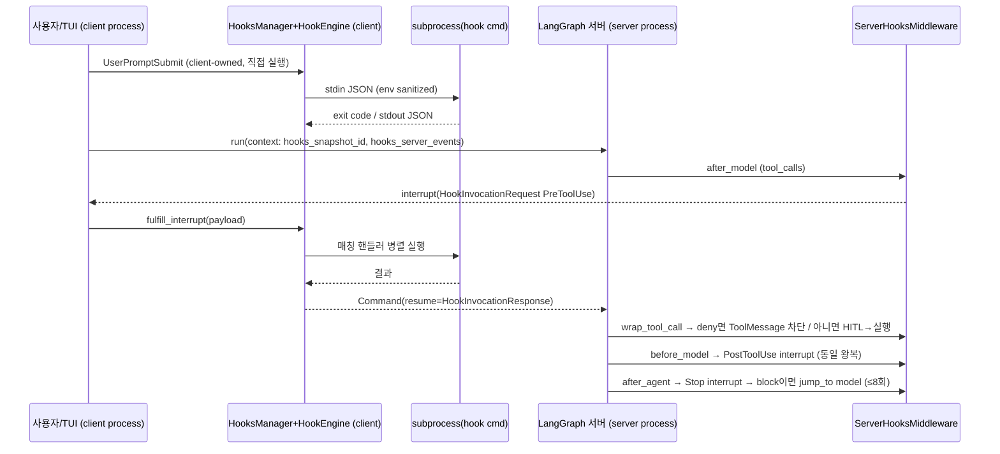

# 07 — MCP 도구 · 훅 · Python 확장 · 플러그인

dcode(deepagents-code 0.1.69, `1d3232c`)는 코드를 고치지 않고 에이전트를 확장하는 네 가지 통로를 제공한다. **MCP**는 외부 서버의 도구를 LangChain 도구로 바꿔 넣는다. **훅(Hooks v2)**은 라이프사이클 이벤트마다 셸 명령을 실행하고, 그 exit code와 stdout으로 허용·거부·컨텍스트 주입·턴 계속을 제어한다. **Python 확장**은 에이전트 서버 프로세스 안에서 `AgentMiddleware`·도구·가상 스토리지 라우트를 등록한다(실험 기능). **플러그인**은 앞의 셋과 skills를 한 디렉터리로 묶어 배포·설치·업데이트하는 패키징·신뢰 단위다. 네 통로가 도는 프로세스는 제각각이다. MCP 도구 로딩과 Python 확장은 **서버 프로세스**에서 그래프를 만들 때 붙는다. 훅 핸들러는 **항상 클라이언트 프로세스**에서 실행되고, 서버 소유 이벤트는 LangGraph `interrupt`로 클라이언트까지 왕복한다. 이 차이를 알아야 "왜 `/reload`로 되는 것과 `/restart`가 필요한 것이 갈리는지"가 설명된다.

---

## 문서가 약속하는 것

**MCP** (`docs_official/code/mcp-tools.md`)
- 설정은 `~/.deepagents/.mcp.json`(user) → `<project>/.deepagents/.mcp.json` → `<project>/.mcp.json` 순서로 자동 발견되고, 뒤로 갈수록 우선순위가 높다. 같은 서버 이름이 겹치면 객체 전체가 교체되며 deep merge는 하지 않는다.
- `--mcp-config PATH`는 최상위 우선순위로 얹히고, `--no-mcp`는 MCP를 전부 끈다. 둘은 상호 배타다.
- 전송은 stdio(기본)·`sse`·`http`이며, `streamable_http`/`streamable-http`는 `http`의 별칭이다. `type` 대신 `transport` 키를 써도 된다.
- 서버 이름은 `[A-Za-z0-9_-]+`만 허용한다. `${VAR}`와 `${VAR:-default}` 보간은 `command/args/env/url/headers`에서 동작한다.
- 서버마다 `allowedTools`와 `disabledTools` 중 하나만 쓸 수 있고, 빈 리스트는 거부된다. fnmatch glob을 쓸 수 있고, bare 이름과 `{server}_{tool}` 두 형태 모두 매칭된다.
- Auto 모드에서는 `readOnlyHint is True`이고 destructive hint가 없으며 모든 hint가 bool/null일 때만 분류기를 우회한다.
- `auth: "oauth"`는 원격 서버에만 쓸 수 있고 `Authorization` 헤더와 함께 쓸 수 없다. `dcode mcp login`의 동작은 호스트별로 갈린다. Slack은 paste-back 흐름에 공개 client와 team ID를 쓰고, GitHub(`api.githubcopilot.com`)는 RFC 8628 device flow를 쓴다.
- 토큰은 `~/.deepagents/.state/mcp-tokens/<server>-<sha256-16(url)>.json`에 저장된다. 디렉터리는 0700, 파일은 0600이며 atomic write로 쓴다. refresh에 실패하면 서버 상태만 `unauthenticated`로 바뀐다.
- 프로젝트 MCP는 기본 거부(default-deny)다. 승인은 `[mcp].enabled_project_server_approvals`에 project_root·name·fingerprint로 저장된다. `-n` 모드에서는 `--trust-project-mcp` 없이는 조용히 skip된다. `disabled_project_servers`와 그에 대응하는 env var의 거부가 항상 우선한다. `DEEPAGENTS_CODE_DANGEROUSLY_ENABLE_PROJECT_MCP_SERVERS`는 이름 기반 우회 수단이다.

**훅** (`docs_official/code/hooks.md`, repo `libs/code/HOOKS.md`)
- 위치는 `~/.deepagents/hooks.json`(user), `{project}/.deepagents/hooks.json`(workspace trust 이후), 그리고 플러그인의 `hooks/hooks.json`·manifest 경로·inline이다.
- 우선순위는 project → user → plugin 순이다. **매칭된 핸들러는 모두 동시에 실행**되고, 결과만 이 순서로 합쳐진다. 따라서 plugin 핸들러의 부작용은 무조건 일어난다.
- 신뢰 모델: 인터랙티브에서는 프롬프트를 띄우고 결정을 `~/.deepagents/.state/hooks_trust.json`에 저장한다. Esc는 시작을 중단하고, 거부하면 user/plugin 훅만 로드한다. headless에서는 `--trust-project-hooks`가 있어야 한다.
- 이벤트는 client 5개(SessionStart, UserPromptSubmit, SessionEnd, PermissionRequest, Notification)와 server 쪽 PreToolUse·PostToolUse·PreCompact·Stop·SubagentStart·SubagentStop이다. 공식 문서에는 서버 이벤트가 6개로 나오고, repo HOOKS.md는 여기에 `PostToolUseFailure`를 더해 7개로 적는다.
- 핸들러 필드는 `type:"command"`(필수), `command`(필수), `argv`, `timeout`(기본 600초, UserPromptSubmit만 30초), `statusMessage`다. `async:true`는 오류로 처리된다.
- 핸들러 환경에서는 이름에 `KEY/TOKEN/SECRET/PASSWORD/APIKEY`가 들어간 변수를 제거한다. stdout과 stderr는 각각 100,000바이트까지만 보존한다.
- exit 0이면 JSON을 해석한다. exit 2는 이벤트별로 block/deny/feedback/continue 중 하나로 해석되며 stdout은 무시하고 stderr를 쓴다. 그 밖의 exit code는 진단만 남긴다.
- PreToolUse 결정은 `deny > ask > allow` 순으로 우선한다. PermissionRequest에서는 deny 하나라도 있으면 거부, 없고 allow가 있으면 허용이다. Stop에서 block하면 턴이 계속되며, 연속 8회로 상한이 걸린다.
- `updatedInput`, `defer`, `updatedToolOutput` 등은 파싱만 하고 적용하지 않는다.
- 레거시 list 형태 `hooks.json`은 자동으로 마이그레이션된다.

**Python 확장** (`docs_official/code/extensions.md`, repo `libs/code/EXTENSIONS.md`)
- `DEEPAGENTS_CODE_EXPERIMENTAL=1`이 필수다. 진입 파일은 `async def extension(d: ExtensionAPI)`여야 한다.
- API는 `register_middleware/register_tool/register_backend_route/on_shutdown`과 읽기 전용 속성 `d.cwd/mode/has_ui/path`로 구성된다.
- 라우트 prefix는 소문자 절대경로에 앞뒤 슬래시가 붙은 형태여야 하고, 내부 라우트와 겹치면 거부된다. sandbox에서는 `FilesystemBackend`를 거부한다. shell `execute`는 라우트 내용을 볼 수 없다.
- 소스 로딩 순서는 `~/.deepagents/extensions/` → `[extensions].extra_paths` → `-e/--extension` → 플러그인 → `dcode.extensions` entry point → 프로젝트 `.deepagents/extensions/`(trust 필요)다.
- 설정은 `[extensions] enabled/trust/extra_paths`, env로는 `DEEPAGENTS_CODE_EXTENSIONS`와 `DEEPAGENTS_CODE_EXTENSIONS_TRUST`가 있다.
- 로드는 transactional이라 실패하면 부분 등록을 롤백한다. 확장 도구는 HITL 승인 맵에 자동으로 들어가지 않는다.

**플러그인** (`docs_official/code/plugins.md`)
- `.claude-plugin/plugin.json` 또는 `.codex-plugin/plugin.json`을 쓰며, manifest는 선택이다. 기본 경로는 `skills/`(또는 루트 `SKILL.md`), `.mcp.json`, `hooks/hooks.json`이다. 경로 선언은 `./`로 시작해야 하고 `..`를 쓸 수 없다.
- MCP와 hook 명령에서 `${CLAUDE_PLUGIN_ROOT}/${PLUGIN_ROOT}/${CLAUDE_PLUGIN_DATA}/${PLUGIN_DATA}/${CLAUDE_PROJECT_DIR}` 변수를 쓸 수 있다.
- skills·MCP·hooks는 `/reload`로 반영되고, Python 확장은 `/restart`가 필요하다.
- 플러그인 자동 업데이트는 manifest의 `extensions."com.langchain.deepagents.code".autoUpdate: true`로 켠다. 전역으로는 `[plugins].auto_update` 또는 `DEEPAGENTS_CODE_PLUGIN_AUTO_UPDATE`로 끌 수 있다.
- marketplace 파일 위치는 `.claude-plugin/marketplace.json`, `.agents/plugins/marketplace.json`, `api_marketplace.json`이고, source 타입은 `github`, `url`, `git-subdir`다. 원격은 HTTPS만 허용한다.

**SDK** (`docs_official/sdk/mcp.md`): LangChain의 `langchain.mcp.MCPAdapter`(FastMCP 기반, beta)로 MCP 도구를 `create_agent`에 넘기는 방법을 설명한다. deepagents SDK가 MCP를 직접 다룬다는 약속은 없다.

---

## 코드 지도

| file/symbol | 역할 | 비고 |
|---|---|---|
| `libs/code/deepagents_code/mcp_tools.py:1501` `discover_mcp_config_sources` | user → `.deepagents/.mcp.json` → 루트 `.mcp.json` 후보를 scope와 함께 수집 | 문서의 3단계 우선순위와 같다 |
| `mcp_tools.py:851` `_validate_server_config` | 이름 regex, 전송별 필수 필드, command/url 동시 선언 거부, oauth 제약 검사 | `${VAR}` 보간은 활성화 시점으로 미룬다(`:855`) |
| `mcp_tools.py:3042` `resolve_and_load_mcp_tools` | user config → plugin 레이어(deny만 적용) → project(trust 필터) → explicit 순으로 합친 뒤 disabled 필터, 검증, 로드 | 서버 프로세스의 호출자는 `server_graph.py:231` |
| `mcp_tools.py:2392` `_load_tools_from_config` | 서버별 preflight·discovery를 동시성 8(`:2294`)로 수행, 실패는 `MCPServerInfo`에 격리 | `langchain_mcp_adapters` 사용 |
| `mcp_tools.py:632` `MCPSessionManager` | discovery는 일회용 세션, 실제 호출은 서버별 지연 생성·캐시 세션 | 활성 세션이 있으면 재구성 금지(`:676`) |
| `mcp_tools.py:2017` `_mcp_tool_name` | `{server}_{tool}`을 64자로 자르고 12자리 sha256 접미사를 붙임 | 문서에 없음 |
| `mcp_tools.py:2227` `_apply_tool_filter` | allowed/disabled 필터, 원본 이름(`_deepagents_code_mcp_tool` 메타데이터)과 prefix 이름 모두 매칭 | |
| `auto_mode.py:538` `mcp_tool_is_coherently_read_only` | readOnlyHint 판정 | 문서의 3조건과 같다 |
| `mcp_auth.py:1340` `_ExpiryAwareOAuthClientProvider` | 저장된 만료 시각 복원, 30초 safety margin, 교차 프로세스 refresh 락 | |
| `mcp_auth.py:1512` `_refresh_lock_guard` | `<token>.json.lock` sidecar에 `FileLock`(최대 60초) | timeout이 나면 refresh를 건너뛴다 |
| `mcp_auth.py:252` `token_store_dir` / `:263` `_token_file_stem` | `DEFAULT_STATE_DIR/mcp-tokens`, `<name>-<sha256[:16](url)>` | |
| `mcp_providers/_registry.py:22`, `github.py:34`, `slack.py:60`, `base.py:120` | URL 호스트로 OAuth provider 선택(GitHub device, Slack loopback :3118, Generic) | |
| `hooks/capabilities.py:102` `_HOOK_EVENT_SPECS` | 이벤트 12종의 owner·matcher 필드·timeout·exit2·plain output·aggregation 정책 | 동작의 단일 원천 |
| `hooks/models/config.py:20` `CommandHandlerSpec` | `type/command/argv/timeout/statusMessage/async` 스키마 | 알 수 없는 키는 무시(`extra="ignore"`) |
| `hooks/loading.py:177` `load_hooks_config` | project → user → plugin 문서 병합, snapshot_id(sha256) 계산 | 레거시 마이그레이션은 `:394` |
| `hooks/snapshot.py:77` `HooksSnapshot.from_config` / `:209` `_compile_matcher` | 매처 컴파일(exact/`|`/`,` 대체, 그 외는 regex), plugin 변수 치환 | |
| `hooks/engine.py:41` `HookEngine.run` | 매칭된 핸들러를 `asyncio.gather`로 병렬 실행하고 설정 순서대로 reduce | |
| `hooks/runner.py:46` `run_command_handler` | subprocess(shell/exec, `start_new_session`), 출력 상한, timeout 시 프로세스 그룹 SIGKILL | exit 2를 `decision:"block"`으로 합성(`:151`) |
| `hooks/reducer.py:83` `reduce_hook_results` | 이벤트별 decision 생성, `_PERMISSION_RANK`(`:56`), `MAX_STOP_CONTINUATIONS=8`(`:57`) | |
| `hooks/server_middleware.py:293` `ServerHooksMiddleware` | 서버 소유 이벤트를 `interrupt()`로 방출 | 서버 프로세스에서 동작 |
| `hooks/client.py:70` `fulfill_hook_invocation` / `hooks/manager.py:519` | 클라이언트가 interrupt payload를 받아 실행하고 resume 값을 만든다 | ledger로 중복을 제거한다 |
| `hooks/manager.py:106` `HooksManager` | 클라이언트 측 런타임, 신뢰 판정, reload, client 이벤트 API | |
| `hooks/trust.py:357` `WorkspaceTrust` | 세션 grant(fingerprint에 묶임)와 영구 store, headless는 `explicit_only` | |
| `hooks/tools.py:68` `_NATIVE_TO_WIRE` | `execute→Bash`, `write_file→Write` 등 이름·입력 변환, MCP는 `mcp__srv__tool` | |
| `hooks/env.py:18` `sanitize_hook_environ` | 비밀처럼 보이는 env var 제거 | 마커는 `config_manifest.py:1959` |
| `hooks/legacy.py:1` | 레거시 dispatch(2026-09-01 제거 예정) | 아직 `tui/textual_adapter.py:1864`에서 호출됨 |
| `extensions/runtime.py:79` `load_extensions` | 설정·trust·플러그인 해석, 소스 발견, transactional 로드 | 호출자는 `server_graph.py:592` |
| `extensions/discovery.py:164` `discover_extensions` | 소스 6종을 정해진 순서로 모으고 경로 기준 중복 제거 | |
| `extensions/loader.py:67` `load_extension` | 모듈명 `deepagents_code_extension_<sha16>`, async factory 강제, 롤백 | |
| `extensions/api.py:31` `ExtensionAPI` | 등록자, prefix regex(`:21`) | |
| `extensions/registry.py:87` `ExtensionRegistry` | 이름별로 먼저 등록된 것 승리, listener가 예외를 던지면 롤백 | |
| `extensions/hosting.py:38` `ExtensionRuntimeMiddleware` | 요청 시점마다 확장 도구를 주입·교체 | |
| `extensions/hosting.py:114` `validate_backend_route` / `:152` `bind_runtime_host_policy` | 내부 라우트 중첩·sandbox 검사, 늦게 온 등록은 restart 플래그 | |
| `agent.py:3135-3151`, `agent.py:3457-3481` | 확장 라우트를 `CompositeBackend`에 연결, 확장 도구·미들웨어로 동명 built-in 교체 | |
| `offload_api.py:1254` `/extensions` route | 서버의 provenance JSON(`runtime.py:137`) | 클라이언트 `/extensions` 명령이 조회(`app.py:13597`) |
| `plugins/manifest.py:256` `load_manifest` / `:375` `build_inventory` | manifest 파싱, 컴포넌트 경로, `pythonExtensions`(EXPERIMENTAL + version 필요) | `plugin.json` 루트 파일도 인식(`:22`) |
| `plugins/discovery.py:465` `discover_plugins` | enabled id → install cache → PluginInstance | `:338` auto update |
| `plugins/adapters/mcp.py:33` `scoped_mcp_server_name` | `plugin__<id>__<server>`로 네임스페이스 부여 | 문서에 없음 |
| `plugins/adapters/hooks.py:60` `discover_plugin_hook_sources` | `PluginHooksSource(env=plugin_environment)` 문서 생성 | |
| `plugins/substitution.py:13` `plugin_environment` | 경로 변수 5종 | |
| `plugins/store.py:41` `plugin_storage_root` / `:74` `plugin_data_dir` | `~/.deepagents/plugins`(`DEEPAGENTS_CODE_PLUGIN_CACHE_DIR`로 변경 가능), `data/<sanitized id>` | |
| `examples/extensions/memory_store.py:8` | `/memories/`에 `StoreBackend`를 붙이는 예제 | |

---

## 동작 흐름

### A. 서버 그래프 구성(서버 프로세스): MCP와 확장

1. `server_graph.py:216-240`: `config.no_mcp`가 아니면 먼저 `discover_plugin_mcp_configs`를 스레드로 실행한다. blockbuster가 이벤트 루프의 블로킹 IO를 막기 때문이다(`:225`). 그다음 `resolve_and_load_mcp_tools(additional_configs=plugin_mcp_configs, stateless=True, session_manager=_get_mcp_session_manager())`를 호출한다.
2. `mcp_tools.py:3129-3134`에서 user config를 로드한다.
3. `:3143-3148`: plugin 레이어나 project config가 있을 때만 user-level trust list(`load_mcp_server_trust_lists`)를 읽는다.
4. `:3156-3198`: plugin 서버에는 `config_trusted=not trust_lists.load_failed`로 필터를 건다. 설치 자체를 신뢰로 보되 명시적 deny는 적용하고, 정책을 읽지 못하면 fail-closed다.
5. `:3202-3282`: project config는 **우선순위를 먼저 해석하고 trust를 나중에 본다**(`:3230` 주석). whole-config trust는 `trust_project_mcp is True`일 때만 켜지고(`:3221`), trust list를 읽지 못하면 끈다(`:3223`).
6. `:3284-3290`: explicit `--mcp-config`를 붙인다. 이 파일의 오류는 치명적이다.
7. `:3306-3343`: 병합한 뒤 `get_disabled_servers()`로 managed/user disabled 목록을 적용한다. managed 정책을 읽을 수 없으면 **모든 서버를 비활성화**한다(`:3315-3322`).
8. `:3346-3356`: 전체 서버를 검증한 뒤 `_load_tools_from_config`를 부른다. 이 안에서 preflight와 discovery를 하고, 도구 이름을 `_mcp_tool_name`으로 짓고, 메타데이터에 `_deepagents_code_mcp_server`를 기록한다(`:2766-2772`).
9. `server_graph.py:586-617`: EXPERIMENTAL이 켜져 있으면 `load_extensions(project_trust_granted=config.trust_project_extensions, cli_paths=config.extension_paths)`를 실행하고, `active`면 `bind_server_extensions`를 호출한다.
10. `agent.py:3135-3151`: 확장 backend 라우트를 검증한 뒤 `CompositeBackend(routes=extension_routes)`에 넣고, 늦게 오는 등록에 대비해 host policy를 구독한다.
11. `agent.py:3457-3481`: 확장 도구·미들웨어 이름과 같은 built-in을 목록에서 빼고 확장 쪽을 붙인다. 마지막에 `ExtensionRuntimeMiddleware`를 추가한다.
12. `agent.py:3208-3212`: HITL 미들웨어 **다음에** `ServerHooksMiddleware`를 붙인다(주석: "so `PreToolUse` resolves before approval routing"). 서브에이전트에도 `emit_stop=False`로 붙인다(`agent.py:2741-2754`).

### B. 클라이언트 훅 런타임과 서버 이벤트 왕복

1. 클라이언트가 `HooksManager.create` 또는 `reload`를 호출하면 `_load_runtime`(`manager.py:594`)이 plugin hook 소스를 발견하고, `WorkspaceTrust.allows(cwd)`를 판정하고, `HooksRuntime.create`를 실행한다. 로드 중 project 파일이 바뀌어 fingerprint가 달라지면 project 훅을 빼고 다시 로드한다(`:632-648`).
2. 턴마다 `apply_hooks_context`(`hooks/context.py:13`)가 그래프 context에 `hooks_snapshot_id`와 `hooks_server_events`(설정된 server 이벤트 목록)를 기록한다.
3. 서버에서는 `after_model`(`server_middleware.py:562`)이 마지막 AIMessage의 tool call마다 PreCompact(`compact_conversation` 도구일 때)와 PreToolUse를 `_invoke_hook`으로 방출하고, 결과를 private state `_hooks_pre_tool_outcomes`에 저장한다.
4. `_invoke_hook`(`:893`)은 결정적 `invocation_id`로 `HookInvocationRequest`를 만들어 `interrupt(build_hook_interrupt_payload(request))`를 호출한다(`:930`). 그래프 밖의 offload 작업(compaction HTTP route)에서는 `HookTransportInterruptError`를 HTTP 경계까지 올린다(`:940`).
5. 클라이언트(`tui/textual_adapter.py:2384`, `client/remote_client.py:438`, `client/non_interactive.py:647`)는 hook interrupt인지 판별한 뒤 `HooksManager.fulfill_interrupt`를 부른다. 내부에서 `fulfill_hook_invocation`(`client.py:70`)이 snapshot_id가 같은지 확인하고, `HookEngine.run`을 실행하고, resume 값을 돌려준다.
6. `HookEngine.run`(`engine.py:41`)의 순서: 매칭 → wire payload 직렬화 → `sanitize_hook_environ()`에 plugin env 오버레이 → `run_command_handler`를 병렬 실행 → `reduce_hook_results`.
7. 서버가 resume되면 `wrap_tool_call`(`:380`)이 state에 저장된 deny면 실행 대신 거부 ToolMessage를 반환한다. `task` 도구면 SubagentStart를 방출하고, 실행한 뒤 PostToolUse 대기열(`_hooks_pending_post_tools`)에 소요 시간을 기록한다.
8. 다음 `before_model`(`:498`)이 체크포인트된 ToolMessage에 대해 PostToolUse 또는 PostToolUseFailure와 SubagentStop을 방출하고, feedback·context를 ToolMessage 뒤에 덧붙인다.
9. `after_agent`(`:726`)는 Stop을 방출한다. `continue_loop`면 `HumanMessage(feedback)`와 `jump_to:"model"`을 반환하고 카운터를 1 올린다.



### C. 확장 로드(서버)

```mermaid
flowchart TD
    A[load_extensions] --> B{EXPERIMENTAL?}
    B -- no --> Z[빈 결과]
    B -- yes --> C[load_extension_settings: enabled/trust/extra_paths]
    C -- enabled=false --> Z
    C --> D{project trust: flag / ALWAYS / extension_trust.json}
    D --> E[discover_plugins → manifest.python_extensions]
    E --> F[discover_extensions: user → extra → -e → plugin → entry points → project]
    F --> G[각 source: to_thread import → async factory(api)]
    G -- 예외 --> H[registry._rollback + sys.modules pop + errors]
    G -- 성공 --> I[apis 보관]
    I --> J[agent.py: CompositeBackend routes / 도구·미들웨어 교체 / ExtensionRuntimeMiddleware]
```

---

## 핵심 설계 포인트

**1. 훅은 "설정이 있는 곳"에서 실행한다: 서버 이벤트도 클라이언트로 왕복한다.** 공식 문서의 "Server-owned events originate in the agent execution path and round-trip to the client"(`hooks.md:133`)가 코드로 구현된 모습이다. 원격 서버를 쓰는 배포에서도 사용자의 `hooks.json`과 로컬 셸이 그대로 쓰인다. `snapshot_id`가 다르면 `ValueError`로 거부하므로(`client.py:86`) `/reload` 이전 스냅샷의 요청이 섞이지 않는다.

```python
# server_middleware.py:928-941
operation_responses = _HOOK_RESPONSES.get()
if operation_responses is None:
    raw = interrupt(build_hook_interrupt_payload(request))
else:
    key = str(request.invocation_id)
    if key not in operation_responses:
        raise HookTransportInterruptError(request)
    raw = operation_responses[key]
```
`HookTransportInterruptError`가 `BaseException`을 상속하는 이유는, compaction 체인 곳곳의 `except Exception`이 이 신호를 삼키지 못하게 하기 위해서다(`:98-106`).

**2. 핸들러가 없으면 왕복도 없다.** `_event_enabled`(`:789`)는 context의 `hooks_server_events`에 이벤트가 들어 있을 때만 true다. 목록은 `configured_server_events()`(`snapshot.py:200`)에서 오고, 이 목록은 서버 시작 시점이 아니라 **턴마다 context로 전달**된다. 다만 문서는 "server-owned events are fixed when a session starts"라고 적는다. 실제 고정 지점은 클라이언트 runtime snapshot이며, `/reload`가 `_reload_hooks`로 이를 갱신한다(`app.py:17493`). (추정: 문서의 "fixed"는 클라이언트 snapshot을 가리키는 것으로 보인다.)

**3. "동시 실행, 순서대로 축약"이라는 결정성.** `asyncio.gather`의 결과는 입력 순서를 보존하므로(`engine.py:94-107`), 완료 순서와 상관없이 첫 `stopReason`이 이긴다(`reducer.py:138-149`). 권한은 순위표로 합친다.

```python
# reducer.py:56, 479-481
_PERMISSION_RANK = {"none": 0, "allow": 1, "ask": 2, "deny": 3}
def _merge_permission(state, effect):
    if _PERMISSION_RANK[effect.behavior] > _PERMISSION_RANK[state.permission.behavior]:
        state.permission = effect
```

**4. exit 2의 해석은 이벤트 capability가 결정한다.** runner는 이벤트를 모른 채 `HookWireOutput(decision="block", reason=stderr)`만 합성하고(`runner.py:151-160`), reducer가 `ExitCodePolicy`(BLOCK/DENY/FEEDBACK/CONTINUE_LOOP/CONTEXT/DIAGNOSE)로 분기한다(`reducer.py:210-264`). SubagentStop의 block은 "아직 지원하지 않음" 진단을 남기고 부모 context로 강등된다(`:235-255`).

**5. PreToolUse "ask"는 HITL로 넘어간다.** `_after_model`에서 `permission.behavior == "ask"`면 `_ask_permission_via_hitl`(`:626`, `:1172`)을 호출해 사용자 승인을 강제한다. allow나 deny를 받으면 `hook_decided_permission`(`:818`)이 stock 승인 흐름의 중복 프롬프트를 막는다.

**6. timeout은 프로세스 트리를 죽인다.** `start_new_session=True`로 띄운 뒤 `os.killpg(pid, SIGKILL)`을 보낸다(`runner.py:92`, `:270-272`). Windows에서는 `taskkill /T /F`를 쓰고, 경로는 `GetSystemDirectoryW`로 구해 PATH 하이재킹을 피한다(`:287-344`).

**7. 프로젝트 훅 신뢰는 경로가 아니라 내용에 묶인다.** 세션 grant는 `(project_key, sha256(hooks.json bytes))` 쌍이고(`trust.py:442-465`), 로드된 bytes의 fingerprint와 다시 대조한다(`manager.py:632-648`). headless는 `WorkspaceTrust.explicit_only`라서 영구 store를 보지 않는다(`non_interactive.py:2224`). 인터랙티브에서 "항상 허용"을 한 번 선택했더라도 `dcode -n`이 조용히 훅을 실행하지 않도록 막는 장치다.

**8. 확장 등록은 "먼저 온 것이 이긴다"와 "built-in은 교체된다"를 동시에 따른다.** 확장끼리 이름이 겹치면 경고와 함께 무시된다(`registry.py:174-182`). 반면 `agent.py:3457-3477`은 같은 이름의 built-in 도구·미들웨어를 목록에서 제거한다. 확장 도구는 HITL `interrupt_on` 맵에 추가되지 않는다(문서 경고와 일치). 코드에서 추가하는 경로를 찾지 못했다.

**9. 늦게 등록된 도구는 즉시, 미들웨어와 라우트는 restart가 필요하다.** `ExtensionRuntimeMiddleware.awrap_model_call`은 요청마다 `registry.tool_units()` 스냅샷으로 `request.tools`를 덮어쓰고(`hosting.py:73-83`), `awrap_tool_call`은 실행 대상을 교체한다(`:101-111`). 늦게 온 middleware·backend_route 등록은 `require_restart()`만 호출한다(`hosting.py:160-168`). `/extensions` 출력에는 "Run `/restart`"가 붙는다(`app.py:13645`).

**10. sandbox 가드는 의도적으로 얕다.** `isinstance(item.unit, FilesystemBackend)`만 검사한다(`hosting.py:144`). SDK의 `LocalShellBackend(FilesystemBackend, SandboxBackendProtocol)`(`libs/deepagents/deepagents/backends/local_shell.py:27`)이 서브클래스라서 함께 막힌다. 래퍼 backend 안쪽은 들여다보지 않는다(docstring `:122-124`).

**11. MCP refresh의 교차 프로세스 안전성.** LangSmith처럼 refresh token을 회전시키는 서버에서 재사용이 감지되면 토큰 계열 전체가 폐기되기 때문에, 다음과 같이 방어한다.
- refresh 전에 디스크에서 토큰을 다시 읽는다(`mcp_auth.py:1439-1453`).
- sidecar `.lock` 파일에 `FileLock(thread_local=False)`를 건다(`:1533`). acquire와 release가 서로 다른 `to_thread` 워커에서 실행되기 때문이다.
- 락 대기가 **timeout되면 refresh하지 않는다**(`:1480-1492`).
- SDK가 복원하지 않는 `token_expiry_time`을 sidecar에서 복원하고, 만료 정보가 없으면 `1.0`으로 둬서 refresh를 유도한다(`:1409-1414`).

**12. 신뢰 경계의 비대칭(플러그인 = 설치가 곧 동의).** plugin MCP는 per-server 승인 없이 로드되고 deny만 적용받는다(`mcp_tools.py:3150-3198`). plugin hooks는 workspace trust와 무관하다(`loading.py:244-250`에서 trust 분기 없이 병합). plugin 확장은 enabled인 동안 `_plugin_sources`가 무조건 포함한다(`discovery.py:105-117`). 프로젝트 쪽 MCP·hooks·extensions는 각각 **별도의 신뢰 저장소**를 쓴다. MCP는 `config.toml [mcp].enabled_project_server_approvals`, 훅은 `.state/hooks_trust.json`, 확장은 `.state/extension_trust.json`(`extensions/trust.py:16-19`, 훅 trust 구현을 재사용)이다.

---

## 문서 ↔ 코드 대조

| 항목 | 문서 | 코드 | 판정 |
|---|---|---|---|
| 확장 설정 키 | 공식: `extra_paths`(`extensions.md:152`) / repo: `extra_files`, `extra_dirs`(`EXTENSIONS.md:100,122-123`) | `extra_paths`만 읽음(`extensions/settings.py:114`, `config_manifest.py:2664`) | **불일치**(repo EXTENSIONS.md가 낡음) |
| 확장 middleware·route 반영 | 공식: "require `/reload`"(`extensions.md:114`) / repo·plugins 문서: `/restart` | `require_restart` 플래그, UI는 "Run `/restart`"(`hosting.py:160-168`, `app.py:13645-13646`) | **불일치**(공식 extensions.md 오기) |
| sandbox에서 거부하는 backend | 공식: `FilesystemBackend` / repo: `FilesystemBackend`와 `LocalShellBackend` | `isinstance(FilesystemBackend)`, LocalShell은 서브클래스 | 일치(표현만 다름) |
| `DEEPAGENTS_CODE_EXTENSIONS` 의미 | "enables or disables all extension loading" | `extensions.enabled`로 해석(`config_manifest.py:2646-2653`). `_env_vars.py:275` docstring은 "installed-plugin and trusted-project"로 좁게 적음 | 일치(docstring 부정확) |
| 확장 로드 게이트 이중화 | EXPERIMENTAL 필요 | `discover_extensions`(`discovery.py:176`), `_prepare`(`runtime.py:49`), `manifest._python_extensions`(`manifest.py:221`), `agent.py:2648` 등 4곳에서 확인 | 일치(방어 중복) |
| 확장 모듈 이름·중복 경로 | "later duplicate entry paths ignored" | canonical path로 `setdefault`(`discovery.py:157-161`), 모듈명 `deepagents_code_extension_<sha16>`(`loader.py:22-24`) | 일치 / 모듈명은 코드에만 있음 |
| `/extensions` 데이터 원천 | "Run `/extensions`" | 서버 HTTP `GET /extensions`(`offload_api.py:1254`), shutdown 훅은 제외(`runtime.py:146`) | 코드에만 있음(전송 방식) |
| 훅 이벤트 수 | 공식 11개(`hooks.md:135-147`) / repo 12개 | 12개(`capabilities.py:102-248`), `PostToolUseFailure` 포함 | **문서에만 누락**(공식이 PostToolUseFailure 빠뜨림) |
| SessionStart/End matcher 필드 | 공식: `source`/`reason` / repo: `cause` | 내부 `matcher_field="cause"`, 매칭값은 `event.cause.value`(`snapshot.py:269-272`), wire 필드명은 `source=`/`reason=`(`projection.py:123,152`) | 일치(이름만 다르고 값 공간은 같음) |
| Subagent matcher | 공식: `agent_type` / repo: `agent_name` | `matcher_field="agent_name"`에서 `event.agent.name`, wire `agent_type=identity.name`(`projection.py:342`) | 일치(동일 값) |
| PreCompact 소유 | server | spec은 SERVER(`capabilities.py:200-211`), 서버에서는 `compact_conversation` tool call일 때 방출(`server_middleware.py:585-606`). client API `HooksManager.on_pre_compact`(`manager.py:351`)도 있으나 외부 호출처는 찾지 못함 | 일치 / client 경로는 (추정) 미사용 |
| PreCompact trigger | `manual`/`auto` | `force is True`면 MANUAL, 아니면 AUTO(`:586-590`) | 코드에만 있음(판정 규칙) |
| 기본 timeout | 600초, UPS 30초 | `DEFAULT_COMMAND_TIMEOUT_SECONDS=600.0`, UPS `30.0`(`capabilities.py:80,122`) | 일치 |
| 서버 이벤트 client 응답 deadline | 없음 | `_DEFAULT_DEADLINE=timedelta(600s)`(`server_middleware.py:89`) | 코드에만 있음 |
| 출력 상한 | 100,000 bytes | `MAX_HOOK_OUTPUT_BYTES=100_000`(`runner.py:30`), 초과 시 `stdout_truncated` 진단 | 일치 |
| 비밀 env 제거 | KEY/TOKEN/SECRET/PASSWORD/APIKEY | `_SECRET_NAME_MARKERS`(`config_manifest.py:1959`)로 **부분 문자열·대소문자 무시** 매칭(`:2065-2068`). `MONKEY` 같은 이름도 제거됨 | 일치(과잉 제거는 코드에만 있음) |
| plugin env가 sanitize 이후 오버레이됨 | 변수 제공 | `env |= handler.source.env`(`engine.py:126-128`) | 일치 |
| Stop 연속 상한 | 8 | `MAX_STOP_CONTINUATIONS = 8`(`reducer.py:57`) | 일치 |
| `terminalSequence` 제한 | "restricted" | OSC 0/1/2/9/99/777과 BEL만 허용(`reducer.py:152-168`) | 코드에만 있음(허용 목록) |
| `stopReason`과 `continue:true` 동시 사용 | 언급 없음 | `ignored_stop_reason` 진단(`reducer.py:128-137`) | 코드에만 있음 |
| 알 수 없는 설정 키 | 언급 없음 | 설정에서는 무시(`models/config.py:17`), 출력의 extra 필드는 진단(`reducer.py:190-207`) | 코드에만 있음 |
| `argv` 필드 | 공식: 일반 기능으로 권장 | 스키마 docstring상 "temporary legacy-migration compatibility field. Remove … after September 1, 2026"(`models/config.py:30-31`) | **불일치**(문서는 권장, 코드는 제거 예정 표시) |
| 레거시 hooks | "deprecated but still supported" | 제거일 "September 1, 2026"(`loading.py:59`). 분석 시점(2026-09-15)에 이미 지났으나 여전히 로드됨. UPS v2 핸들러가 없으면 `dispatch_hook("session.start"/"user.prompt")`도 호출(`textual_adapter.py:1862-1865`) | 코드에만 있음(병행 경로) |
| 프로젝트 훅 신뢰 저장 | 경로 저장 | 영구 store는 경로, 세션 grant는 파일 sha256에 묶임(`trust.py:442-465, 488-526`) | 코드에만 있음(content binding) |
| MCP 발견 우선순위 | user < `.deepagents/.mcp.json` < 루트 `.mcp.json` | 같은 순서(`mcp_tools.py:1515-1527`) | 일치 |
| MCP 도구 이름 | 문서는 `{server}_{tool}`만 언급 | 비허용 문자를 `_`로 바꾸고, 64자 초과·변형 시 해시 12자리 접미사(`mcp_tools.py:2017-2036`) | 코드에만 있음 |
| 플러그인 MCP 서버 이름 | "merges these servers" | `plugin__<safe(plugin_id)>__<safe(server)>`(`plugins/adapters/mcp.py:33-48`). 결과적으로 hook matcher는 `mcp__plugin__…__srv__tool` 형태 | **코드에만 있음**(hook·allowedTools 작성 시 중요) |
| 플러그인 MCP 신뢰 | "Installing is the consent gate" | deny 적용, 정책을 읽지 못하면 fail-closed(`mcp_tools.py:3182-3198`) | 일치(fail-closed는 코드에만 있음) |
| managed MCP 정책 읽기 실패 | 언급 없음 | 모든 MCP 서버 비활성화(`mcp_tools.py:3315-3322`) | 코드에만 있음 |
| `mcp.disabled_servers` | 언급 없음 | 서버 뷰어의 disable 토글, managed와 user 목록 union(`config_manifest.py:2927-2937`), 상태 `disabled`(`mcp_tools.py:3329-3336`) | 코드에만 있음 |
| MCP 서버 상태 | ok/unauthenticated/error 3종 | `disabled`도 존재(`mcp_tools.py:3334`) | **불일치**(문서 누락) |
| MCP 로드 동시성 | 없음 | `_MCP_LOAD_CONCURRENCY = 8`(`mcp_tools.py:2294`) | 코드에만 있음 |
| OAuth refresh 파라미터 | "refreshed automatically" | safety margin 30초(`mcp_auth.py:177`), 락 대기 60초(`:214`), `.lock` sidecar(`:335-344`) | 코드에만 있음 |
| `DEEPAGENTS_CODE_DEBUG_MCP_PROJECT_TRUST` | 없음 | 프롬프트 강제 표시용(`_env_vars.py:196`) | 코드에만 있음 |
| plugin manifest 위치 | `.claude-plugin/`, `.codex-plugin/` | 루트 `plugin.json`도 1순위로 인식(`manifest.py:21-25`) | 코드에만 있음 |
| plugin `agents/`, `commands/` 디렉터리 | 언급 없음 | 발견되면 unsupported로 표시(`manifest.py:28-31, 360-372`) | 코드에만 있음 |
| plugin MCP 번들 `.mcpb`/`.dxt` | 없음 | 경고 후 skip(`adapters/mcp.py:140-146`) | 코드에만 있음 |
| Codex `mcp_servers` 래퍼 | 없음 | `mcpServers`, `mcp_servers`, bare map 모두 허용(`adapters/mcp.py:98-115`) | 코드에만 있음 |
| plugin MCP의 env·cwd | 변수 치환 | `env`에 plugin env 5종을 자동 병합(서버 설정이 우선), 상대 `cwd`는 plugin root 기준(`adapters/mcp.py:179-192`) | 코드에만 있음 |
| plugin 캐시 위치 | 없음 | `~/.deepagents/plugins`, `DEEPAGENTS_CODE_PLUGIN_CACHE_DIR`(`store.py:41-50`), 교차 프로세스 `.mutation.lock`(`:53-71`) | 코드에만 있음 |
| auto update 조건 | 옵트인 plugin만 | 추가로 `OFFLINE`이면 skip, 버전 없는 plugin skip, mutation lock `timeout=0`(`discovery.py:351-462`) | 일치 + 코드 세부 |
| shell 훅의 plugin 변수 | "Shell-form expand normally" | POSIX에서는 원문 유지(셸이 env로 확장), Windows는 `%VAR%`로 치환, argv는 직접 치환(`loading.py:107-120`) | 일치 |
| SDK MCP | `langchain.mcp.MCPAdapter`(FastMCP, beta) | dcode는 `langchain_mcp_adapters.sessions/tools`를 사용(`mcp_tools.py:2432-2437`) | **불일치**(SDK 문서의 권장 경로와 구현 라이브러리가 다름) |

---

## dcode ↔ SDK 경계

| 기능 | dcode가 추가하는 것 | SDK·LangChain에 위임하는 것 |
|---|---|---|
| MCP | 설정 발견·병합·신뢰·필터·OAuth provider·토큰 저장·세션 캐시·도구 명명·readOnly 판정 전부(`mcp_tools.py`, `mcp_auth.py`, `mcp_providers/`) | 프로토콜과 도구 변환은 `langchain_mcp_adapters`(`mcp_tools.py:2432-2437`), OAuth 흐름 본체는 MCP Python SDK의 `OAuthClientProvider`(`mcp_auth.py:1340` 상속). **deepagents SDK(`libs/deepagents/deepagents/`)에는 MCP 관련 코드가 없다.** `grep -rli mcp` 결과가 비어 있었다. 도구는 결국 `create_deep_agent(tools=...)`의 일반 도구로 들어간다. |
| 훅 | Hooks v2 전체(설정, 스냅샷, 엔진, reducer, trust, transcript, interrupt 프로토콜) | 서버 측 삽입점은 LangChain `AgentMiddleware`의 `after_model/wrap_tool_call/before_model/after_agent`와 LangGraph `interrupt`, `jump_to`, `PrivateStateAttr`(`server_middleware.py:214-251, 442-466`). 서브에이전트 결과 병합 시 private 필드를 제거하는 일은 SDK `SubAgentMiddleware`가 맡는다(주석 `:219-220`). |
| 확장 | 발견·신뢰·transactional 로드·registry·host policy·런타임 도구 주입·provenance endpoint | 라우팅은 SDK `CompositeBackend`(`libs/deepagents/deepagents/backends/composite.py:228`), backend 타입은 `BackendProtocol`·`StoreBackend`·`FilesystemBackend`. 미들웨어 병합은 SDK `_apply_custom_middleware`가 **이름 기준 in-place 교체 또는 core 뒤 삽입**으로 처리한다(`libs/deepagents/deepagents/graph.py:204-237`). dcode는 그 전에 자체 목록에서 동명 항목을 제거한다(`agent.py:3467-3477`). |
| 플러그인 | marketplace·install cache·manifest·adapters(skills/MCP/hooks/extensions) 전부 | skills는 SDK `SkillsMiddleware` 소스 형식으로 넘긴다(`plugins/adapters/skills.py`, `skills_middleware.py`). SDK에는 플러그인 개념이 없다. |

정리하면, SDK는 "미들웨어 스택 + backend 라우팅 + subagent"라는 **삽입 지점**만 제공하고, 네 확장 메커니즘의 정책·보안·수명주기는 모두 dcode 몫이다.

---

## 훅 vs 확장 vs 플러그인: 언제·어디서 도는가

| 구분 | 실행 주체 | 실행 프로세스 | 적용 시점 | 신뢰 게이트 |
|---|---|---|---|---|
| 훅(client 이벤트) | 셸 subprocess | 클라이언트 | 즉시, `/reload`로 스냅샷 교체(`manager.py:236`) | user는 항상, project는 WorkspaceTrust, plugin은 enable |
| 훅(server 이벤트) | 셸 subprocess | **클라이언트**(서버가 interrupt로 요청) | 턴 context의 `hooks_server_events` | 위와 동일 |
| MCP 도구 | 외부 MCP 서버(stdio subprocess 또는 원격) | 서버 프로세스가 세션 소유(`server_graph.py:231-239`) | 그래프 빌드 시(`/mcp reconnect`·`/restart`는 서버 respawn, `app.py:4164`) | project는 승인과 fingerprint, plugin은 enable+deny |
| Python 확장 | in-process Python | 서버 프로세스(`server_graph.py:586-617`) | 도구는 다음 모델 요청, 미들웨어·라우트는 `/restart` | user·`-e`는 암묵 승인, project는 `extension_trust.json`/flag/policy, plugin은 enable+version |
| 플러그인 | 위 3종 + skills의 묶음 | 컴포넌트별 | skills·MCP·hooks는 `/reload`, 확장은 `/restart` | 설치·enable이 곧 동의 |

---

## 더 볼 거리

- **레거시 훅 sunset이 지났다.** `_LEGACY_HOOKS_REMOVAL_DATE="September 1, 2026"`(`loading.py:59`)이 이미 지났는데 레거시 dispatch가 여전히 호출된다(`textual_adapter.py:210,274,1864`). 다음 릴리스에서 `argv`·`hooks.legacy`·`hooks.migration`이 함께 제거될지, 그리고 공식 문서가 권장하는 `argv`의 운명이 어떻게 될지 추적할 필요가 있다.
- **확장 도구와 승인.** 확장 도구가 built-in `execute`·`write_file`을 이름으로 교체할 때 기존 `interrupt_on`(HITL) 항목이 교체된 도구에 그대로 걸리는지 확인해야 한다. HITL은 이름 기반이므로 걸릴 것으로 (추정), 반대로 새 이름의 도구는 승인 없이 실행된다. Auto mode 분류기가 확장 도구를 어떻게 다루는지도 미확인이다.
- **ServerHooksMiddleware의 순서 주석.** 주석은 HITL "after"에 붙여야 PreToolUse가 승인 라우팅보다 먼저 해결된다고 한다(`agent.py:3205-3208`). `after_model` 훅은 역순으로 실행된다는 LangChain 규칙 때문으로 (추정)되며, SDK `_apply_custom_middleware`의 core 뒤 삽입 규칙과 합쳐졌을 때 최종 순서를 실제로 확인할 필요가 있다.
- **원격 서버(RemoteGraph) 배포.** `_context_mapping`은 mapping context를 허용한다(`server_middleware.py:992-1016`). 원격 agent server에서 `--extension`·project trust 플래그가 어떻게 전달되는지는 `_server_config.py:617`만 확인했다(`trust_project_extensions=is_project_extensions_trusted(target_root)`).
- **`on_pre_compact` client API** (`manager.py:351`)의 호출처가 보이지 않는다. `/compact` 수동 경로가 서버 `compact_conversation`만 쓰는지(`force=True`에서 MANUAL) 확인이 필요하다.
- **snapshot_id에 plugin env가 포함된다**(`loading.py:289-305`). plugin 경로가 바뀌면(버전 업데이트) 스냅샷이 달라져 진행 중이던 interrupt resume이 `snapshot mismatch`로 실패할 수 있다. auto update가 첫 프롬프트 이후 백그라운드로 도는데, 현재 세션은 `/reload` 전까지 기존 스냅샷을 유지하는지 검증하면 좋겠다.
- **MCP 세션 매니저 재구성 금지**(`mcp_tools.py:672-679`): OAuth 재로그인(`/mcp`에서 Enter)으로 서버가 다시 붙을 때 새 매니저를 쓰는지, 서버 respawn인지 추가 확인이 필요하다.
- **공식 문서 수정 후보**: extensions.md의 `/reload`는 `/restart`로 고쳐야 하고, hooks.md에는 `PostToolUseFailure`를 추가해야 한다. mcp-tools.md에는 `disabled` 상태와 plugin 서버 네임스페이스(`plugin__…`)를 적어야 하고, repo EXTENSIONS.md의 `extra_files/extra_dirs`는 `extra_paths`로 바꿔야 한다.
