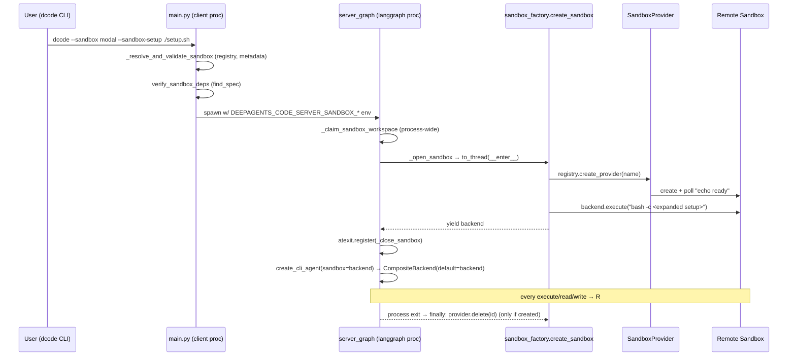
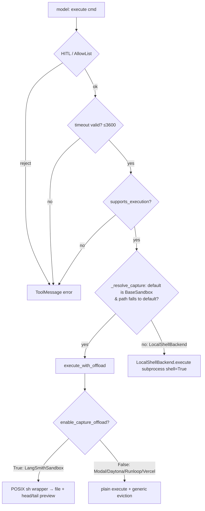

# 08 — 원격 샌드박스·명령 실행 백엔드

dcode의 "명령 실행 백엔드" 영역은 에이전트가 호출하는 `execute`와 파일 도구(`read_file`/`write_file`/`edit_file`/`ls`/`glob`/`grep`)가 **어느 머신에서 실제로 실행되는지** 정합니다. 기본값은 로컬 모드입니다. 이때 SDK의 `LocalShellBackend`가 사용자 호스트에서 `subprocess.run(shell=True)`로 명령을 돌립니다. `--sandbox <provider>`를 주면 LangGraph 서버 프로세스가 기동할 때 원격 샌드박스(LangSmith, AgentCore, Daytona, Modal, Runloop, Vercel, 또는 entry-point나 config로 선언한 프로바이더)를 **서버 프로세스당 하나** 만듭니다. 그 `SandboxBackendProtocol` 객체를 `CompositeBackend`의 default로 꽂으면 모든 도구 호출이 원격으로 갑니다. 이것이 SDK 문서가 말하는 "sandbox as tool" 패턴입니다. dcode가 직접 맡는 부분은 프로바이더 레지스트리(built-in, entry point, config), 자격 증명 해석(워크스페이스 `.env`와 서버 env를 구분해 fail-closed), 수명주기(생성·setup 스크립트·atexit 정리), 그리고 샌드박스에서 쓸 수 없는 기능(Auto 모드, QuickJS `js_eval`)의 차단입니다. 셸 명령을 파일 연산으로 바꾸는 계층(`BaseSandbox`)과 `execute` 도구 자체는 SDK에 맡깁니다. 로컬 파일을 샌드박스로 올리는 자동 동기화는 **없고**, setup 스크립트가 유일한 공식 경로입니다.

---

## 문서가 약속하는 것

**dcode 문서**
- 실행 모델은 "sandbox as tool"입니다. LLM 루프·메모리·도구 디스패치는 로컬에서 돌고, `read_file`/`write_file`/`execute` 등은 원격 샌드박스를 대상으로 합니다. 파일을 샌드박스에 넣으려면 setup 스크립트나 프로바이더 파일 전송 API를 씁니다 (`docs_official/code/remote-sandboxes.md:9`).
- LangSmith는 기본 포함이고, 나머지 built-in은 `/install <name>` 또는 `dcode --install <name>`으로 설치하는 extra입니다. `all-sandboxes`는 built-in 전부를 묶고 E2B 같은 서드파티는 포함하지 않습니다 (`docs_official/code/remote-sandboxes.md:15-97`, `docs_official/code/cli-reference.md:416`).
- 자격 증명은 LangSmith `LANGSMITH_API_KEY`, AgentCore `AWS_*`, Daytona `DAYTONA_API_KEY`, Modal `modal setup`, Runloop `RUNLOOP_API_KEY`, Vercel `VERCEL_TOKEN/PROJECT_ID/TEAM_ID`(또는 Vercel 위에서는 OIDC), E2B `E2B_API_KEY`입니다 (`docs_official/code/remote-sandboxes.md:100-153`).
- 플래그: `--sandbox TYPE`(기본 `none`, 값 없이 주면 `[sandboxes].default`), `--sandbox-id`(기존 샌드박스 재사용, 생성·정리 생략), `--sandbox-snapshot-name`(langsmith/runloop 및 이를 광고하는 프로바이더만, `--sandbox-id`와 함께 쓸 수 없음), `--sandbox-setup PATH` (`docs_official/code/remote-sandboxes.md:204-209`, `docs_official/code/cli-reference.md:469-472`).
- 프로바이더별 작업 디렉터리는 `/root`, `/tmp`, `/home/daytona`, `/workspace`, `/home/user`, `/vercel/sandbox`, E2B `/home/user`입니다. "setup 스크립트와 `execute` 명령은 이 디렉터리에서 실행된다"고 합니다 (`docs_official/code/remote-sandboxes.md:211-221`).
- bare `--sandbox`는 명령행 마지막에 둬야 합니다 (`docs_official/code/remote-sandboxes.md:239-241`).
- 프로바이더 소스는 built-in, entry point(`deepagents_code.sandbox_providers`), config(`[sandboxes.providers]`) 세 가지이고, 이름이 겹치면 **config > entry point > built-in** 순으로 이깁니다 (`docs_official/code/remote-sandboxes.md:245-251`).
- 서드파티 프로바이더가 `metadata` 속성을 오버라이드하면 dcode는 "**인스턴스화 없이**" working dir과 capability를 알 수 있습니다. `metadata`를 생략하면 `/workspace`와 스냅샷 미지원이 기본값입니다 (`docs_official/code/remote-sandboxes.md:275`, `:310`).
- config 키는 `class_path`(필수), `working_dir`(기본 `/workspace`), `package`, `supports_sandbox_id`(기본 true), `supports_snapshot_name`(기본 false), `params`(`get_or_create()`로 전달)입니다. built-in 이름을 덮어써도 의존성 pre-flight 검사는 유지되고, 잘못된 엔트리는 경고 후 건너뜁니다 (`docs_official/code/remote-sandboxes.md:317-362`).
- setup 스크립트 안의 `${VAR}`는 로컬 환경 변수로 확장되고, 비밀은 로컬 `.env`에 둡니다 (`docs_official/code/remote-sandboxes.md:370-389`).
- Auto 승인 모드는 샌드박스가 없는 interactive 세션에서만 쓸 수 있고, `--sandbox`를 주면 Manual로 강제됩니다 (`docs_official/code/approval-modes.md:32`, `:207`).
- `js_eval`(QuickJS REPL)은 "local sessions only"이고 기본은 켜짐입니다 (`docs_official/code/config-file.md:605-621`).
- 샌드박스 모드에서는 extension이 `FilesystemBackend` 계열 route를 직접 마운트할 수 없습니다 (`docs_official/code/extensions.md:108`).
- `[sandboxes].default`는 샌드박스를 강제하지 않습니다. `--sandbox`를 줬을 때만 선택에 쓰입니다 (`docs_official/code/configuration.md:527`).

**SDK 문서**
- 프로바이더가 구현해야 하는 핵심은 `execute()` 하나이고, 나머지 파일 연산은 `BaseSandbox`가 `execute()` 위에 스크립트로 올립니다 (`docs_official/sdk/sandboxes.md:1413-1440`).
- 출력이 크면 자동으로 파일에 저장되고, 에이전트에게 `read_file`로 읽으라고 안내합니다 (`docs_official/sdk/sandboxes.md:1651`).
- 파일 접근은 두 평면으로 나뉩니다. 에이전트 도구는 `execute()`를 거치고, 앱 코드는 `upload_files`/`download_files`(프로바이더 네이티브 API)를 씁니다 (`docs_official/sdk/sandboxes.md:1653-1690`).
- 수명주기는 thread-scoped가 기본이고 assistant-scoped를 고를 수 있습니다 (`docs_official/sdk/sandboxes.md:700-712`).
- 샌드박스 안에 비밀을 넣지 말아야 합니다. context injection으로 유출될 수 있습니다 (`docs_official/sdk/sandboxes.md:2083-2104`).
- `LocalShellBackend`는 격리가 없는 호스트 셸이므로 HITL을 강력히 권장하고, `virtual_mode=True`도 셸 앞에서는 보안이 되지 않습니다 (`docs_official/sdk/backends.md:343-378`).
- 인터프리터(QuickJS)는 같은 프로세스 안의 임베디드 컨텍스트이고 "full production sandbox backend"가 아닙니다. 기본값은 `tool_name="eval"`, `timeout=5.0`, `memory_limit=64MB`, `max_ptc_calls=256`, `max_result_chars=4000`입니다 (`docs_official/sdk/interpreters.md:526-565`).

---

## 코드 지도

| file/symbol | 역할 | 비고 |
|---|---|---|
| `libs/code/deepagents_code/main.py:2716-2749` | `--sandbox`(nargs="?", const=sentinel, default `"none"`), `--sandbox-id`, `--sandbox-snapshot-name`, `--sandbox-setup` argparse 정의 | help 문구는 built-in 목록 포함 |
| `libs/code/deepagents_code/main.py:2921-3003` `_resolve_and_validate_sandbox` | bare `--sandbox`를 `[sandboxes].default`로 해석하고, 모르는 프로바이더를 거부하고, metadata 기반으로 snapshot/id 플래그를 검증 | 클라이언트(앱) 프로세스에서 실행 |
| `libs/code/deepagents_code/main.py:6204-6214` | `verify_sandbox_deps` 호출. 서버 서브프로세스를 띄우기 전에 import 가능 여부를 확인 | 6341-6346에도 동일 |
| `libs/code/deepagents_code/main.py:1197-1216`, `1242-1267` | 인터프리터와 샌드박스 충돌 해석. managed/CLI가 명시하면 종료, 아니면 조용히 off | |
| `libs/code/deepagents_code/_server_config.py:272-305` `_resolve_enable_interpreter` | 샌드박스일 때 인터프리터 기본값을 False로 | |
| `libs/code/deepagents_code/_server_config.py:767-770`, `827-830` | `SANDBOX_TYPE/ID/SNAPSHOT_NAME/SETUP`을 `DEEPAGENTS_CODE_SERVER_*` env로 직렬화·역직렬화 | 접두사 `libs/code/deepagents_code/_env_vars.py:549` |
| `libs/code/deepagents_code/server_graph.py:461-510` | 서버 그래프를 빌드할 때 `create_sandbox` 컨텍스트에 진입하고 atexit에 등록. 예외 종류별로 `sys.exit(1)` | 전역 `_sandbox_cm`, `_sandbox_backend` |
| `libs/code/deepagents_code/server_graph.py:71-94` `_open_sandbox`/`_close_sandbox` | 스레드에서 `__enter__`하고 `asyncio.shield`. 취소되면 완료를 기다린 뒤 닫음 | |
| `libs/code/deepagents_code/server_graph.py:723-743` `_claim_sandbox_workspace` | 프로세스 전역 샌드박스를 첫 워크스페이스가 선점. 다른 워크스페이스는 `WorkspaceConflictError` | |
| `libs/code/deepagents_code/server_graph.py:628-676` `_build_runtime_factory` | 런타임 캐시. "sandbox 생성·atexit 등록은 정확히 한 번" | |
| `libs/code/deepagents_code/integrations/sandbox_provider.py:79-137` `SandboxProvider` | `get_or_create`/`delete` ABC와 `aget_or_create`(to_thread) | |
| `libs/code/deepagents_code/integrations/sandbox_provider.py:42-63` `SandboxProviderMetadata` | `working_dir`, `install`, `supports_sandbox_id=True`, `supports_snapshot_name=False`, `backend_module` | |
| `libs/code/deepagents_code/integrations/sandbox_registry.py:38-79` `BUILTIN_METADATA` | built-in 6종의 working_dir·capability·probe 모듈 | |
| `libs/code/deepagents_code/integrations/sandbox_registry.py:208-331` | `get_metadata`, `create_provider`(config class_path > EP > builtin), `provider_metadata` | |
| `libs/code/deepagents_code/integrations/sandbox_config.py:78-254` `SandboxConfig` | `[sandboxes]` 파싱. managed policy와 user 파일을 합치고 `parse_error`를 노출 | |
| `libs/code/deepagents_code/integrations/sandbox_factory.py:86-182` `create_sandbox` | 생성/연결, setup 스크립트, finally에서 삭제 | 정리 경로는 핵심 설계 포인트 참조 |
| `libs/code/deepagents_code/integrations/sandbox_factory.py:44-83` `_run_sandbox_setup` | `string.Template.safe_substitute(active_environment())` 후 `bash -c` | |
| `libs/code/deepagents_code/integrations/sandbox_factory.py:265-454` `_LangSmithProvider` | 이름으로 스냅샷을 찾고 없으면 빌드. `echo ready` 폴링 | 기본 스냅샷 `deepagents-code`, 이미지 `python:3`, 16GiB |
| `libs/code/deepagents_code/integrations/sandbox_factory.py:457-539` `_DaytonaProvider` | 생성 후 폴링. `sandbox_id`를 주면 `NotImplementedError` | |
| `libs/code/deepagents_code/integrations/sandbox_factory.py:542-668` `_ModalProvider` | 토큰 쌍이 불완전하면 fail-closed. App `deepagents-sandbox`, `workdir="/workspace"` | |
| `libs/code/deepagents_code/integrations/sandbox_factory.py:671-735` `_RunloopProvider` | `langchain_runloop.RunloopProvider`에 위임하고 KeyError를 `SandboxNotFoundError`로 매핑 | |
| `libs/code/deepagents_code/integrations/sandbox_factory.py:814-981` `_AgentCoreProvider` | boto3 세션을 워크스페이스 자격으로 사전 검증. 재연결 불가 | |
| `libs/code/deepagents_code/integrations/sandbox_factory.py:1024-1254` `_VercelProvider` | 자격 3종 전부-아니면-전무 규칙. runtime `python3.13`, 수명 30분 | |
| `libs/code/deepagents_code/integrations/sandbox_factory.py:1277-1317` `verify_sandbox_deps` | `find_spec(metadata.backend_module)` | |
| `libs/code/deepagents_code/agent.py:2979-3012` | 로컬: `LocalShellBackend(inherit_env=False, env=shell_env)` 또는 `FilesystemBackend`. 원격: `backend = sandbox` | |
| `libs/code/deepagents_code/agent.py:3014-3051` | `enable_interpreter`와 샌드박스가 겹치면 ValueError. 로컬이면 `CodeInterpreterMiddleware(tool_name="js_eval")` | |
| `libs/code/deepagents_code/agent.py:3054-3066` | 실행 가능한 backend면 `LocalContextMiddleware`. 허용 목록이 있으면 `ShellAllowListMiddleware` | 샌드박스에도 적용 |
| `libs/code/deepagents_code/agent.py:3095-3173` | 로컬만 artifact/conversation-history route 추가. 샌드박스면 extension route만 둔 `CompositeBackend` | |
| `libs/code/deepagents_code/agent.py:1626-1647` | 시스템 프롬프트: "remote Linux sandbox at `{working_dir}`", 로컬 경로 금지 | |
| `libs/code/deepagents_code/agent.py:2653-2657` | 샌드박스면 Auto를 끄고 Manual HITL | |
| `libs/code/deepagents_code/extensions/hosting.py:112-148` `validate_backend_route` | 샌드박스 활성 시 `FilesystemBackend`(하위 클래스 포함) 마운트를 거부 | |
| `libs/code/deepagents_code/local_context.py:718-728` `LocalContextMiddleware` | git·트리 감지 스크립트를 `backend.execute()`로 실행하므로 샌드박스에서도 동작 | |
| `libs/deepagents/deepagents/backends/protocol.py:870-925` `SandboxBackendProtocol` | `id`, `execute`, `aexecute`(to_thread) | |
| `libs/deepagents/deepagents/backends/protocol.py:946-966` `execute_accepts_timeout` | 시그니처를 검사해 구버전 백엔드와 호환 | |
| `libs/deepagents/deepagents/backends/sandbox.py:1411-1989` `BaseSandbox` | 파일 연산을 `python3 -c` 템플릿과 `execute`로 구현. write는 `upload_files` | 서브클래스는 `execute/upload_files/download_files/id`만 구현 |
| `libs/deepagents/deepagents/backends/sandbox.py:1296-1408`, `1464-1513` | capture-at-source offload 래퍼(POSIX sh)와 `execute_with_offload` | `enable_capture_offload=False` 기본 |
| `libs/deepagents/deepagents/backends/langsmith.py:56-140` `LangSmithSandbox` | `enable_capture_offload=True`, 기본 timeout 30분, async 클라이언트 캐시 | SDK 내장 |
| `libs/deepagents/deepagents/backends/local_shell.py:27-363` `LocalShellBackend` | `subprocess.run(shell=True)`, 120s, 100KB, stdin DEVNULL, 새 세션 | |
| `libs/deepagents/deepagents/backends/composite.py:814-874` | `execute`는 path 라우팅 없이 **항상 default**로 위임 | |
| `libs/deepagents/deepagents/middleware/filesystem.py:1568-1587` `supports_execution` | Composite면 default가 SandboxBackendProtocol인지 확인 | |
| `libs/deepagents/deepagents/middleware/filesystem.py:2880-2919` `_resolve_capture` | offload 경로가 default(BaseSandbox)로 떨어질 때만 capture 허용 | |
| `libs/deepagents/deepagents/middleware/filesystem.py:2959-3053` `_create_execute_tool` | timeout 검증(≤`max_execute_timeout`=3600), capture 또는 plain execute | |
| `libs/partners/{daytona,modal,runloop,vercel}/` | `BaseSandbox` 서브클래스 4종 + `langchain_runloop.RunloopProvider` | AgentCore·E2B 패키지는 저장소에 없음 |
| `libs/partners/quickjs/langchain_quickjs/middleware.py:228-242` | `CodeInterpreterMiddleware.__init__` | dcode 코어 의존성 (`libs/code/pyproject.toml:65`) |
| `libs/code/pyproject.toml:61`, `138-145` | `langsmith[sandbox]` 코어 의존. extra: agentcore/daytona/modal/runloop/vercel/all-sandboxes | |

---

## 동작 흐름

### A. 기동: CLI에서 서버, 서버에서 샌드박스로

1. argparse가 `--sandbox`를 파싱합니다. 값 없이 오면 `_SANDBOX_DEFAULT_SENTINEL`이 들어갑니다 (`libs/code/deepagents_code/main.py:2716-2721`).
2. `_resolve_and_validate_sandbox`가 `SandboxRegistry.load()`를 부르고, sentinel이면 `registry.default`로 치환합니다. `is_available`가 거짓이면 사용 가능 목록과 `/install <pkg> --package` 안내로 에러를 냅니다. 그다음 metadata로 snapshot/id 지원 여부를 검사합니다 (`libs/code/deepagents_code/main.py:2942-3003`).
3. 인터프리터 해석: managed나 CLI 티어가 "켜짐"을 명시했는데 원격 샌드박스면 strict 모드에서 종료하고, 그렇지 않으면 샌드박스 때문에 False가 됩니다 (`libs/code/deepagents_code/main.py:1197-1216`). 조용히 꺼진 경우 stderr나 TUI toast로 알립니다 (`libs/code/deepagents_code/main.py:1458-1493`, `libs/code/deepagents_code/app.py:4987-5019`).
4. 서버를 띄우기 전에 `verify_sandbox_deps(args.sandbox)`로 `find_spec`을 검사하고, 실패하면 설치 힌트와 함께 `sys.exit(1)`합니다 (`libs/code/deepagents_code/main.py:6204-6214`, `libs/code/deepagents_code/integrations/sandbox_factory.py:1292-1317`).
5. `ServerConfig.to_env()`가 `DEEPAGENTS_CODE_SERVER_SANDBOX_TYPE/ID/SNAPSHOT_NAME/SETUP`을 설정하고, 서버 쪽 `from_env()`가 이를 복원합니다. `"none"`은 None으로 정규화됩니다 (`libs/code/deepagents_code/_server_config.py:662-663`, `767-770`, `827-830`).
6. 서버의 `make_graph`에서 `get_server_runtime()`, `_claim_sandbox_workspace()`, `_get_runtime()`, `_make_graphs()` 순으로 들어갑니다 (`libs/code/deepagents_code/server_graph.py:851-906`).
7. `_make_graphs`는 `config.sandbox_type`이 있으면 `_open_sandbox(lambda: create_sandbox(...))`를 부르고, 성공하면 `atexit.register(_close_sandbox, context)`합니다. `ImportError`/`NotImplementedError`/`ValueError`/기타 예외마다 메시지를 달리해 `sys.exit(1)`합니다 (`libs/code/deepagents_code/server_graph.py:467-510`).
8. `create_sandbox` 단계:
   - registry 로드, snapshot 제약 검증 (`libs/code/deepagents_code/integrations/sandbox_factory.py:121-136`)
   - `create_provider(name)`: config `class_path` > entry point > built-in 순 (`libs/code/deepagents_code/integrations/sandbox_registry.py:276-295`)
   - `should_cleanup = sandbox_id is None`. config `params`와 `snapshot`을 kwargs로 병합 (`libs/code/deepagents_code/integrations/sandbox_factory.py:143-148`)
   - `provider.get_or_create(...)`. 각 프로바이더는 `echo ready` 폴링 등으로 준비 완료를 확인 (`libs/code/deepagents_code/integrations/sandbox_factory.py:372-386`, `519-532`, `641-658`)
   - setup 스크립트 실행 (`libs/code/deepagents_code/integrations/sandbox_factory.py:160-161`)
   - `yield backend`. finally에서 `should_cleanup`이면 `provider.delete(sandbox_id=backend.id)` (`libs/code/deepagents_code/integrations/sandbox_factory.py:163-182`)
9. `create_cli_agent(sandbox=sandbox_backend, sandbox_type=...)`를 호출하고, 이때 `auto_mode_enabled = interactive and sandbox_backend is None`입니다 (`libs/code/deepagents_code/server_graph.py:516`, `528-569`).
10. `create_cli_agent` 안에서 `backend = sandbox`가 되고 (`libs/code/deepagents_code/agent.py:3010`), 인터프리터가 겹치면 ValueError를 냅니다 (`:3014-3021`). `LocalContextMiddleware`가 샌드박스에서 감지 스크립트를 돌리고 (`:3054-3062`), `CompositeBackend(default=sandbox, routes=extension_routes)`가 만들어집니다 (`:3154-3158`).



### B. `execute` 한 번의 경로

1. 모델이 `execute(command, timeout?)`를 호출합니다. HITL `interrupt_on`의 `execute` 항목이 approve/reject를 요구하는데, 샌드박스 모드에서도 같은 맵을 씁니다 (`libs/code/deepagents_code/agent.py:2191-2240`).
2. `ShellAllowListMiddleware`가 활성이면 허용 목록 밖의 명령을 거절 ToolMessage로 바꿉니다 (`libs/code/deepagents_code/agent.py:821-893`, `:3065-3066`).
3. SDK `sync_execute`/`async_execute`가 timeout 음수이거나 `max_execute_timeout`을 넘으면 에러를 반환합니다 (`libs/deepagents/deepagents/middleware/filesystem.py:2972-2986`, 기본 3600은 `:1756`).
4. `supports_execution(backend)`가 거짓이면 에러를 냅니다 (`libs/deepagents/deepagents/middleware/filesystem.py:2991-3001`).
5. timeout을 줬는데 백엔드 `execute` 시그니처에 `timeout`이 없으면 에러를 냅니다 (`libs/deepagents/deepagents/middleware/filesystem.py:3006-3016`).
6. `_resolve_capture`: default가 `BaseSandbox`이고 offload 경로가 default로 떨어지면 `execute_with_offload`를 쓰고, 아니면 plain `execute`를 씁니다 (`libs/deepagents/deepagents/middleware/filesystem.py:3017-3031`).
7. `CompositeBackend.execute`는 항상 `default.execute`로 갑니다 (`libs/deepagents/deepagents/backends/composite.py:814-867`). 그 뒤로는 프로바이더 SDK 호출입니다. 예를 들어 Modal은 `sandbox.exec("bash","-c",cmd)`를 부릅니다 (`libs/partners/modal/langchain_modal/sandbox.py:94-95`).



### C. 로컬 모드

- `enable_shell`이 참이면 `shell_env = dict(environment)`에 `GIT_TERMINAL_PROMPT=0`를 넣고, 사용자 LangSmith env를 복원하고, `PYTHONPATH`를 relay한 뒤 `LocalShellBackend(root_dir, virtual_mode=False, inherit_env=False, env=shell_env)`를 만듭니다 (`libs/code/deepagents_code/agent.py:2982-3004`, `:2278-2292`).
- `enable_shell`이 거짓이면 `FilesystemBackend`만 두고 `execute` 도구는 없습니다 (`libs/code/deepagents_code/agent.py:3005-3007`).
- SDK 실행 세부: 빈 명령은 exit 1, timeout 120s(`DEFAULT_EXECUTE_TIMEOUT`), `stdin=DEVNULL`, `start_new_session`, stderr 줄마다 `[stderr]` 접두사, 100,000자를 넘으면 truncate, 0이 아닌 종료 코드는 본문에 `Exit code: N`을 붙이고, timeout은 exit 124입니다 (`libs/deepagents/deepagents/backends/local_shell.py:23`, `291-363`).

---

## 핵심 설계 포인트

### 1. 샌드박스는 "스레드"가 아니라 "서버 프로세스" 단위
SDK 문서의 기본값은 thread-scoped입니다 (`docs_official/sdk/sandboxes.md:708`). dcode는 서버 프로세스마다 샌드박스 하나를 만들고 캐시하며, 워크스페이스 하나에만 허용합니다.

```python
# libs/code/deepagents_code/server_graph.py:728-743
if not sandbox_type:
    return
if _sandbox_workspace_id is None:
    _sandbox_workspace_id = binding.workspace_id
    return
if _sandbox_workspace_id == binding.workspace_id:
    return
reason = ("a runtime for another workspace already exists and the configured "
          "sandbox is process-wide")
```
결과적으로 한 dcode 세션 안의 모든 스레드(`/threads` 전환 포함)가 같은 원격 파일시스템을 공유합니다. 캐시가 필요한 이유도 "per request로 빌드하면 sandbox 세션이 샙니다"라고 명시되어 있습니다 (`libs/code/deepagents_code/server_graph.py:633-636`).

### 2. setup 스크립트가 실패하면 샌드박스가 정리되지 않음 (코드 구조상)
`_run_sandbox_setup`은 `try:`/`finally:` **바깥**에서 실행됩니다.

```python
# libs/code/deepagents_code/integrations/sandbox_factory.py:152-166
backend = provider_obj.get_or_create(sandbox_id=sandbox_id, **provider_kwargs)
...
if setup_script_path:
    _run_sandbox_setup(backend, setup_script_path)   # RuntimeError / FileNotFoundError 가능
try:
    yield backend
finally:
    if should_cleanup:
        ...provider_obj.delete(sandbox_id=backend.id)
```
setup이 0이 아닌 코드로 끝나면 `RuntimeError("Setup failed - aborting")`(`:77-81`)가 제너레이터 밖으로 나갑니다. `_open_sandbox`의 `__enter__`에서 예외가 나므로 context를 받지 못하고, `_close_sandbox`도 atexit도 등록되지 않습니다 (`libs/code/deepagents_code/server_graph.py:78-84`, `484`). 따라서 **새로 만든 원격 샌드박스가 남아 과금이 계속될 수 있습니다**. 프로바이더 내부 TTL이 있는지는 확인하지 못했습니다(추정). 스크립트 경로가 없을 때도 생성 뒤에 검사하므로 같은 누수가 생깁니다 (`:55-58`).

### 3. setup 스크립트의 `$VAR` 확장은 `${VAR}`만이 아니라 `$VAR`까지 로컬 값으로 치환
`string.Template.safe_substitute`는 `${name}`과 `$name`을 모두 치환합니다(Python 표준 동작). 입력은 `active_environment()`, 즉 워크스페이스 `.env` 스냅샷이고 필요하면 서버 `os.environ`으로 폴백합니다 (`libs/code/deepagents_code/integrations/sandbox_factory.py:67-72`, 폴백 설명 `:741-745`). 문서 예시의 `git clone ... $HOME/workspace`와 `cd $HOME/workspace`(`docs_official/code/remote-sandboxes.md:377-384`)는 `HOME`이 로컬 env에 있으면 **로컬 홈 경로(`/Users/...`)로 바뀐 채** 샌드박스로 보내질 가능성이 큽니다(추정. `active_environment`에 HOME이 포함되는지는 config.py를 따로 확인해야 함). `<<'EOF'`로 셸 확장을 막으려는 의도도 전송 전 Python 치환에는 효과가 없습니다. 이 치환 때문에 비밀이 스크립트 본문에 평문으로 박혀 원격 `bash -c` 인자로 전달됩니다 (`:75`).

### 4. 자격 증명의 "워크스페이스 vs 서버" fail-closed 규칙
서버 하나가 여러 워크스페이스를 섬기므로 `.env`에 일부만 둔 자격을 서버 env로 조용히 보충하면 "권한 치환"이 됩니다. 이를 막으려고 프로바이더마다 부분 설정을 거부합니다.
- Modal: `MODAL_TOKEN_ID`/`SECRET` 중 하나만 있으면 ValueError (`libs/code/deepagents_code/integrations/sandbox_factory.py:577-589`)
- AWS: key/secret 짝, 토큰만 있는 경우를 검사하고, workspace 자격이 서버 자격과 다르면서 세션 생성에 실패하면 ValueError (`:785-811`, `:876-886`)
- Vercel: 세 값이 모두 서버 env와 같으면 SDK에 위임하고, 일부만 있거나 섞여 있으면 거부 (`:1078-1130`)

```python
# libs/code/deepagents_code/integrations/sandbox_factory.py:1078-1082
if all(
    value == (os.environ.get(cls._CREDENTIAL_ENV_NAMES[key]) or None)
    for key, value in values.items()
):
    return {}
```
모든 조회는 `resolve_env_var`를 거치므로 `DEEPAGENTS_CODE_<NAME>` 접두 오버라이드가 먼저 적용됩니다 (`:286-294`, `:469-474`, `:683-689`).

### 5. 파일 연산 = `execute` 위의 `python3 -c` 스크립트
`BaseSandbox`의 ls/read/grep/glob/edit은 `python3 -c "..."` 템플릿을 `execute`로 실행합니다 (`libs/deepagents/deepagents/backends/sandbox.py:51`, `376`, `457`, `493`, `655`, 클래스 docstring `:1411-1431`). write만 preflight(`execute`) 뒤에 `upload_files`를 씁니다 (`:1596-1623`). 그래서 **샌드박스 이미지에 `python3`가 없으면 파일 도구 대부분이 동작하지 않습니다**(추정. 템플릿 의존성에서 도출). 기본 이미지가 `python:3`(LangSmith `sandbox_factory.py:258`, Runloop `provider.py`의 `FROM python:3`)이고 Vercel runtime이 `python3.13`(`sandbox_factory.py:1004`)인 것도 이 의존성과 맞아떨어집니다.

### 6. capture-at-source offload는 LangSmith만 켜짐
`BaseSandbox.enable_capture_offload = False`가 기본입니다 (`libs/deepagents/deepagents/backends/sandbox.py:1433`). 저장소 전체에서 `True`로 두는 곳은 `LangSmithSandbox` 하나입니다 (`libs/deepagents/deepagents/backends/langsmith.py:61`). 나머지 파트너 백엔드는 전체 출력을 에이전트 프로세스로 가져온 뒤 일반 eviction을 거칩니다. Modal/Runloop/Daytona는 `truncated=False`를 고정으로 반환하고 크기 제한도 두지 않습니다 (`libs/partners/modal/langchain_modal/sandbox.py:97-107`, `libs/partners/runloop/langchain_runloop/sandbox.py:49-60`, `libs/partners/daytona/langchain_daytona/sandbox.py:125-134`). Vercel만 `MAX_OUTPUT_BYTES`에서 자릅니다 (`libs/partners/vercel/langchain_vercel_sandbox/sandbox.py:117-121`). stderr 표기도 백엔드마다 다릅니다: `[stderr] `(local), `<stderr>…</stderr>`(Daytona/Vercel), 개행 연결(Modal/Runloop).

### 7. 샌드박스 모드에서 꺼지거나 바뀌는 기능
- Auto(분류기 승인)는 강제로 Manual이 됩니다 (`libs/code/deepagents_code/agent.py:2653-2657`, `libs/code/deepagents_code/server_graph.py:516`).
- QuickJS `js_eval`은 세 겹으로 막힙니다. CLI 해석(`main.py:1197-1216`), 서버 기본값(`_server_config.py:291-294`), 에이전트 빌드의 ValueError(`agent.py:3014-3021`).
- conversation-history, large_tool_results 로컬 route가 없습니다. `artifacts_root`가 None이라 offload 이력이 **샌드박스 FS**에 쓰이고 샌드박스와 함께 사라집니다 (`libs/code/deepagents_code/agent.py:3095-3160`, `libs/code/THREAT_MODEL.md:176`, `:208-211`).
- extension route로 `FilesystemBackend`(따라서 `LocalShellBackend`도)를 마운트하면 거부됩니다. 검사는 얕은 `isinstance`라서 래퍼는 통과합니다 (`libs/code/deepagents_code/extensions/hosting.py:120-148`).
- goal criteria와 rubric grader는 샌드박스 backend를 working_dir 루트로 읽습니다 (`libs/code/deepagents_code/agent.py:3263-3266`, `:3327-3329`).
- 스킬 로더는 샌드박스여도 **로컬** `FilesystemBackend(virtual_mode=False)`를 씁니다 (`libs/code/deepagents_code/agent.py:2968-2973`). 스킬 파일은 호스트에서 읽고 실행은 원격이라는 비대칭이 생깁니다.

### 8. 기동 취소 안전성
LangGraph 서버가 기동 중 취소돼도 샌드박스 생성 스레드는 계속 돕니다. 그래서 `asyncio.shield`로 완료를 기다린 뒤 닫습니다.

```python
# libs/code/deepagents_code/server_graph.py:82-94
task = asyncio.create_task(asyncio.to_thread(_enter))
try:
    return await asyncio.shield(task)
except asyncio.CancelledError:
    try:
        context, _ = await asyncio.shield(task)
    except BaseException:
        logger.debug(...)
    else:
        await asyncio.to_thread(_close_sandbox, context)
    raise
```
정리는 `atexit`에만 의존하므로 SIGKILL이나 크래시 때는 삭제되지 않을 수 있습니다(추정, Python atexit 의미론).

### 9. 로컬 셸 env 큐레이션
`inherit_env=False`에 완성된 `shell_env`를 넘겨 "carrier vars와 agent-only LangSmith credentials 부활"을 막습니다 (`libs/code/deepagents_code/agent.py:2996-3004`). 서버 인터프리터에서 떼어낸 `PYTHONPATH`는 approval-gated `execute`에만 다시 붙입니다 (`:2278-2292`).

---

## 문서 ↔ 코드 대조

| 항목 | 문서 | 코드 | 판정 |
|---|---|---|---|
| 프로바이더 우선순위 | config > EP > built-in (`remote-sandboxes.md:251`) | `create_provider` config→EP→builtin (`sandbox_registry.py:276-289`) | 일치 |
| 서드파티 metadata "인스턴스화 없이" | `remote-sandboxes.md:275` | EP 프로바이더는 `provider_metadata`가 **인스턴스를 생성**해 metadata를 읽음 (`sandbox_registry.py:320-326`). CLI 검증(`main.py:2991`)과 `verify_sandbox_deps`(`sandbox_factory.py:1295`)에서 호출되므로 클라이언트 프로세스에서 생성자(자격 검사 포함)가 돎 | 불일치 |
| metadata 생략 시 기본값 | `/workspace`, 스냅샷 미지원 (`remote-sandboxes.md:310`) | `sandbox_registry.py:127`, `sandbox_provider.py:56-57`. `supports_sandbox_id=True`는 문서에 없음 | 일치(부분 누락) |
| `--sandbox-id` 지원 | "reattach 지원 프로바이더만" (`remote-sandboxes.md:207`) | Daytona metadata는 기본 `supports_sandbox_id=True`(`sandbox_registry.py:46-51`)라 CLI 검증을 통과하지만 `_DaytonaProvider`가 `NotImplementedError`(`sandbox_factory.py:510-515`)를 내고 서버가 "not supported"로 종료(`server_graph.py:493-498`). AgentCore는 metadata False라 CLI에서 거부 | 불일치(Daytona) |
| snapshot 지원 | langsmith, runloop (`remote-sandboxes.md:208`) | `sandbox_registry.py:56`, `:68`. id와 함께 쓰면 ValueError (`sandbox_factory.py:131-136`) | 일치 |
| 작업 디렉터리 표 | 6+1종 (`remote-sandboxes.md:213-221`) | `BUILTIN_METADATA` 값 동일 (`sandbox_registry.py:38-79`). E2B는 저장소에 없음 | 일치(E2B 검증 불가) |
| "setup·execute가 working dir에서 실행" | `remote-sandboxes.md:211` | working_dir는 시스템 프롬프트(`agent.py:1627-1647`)와 grader 루트에만 쓰임. setup은 `bash -c`만 하고 `cd`하지 않음(`sandbox_factory.py:75`). Modal만 `workdir="/workspace"`로 생성(`:638-639`). 나머지는 프로바이더 기본 cwd에 의존 | 불일치(추정: 우연히 일치하는 프로바이더 존재) |
| setup `${VAR}` 확장 소스 | "로컬 환경 변수·로컬 `.env`" (`remote-sandboxes.md:389`) | 워크스페이스 `active_environment()` 스냅샷, `$VAR` 형태도 치환 (`sandbox_factory.py:67-72`) | 부분 불일치(`$VAR` 치환이 문서에 없음) |
| setup 실패 시 정리 | 언급 없음 | 누수 가능 (설계 포인트 2) | 코드에만 있음(버그 성격) |
| `--sandbox-id` 시 정리 생략 | `remote-sandboxes.md:207` | `should_cleanup = sandbox_id is None` (`sandbox_factory.py:143`) | 일치 |
| 잘못된 config 엔트리 | "경고 후 skip" (`remote-sandboxes.md:362`) | 테이블이 아니면 skip(`sandbox_config.py:37-45`). `class_path` 누락은 경고만 하고 엔트리는 유지(`:220-225`)되어 `is_available`은 참. 생성 시 ValueError로 서버 종료(`sandbox_registry.py:278-281`, `server_graph.py:499-504`) | 불일치 |
| 설치 명령 | `dcode --install <name>` (`remote-sandboxes.md:28-30`) | 에러 메시지는 `dcode install <name>`(`sandbox_provider.py:37`). `install` 서브커맨드(`main.py:2409`)와 `--install` 플래그(`main.py:2841`)가 둘 다 있음 | 일치(표기 차이) |
| LangSmith 자격 | `LANGSMITH_API_KEY` (`remote-sandboxes.md:104`) | `LANGSMITH_SANDBOX_API_KEY` > `LANGSMITH_API_KEY` > `LANGCHAIN_API_KEY`, 모두 `DEEPAGENTS_CODE_` 접두 가능 (`sandbox_factory.py:286-301`) | 코드에만 있음 |
| LangSmith 스냅샷 env | 없음 | `LANGSMITH_SANDBOX_SNAPSHOT_ID`(최우선), `LANGSMITH_SANDBOX_SNAPSHOT_NAME`, 기본 `deepagents-code`/`python:3`/16GiB, config `params`의 `snapshot_image`, `fs_capacity_bytes`, `timeout`=180 (`sandbox_factory.py:255-262`, `304-362`) | 코드에만 있음 |
| Runloop 블루프린트 env | 없음 | `RUNLOOP_SANDBOX_BLUEPRINT_ID` > `snapshot` > `RUNLOOP_SANDBOX_BLUEPRINT_NAME`, `blueprint_dockerfile` 기본 `FROM python:3` (`libs/partners/runloop/langchain_runloop/provider.py` get_or_create docstring 및 `:194-205`) | 코드에만 있음 |
| Daytona URL | 없음 | `DAYTONA_API_URL` (`sandbox_factory.py:479`) | 코드에만 있음 |
| Modal 인증 | `modal setup` (`remote-sandboxes.md:127`) | `MODAL_TOKEN_ID`+`MODAL_TOKEN_SECRET`(부분 설정은 fail-closed), 없으면 기본 Modal 인증 (`sandbox_factory.py:562-591`) | 코드에만 있음(확장) |
| AgentCore 리전 기본값 | `AWS_REGION="us-west-2"` 예시 | 없으면 `us-west-2` 폴백 (`sandbox_factory.py:842`) | 일치 |
| Vercel 수명·런타임 | 없음 | 새 샌드박스 `timeout=30분`, `python3.13` (`sandbox_factory.py:1004-1008`) | 코드에만 있음 |
| Vercel OIDC | "Vercel에서 실행 시 자동" (`remote-sandboxes.md:144`) | 서버 env와 모두 같으면 SDK에 위임 (`sandbox_factory.py:1069-1082`) | 일치 |
| Auto 차단 | `approval-modes.md:32`, `:207` | `agent.py:2653-2657`, `server_graph.py:516`, `app.py:4949-4953` | 일치 |
| `js_eval` 로컬 전용 | `config-file.md:621` | 3중 차단(설계 포인트 7). managed/CLI가 명시하면 **실행 거부**(`main.py:1212`, `:1259-1264`) | 일치(거부 동작은 코드에만) |
| QuickJS "sandbox" 표현 | dcode `config-file.md:607` "QuickJS sandbox" vs SDK `interpreters.md:526-538` "full sandbox 아님, same-process" | `CodeInterpreterMiddleware`는 in-process (`agent.py:3041-3051`) | 문서 간 불일치 |
| 인터프리터 기본값 | SDK `tool_name="eval"` (`interpreters.md:558`) | dcode는 `tool_name="js_eval"` 고정, ptc 기본 `"safe"` (`agent.py:3044`, `config_manifest.py:72-78`) | 일치(dcode 재정의) |
| extension FS 마운트 거부 | `extensions.md:108` | `hosting.py:144-148` | 일치 |
| 수명 스코프 | SDK: thread-scoped 기본 (`sandboxes.md:708`) | dcode: 서버 프로세스·단일 워크스페이스 스코프 (`server_graph.py:461-466`, `723-743`) | 불일치(설계 차이, dcode 문서엔 미기술) |
| 대용량 출력 파일화 | SDK `sandboxes.md:1651` | capture offload는 LangSmith만 (`langsmith.py:61`). 나머지는 일반 eviction | 부분 일치 |
| 서버 env 접두사 | repo `THREAT_MODEL.md:66`, `:272` "`DA_SERVER_*`" | `DEEPAGENTS_CODE_SERVER_` (`_env_vars.py:549`) | 불일치(repo 개발 문서 드리프트) |
| THREAT_MODEL 프로바이더 목록 | Daytona/LangSmith/Modal/Runloop/AgentCore (`THREAT_MODEL.md:144`, `:607`) | Vercel 포함 6종 (`sandbox_registry.py:71-78`) | 불일치(Vercel 누락) |
| 로컬 셸 기본 | SDK `LocalShellBackend(virtual_mode=True)` 예시 (`backends.md:392`) | dcode는 `virtual_mode=False`, `inherit_env=False`에 큐레이트 env (`agent.py:2999-3004`) | 일치(dcode 선택) |

---

## dcode ↔ SDK 경계

| 관심사 | dcode가 추가 | SDK에 위임 |
|---|---|---|
| 실행 프로토콜 | `_ExecutableBackend`/`_AsyncExecutableBackend` 런타임 Protocol로 LocalContext 적용 여부만 판단 (`libs/code/deepagents_code/local_context.py:230-247`) | `SandboxBackendProtocol.execute/aexecute/id` (`libs/deepagents/deepagents/backends/protocol.py:870-925`), `execute_accepts_timeout` (`:946-966`) |
| 파일 연산 over shell | 없음 | `BaseSandbox` 템플릿 전부 (`libs/deepagents/deepagents/backends/sandbox.py:1411-1989`) |
| `execute` 도구 | 설명 문구·HITL 설명 포매터 (`libs/code/deepagents_code/agent.py:1815-1827`), `ShellAllowListMiddleware` (`:821-893`) | 도구 생성·timeout 검증·capture offload (`libs/deepagents/deepagents/middleware/filesystem.py:2959-3053`, `2880-2919`) |
| 라우팅 | extension·artifact route 구성, 샌드박스면 host FS 마운트 거부 (`libs/code/deepagents_code/agent.py:3095-3160`, `libs/code/deepagents_code/extensions/hosting.py:144`) | `CompositeBackend` (execute는 항상 default) (`libs/deepagents/deepagents/backends/composite.py:814-874`) |
| 로컬 셸 | env 큐레이션(`GIT_TERMINAL_PROMPT`, LangSmith 복원, PYTHONPATH relay) (`libs/code/deepagents_code/agent.py:2982-3004`) | `LocalShellBackend` subprocess 구현 (`libs/deepagents/deepagents/backends/local_shell.py:216-363`) |
| 프로바이더 수명주기 | `SandboxProvider` ABC, 레지스트리, config, 6개 built-in 프로바이더 클래스, 폴링, 정리 (`libs/code/deepagents_code/integrations/*`) | SDK에는 수명주기 추상화가 없음(추정: `backends/`에 provider/factory 모듈 없음). SDK 문서는 앱이 직접 관리하게 함 (`docs_official/sdk/sandboxes.md:700-712`) |
| 백엔드 구현 | 없음 | `LangSmithSandbox`는 SDK 내장 (`libs/deepagents/deepagents/backends/langsmith.py:56`). Daytona/Modal/Runloop/Vercel은 `libs/partners/*`의 `BaseSandbox` 서브클래스. Runloop만 수명주기(`RunloopProvider`)까지 파트너 패키지에 있고 (`libs/partners/runloop/langchain_runloop/provider.py`), 나머지 수명주기는 dcode `sandbox_factory.py`에 있음 |
| 서버 기동 | 프로세스 전역 캐시·워크스페이스 선점·atexit·취소 안전 (`libs/code/deepagents_code/server_graph.py:71-94`, `461-510`, `723-743`) | — |
| 인터프리터 | 샌드박스 배타 정책, `js_eval` 이름, PTC 해석 (`libs/code/deepagents_code/agent.py:3014-3051`) | `langchain_quickjs.CodeInterpreterMiddleware` (`libs/partners/quickjs/langchain_quickjs/middleware.py:228-242`). SDK 코어가 아니라 파트너 패키지 |
| 패키징 | extras `agentcore/daytona/modal/runloop/vercel/all-sandboxes`, `quickjs=[]` 호환 extra (`libs/code/pyproject.toml:138-151`), `SANDBOX_EXTRAS` (`libs/code/deepagents_code/extras_info.py:1029-1031`) | 파트너 pyproject에는 `deepagents_code.sandbox_providers` entry point가 없음(grep 결과 없음). built-in은 dcode가 하드와이어 |

---

## 더 볼 거리

1. **setup 실패 누수 재현**: `_run_sandbox_setup`을 `try` 안으로 옮기면 해결되는지, 이것이 의도인지(디버깅용으로 남겨두기) 이슈나 테스트(`libs/code/tests/**/test_sandbox_factory*`)를 확인할 필요가 있습니다.
2. **`$HOME` 치환 실측**: `active_environment()`가 `HOME`을 포함하는지 `libs/code/deepagents_code/config.py`에서 확인하고, 문서 예제가 실제로 로컬 경로로 치환되는지 테스트로 검증합니다.
3. **Daytona `--sandbox-id`**: `BUILTIN_METADATA["daytona"]`에 `supports_sandbox_id=False`를 두지 않은 게 누락인지 확인합니다. AgentCore와 비교할 대상입니다.
4. **EP metadata 인스턴스화 비용**: `provider_metadata`가 CLI 검증 단계에서 서드파티 생성자(네트워크·자격 검사)를 부르는지, 실패하면 `/workspace`로 폴백해 잘못된 working_dir이 프롬프트에 들어갈 위험이 있는지 봅니다.
5. **Vercel 30분 수명**: 긴 세션에서 샌드박스가 만료되면 에이전트 도구 에러가 어떻게 보이는지, 재생성 경로가 없는지 확인합니다 (`sandbox_factory.py:1007`).
6. **스레드 전환과 공유 FS**: 프로세스 단위 샌드박스라서 `/threads`로 다른 스레드를 resume하면 이전 스레드가 만든 파일이 섞입니다. offload history 경로(`/conversation_history/session_*.md`)가 다른 스레드에 노출되는지 봅니다.
7. **python3 의존성**: AgentCore Code Interpreter 이미지에 `python3`와 POSIX 셸이 있는지, `langchain_agentcore_codeinterpreter.AgentCoreSandbox`(저장소 밖)가 `BaseSandbox`를 상속하는지 확인합니다.
8. **스킬 로컬/실행 원격 비대칭**: 스킬의 스크립트 경로를 샌드박스에서 실행하려 할 때 실패하는지 확인합니다 (`agent.py:2968-2973`).
9. **서브에이전트 backend**: 커스텀 서브에이전트와 async 서브에이전트가 같은 `composite_backend`(샌드박스)를 공유하는지 SDK `graph.py`의 subagent backend 전달 경로에서 확인합니다(이번 분석에서는 미확인).
10. **Runloop 기본 timeout**: `RunloopSandbox._default_timeout` 값과 `timeout` 인자가 "unused"인 점(`sandbox_factory.py:706-708`)이 준비 대기에 미치는 영향을 확인합니다.
11. **managed `[sandboxes]` 병합**: `sandbox_config.py:161-165`의 `section` 선택(managed 우선)과 resolver의 DEEP_MERGE(`config_manifest.py` `sandboxes.providers`)가 user 프로바이더를 가리는지 봅니다.
12. **repo 개발 문서 드리프트**: THREAT_MODEL의 `DA_SERVER_*`, Vercel 누락 등을 `libs/code/THREAT_MODEL.md` 갱신 이력과 대조합니다.
