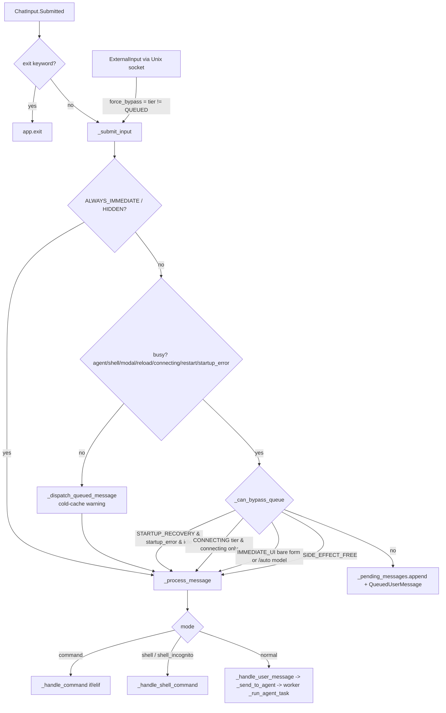
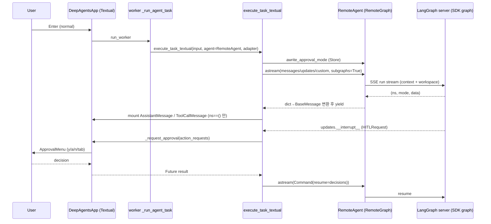
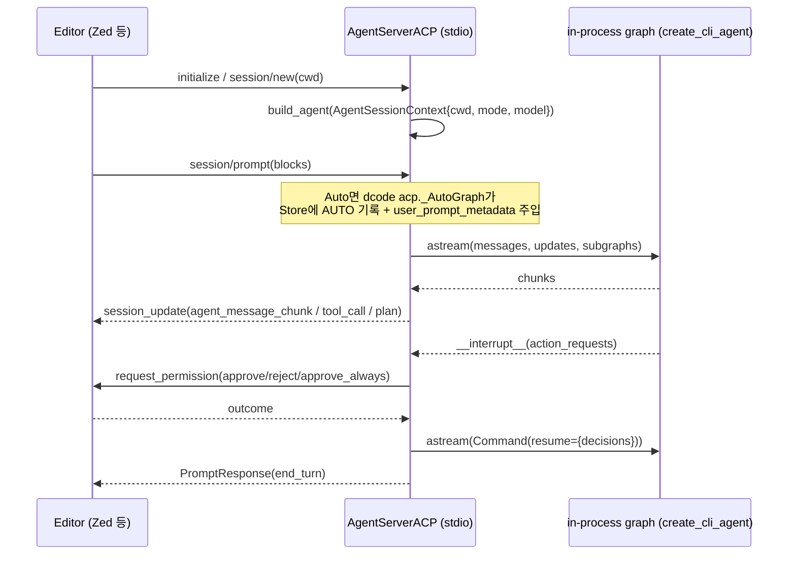

# 09 — 인터랙티브 TUI(Textual) · app.py · 슬래시 커맨드 · ACP 모드

dcode의 "얼굴"에 해당하는 영역이다. `dcode`를 인자 없이 실행하면 Textual 기반 `DeepAgentsApp`(`libs/code/deepagents_code/app.py:3117`)이 뜬다. 이 앱은 입력을 받아 **모드(normal / command / shell / shell_incognito)** 로 라우팅하고, 바쁠 때는 **바이패스 티어(BypassTier)** 정책에 따라 큐에 넣거나 즉시 실행한다. 에이전트 턴은 Textual worker에서 `execute_task_textual`(`libs/code/deepagents_code/tui/textual_adapter.py:1574`)로 돌린다. 이 함수는 별도 프로세스인 LangGraph 서버에 `RemoteAgent.astream`(`libs/code/deepagents_code/client/remote_client.py:482`)으로 붙어 `(namespace, mode, data)` 3-튜플 스트림을 받고, 이를 위젯 마운트·스피너·승인 메뉴·`Command(resume=...)` 재개로 바꾼다. 슬래시 커맨드 메타데이터는 `command_registry.py` 한 곳에 선언되고, 실제 동작은 `app.py`의 거대한 `if/elif` 디스패처(`app.py:16503`)에 있다. 한편 `--acp` 모드는 TUI를 전혀 띄우지 않는다. 별도 라이브러리 `deepagents-acp`의 `AgentServerACP`를 stdio로 실행해 에디터(Zed 등)와 통신하며, **서버 서브프로세스 없이 그래프를 in-process로 빌드**한다(`libs/code/deepagents_code/main.py:3606`).

---

## 문서가 약속하는 것

- 인터랙티브 모드에서 쓰는 슬래시 커맨드 목록과 각 설명: `/model`, `/effort`, `/agents`, `/auth`, `/goal`, `/rubric`, `/remember`, `/skill:<name>`, `/skill-creator`, `/offload`(alias `/compact`), `/context`, `/context-doctor`, `/tools`, `/extensions`, `/cost`, `/tokens`, `/clear`, `/force-clear`, `/copy`, `/prompts`, `/threads`, `/mcp`, `/plugins`, `/notifications`, `/reload`, `/theme`, `/scrollbar`, `/line-numbers`, `/update`, `/auto-update`, `/install`, `/trace`, `/editor`, `/restart`, `/timestamps`, `/changelog`, `/docs`, `/feedback`, `/version`(alias `/about`), `/help`, `/quit` — `docs_official/code/quickstart.md:53-97`
- `!`를 입력하면 셸 모드로 들어간다 — `docs_official/code/quickstart.md:102`
- 단축키: `Shift+Enter`/`Ctrl+J`/`Alt+Enter`/`Ctrl+Enter` 줄바꿈, `@filename` 파일 자동완성·내용 주입, `Shift+Tab` 승인 모드 순환, `Ctrl+G` 외부 에디터, `Ctrl+T` 서브에이전트 패널, `Ctrl+N` 알림, `Ctrl+O` 최근 툴 출력 펼치기, `Escape` 인터럽트, `Ctrl+C` 인터럽트/종료, `Ctrl+D` 종료 — `docs_official/code/quickstart.md:117-126`
- `Ctrl+R`로 프롬프트 히스토리를 인라인 검색한다 — `docs_official/code/quickstart.md:143`
- 외부 에디터는 `$VISUAL` → `$EDITOR` → `vi`/`notepad` 순으로 찾고, GUI 에디터에는 `--wait`를 붙인다 — `docs_official/code/quickstart.md:172`
- `Shift+Tab` 순환 순서는 YOLO → Manual → Auto → YOLO이고, `startup.yolo_switcher = false`이면 YOLO가 빠진다 — `docs_official/code/approval-modes.md:72`
- `/extensions`는 `DEEPAGENTS_CODE_EXPERIMENTAL=1`이 필요하다 — `docs_official/code/cli-reference.md:290`
- `/tools`, `/extensions`, `/context-doctor`, `/cost`는 읽기 전용 진단 커맨드다 — `docs_official/code/cli-reference.md:286`
- `--acp`: "Run as an ACP server over stdio instead of launching the interactive UI" — `docs_official/code/cli-reference.md:481`
- `-y/--auto-approve`는 "Requires an interactive local session"이고, `--yolo`는 "Interactive mode only"다 — `docs_official/code/cli-reference.md` 옵션 표(`--acp` 행 부근, 437-488 구간)
- `/theme` 선택기에서 실시간 미리보기 후 `Enter`를 누르면 `config.toml [ui]`에 저장된다. `[themes.<name>]`로 사용자 테마·빌트인 오버라이드를 정의하며 `/reload`로 반영된다 — `docs_official/code/configuration.md:190-231`
- SDK ACP: `pip install deepagents-acp`, `AgentServerACP(agent)` + `acp.run_agent(server)`로 stdio 서버를 띄운다. 지원 클라이언트는 Zed·JetBrains·VS Code·Neovim·Toad — `docs_official/sdk/acp.md`
- SDK 스트리밍: 서브에이전트 이벤트를 받으려면 `subgraphs=True`, 네임스페이스 `()`는 메인 에이전트이고 `("tools:<id>",)`는 서브에이전트다. 권장 포맷은 `version="v2"` — `docs_official/sdk/streaming.md:22-60, 245-280, 1319-1358`
- SDK 이벤트 스트리밍: `agent.stream_events(input, version="v3")`의 `stream.messages` / `stream.subagents` 투영 — `docs_official/sdk/event-streaming.md:85-104`
- 저장소 개발 문서: 공개 커맨드 45개와 숨김 커맨드 2개(`/debug`, `/debug-error`) 카탈로그. `scripts/generate_commands_catalog.py`로 자동 생성된다 — `libs/code/COMMANDS.md`

---

## 코드 지도

| file/symbol | 역할 | 비고 |
|---|---|---|
| `libs/code/deepagents_code/command_registry.py:18` `BypassTier` | 바쁠 때 큐 우회 여부를 정하는 5단계 분류 | ALWAYS / CONNECTING / IMMEDIATE_UI / SIDE_EFFECT_FREE / QUEUED |
| `libs/code/deepagents_code/command_registry.py:37` `SlashCommand` | 커맨드 단일 선언 (name, description, tier, hidden_keywords, argument_hint, aliases, experimental) | frozen dataclass |
| `libs/code/deepagents_code/command_registry.py:77-370` `COMMANDS` | 공개 커맨드 45개의 정본 | COMMANDS.md 자동 생성 원천 |
| `libs/code/deepagents_code/command_registry.py:396-424` | 티어별 frozenset 파생 (별칭 포함) | |
| `libs/code/deepagents_code/command_registry.py:405` `IMMEDIATE_UI_ARG_FORMS` | 인자가 붙어도 모달만 여는 예외 형태 (`/auto model`) | |
| `libs/code/deepagents_code/command_registry.py:427` `HIDDEN_COMMANDS` | `/debug`, `/debug-error` | 자동완성·help에서 제외 |
| `libs/code/deepagents_code/command_registry.py:430` `STARTUP_RECOVERY_COMMANDS` | 시작 실패 시에도 실행되는 `/install`, `/reload`, `/update` | |
| `libs/code/deepagents_code/command_registry.py:499` `get_slash_commands` | 자동완성 엔트리. experimental 커맨드는 env로 게이트 | |
| `libs/code/deepagents_code/command_registry.py:515,581` | `/skill:<name>` 파싱, 스킬 자동완성 엔트리 생성 | 플러그인 스킬은 짧은 라벨 사용 |
| `libs/code/deepagents_code/app.py:3117` `DeepAgentsApp` | Textual `App` 본체 (앱 파일 30,793줄 중 3117~30567줄) | `ENABLE_COMMAND_PALETTE = False` |
| `libs/code/deepagents_code/app.py:3139-3230` `BINDINGS` | 앱 레벨 키 바인딩 (인터럽트/종료/토글/승인 메뉴) | 승인 키도 App 레벨에 미러링 |
| `libs/code/deepagents_code/app.py:4743` `compose` | 헤더 · `_ChatScroll#chat`(WelcomeBanner + `#messages`) · `_BottomChrome`(SubagentPanel, StartupTip, GoalStatusPanel, ChatInput) · StatusBar | |
| `libs/code/deepagents_code/app.py:5025` `_maybe_start_external_event_source` | Unix 소켓 외부 이벤트 리스너 (env로 opt-in) | 문서 없음 |
| `libs/code/deepagents_code/app.py:5190` | `TextualUIAdapter`에 UI 콜백 주입 | agent는 호출 시점에 주입 |
| `libs/code/deepagents_code/app.py:10081` `_request_approval` | 인라인 `ApprovalMenu` 마운트, shell allow-list 자동 승인 | |
| `libs/code/deepagents_code/app.py:10810` `_process_message` | 모드별 라우팅 | 모르는 모드는 에이전트로 보내지 않음 |
| `libs/code/deepagents_code/app.py:11896` `_can_bypass_queue` | 티어 정책 판정 | |
| `libs/code/deepagents_code/app.py:12449` `_submit_input` | 모든 입력(대화형·외부)의 공통 진입점, 큐잉 | |
| `libs/code/deepagents_code/app.py:12548` `on_chat_input_submitted` | ChatInput 제출 이벤트. 맨 `exit` 키워드로 종료 | |
| `libs/code/deepagents_code/app.py:12626` `on_external_input` | 외부 이벤트 → `_submit_input(force_bypass=...)` | |
| `libs/code/deepagents_code/app.py:16503` `_handle_command` | 슬래시 커맨드 디스패처 (`if/elif` 체인) | 미등록이면 "Unknown command" |
| `libs/code/deepagents_code/app.py:18555` `_run_agent_task` | Textual worker에서 에이전트 턴 실행 | `execute_task_textual` 호출 (`:18746`) |
| `libs/code/deepagents_code/app.py:22268` `action_toggle_auto_approve` | Shift+Tab 승인 모드 순환 | 모달별로 Shift+Tab 의미가 달라짐 |
| `libs/code/deepagents_code/app.py:23411` `on_paste` | 포커스 밖 붙여넣기를 ChatInput으로 넘김 (드래그앤드롭) | 승인/질문 위젯이 떠 있으면 무시 |
| `libs/code/deepagents_code/app.py:30605` `run_textual_app` | 앱 실행 엔트리 | |
| `libs/code/deepagents_code/tui/textual_adapter.py:792` `TextualUIAdapter` | 스트림 루프가 호출하는 UI 콜백 묶음 | |
| `libs/code/deepagents_code/tui/textual_adapter.py:1574` `execute_task_textual` | 서버 스트림 → UI 변환의 핵심 (약 2,500줄) | |
| `libs/code/deepagents_code/client/remote_client.py:298` `RemoteAgent` | `langgraph.pregel.remote.RemoteGraph` 래퍼 | 메시지 dict를 LC 메시지로 역직렬화 |
| `libs/code/deepagents_code/tui/widgets/chat_input.py:2117` `ChatInput` / `:565` `ChatTextArea` | 입력창, 모드 프리픽스, 자동완성, 붙여넣기 축약, 미디어 첨부 | 4,259줄 |
| `libs/code/deepagents_code/tui/widgets/messages.py` | `UserMessage:641`, `QueuedUserMessage:1013`, `AssistantMessage:1436`, `ReasoningMessage:1626`, `ToolCallMessage:1825`, `DiffMessage:5461`, `ErrorMessage:5684`, `AppMessage:6054`, `SummarizationMessage:6170` 등 | 6,216줄 |
| `libs/code/deepagents_code/tui/widgets/message_store.py:653` `MessageStore` | 가상화된 채팅 히스토리 (슬라이딩 윈도우) | `WINDOW_SIZE=800`, `HARD_WINDOW_SIZE=900` |
| `libs/code/deepagents_code/tui/widgets/approval.py:102` `ApprovalMenu` | HITL 승인 메뉴 (y/a/n/e/tab/1-3) | "mistral-vibe reference" 패턴 |
| `libs/code/deepagents_code/tui/widgets/diff.py` | unified diff를 행 단위 `Static`으로 렌더 (구문 강조, 단어 단위 강조, 거터) | |
| `libs/code/deepagents_code/media_utils.py:224,400,592` | 클립보드 이미지, 경로 → 이미지/비디오, 멀티모달 content 블록 생성 | macOS는 pngpaste/osascript 사용 |
| `libs/code/deepagents_code/_textual_patches.py:1-80` | Textual 내부 API 런타임 패치 7종 | 각 패치는 실패해도 기본 동작으로 되돌아감 |
| `libs/code/deepagents_code/theme.py:260,460,517` | `ThemeColors`, 빌트인(Textual 테마 자동 흡수), 사용자 `[themes.*]` 로드 | |
| `libs/code/deepagents_code/ui.py:107~1029` | argparse용 `show_*_help` (TUI 아님, CLI help 출력) | |
| `libs/code/deepagents_code/event_bus.py:116` `UnixSocketEventSource` | NDJSON 외부 이벤트 인그레스 | "Experimental" |
| `libs/code/deepagents_code/main.py:2870` `--acp` | ACP 플래그 | |
| `libs/code/deepagents_code/main.py:5417-5493` | ACP 분기: 승인 모드 해석, YOLO ack 검사, 의존성 import | |
| `libs/code/deepagents_code/main.py:3429` `_run_acp_cli_async` | 모델·MCP·체크포인터 준비, `build_agent` 팩토리, 서버 실행 | in-process |
| `libs/code/deepagents_code/acp.py:34` `_AutoGraph` / `:101` `AgentServerACP` | Auto 모드 전용 서브클래스. 매 스트림마다 승인 모드와 신뢰 프롬프트 메타데이터 주입 | 139줄 |
| `libs/acp/deepagents_acp/server.py:224` `AgentServerACP` | SDK 측 ACP 브리지 (세션, 스트리밍, 권한 요청, plan) | 1,354줄 |

### 슬래시 커맨드 전수 인벤토리

구현 위치는 `app.py:_handle_command`의 분기 줄이다. "문서"는 `docs_official/code/*.md`에서 `` `/cmd` `` 표기를 grep한 결과이며, COMMANDS.md(저장소 개발 문서)는 따로 표시한다.

| 커맨드 (별칭) | 티어 | 구현 위치 | 공식 문서 존재 |
|---|---|---|---|
| `/agents` | IMMEDIATE_UI | `app.py:16560` | quickstart, config-file |
| `/auto` | IMMEDIATE_UI (+`/auto model`) | `app.py:16562` → `_handle_auto_command:22554` | approval-modes, config-file (quickstart 목록엔 없음) |
| `/manual` | SIDE_EFFECT_FREE | `app.py:16564` → `_handle_approval_mode_command:22848` | **없음** (COMMANDS.md에만) |
| `/yolo` | SIDE_EFFECT_FREE | `app.py:16564` | **없음** (COMMANDS.md에만) |
| `/auth` (`/connect`) | IMMEDIATE_UI | `app.py:16863` | quickstart, credentials 등 / `/connect`는 **없음** |
| `/clear` | QUEUED | `app.py:16574` | quickstart |
| `/force-clear` | ALWAYS | `app.py:16574-16580` | quickstart |
| `/copy` | QUEUED | `app.py:16647` | quickstart |
| `/context` | QUEUED | `app.py:16755` | quickstart, cli-reference |
| `/context-doctor` | QUEUED | `app.py:16776` → `:13454` | quickstart, cli-reference |
| `/cost` | QUEUED | `app.py:16824` | quickstart, cli-reference |
| `/goal` | QUEUED | `app.py:16568` → `_handle_goal_command:14847` | quickstart, goals-and-rubrics |
| `/editor` | QUEUED | `app.py:16703` | quickstart |
| `/effort` | QUEUED | `app.py:16869` → `:18407` | quickstart |
| `/mcp` | SIDE_EFFECT_FREE | `app.py:16854-16856` → `_handle_mcp_subcommand:26236` | quickstart, mcp-tools |
| `/plugins` | IMMEDIATE_UI | `app.py:16860` | quickstart, plugins |
| `/prompts` | IMMEDIATE_UI | `app.py:16693` | quickstart |
| `/model` | IMMEDIATE_UI | `app.py:16873` | quickstart, providers 등 |
| `/summarization-model` | IMMEDIATE_UI | `app.py:16871` → `:29948` | cli-reference, config-file (quickstart 목록엔 없음) |
| `/notifications` | IMMEDIATE_UI | `app.py:16867` | quickstart |
| `/offload` (`/compact`) | QUEUED | `app.py:16705` | quickstart, configuration |
| `/remember` | QUEUED | `app.py:16831` | quickstart, memory-and-skills |
| `/reload` | QUEUED (+복구 예외) | `app.py:16918` | 다수 |
| `/skill-creator` | QUEUED | `app.py:16846` | quickstart |
| `/threads` | IMMEDIATE_UI | `app.py:16716` → `:28375` | quickstart |
| `/trace` | SIDE_EFFECT_FREE | `app.py:16718` → `:13157` | quickstart |
| `/tokens` | QUEUED | `app.py:16778` | quickstart, cli-reference |
| `/extensions` (experimental) | QUEUED | `app.py:16829` → `:13576` | quickstart, cli-reference, extensions |
| `/tools` | QUEUED | `app.py:16827` → `:13358` | quickstart, cli-reference |
| `/rubric` (`/criteria`) | IMMEDIATE_UI | `app.py:16570` → `:15945` | goals-and-rubrics / `/criteria`는 **없음** |
| `/restart` | ALWAYS | `app.py:16934` → `:27766` | quickstart, extensions, plugins |
| `/theme` | IMMEDIATE_UI | `app.py:16865` | quickstart, configuration |
| `/scrollbar` | SIDE_EFFECT_FREE | `app.py:16728` | quickstart |
| `/timestamps` | SIDE_EFFECT_FREE | `app.py:16737` | quickstart |
| `/line-numbers` | SIDE_EFFECT_FREE | `app.py:16746` | quickstart, config-file |
| `/update` | QUEUED (+복구 예외) | `app.py:16720` → `:7067` | quickstart |
| `/install` | QUEUED (+복구 예외) | `app.py:16724` → `:7745` | quickstart, providers |
| `/uninstall` | QUEUED | `app.py:16726` → `:8020` | **없음** (CLI `--uninstall`만 cli-reference에 있음) |
| `/auto-update` | SIDE_EFFECT_FREE | `app.py:16722` → `:8537` | quickstart |
| `/changelog`, `/docs`, `/feedback` | SIDE_EFFECT_FREE | `app.py:16555` | quickstart |
| `/version` (`/about`) | CONNECTING | `app.py:16557` → `:8403` | quickstart |
| `/help` | QUEUED | `app.py:16515` | quickstart |
| `/quit` (`/q`) | ALWAYS | `app.py:16513` | quickstart / `/q`는 **없음** |
| `/skill:<name>` | (등록 안 됨, 동적) | `app.py:16921` → `_handle_skill_command:17649` | quickstart, plugins |
| `/debug` | HIDDEN (항상 즉시) | `app.py:16924` | 없음 (의도적 숨김) |
| `/debug-error` | HIDDEN | `app.py:16926` (가짜 "Server failed to start" 에러 표시) | 없음 (의도적 숨김) |

---

## 동작 흐름

### A. 입력 → 라우팅 → 큐/즉시 실행

1. 사용자가 ChatInput에서 Enter를 누르면 `ChatInput.Submitted`가 발생한다. 이때 `!`/`!!`/`/` 프리픽스는 입력창의 상태 기계가 모드로 바꾼 뒤 제거한다(`tui/widgets/chat_input.py:2905-2921`).
2. `on_chat_input_submitted`(`app.py:12548`)는 모드가 normal이고 값이 맨 `exit`이면 즉시 `self.exit()`한다(`app.py:12562`). 그 외에는 `_submit_input`으로 넘긴다.
3. `_submit_input`(`app.py:12449`) 처리 순서:
   - `ALWAYS_IMMEDIATE | HIDDEN_COMMANDS`는 바로 `_process_message`로 간다(`app.py:12490-12495`).
   - 진행 중인 `/reload`가 있으면 두 번째 `/reload`는 병합(coalesce)을 위해 즉시 실행한다(`app.py:12500`).
   - 스레드 전환 중이면 경고만 띄우고 버린다(`app.py:12505`).
   - 에이전트 실행, 셸, 모달, 리로드, 접속 중, 재시작, 시작 시퀀스, 시작 실패 중 하나라도 해당하면 `_can_bypass_queue`를 확인한다. 통과하지 못하면 `QueuedMessage` + `QueuedUserMessage` 위젯으로 큐에 넣는다(`app.py:12518-12542`).
   - 한가하면 `_dispatch_queued_message`로 간다. 여기서 cold-cache 경고를 거친 뒤 `_process_message`를 호출한다(`app.py:12426-12447`).
4. `_process_message`(`app.py:10810`)는 `shell_incognito`/`shell`이면 `_handle_shell_command`, `command`이면 `_handle_command`, `normal`이면 `_handle_user_message`로 보낸다. 알 수 없는 모드는 에러 위젯만 띄운다(`app.py:10830-10843`).
5. normal 메시지는 `_handle_user_message`(`app.py:18024`) → `_send_to_agent`(`app.py:18061`) → worker `_run_agent_task`(`app.py:18555`) 순으로 흐른다(가운데 연결은 추정). `_run_agent_task`의 docstring이 "runs in a Textual worker"라고 명시한다(`app.py:18564`).



### B. 에이전트 턴: 서버 스트림 → UI

1. `_run_agent_task`가 `execute_task_textual(...)`을 호출한다(`app.py:18746`). 어댑터는 `on_mount` 단계에서 이미 콜백과 함께 생성되어 있다(`app.py:5190-5213`).
2. 입력 구성: `@file` 멘션 파일을 읽어 붙인다(`_read_mentioned_file`, `textual_adapter.py:1244`). 이미지나 비디오가 있으면 `create_multimodal_content`로 content 블록 리스트를 만든다(`textual_adapter.py:1685-1695`). hook의 `session.start`/`user.prompt` 컨텍스트는 system 메시지로 앞에 붙는다(`textual_adapter.py:1864-1874`). 결과는 `stream_input = {"messages": ..., "goal_criteria_request": None, ["rubric"]}` 형태다(`textual_adapter.py:1875-1880`).
3. `while True` 루프(`textual_adapter.py:1907`)의 각 반복:
   - 승인 모드를 `awrite_approval_mode`로 **Store에 먼저 기록**한다. 기록에 실패하면 Manual로 다시 시도하고, 그것도 실패하면 `RuntimeError`로 그래프 실행을 막는다(`textual_adapter.py:1921-1977`).
   - `agent.astream(stream_input, stream_mode=["messages","updates","custom"], subgraphs=True, context=context, durability="exit")`(`textual_adapter.py:1992-1999`).
4. `RemoteAgent.astream`(`remote_client.py:482`)은 context에 `workspace`를 추가하고, 설정돼 있으면 LangSmith replica project를 붙여 `RemoteGraph.astream`을 호출한다. messages 모드의 dict는 LangChain 메시지 객체로 바꾼다(`remote_client.py:525-560`).
5. 청크 분기:
   - **custom** (`textual_adapter.py:2025`): 서브에이전트 모델 usage를 기록하고, 세션 누적 비용(서버가 절대값을 보냄)과 `model_attempt` start/retry 스코프를 처리한다(`:2031-2110`).
   - **updates** (`:2374`): `__interrupt__`가 있으면 hook interrupt(`:2384`), `ask_user`(`:2393`, ToolCallMessage 마운트), HITLRequest(`:2471`, `pending_interrupts`)로 나눈다. `todos`는 **아직 렌더하지 않는다**(`:2487-2494`).
   - **messages** (`:2497`): usage/비용은 렌더 필터보다 **먼저** 기록한다(`:2541-2565`). 그다음 서브에이전트 네임스페이스(`:2568`), summarization 청크(`:2577`, 스피너 "Offloading"), Auto 분류기 청크(`:2587`)를 건너뛰고, 나머지만 content_blocks를 따라 Assistant/Reasoning/ToolCall 위젯으로 렌더한다(`:2965` 이후).
6. 스트림이 끝나고 `pending_interrupts`가 있으면 hook `permission.request`를 디스패치한다(`:3596`). 단일 `execute` 승인일 때는 툴 행을 숨긴다(`:3611-3623`). 이어서 `adapter._request_approval` → `app._request_approval`(`app.py:10081`)이 `ApprovalMenu`를 인라인으로 마운트한다(`app.py:10168`). 사용자가 입력 중이면 "Waiting for typing to finish..." 플레이스홀더를 먼저 보여준다.
7. 결정(approve / reject / `auto_approve_all`)을 `ApproveDecision`/`RejectDecision`으로 모아 `stream_input = Command(resume=resume_payload)`로 루프를 다시 돈다(`textual_adapter.py:3660, 3897`).



### C. ACP 모드

1. `main.py:5220`: argv에 `--acp`가 있으면 Textual 의존성 검사를 건너뛴다.
2. `main.py:5417-5447`: 승인 모드를 `_resolve_approval_mode(args)`로 해석한다(raw 플래그보다 managed `startup.mode`가 우선). YOLO는 **TUI에서 한 번 acknowledgement한 기록이 없으면 exit 2**로 끝난다. `--auto-classifier-model`은 Auto일 때만 허용된다.
3. `main.py:5450-5460`: `acp.run_agent`와 `deepagents_acp.server.AgentServerACP`를 import하고, 실패하면 `--with deepagents-acp` 설치 안내를 출력한다.
4. `_run_acp_cli_async`(`main.py:3429`): `create_model` → MCP 로드 → `get_checkpointer()` → Auto면 `InMemoryStore`를 만든다(`:3585`). `build_agent(context)` 팩토리가 세션 모델/cwd별로 `create_cli_agent(...)`를 **직접** 호출한다(`:3587-3626`). Auto면 dcode의 `acp.AgentServerACP` 서브클래스, 아니면 SDK 클래스를 쓴다(`:3628-3641`). 그 뒤 `models=...`, `load_sessions=True`로 `run_acp_agent(server)`를 실행한다.
5. SDK `AgentServerACP.prompt`(`libs/acp/deepagents_acp/server.py:945`): ACP content 블록을 LC 멀티모달로 변환하고 `astream(stream_mode=["messages","updates"], subgraphs=True)`를 호출한다(`:1008-1014`). 네임스페이스가 없는(top-level) 메시지만 `session_update`로 보내고(`:1098-1107`), todos는 ACP `plan`으로 변환한다(`:1052-1057`). 스트림이 닫힌 뒤 `aget_state`로 interrupt를 처리해 `request_permission`을 부르고(`:1273`), `Command(resume={"decisions": ...})`로 재개한다(`:1127-1139`).



---

## 핵심 설계 포인트

### 1. 커맨드 메타데이터는 한 곳, 동작은 다른 곳
`COMMANDS`가 자동완성·help·COMMANDS.md·바이패스 집합의 유일한 원천이다(`command_registry.py:1-6`). 반면 실행 분기는 `app.py:_handle_command`에 문자열 비교로 하드코딩되어 있다. 둘이 어긋나는 문제는 `ALL_CLASSIFIED`를 쓰는 "drift tests"로 막는다(`command_registry.py:447-455`). `/skill:`은 registry에 없고 접두사 분기(`app.py:16921`)로만 처리된다.

### 2. 5단계 바이패스 티어 (바쁠 때의 반응성과 경쟁 조건 사이의 절충)
```python
if cmd in IMMEDIATE_UI:
    # Only UI-opening forms bypass: the bare command, or an argument
    # form whitelisted in IMMEDIATE_UI_ARG_FORMS ...
    return value == cmd or " ".join(value.split()) in IMMEDIATE_UI_ARG_FORMS
return cmd in SIDE_EFFECT_FREE
```
(`app.py:11935-11946`) `/model`은 에이전트 실행 중에도 선택기를 바로 연다. 실제 전환은 `DeferredAction`(`app.py:2139`)으로 idle 이후까지 미룬다. `/model <name>`처럼 인자를 붙여 직접 전환하는 형태는 큐에 들어간다. 또 시작이 실패한 상태에서도 `/install`, `/reload`, `/update`는 복구 수단으로 큐를 우회한다(`command_registry.py:430-445`, `app.py:11919-11928`).

### 3. 셸 프리픽스가 LLM으로 새지 않게 막는 fail-safe
`_process_message`는 알 수 없는 모드를 절대 에이전트로 보내지 않는다(`app.py:10830-10843`). `_strip_mode_value`는 큐 재제출과 외부 호출에서 프리픽스가 남아 있는 경우까지 처리한다(`app.py:10846-10897`). `!!`(incognito)는 명령과 출력을 모델 컨텍스트에 넣지 않는다(`/help` 텍스트, `app.py:16541-16543` 부근).

### 4. 승인 모드는 매 스트림 반복마다 Store에 먼저 기록
클라이언트 메모리의 상태만 믿지 않는다. 서버 측 미들웨어가 읽는 Store 키(`approval_mode_key`)를 매 `astream` 직전에 갱신하고, 실패하면 **Manual로 강등**하거나 실행 자체를 막는다(`textual_adapter.py:1934-1977`). ACP Auto도 같은 원리로, `_AutoGraph.astream`이 매번 `store.put(APPROVAL_MODE_NAMESPACE, key, AUTO)`를 수행한다(`acp.py:54-59`).

### 5. 서브에이전트 출력은 채팅에 그리지 않지만 비용은 센다
```python
# Account cost/tokens before render filters. Subagent
# namespaces and summarization/auto-classifier calls still
# spend money even though their text stays out of the chat.
...
if not is_main_agent:
    logger.debug("Skipping subagent message ns=%s", ns_key)
    continue
```
(`textual_adapter.py:2541-2570`) SDK 문서의 네임스페이스 규약(`()` = 메인)을 그대로 쓴다. 서브에이전트 진행 상황은 채팅이 아니라 custom 이벤트 기반의 `SubagentPanel`(`app.py:4772-4775`, js_eval fan-out)로 보여준다.

### 6. 승인 메뉴 오조작 방지
- 사용자가 타이핑 중이면 메뉴 대신 플레이스홀더를 먼저 띄운다. 'y'/'n' 같은 단일 키가 문장을 입력하다가 결정으로 처리되는 것을 막기 위해서다(`app.py:10178-10184`).
- 승인 키를 `ApprovalMenu.BINDINGS`(`approval.py:118-132`)와 App `BINDINGS`(`app.py:3203-3226`)에 중복 선언한다("handled at App level for reliability"). `tab`은 Screen의 focus_next보다 먼저 잡혀야 해서 `priority=True`다(`app.py:3214-3225`).
- shell allow-list에 모두 걸리는 `execute` 배치는 메뉴 없이 자동 승인하고 AppMessage로 알린다. 단 "Auto human fallback" 요청은 예외다(`app.py:10106-10150`).

### 7. 스트리밍 Markdown 렌더 성능
`AssistantMessage`는 첫 조각만 즉시 쓰고 이후 토큰은 `_pending_append`에 모았다가 타이머로 flush한다. 토큰마다 re-parse하면 UI 루프가 막혀 키 입력이 굶기 때문이다. 스트림이 끝나면 Textual 버그(#6518)를 피하려고 전체를 다시 파싱한다(`tui/widgets/messages.py:1437-1454`). 긴 세션은 `MessageStore`가 DOM에 최대 약 800개 위젯만 두고 나머지는 dataclass로 보관한다(`tui/widgets/message_store.py:1-9, 673-675`).

### 8. Textual 내부 패치를 격리
alt+enter 보존(VSCode shift+enter, textual#6378), kitty 락키, 더블클릭 단어 선택, Shift+클릭 선택 확장, 분리된 위젯 hit 크래시(textual#6643), diff 거터 선택 제외, ASCII 보더까지 7개 패치를 각각 독립적으로 try한다(`_textual_patches.py:1-80`). 모듈 docstring 첫 줄은 "six independent"라고 쓰면서 본문은 7번까지 나열한다. 문서 내부의 사소한 불일치다(`_textual_patches.py:3` vs `:79`).

### 9. 외부 이벤트 인그레스 (문서화되지 않은 자동화 표면)
`DEEPAGENTS_CODE_EXTERNAL_EVENT_SOCKET`이 truthy면 Unix 소켓에서 NDJSON으로 `command`/`prompt`/`signal`(`interrupt`, `force-clear`)을 받는다(`event_bus.py:33-37`, `app.py:5025-5048`). 외부 이벤트의 tier가 `QUEUED`가 아니면 무조건 큐를 우회한다(`app.py:12642`). env docstring이 "experimental until the listener is documented in the README"라고 적고 있다(`_env_vars.py:281-286`).

### 10. ACP는 클라이언트/서버 분리를 쓰지 않는다
TUI는 `RemoteAgent`로 서버 프로세스에 붙지만, ACP는 같은 프로세스에서 `create_cli_agent`를 호출하고 checkpointer를 직접 연다(`main.py:3579-3626`). 편집기가 이미 프로세스 생명주기를 관리하는 stdio 모델이라 그렇게 한 것으로 보인다(추정). 대신 세션 cwd별로 `ProjectContext.from_user_cwd(Path(context.cwd))`를 새로 만든다(`main.py:3621`).

---

## 문서 ↔ 코드 대조

| 항목 | 문서 | 코드 | 판정 |
|---|---|---|---|
| 공개 커맨드 수 | COMMANDS.md "Public (45)" | `COMMANDS` 45개 (`command_registry.py:77-370`) | 일치 |
| `/manual`, `/yolo` | 공식 docs에 표기 없음 (approval-modes.md는 Shift+Tab만 설명) | `command_registry.py:98-109`, `app.py:16564` | 코드에만 있음 |
| `/uninstall` 슬래시 | quickstart 목록에 없음 (CLI `--uninstall`만 있음) | `command_registry.py:325`, `app.py:16726` | 코드에만 있음 |
| 별칭 `/connect`, `/criteria`, `/q` | 공식 docs에 없음 | `command_registry.py:117,279,368` | 코드에만 있음 |
| `/summarization-model` | cli-reference/config-file에는 있고 quickstart 목록엔 없음 | `command_registry.py:203` | 부분 일치 (목록 누락) |
| `/auto` | quickstart 목록에 없음, approval-modes에만 있음 | `command_registry.py:84` | 부분 일치 |
| `/debug`, `/debug-error` | 공식 docs 없음, COMMANDS.md Hidden | `app.py:16924-16932` | 일치 (의도적 숨김) |
| `/tokens` 설명 | "Display current context window token usage breakdown" (quickstart) | "Show token usage", hidden_keywords "cost" (`command_registry.py:256`) | 표현 차이 |
| `!!` incognito 셸 | quickstart는 `!`만 설명 (`:102`) | `/help`에 `!!command` 설명, 모드 `shell_incognito` (`app.py:10817`) | 코드에만 있음 |
| 맨 `exit` 입력 시 종료 | quickstart 단축키·커맨드 목록에 없음 | `app.py:11887-11894, 12562` | 코드에만 있음 |
| `Ctrl+\` 디버그 콘솔 | quickstart 단축키 표(117-126)에 없음 | `app.py:3185-3197`, `/help` 텍스트 | 코드에만 있음 |
| Shift+Tab 의미 | "Cycle YOLO → Manual → Auto" (approval-modes.md:72) | docstring "Manual → Auto → YOLO (when enabled)" (`app.py:22269`), `/help` 텍스트는 "Toggle auto-approve mode" (`app.py:16541`) | 불일치 (help 문구가 낡음; 순서는 시작점만 다를 뿐 같은 순환) |
| 승인 메뉴 키 `e`(명령 펼치기), `tab`(사유 입력 거부), `1-3` | 문서 미기재 | `approval.py:118-132` | 코드에만 있음 |
| `--acp` 설명 | 한 줄 (cli-reference.md:481) | 승인 모드·MCP·models·load_sessions·Auto 서브클래스 (`main.py:3429-3653, 5417-5493`) | 문서가 크게 부족 |
| `-y/--auto-approve` 적용 범위 | "Requires an interactive local session" | ACP에서 Auto 허용, `acp.AgentServerACP` 사용 (`main.py:3628-3632, 5488`) | 불일치 |
| `--yolo` 적용 범위 | "Interactive mode only" | ACP에서도 YOLO 허용 (TUI ack 필요, 없으면 exit 2) (`main.py:5425-5433, 5489`) | 불일치 |
| ACP `--auto-classifier-model` 제약 | 없음 | Auto가 아니면 exit 2 (`main.py:5439-5447`) | 코드에만 있음 |
| ACP 설치 방법 | SDK: `pip install deepagents-acp` | dcode **기본 의존성** `"deepagents-acp>=0.0.10,<1.0.0"` (`libs/code/pyproject.toml:103-104`, `# ACP` 섹션). 그런데도 import 실패 시 `--with deepagents-acp`로 재설치하라고 안내 (`main.py:5455`) | 코드 내부 불일치 (안내 문구가 낡음, 정상 설치면 도달하지 않음) |
| ACP 세션 로드 | SDK 문서는 `AgentServerACP(agent)`만 설명 | `load_sessions=True`, `models=` 목록, 팩토리 방식 (`main.py:3636-3641`, `server.py:229-249`) | 코드에만 있음 |
| ACP 네임스페이스 필터 | SDK acp.md 미언급 | top-level만 `session_update` (`server.py:1098-1107`) | 코드에만 있음 |
| ACP free-form interrupt | 미언급 | dict가 아닌 interrupt는 `RequestError(-32600)` (`server.py:1026-1045`) | 코드에만 있음 |
| todo(plan) 표시 | (TUI 문서 언급 없음) | TUI는 미구현 `pass` (`textual_adapter.py:2487-2494`) / ACP는 plan 업데이트 (`server.py:1052-1057`) | 코드에만 있음 (기능 비대칭) |
| 스트리밍 포맷 | SDK: `version="v2"` 권장, `stream_events(version="v3")` (`streaming.md:1319`, `event-streaming.md:88`) | dcode TUI와 ACP 모두 v1 3-튜플 `(ns, mode, data)` (`textual_adapter.py:2004-2008`, `server.py:1016-1020`) | 불일치 (레거시 포맷 사용) |
| `subgraphs=True` | SDK 권장 | TUI `:1995`, ACP `:1014` | 일치 |
| 테마 저장·사용자 테마 | `[ui]`, `[themes.*]`, `/reload` 반영 (configuration.md:190-231) | `theme.py:517-545` (managed config가 user보다 우선) | 일치 (managed 우선순위는 코드에만 있음) |
| 외부 이벤트 소켓 env | 없음 | `_env_vars.py:281-289`, `event_bus.py` | 코드에만 있음 (실험적) |
| UI env: `DEEPAGENTS_CODE_KITTY_KEYBOARD`, `UI_CHARSET_MODE`, `SHOW_HEADER`, `CURSOR_STYLE`, `TERMINAL_PROGRESS`, `SHOW_SCROLLBAR`, `SHOW_MESSAGE_TIMESTAMPS`, `YOLO_SWITCHER` | code docs에서 env 이름으로 grep되지 않음 (TOML 키로는 있을 수 있음) | `_env_vars.py:87-666` | 코드에만 있음 (env 이름 기준) |
| `DEEPAGENTS_CODE_COLLAPSE_PASTES`, `DEEPAGENTS_CODE_THEME` | configuration.md에 있음 | `_env_vars.py:77, 657` | 일치 |
| 메시지 가상화 한도 | 없음 | `WINDOW_SIZE=800`/`HARD_WINDOW_SIZE=900` (`message_store.py:673-675`) | 코드에만 있음 |
| Textual 커맨드 팔레트 | 없음 | 비활성화 (`app.py:3126-3128`) | 코드에만 있음 |
| ARCHITECTURE "request flow는 interactive와 headless가 같은 모양" | `ARCHITECTURE.md` Request flow | ACP는 서버 프로세스 없이 in-process (`main.py:3606`) | 문서에 ACP 경로 없음 |

---

## dcode ↔ SDK 경계

| 관심사 | dcode가 추가한 것 | SDK / 외부에 위임한 것 |
|---|---|---|
| 에이전트 그래프 | `create_cli_agent`로 미들웨어 조립 (ask_user는 `agent.py:2918-2923`) | `create_deep_agent`, 서브에이전트, summarization (다른 분석 영역) |
| 스트리밍 소비 | 3모드 동시 소비, 네임스페이스 필터, usage/비용 선기록, attempt 스코프, summarization·분류기 청크 숨김 (`textual_adapter.py:1992-2600`) | LangGraph `astream(subgraphs=True)` 프로토콜과 네임스페이스 규약 (`docs_official/sdk/streaming.md:245-280`), 원격 전송은 `langgraph.pregel.remote.RemoteGraph` (`remote_client.py:346`) |
| summarization 청크 식별 | `_is_summarization_chunk`로 `lc_source="summarization"` 메타데이터 판별 (`textual_adapter.py:609`, 주석 `:2572-2575`) | SDK summarization 미들웨어가 메타데이터 태깅 (추정) |
| HITL | `ApprovalMenu`, allow-list 자동 승인, `auto_approve_all` → 모드 전환 콜백, 타이핑 가드 (`app.py:10081-10200`) | 페이로드 스키마 `HITLRequest`/`ApproveDecision`/`RejectDecision`은 `langchain.agents.middleware.human_in_the_loop` (`textual_adapter.py:1641-1645`), 재개는 `langgraph.types.Command` |
| ask_user | TUI 위젯, hook 재귀 방지(답변 전사본을 hook에 보내지 않음, `textual_adapter.py:220-270`) | dcode 자체 `AskUserMiddleware` (`agent.py:2921`). SDK 기능이 아님 |
| 멀티모달 입력 | 클립보드·드래그앤드롭·플레이스홀더 토큰 관리 (`media_utils.py`, `chat_input.py:3402`) | LangChain content block 포맷 (`media_utils.py:592-635`) |
| ACP 프로토콜 | Auto 모드 신뢰 컨텍스트 주입 서브클래스 (`acp.py`), 승인 모드 해석, YOLO ack, models 목록, MCP·체크포인터 조립 (`main.py:3429-3653`) | `deepagents_acp.server.AgentServerACP`: 세션, `request_permission`, plan, replay, 콘텐츠 변환 (`libs/acp/deepagents_acp/server.py`), 전송은 `acp.run_agent` |
| ACP 권한 옵션 | (추가 없음) | approve / reject / `approve_always`(execute는 명령 타입 단위 기억) (`server.py:1242-1312`) |
| 커맨드·키바인딩·테마·diff | 전부 dcode (`command_registry.py`, `app.py`, `theme.py`, `diff.py`) | Textual 프레임워크 (패치 7종으로 보정) |

---

## 더 볼 거리

- **ACP에서 ask_user**: dcode ACP 에이전트도 `create_cli_agent`의 `enable_ask_user=True` 기본값을 따르는 것으로 보인다(`agent.py:2423`). `ask_user` interrupt 값은 dict이지만 `action_requests`가 없다. 그래서 SDK `_handle_interrupts`가 빈 decisions를 반환하고, `prompt` 루프가 `current_state.interrupts`를 가진 채 같은 입력으로 다시 스트림할 가능성이 있다(`server.py:1127-1139, 1150-1160`). 무한 루프나 멈춤이 생기는지 확인이 필요하다(추정).
- **ACP에서 dcode hook interrupt**(`is_hook_interrupt_payload`)를 처리하는 경로가 없다. TUI만 `hooks.fulfill_interrupt`를 한다(`textual_adapter.py:2384-2390`).
- **ACP Manual 모드의 승인 모드 Store 기록**: Auto가 아닐 때는 `store=None`이고 `_AutoGraph` 래핑도 없다(`main.py:3585, 3633-3635`). 서버 측 승인 미들웨어가 모드를 어떻게 결정하는지 `create_cli_agent(auto_approve=yolo, auto_mode_enabled=auto)` 쪽을 추적할 필요가 있다.
- ACP는 `modes`를 넘기지 않으므로(`main.py:3636-3641`) 에디터에서 세션 모드(Manual/Auto/YOLO) 전환 UI가 없다. 모델 선택만 가능하다(`server.py:282-344`).
- `/help` 텍스트의 Shift+Tab 설명("Toggle auto-approve mode")이 3모드 순환 이후 갱신되지 않은 것으로 보인다(`app.py:16541`).
- TUI의 todo 렌더 미구현(`textual_adapter.py:2494`): `write_todos` 결과가 사용자에게 어떻게 보이는지 ToolCallMessage 렌더러 쪽(`tool_renderers.py`)을 확인할 것.
- `_handle_user_message` → `_send_to_agent` → `run_worker` 사이의 실제 호출, cold-cache 경고(`app.py:11948`) 로직, `DeferredAction` 병합 정책은 정밀하게 읽지 않았다.
- `deepagents-acp`는 기본 의존성(`libs/code/pyproject.toml:104`)이며 개발 시에는 editable path(`pyproject.toml:215`)로 연결된다. `main.py:5452-5460`의 ImportError 분기는 버전 불일치나 깨진 설치에서만 쓰일 것으로 보이니, 안내 문구가 적절한지 검토할 것.
- 외부 이벤트 소켓(`event_bus.py:116-420`)의 권한 검사(소켓 파일 모드, 경로)와 THREAT_MODEL.md의 해당 기술 여부.
- SDK 문서가 권장하는 `version="v2"`/`stream_events v3`로 옮길 계획이 있는지, 그리고 `RemoteGraph`가 v2를 지원하는지(`remote_client.py:494` "messages-tuple negotiation").
- `_textual_patches.py` docstring의 "six" vs 실제 7개 패치, Textual 버전 핀(pyproject)과의 관계.
